# 推荐系统介绍- 1:基于内容的过滤和协同过滤

> 原文：<https://towardsdatascience.com/introduction-to-recommender-systems-1-971bd274f421?source=collection_archive---------1----------------------->

格伦·卡斯滕斯-彼得斯在 [Unsplash](https://unsplash.com/s/photos/netflix?utm_source=unsplash&utm_medium=referral&utm_content=creditCopyText) 上拍摄的照片

## 像网飞、亚马逊和 Youtube 这样的服务是如何向用户推荐商品的？

我们都用过像网飞、亚马逊和 Youtube 这样的服务。这些服务使用非常复杂的系统向他们的用户推荐最好的商品，以使他们的体验更好。但是，他们是如何实现如此伟大的系统的？在本文中，我们将看看这个问题的答案。

## 推荐人的组成程序:

推荐器通常有 3 个组成部分:

1.  **候选生成:**这种方法负责在给定一个由数千个项目组成的大池的情况下，生成更小的候选子集推荐给用户。
2.  **评分系统**:候选生成可以由不同的生成器完成，因此，我们需要标准化所有内容，并尝试给子集中的每个项目分配一个分数。这是由评分系统完成的。
3.  **重新排名系统:**评分完成后，系统会考虑其他附加约束条件，以产生最终排名。

## 候选生成系统的类型:

1.  基于内容的过滤系统
2.  协同过滤系统

**基于内容的过滤系统:**基于内容的推荐系统试图猜测用户的特征或行为。

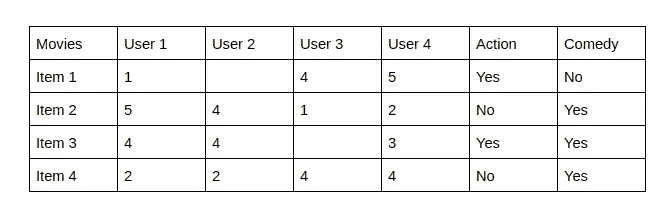

最后两栏动作片和喜剧片描述了电影的类型。现在，给定这些类型，我们可以知道哪些用户喜欢哪个类型，因此，我们可以根据他/她对该类型电影的反应来获得与该特定用户相对应的特征。

一旦我们知道了用户的喜好，我们可以使用生成的特征向量将他/她嵌入到嵌入空间中，并根据他/她的选择推荐他/她。在推荐过程中，相似性度量(我们稍后会谈到)是根据项目的特征向量和用户以前记录中的偏好特征向量来计算的。然后，推荐前几名。

基于内容的过滤在向一个用户推荐时不需要其他用户的数据。

**协同过滤系统:**协同不需要给出项目的特征。每个用户和项目都由一个特征向量或嵌入来描述。

它自己为用户和项目创建嵌入。它将用户和项目嵌入到同一个嵌入空间中。

它在推荐特定用户时会考虑其他用户的反应。它记录特定用户喜欢哪些项目，以及具有与他/她相似的行为和爱好的用户喜欢哪些项目，以向该用户推荐项目。

它收集用户对不同项目的反馈，并使用它们进行推荐。

## 用户-项目交互的来源

**隐性反馈:**根据用户的点击、搜索和购买等行为，记录用户的好恶。它们大量存在，但没有发现负面反馈。

**显式反馈:**用户通过对某个项目做出反应或对其进行评级等动作来指定他/她喜欢或不喜欢的东西。它有正反馈和负反馈，但数量较少

**协同推荐系统的类型:**

基于记忆的协同过滤(Memory-based collaborative filtering):主要是记住用户-项目交互矩阵，以及用户对它的反应，即用户对项目的评分。不存在这样的维度减少或模型拟合。主要是两个部分:

**用户-用户过滤:**在这种情况下，如果一个用户 A 的特征与另一个用户 B 相似，那么 B 喜欢的产品就会被推荐给 A。作为一种陈述，我们可以说，“喜欢与你相似产品的用户也喜欢那些产品”。所以这里我们推荐利用两个用户的相似性。

现在，如果一个用户 A 的行为像其他用户 B、C 和 D 一样，那么对于产品 x，A 的评级由下式给出:

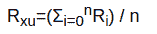

其中 Rxu 是用户 u 给予 x 的评级，i=0 到 n 是表现出与 u 相似行为的用户。现在，所有 n 个用户与用户 u 的相似程度不同。因此，我们找到一个加权和来提供评级。

这里的权重是使用的相似性度量。

现在，用户在评级时表现出一些行为差异。一些是慷慨的评价者，其他的不是，即，可能一个用户在范围 3 到 5 中评价，而其他用户在 1 到 3 中评价。因此，我们计算用户提供的所有评分的平均值，并从 Ri 中减去该值，以便标准化每个用户的评分。

**物品-物品过滤:**这里，如果用户 A 喜欢一个物品 x，那么，在性质上与 x 相似的物品 y 和 z，那么 y 和 z 被推荐给用户。作为陈述，可以说“因为你喜欢这个，所以你也可能喜欢那些”。

这里也使用相同的等式

其中 R 是用户 u 给产品 x 的评分，它是 u 给类似产品 x 的评分的平均值。这里我们也取一个加权平均值

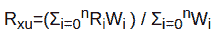

其中权重是产品之间的相似性。

## 相似性度量

它们是用于确定一个向量与给定向量相似程度的数学度量。

最常用的相似性度量:

1.  余弦相似度:向量之间的余弦角。
2.  点积:向量的余弦角和大小也很重要。
3.  欧几里德距离:两个向量之间的元素平方距离
4.  皮尔逊相似性:这是一个由下式给出的系数:

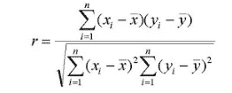

**基于模型的协同过滤**:这里不需要记住矩阵。从矩阵中，我们试图了解特定用户或项目的行为。我们使用降维或使用聚类算法来压缩大的交互矩阵。在这种类型中，我们拟合机器学习模型，并尝试预测用户会给一个产品多少评级。有几种方法:

1.  **聚类算法**
2.  **基于矩阵分解的算法**
3.  **深度学习方法**

**聚类算法:**他们通常使用简单的聚类算法，如 K-最近邻算法，根据所使用的相似性度量来查找给定用户或项目嵌入的 K 个最近邻或嵌入。

**基于矩阵分解的算法:**

**思路:**像任何一个大数都可以分解成更小的数一样，用户-物品交互表或矩阵也可以分解成两个更小的矩阵，这两个矩阵也可以用来生成回交互矩阵。

因此，我们生成因素矩阵作为用户和项目的特征矩阵。这些特征矩阵充当每个用户和项目的嵌入。为了创建特征矩阵，我们需要降维。

说吧，

有 4 个用户和 5 个项目，用户和项目放置根据域 D1 说，流派如果项目是电影。我们可以说它们不能很好地分开，整个事情看起来非常一般化。

作者图片

因此，我们增加域的数量或添加一个域，在此基础上我们可以对用户和项目进行分类。

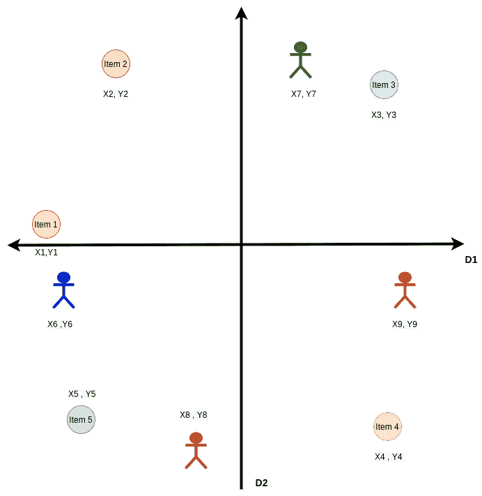

作者图片

现在，使用这两个域，我们可以很容易地对项目和用户进行适当的分类，因此,( x，y)对可以用作它们的特征向量或嵌入。因此，我们的矩阵是因式分解。

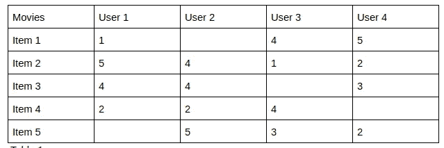

表 1

上面的交互表被转换成:

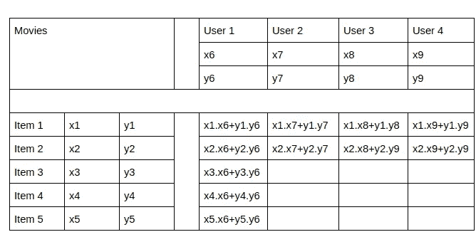

表 2

因此，我们的任务是找到(x，y)值，使表 2 中生成的数字尽可能接近实际的相互作用矩阵。一旦我们找到所有的(x，y)值，我们也可以找到丢失的值。现在，缺少值是因为用户没有对项目进行评级。所以，如果生成的值很好，我们可以推荐给用户。这里只显示了 x 和 y 两个域，实际上可以有非常多的域。域数越多，特征向量越大，嵌入空间越大。

现在，特征向量中的特征数量取决于有多少个域或特征(一个域中表示一个特征)，我们需要考虑清楚地表示用户和项目。因此，我们基本上需要找到用户和项目分布的主要组成部分。寻找主成分意味着降维，即使用尽可能少的特征清楚地表示分布。

降维可以通过几种方法实现:

1.  **奇异值分解:奇异值分解**
2.  **PMF:概率矩阵分解**
3.  **NMF:非负矩阵分解**

如果我们观察表 2，x1.x6+y1.y6 是项目 1 嵌入向量乘以[ x6，y6 ]的点积，即用户 1 的嵌入向量的转置。

所以，表 2 中的每个单元格，

用户对项目 u 的评级 v= U .转置(V)

**降维:创建特征向量**

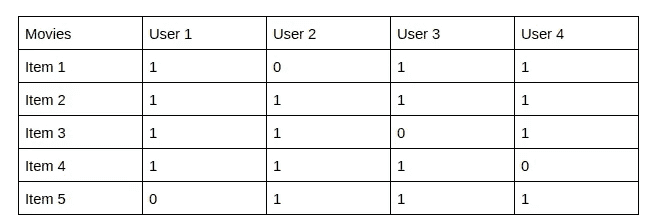

**表 3**

1 表示用户对项目做出了反应或对其进行了评级，0 表示用户没有做出反应。这里 1 的数量远大于 0 的数量。在现实世界中，实际上 0 的数量远大于 1 的数量。所以，它们大多是稀疏矩阵。

我们的目标函数，也就是我们这里需要最小化的函数是:

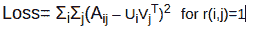

r(i，j)=1 可以从表 3 中找到。这暗示了已经对项目 I 做出反应或评级的用户 j。如果 r(i，j)=0，则用户 j 没有对项目 I 进行评级

因此，这意味着我们正在尝试最小化表 1 中给定的原始评级 A(i，j)和从表 2 中获得的值之间的差异，乘以用户和项目的特征向量。这有助于优化特征向量。

**对于奇异值分解，**

其中，Aij 是表 1 中的小区额定值，u，v 是算法产生的值。现在，由于矩阵的稀疏性，奇异值分解在这里表现不佳。

SVD 由 R = UσV 给出，其中 U 是 n×d 维的项目矩阵，即总共 n 个项目，V 具有 m×d 维，即总共 m 个用户，σ是 d×d 对角矩阵，用于乘法兼容性。d 是每个用户和项目的特征向量的大小。

在奇异值分解中，矩阵分解为

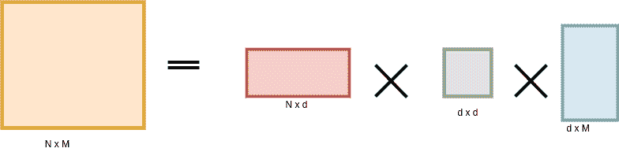

作者图片

其中 N 是项目的数量，M 是用户的数量，d 是特征向量的维度或大小。

中间的是对角向量。

**NMF:** 非负矩阵分解之所以如此，是因为这里的矩阵没有负的分量，即评分永远不可能是负的。未评级的被认为是 0

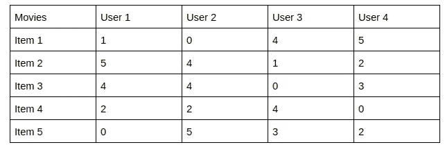

表 4

因此，NMF 只使用观察到的或评级的。因此，它将函数修改为:

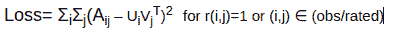

这对于稀疏矩阵表现得更好。

它将向量分解为:

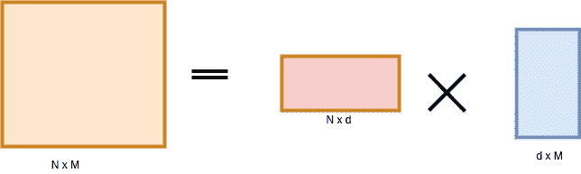

作者图片

其中 N 是用户数量，M 是项目数量，d 是特征向量的维度或大小。

矩阵分解还有另一种形式。叫做**加权矩阵分解。**它将损失函数修改为:

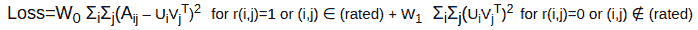

这里，我们包括两个评级项 w0 和 w1，并试图优化评级项和非评级项。未评级的被认为是零，所以，((Ui。Vj)-0)2 用于优化非额定或零个。W0 和 W1 是超参数，我们需要谨慎选择。

**最小化目标函数**

最常用的最小化算法包括:

**加权交替最小二乘法:**如果我们专注于这个问题，我们可以发现两个独立的问题:找到最佳描述项目的最佳嵌入，以及最佳描述用户的最佳嵌入。

现在，让我们分解并逐个查看问题，

1.  如果我们有项目的特征矩阵或向量，就像我们对基于内容的系统所做的那样，我们可以通过注意用户如何反应或评价具有不同特征向量的项目来容易地找到用户嵌入或特征集。

所以，我们的目标函数变成了:

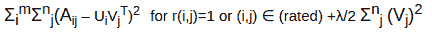

其中 Vj 是用户的特征向量，λ项是用于优化用户嵌入的正则化项，给定每个项目 I 的项目嵌入或特征向量 Ui

2.现在，如果我们有了用户特征或知道用户如何行为或反应，我们就可以从每个用户对项目的反应或评价中找到项目的最佳特征或嵌入向量。

我们的目标函数是:

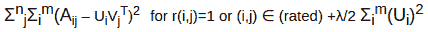

其中 Ui 是项目的特征向量。我们需要找到给定用户向量 Vj 的 Ui。

现在，在矩阵分解中，我们需要找到 U 和 v。因此，WALS 算法通过在上述两个方程之间交替来工作。

*   固定 U 并求解 v。
*   定 V，解 u。

现在，问题是这两个方程不是同时凸的。要么等式 1 是凸的，要么等式 2 是凸的，但不是组合的。因此，我们在这里不能达到全局最小值，但是已经观察到，达到接近全局最小值的局部最小值给了我们在全局最小值处的优化结果的良好近似。所以，这个算法给了我们一个近似的结果。

挑战:

1.  给定(用户，项目)对的模型预测是相应嵌入的点积。因此，如果在训练期间没有看到一个项目，系统就不能为它创建嵌入，也不能用这个项目查询模型。这个问题通常被称为**冷启动问题**。

这个问题通常用两种方法解决:

1.  WALS 的投影
2.  启发生成新鲜项目的嵌入

2.侧面特征很难包括在内。次要特征是那些可能影响推荐的特征，例如对于一部电影，U/PG 分级可以是次要特征或国家。

## 结论

在本文中，我们研究了两种基本类型的过滤机制。在我的[下一篇文章中，](https://medium.com/@myac.abhijit/introduction-to-recommender-systems-2-deep-neural-network-based-recommendation-systems-4e4484e64746)我将谈论基于深度学习的协同过滤，并尝试通过一些应用。

快乐学习！！！。