# 推荐系统介绍- 2:基于深度神经网络的推荐系统

> 原文：<https://towardsdatascience.com/introduction-to-recommender-systems-2-deep-neural-network-based-recommendation-systems-4e4484e64746?source=collection_archive---------1----------------------->

格伦·卡斯滕斯-彼得斯在 [Unsplash](https://unsplash.com/s/photos/netflix?utm_source=unsplash&utm_medium=referral&utm_content=creditCopyText) 上拍摄的照片

## 深度学习在推荐系统中是如何使用的？

这是我关于推荐系统的第二篇文章。在我的[上一篇文章](/introduction-to-recommender-systems-1-971bd274f421)中，我谈到了基于内容的协同过滤系统。如果你有任何困惑，我会鼓励你通读这篇文章。在这篇文章中，我们将看到深度学习是如何用于推荐系统的。我们将介绍 Youtube 推荐系统的候选生成架构。所以，让我们开始吧。

**为什么选择深度神经网络？**

矩阵分解方法的局限性:

1.  使用辅助功能的困难，这可能会影响推荐，如电影的 U/PG 分级或用户的国家。在矩阵分解的情况下，我们只能使用项目 ID 和用户 ID。它还防止我们查询不在训练集中的项目或用户。
2.  矩阵分解也有冷启动问题，因为它没有特征向量或新项目的嵌入
3.  矩阵分解通常倾向于向每个人推荐受欢迎的项目，这通常在使用点产品时并不总是反映特定用户的兴趣。
4.  矩阵分解作用于用户和项目特征嵌入的简单内积，它通常不足以捕捉和表示用户和项目中的复杂关系。

深度神经网络被设计并用于解决矩阵分解方法的这些缺点。

我们将使用两篇研究论文中的参考文献来了解深度学习如何为推荐系统工作:

1.  神经协同过滤:[https://arxiv.org/abs/1708.05031](https://arxiv.org/abs/1708.05031)
2.  YouTube 深度神经网络推荐:[https://dl.acm.org/doi/10.1145/2959100.2959190](https://dl.acm.org/doi/10.1145/2959100.2959190)

## **神经协同过滤:**

神经协同过滤(Neural Collaborative Filtering，NCF)是新加坡国立大学、哥伦比亚大学、山东大学和德克萨斯 A&M 大学在 2017 年发表的论文。本文提出了一个基于神经网络的协作学习框架，该框架将使用多个感知器层来学习用户-项目交互功能。

## **矩阵分解**

我在上一篇文章中谈到的矩阵分解，(如果您有任何困惑，请检查工作)将用户和项目潜在向量，或用于描述项目或用户的密集特征向量，映射到相同的潜在空间或嵌入空间，并将用户-项目交互表示为用户和项目向量的内积或点积。本文认为，在矩阵分解的情况下，交互函数的简单选择，即点积可能会造成阻碍，因为它可能无法捕捉用户-项目交互的复杂关系。

该文件展示了以下例子:

假设有 M 个用户和 N 个项目，Y(M×N)表示项目用户矩阵，使得:

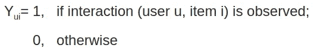

所以，生成的矩阵看起来像，

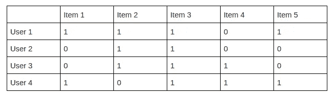

比方说，这是我们的用户-项目互动矩阵，1 表示用户与项目互动，反之亦然。现在，如果我们获得我们的用户和项目潜在向量或嵌入向量，它们将看起来像这样:

对于项目和用户，我们分别得到:

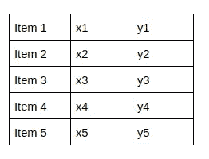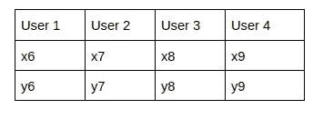

(A)项目嵌入(B)用户嵌入

内积上的上述矩阵给出了相互作用矩阵。现在，这篇论文集中在隐式反馈上，例如，如果用户与一个项目交互，它的正面反馈，正如这里所考虑的。但在实际情况下，这里的 1 可能并不直接暗示用户喜欢该内容。类似地，0 表示用户和项目之间没有交互。详细地说，如果我作为一个用户观看一个视频，我与该项目进行交互，这被认为是 1 暗示我对该视频的积极反馈，这在现实世界中可能不是真实的，因为我可能不喜欢该视频。我认为这背后的直觉是，如果我与一个项目互动，这表明我对该类型的项目感兴趣，因此，它可能会给出我喜欢或想观看的内容类型的想法。这是某种积极的反馈。虽然 0 可能不是负面的反馈，但它们可能仅仅意味着用户没有看或者丢失了数据。所以，存在着负反馈的危机。

现在，为了使用基于模型的方法对项目进行排序，本文使用:

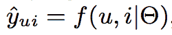

[来源](https://arxiv.org/abs/1708.05031)

y(u，I)是用户 u 和项目之间交互的预测得分，θ表示我们需要优化的模型参数，f 是交互函数。

现在让我们来谈谈目标函数或所用的损失函数:

**逐点损失:**尽管使用了均方误差的回归框架损失函数，但它将问题视为分类问题。它试图最小化条目的预测分数和目标值之间的 MSE。如果我们去实现细节，我们采取一个积极的例子和 k 个消极的例子，并适合一个 sigmoid 激活。然后，我们使用 MSE 来最小化误差。负例是指相对于正例或 1 随机抽样的 0。基本上这是一个分类，我们试图让层预测 1 为积极的例子和 0 为消极的例子。

**成对损失或排名损失:**它试图将观察到的条目或 1 的排名高于 0 或未观察到的条目，即 1 的得分高于 0。它使用的公式如下:

Loss= 1 — sigmoid(正分-负分)。

它训练三个一组，一个例子，一个积极的或观察到的项目，一个消极的或未观察到的项目被耦合在一起，以创建一个训练样本。如果阳性和阴性得分之间的差异很大，则 sigmoid 给出一个接近 1 的数字，并且从 1 中减去该数字，从而给出较低的损失。这种损失被暹罗网络所利用。这种损失函数有一个自适应版本，我们不打算讨论，但简单地说，它不是随机地对负样本进行采样，它从一组入围的负样本中选择负样本，对其生成的分数是最大的，也就是说，该模型对该样本产生大量错误的概率是最大的。

**论文使用了逐点损失。**

接下来，让我们观察矩阵分解方法的缺点，

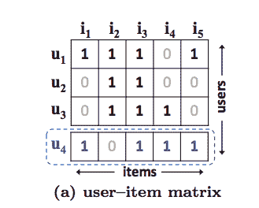

[来源](https://arxiv.org/abs/1708.05031)

假设，这是我们的物品-用户交互矩阵。我们将使用余弦函数来获得用户潜在向量之间的相似性。

S{i，j}=余弦(I，j)

s 表示用户 I 和 j 之间的相似性

所以，我们得到了，

S{23} > S{12} > S{13}。

现在，如果我们根据它们的相似性排列它们，我们得到:

[来源](https://arxiv.org/abs/1708.05031)

这种类型的向量表示，其中每个向量 P 代表一个用户。

现在，U4 来了一个新用户。

重新计算后，我们会得到。

S{41} > S{43} > S{42}。

如果我们仔细观察，会发现 U4 和 P1 最相似，然后是 P3，最后是 P2。

让我们看看另一个矢量表示:

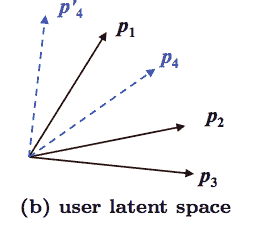

[来源](https://arxiv.org/abs/1708.05031)

如果碰巧 u4 被放置在 p4，它将类似于 u2 并给出错误的推荐，因为它将给予 u2 比 u3 更大的权重来预测 u4。

这个缺点通过使用推荐系统的深度学习得到了解决，推荐系统使用深度神经网络来创建嵌入。

## **NCF 的建筑:**

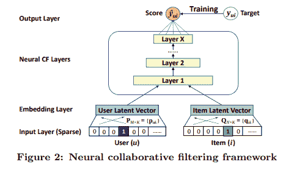

[来源](https://arxiv.org/abs/1708.05031)

**工作:**模型接受两个稀疏向量，一个代表用户，另一个代表商品。项目向量在索引处具有 1 意味着用户已经与对应于该索引的项目进行了交互。所以，精心地，

用户向量=[ 0，0，1 ……..0]具有 m 个元素，意味着该向量代表 m 个用户中的第 3 个用户。

项目向量=[0，1，0，1，1，0…..1]具有 n 个元素，意味着用户与 n 个项目中的那些项目进行了交互。

基本上项目和用户都是一次性编码的。

接下来的层是嵌入层，从输入层获得稀疏输入的密集或潜在向量。现在，获得的潜在向量被馈送到多层神经架构中，以将潜在向量映射到预测的概率得分。这些层负责从数据中发现复杂的用户-项目关系。输出层产生预测得分 Y_pred(ui)，即用户 u 与项目 I 交互的概率有多大。

为了训练模型，作者使用了逐点损失函数，以最小化目标值 Y(ui)和相应预测值之间的差异。

NCF 模型的预测方程由下式给出:

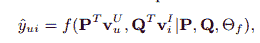

[来源](https://arxiv.org/abs/1708.05031)

*“其中 P ∈ R(M×K)和 Q ∈ R (N×K)，分别表示用户和项目的潜在因子矩阵，θf 表示交互函数 f 的模型参数”*。- [*来源*](https://arxiv.org/abs/1708.05031)

我们知道对于多感知器层，对于每一层，

y= f1(x)，其中 f1 是激活函数或映射函数。这里，输出预测被公式化为:

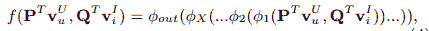

来源

其中 Psi-out 和 Psi-x 分别表示输出层和第 X 个神经协同滤波(CF)层的映射函数，总共有 X 个神经 CF 层。

**NCF 的学与失**

NCF 使用逐点损失来训练模型参数。因此，它使用均方损失进行训练。损失被描述为:

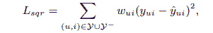

[来源](https://arxiv.org/abs/1708.05031)

*“其中 Y 表示 Y 中观察到的相互作用的集合，Y 表示负实例的集合，其可以是所有(或从中取样)未观察到的相互作用；Wui 是一个超参数，表示训练实例(u，I)“T19”的权重。[——*出处。*](https://arxiv.org/abs/1708.05031)*

现在，正如我们所知，平方损失通常用于回归，并解释为高斯分布，但在我们的情况下，它是一种目标值为 0 或 1 的二元分类，取决于用户是否与项目交互。因此，为了满足我们的要求，本文提出了一种学习逐点损失的概率方法，该方法更加关注数据的二进制属性。本文使用逻辑函数将预测输出保持在[0，1]的范围内。

该函数被重新定义为:

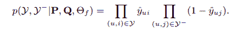

[来源](https://arxiv.org/abs/1708.05031)

所以，取负对数，得到的函数是:

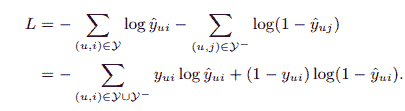

[来源](https://arxiv.org/abs/1708.05031)

损失函数实际上是**二元交叉熵损失或对数损失**。优化是使用 SGD 优化器完成的。

因此，NCF 获得损失函数值，并使用它通过反向传播来训练嵌入和模型参数。证明了矩阵分解是 NCF 的特例。因此，我们可以使用神经协同过滤准确地获得项目和用户嵌入。

我们刚刚在这里谈到了 NCF 模型，本文还提出了一种融合一般矩阵分解 GMF 和多感知器层 MLP 的模型思想，命名为 NeuMF。

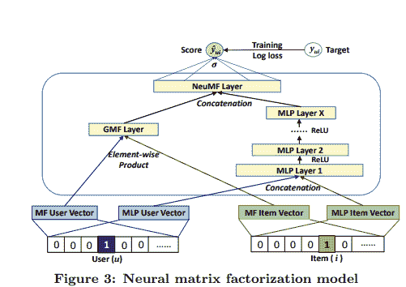

[来源](https://arxiv.org/abs/1708.05031)

融合背后的一般思想是，GMF 更好地生成线性依赖性，而 MLP 更好地模拟用户-项目交互中的非线性依赖性。

这里，MLP 的项目和用户向量以及 GMF 层的用户和项目向量被分别训练，从而它们可以达到个体最优。

然后，这些层被连接起来，并被馈送到 NueMF 层，用于最终预测和从丢失中反向传播。我们不打算在这里谈论它的工作原理，如果你想知道更多，请随意浏览[原文。](http://staff.ustc.edu.cn/~hexn/papers/www17-ncf.pdf)

## **深度神经网络 Softmax 方法**

现在，让我们谈谈第二篇论文，以获得关于 youtube 如何利用 softmax 层实现其推荐系统的清晰直觉。

## **针对 YouTube 的深度神经网络推荐:**

该论文由保罗·卡温顿、杰伊·亚当斯和埃姆雷·萨金撰写。本文讨论 Youtube 如何向用户推荐视频。该文件主要提到三个挑战:

1.  数据规模:Youtube 拥有庞大的用户群和语料库
2.  新鲜感:youtube 的语料库是非常动态的，每秒钟都有一小时的视频被上传
3.  噪声:有稀疏性和外部因素造成嘈杂的隐式反馈。

## **系统概述**

youtube 的系统由两个神经网络组成，一个用于候选人生成，另一个用于排名。候选生成器负责将用户的观看历史作为输入，并从 youtube 庞大的视频语料库中给出一小部分视频作为推荐。候选生成网络基于协同过滤工作。像观看历史和人口统计这样的特征被用来决定用户之间的相似性。排名网络通过使用描述视频和用户的特征集合根据期望的目标函数给每个视频分配分数来完成前 N 个项目的选择。

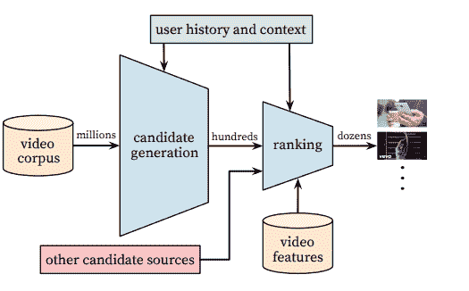

[来源](https://dl.acm.org/doi/10.1145/2959100.2959190)

该图显示了 youtube 的系统概述。该系统使用我们在上面讨论过的性能指标，如精确度、召回率和排名损失。

## **候选人生成**

候选生成神经网络基于使用排名损失的矩阵分解，其中用户的嵌入层完全使用用户的观看历史来构建。根据该论文，该方法可以被称为**“因子分解技术的非线性推广”。-** [*来源*](https://dl.acm.org/doi/10.1145/2959100.2959190)

## **工作**

本文使用建议作为极端多类分类，并将 softmax 图层作为输出图层。

softmax 函数由下式给出:

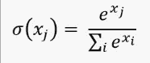

论文提出问题的分类方程为:

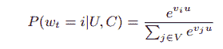

[来源](https://dl.acm.org/doi/10.1145/2959100.2959190)

这里，该模型试图对用户 U 将在时间 t 观看视频的概率进行分类，由(W{t})从给定上下文 C ***中的视频 ***i*** 的庞大语料库中给出。***“u”代表用户的嵌入或密集特征向量，“v{j}”代表候选视频的嵌入。嵌入是从用户的稀疏向量中创建的，这些稀疏向量是从他们的观看历史中创建的。神经网络学习作为用户历史的函数的用户嵌入“u ”,该用户历史被馈送到 softmax 层以基于历史和嵌入对用户可能想要观看的视频进行分类。用户观看视频的概率由 1 给出，用户不观看的条件由 0 给出。

现在，已经说过 youtube 在分类机制上工作，我们应该注意到 youtube 有一个巨大的项目语料库，如果我们想使用 softmax 层对特定用户喜欢的内容或项目进行分类，这将是一个巨大的分类，在输出层有大量的节点，大多数项目都是负样本。大多数条目将是负面的，因为考虑到 youtube 上给出的条目的巨大语料库，从常识来说，我们可以说，不存在观看了 youtube 上全部可用内容的 20%的用户。此外，如果我们分析我们的观看模式，我们会意识到，作为观众，我们对某些特定类型的内容感兴趣，也就是说，我们实际上不想观看任何类型的内容，我认为这也可以清楚地满足为什么首先我们的观看历史对描述我们作为观众如此重要。因此，交互矩阵中的大多数项目的概率为 0。

使用 softmax 一次对如此多的项目进行分类将花费大量时间，因此 Youtube 使用了**负采样方法。**这种方法有助于 youtube 从背景分布中随机抽取用户的负面类别。在实践中，数以千计的负面类被采样。基本上，这个想法是由这样一个事实驱动的，即我们想知道用户喜欢什么类型的内容，因此，使用 100K 的负样本是没有意义的，这会延迟模型的性能。这减少了训练集的大小，从而减少了输出层中的节点数，并最终减少了 softmax 模型所花费的时间。

现在，一旦候选生成网络生成了密集向量或嵌入，评分网络就变成了用户和项目向量的点积空间中的最近邻居搜索，并因此产生了作为推荐出现的前 N 个选择。

## **反馈机制**

Youtube 的工作基于一种隐含的反馈机制。虽然它有显式反馈可用，但鉴于视频和用户的数量巨大，显式反馈在本质上变得非常稀疏，因此，隐式反馈被用于训练模型。如果用户完成观看一个视频，则视为正反馈，以此类推。通过这种方式收集反馈。这种方法会产生大量反馈，可用于训练模型。

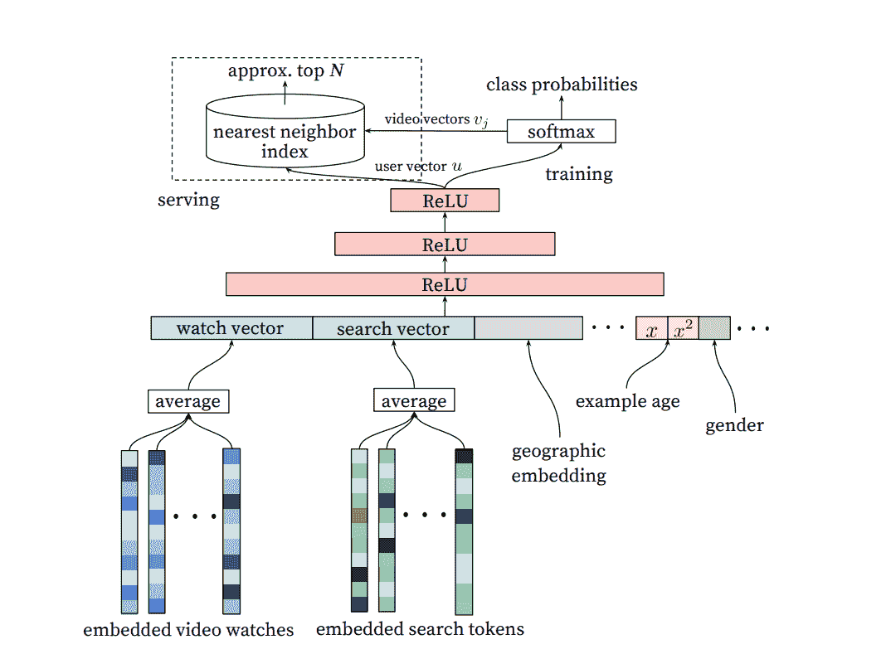

[来源](https://dl.acm.org/doi/10.1145/2959100.2959190)

## **模型架构**

该论文指出，youtube 的模块使用固定的词汇来学习视频的嵌入。对于用户来说，用户的观看历史被表示为稀疏视频 id 的可变长度序列，稀疏视频 id 被映射到密集向量，密集向量充当用户的嵌入向量。嵌入被连接以形成特征。除此之外，年龄、性别和国家等其他特征也被考虑在内。完整的特征集被馈送到完全连接的多层整流线性(ReLU)单元。使用正常梯度下降来训练参数和嵌入。我们从 softmax 层获得候选视频和用户的最终嵌入，并将其提供给最近邻算法以生成最佳选择。

作为使用深度神经网络的一个重要方面，该论文还关注于包含侧面特征来训练模型。它指出，该方法有助于以规范化的方式包括许多二元和连续的特征，如年龄、性别和人口统计，这对于向新用户推荐非常重要。例如，该论文提到，youtube 已经观察到“新鲜的”内容或新上传到 youtube 上的内容受到用户的偏好，因此，制作者需要基于用户的兴趣向用户推荐新鲜的内容。它还需要对本质上完全动态的病毒内容进行同样的处理。

论文还谈到了排名系统，我们不会讨论这个问题。如果你有兴趣了解完整的流程，我建议你去浏览一下[原文](https://storage.googleapis.com/pub-tools-public-publication-data/pdf/45530.pdf)以便有一个完整的概念。

最后，我想谈谈另一种基于深度学习的推荐系统。

## **推荐为序列预测**

如果我们观察我们与不同项目的交互，比如说，我们正在观看 youtube 的视频，我们按顺序观看视频，也就是说，我们选择一个项目，与它交互，然后移动到新项目。因此，基本上我们所做的是，作为一个观众，我们按照访问项目的顺序创建一个项目序列。这种类型的推荐系统采用这些序列，并基于该序列尝试预测序列中的下一个项目。

现在，为了预测序列中的下一个项目，它为特定用户的每个项目分配一个可变概率“p”。它指出，基于用户的历史，用户下一步想要与相应的项目交互的可能性是 p%。

因此，它可以表示为:

[a]->b

[a b]->c

【公元前】->公元前

诸如此类。

系统将每个用户定义为他/她的项目交互历史的函数。有几种方法可以解决这个问题:

1.  用户被定义为他以前交互过的项目向量的平均值，然后获得的用户向量被用于推荐
2.  递归神经网络在用户的连续观看历史上被训练，以生成用户的嵌入
3.  可以使用卷积神经网络。我们可以将观看历史序列分割成训练窗口，并且在特定用户的交互序列上移动一维训练窗口以获得嵌入

这三种是构建推荐系统的常用方法，将用户数据视为一个序列。

## **结论**

在本文中，我们讨论了深度学习在推荐系统中的使用方式。

希望这篇文章有所帮助