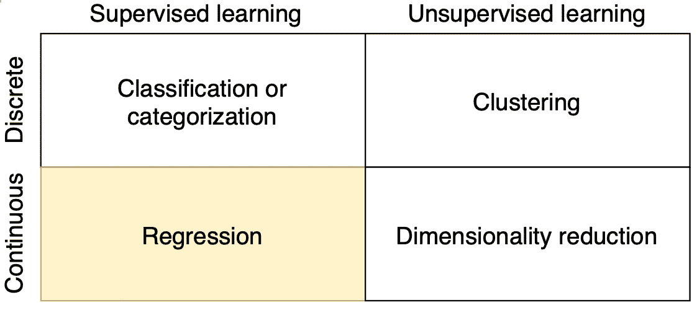
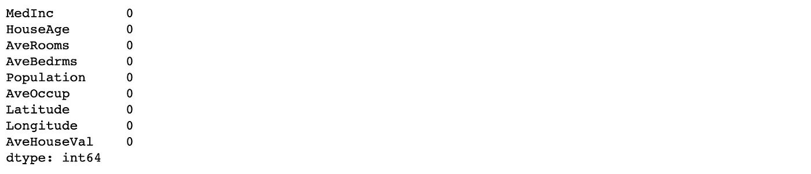
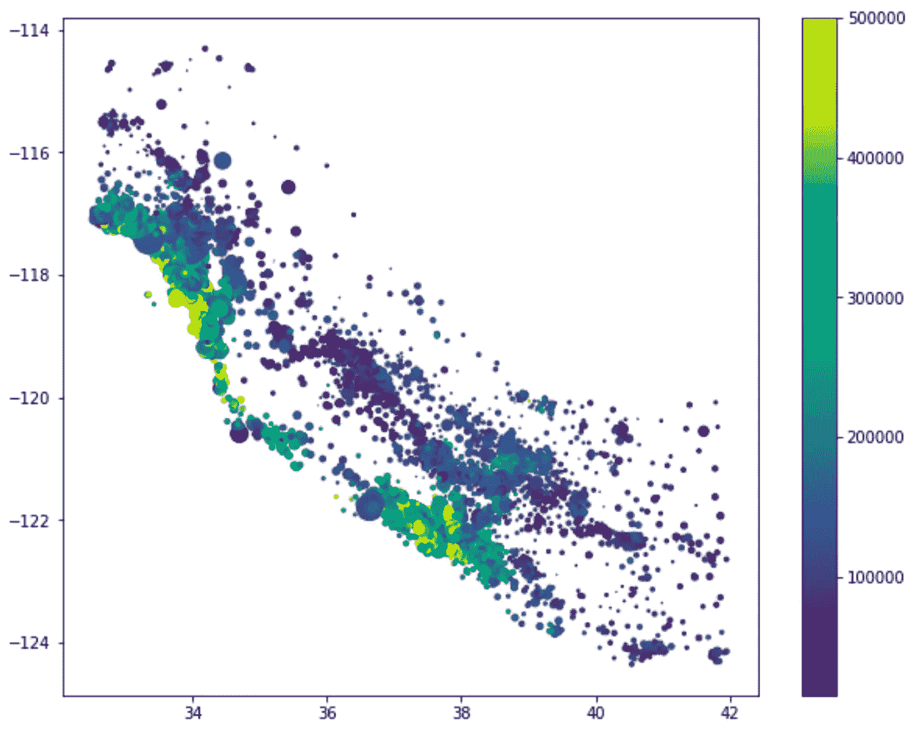
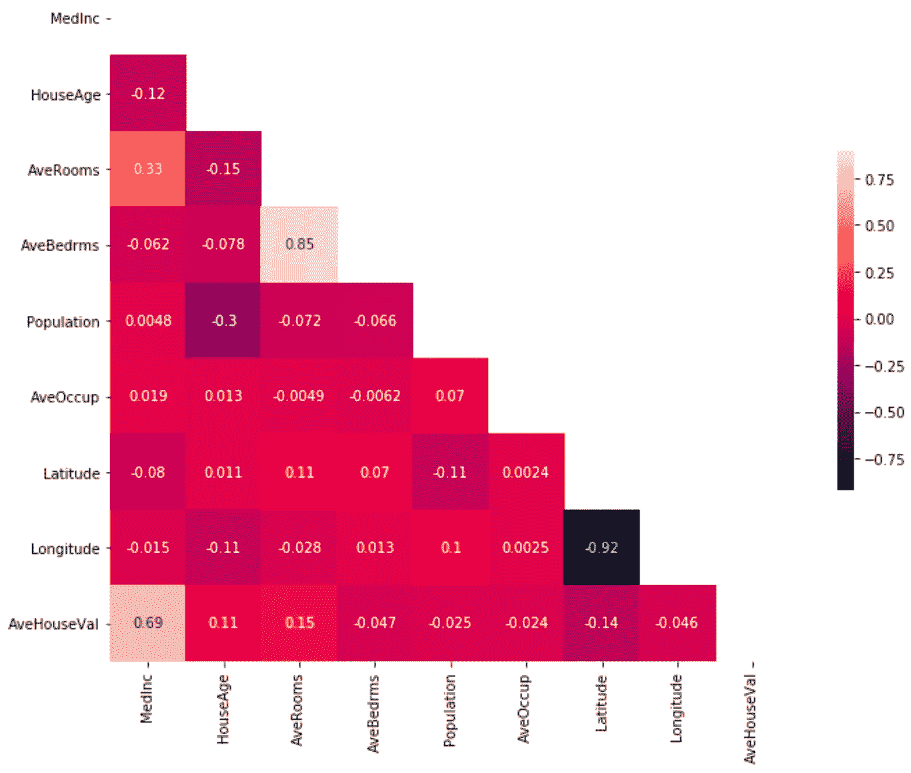
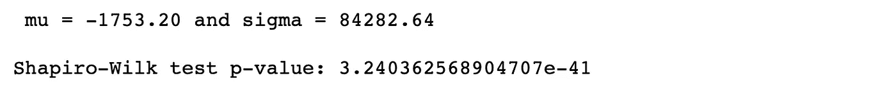
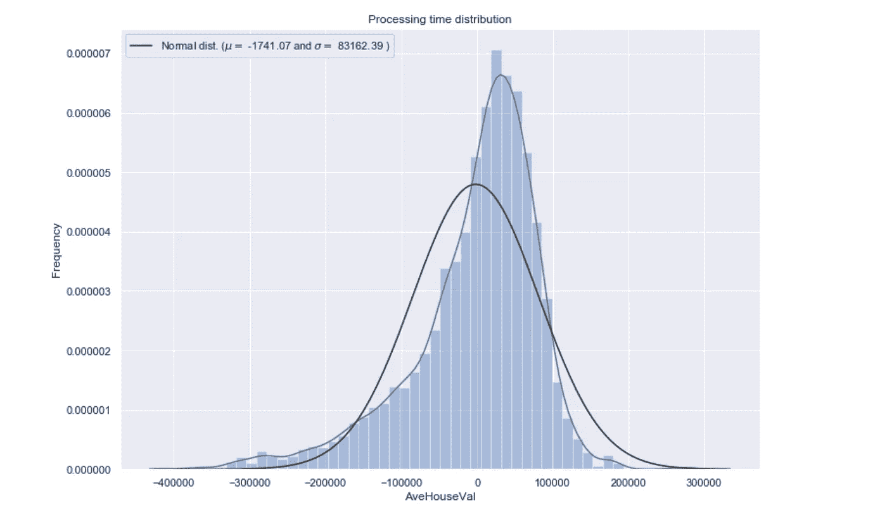
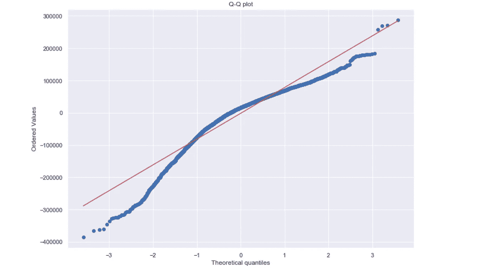

# 回归分析导论

> 原文：<https://towardsdatascience.com/introduction-to-regression-analysis-9151d8ac14b3?source=collection_archive---------10----------------------->

## 本文介绍了回归分析的基础，使用加州住房数据集作为一个说明性的例子


照片由[卢卡斯](https://www.pexels.com/@goumbik)在[像素](https://www.pexels.com/photo/chart-close-up-data-desk-590022/)上拍摄

机器学习任务可以分为以下四类:



本文着重于回归分析。具体来说，本文描述了这项任务的基础，并在[加州住房数据集](https://scikit-learn.org/stable/modules/generated/sklearn.datasets.fetch_california_housing.html)上阐释了其主要概念。

这篇文章的结构如下:

1.  **什么是回归？**
2.  **回归和分类的区别**
3.  **回归的类型**:由于回归模型数量众多，我们介绍最常见的几种。
4.  **如何选择正确的型号**
5.  **线性模型**:在所有可用的回归模型中，本文重点介绍线性模型的理论和假设。
6.  **线性模型示例**:用线性回归模型分析加州住房数据集。
7.  **其他回归分析示例**

# 1.什么是回归？

[回归分析](https://en.wikipedia.org/wiki/Regression_analysis)在维基百科中的定义是:

> 在[统计建模](https://en.wikipedia.org/wiki/Statistical_model)中，**回归分析**是一组统计过程，用于[估计](https://en.wikipedia.org/wiki/Estimation_theory)一个[因变量](https://en.wikipedia.org/wiki/Dependent_variable)(通常称为“结果变量”)与一个或多个[自变量](https://en.wikipedia.org/wiki/Independent_variable)(通常称为“预测值”、“协变量”或“特征”)之间的关系。

您经常听到的与回归分析相关的术语是:

*   **因变量**或**目标变量:**要预测的变量。
*   **自变量**或**预测变量:**估计因变量的变量。
*   **异常值:**与其他观察值显著不同的观察值。应该避免，因为它可能会妨碍结果。
*   [**多重共线性**](https://www.statisticssolutions.com/multicollinearity/) **:** 两个或两个以上自变量高度线性相关的情况。
*   [**同质性**](https://www.statisticshowto.com/homoscedasticity/) 或**方差同质性:**误差项在自变量的所有值上都相同的情况。

回归分析主要用于两个不同的目的。一是广泛用于[预测](https://en.wikipedia.org/wiki/Prediction)和[预测](https://en.wikipedia.org/wiki/Forecasting)，与机器学习领域重叠。其次，它还用于推断自变量和因变量之间的[因果关系](https://en.wikipedia.org/wiki/Causality)。

# 2.回归和分类的区别

回归和分类都是[有监督的学习方法](https://en.wikipedia.org/wiki/Supervised_learning)，也就是说它们使用带标签的训练数据来训练自己的模型，进行预测。因此，在机器学习中，这两项任务通常被归为同一组。

它们之间的主要区别是输出变量。在回归中，输出是数字或连续的，而在分类中，输出是分类的或离散的。这定义了分类和回归评估预测的方式:

*   分类预测可以使用准确性进行评估，而回归预测则不能。
*   回归预测可以使用均方根误差进行评估，而分类预测则不能。

下面的[环节](https://machinelearningmastery.com/how-to-choose-loss-functions-when-training-deep-learning-neural-networks/)在训练分类和回归模型的时候都收集了一些损失函数。

分类和回归算法之间有一些重叠；例如:

*   分类算法可以预测连续值，但是该连续值是类别标签的概率形式。
*   回归算法可以预测离散值，但是该离散值是整数形式的。

有些算法只需稍加修改即可用于分类和回归，如决策树和人工神经网络。对于这两种问题类型，其他一些算法更难以实现，例如用于回归预测建模的线性回归和用于分类预测建模的逻辑回归[ [1](https://machinelearningmastery.com/classification-versus-regression-in-machine-learning/) ]。

# 3.回归的类型

数据科学和机器学习中使用了各种类型的回归。每种类型在不同的情况下都有自己的重要性，但核心是，所有的回归方法都分析自变量对因变量的影响。这里我们提到一些重要的回归类型:

1.  [线性回归](https://www.listendata.com/2018/03/regression-analysis.html#Linear-Regression)
2.  [多项式回归](https://www.listendata.com/2018/03/regression-analysis.html#Polynomial-Regression)
3.  [支持向量回归](https://www.listendata.com/2018/03/regression-analysis.html#Support-Vector-Regression)
4.  [决策树回归](https://www.listendata.com/2015/04/decision-tree-in-r.html)
5.  [随机森林回归](https://www.listendata.com/2014/11/random-forest-with-r.html)
6.  [岭回归](https://www.listendata.com/2018/03/regression-analysis.html#Ridge-Regression)
7.  [套索回归](https://www.listendata.com/2018/03/regression-analysis.html#Lasso-Regression)
8.  [逻辑回归](https://www.listendata.com/2018/03/regression-analysis.html#Logistic-Regression)

详细解释每一个都需要几篇文章，因此，如果读者对回归变量的进一步信息感兴趣，我推荐阅读[ [2](https://www.analyticsvidhya.com/blog/2015/08/comprehensive-guide-regression/) 、 [3](https://www.listendata.com/2018/03/regression-analysis.html) 、 [4](https://www.javatpoint.com/regression-analysis-in-machine-learning) ]。

# 4.如何选择正确的回归模型？

在我看来，这是最困难的任务，不仅在回归方面，而且在一般的机器学习方面。

尽管我认为经验可能是这个问题的正确答案，一些建议是:

1.  线性模型是最常见和最简单的使用方法。如果你有一个连续的因变量，线性回归可能是你应该考虑的第一种类型。
2.  如果因变量是连续的，并且您的模型具有共线性或许多自变量，您可以尝试，例如，岭或套索模型。您可以根据 [R 方](https://www.investopedia.com/ask/answers/012615/whats-difference-between-rsquared-and-adjusted-rsquared.asp)或 [RMSE](https://en.wikipedia.org/wiki/Root-mean-square_deviation) 选择最终型号。
3.  如果您正在处理分类数据，可以尝试泊松、拟泊松和负二项式回归。
4.  为了避免过度拟合，我们可以使用交叉验证方法来评估模型。脊、套索和弹性网回归技术可用于纠正过度拟合问题。
5.  当你有一个非线性模型时，尝试支持向量回归。

# 5.线性模型

回归分析中最常见的模型是[线性回归](https://en.wikipedia.org/wiki/Linear_regression)。这个模型通过拟合一个线性方程找到自变量和因变量之间的关系。拟合该回归线最常用的方法是使用[最小二乘法](https://en.wikipedia.org/wiki/Least_squares)，它计算出最佳拟合线，使每个数据点到该线的垂直偏差平方和最小。

建立线性回归模型只是工作的一半。为了在实践中实际可用，模型应符合线性回归的假设[ [7](http://r-statistics.co/Assumptions-of-Linear-Regression.html) ， [8](http://www.ucdenver.edu/academics/colleges/PublicHealth/resourcesfor/Faculty/perraillon/perraillonteaching/Documents/week%207%20diagnosis.pdf) ]:

1.  参数呈线性。
2.  样本在总体上具有代表性。
3.  独立变量的测量没有误差。
4.  观察值的数量必须大于自变量的数量。
5.  独立变量中没有多重共线性
6.  残差的平均值为零。
7.  残差正态性
8.  独立变量和残差是不相关的
9.  残差的同方差性(残差的方差在整个观测中是常数)
10.  残差无自相关(特别适用于时间序列数据)。数学上，误差的[方差-协方差矩阵](https://en.wikipedia.org/wiki/Covariance_matrix)是[对角线](https://en.wikipedia.org/wiki/Diagonal_matrix)。

很难满足所有这些假设，因此从业者开发了各种各样的方法来在现实世界中保持一些或所有这些理想的属性。下面的文章[ [9](/linear-regression-and-its-assumptions-ef6e8db4904d) ， [10](/model-assumptions-for-regression-problems-e4591af44901) 解释一些例子。

# 6.线性模型示例

为了展示之前介绍的一些概念，我们在[加州住房数据集](https://scikit-learn.org/stable/modules/generated/sklearn.datasets.fetch_california_housing.html)上实现了一个线性回归模型。下面是代码以及对每个块的简要说明。

首先，我们导入所需的库。

接下来，我们从`scikit-learn`库中加载住房数据:

```
dict_keys(['data', 'target', 'feature_names', 'DESCR'])
```

为了了解更多的特性，我们打印了`california_housing_dataset.DESCR`:

```
- MedInc        median income in block
- HouseAge      median house age in block
- AveRooms      average number of rooms
- AveBedrms     average number of bedrooms
- Population    block population
- AveOccup      average house occupancy
- Latitude      house block latitude
- Longitude     house block longitude
```

这是八个独立变量，基于它们我们可以预测房子的价值。房子的价格由变量`AveHouseVal`表示，它定义了我们的**因变量。**

我们现在使用`pd.DataFrame`将数据加载到 pandas 数据帧中。

## 数据预处理

加载数据后，最好查看数据中是否有任何缺失值。我们使用`isnull()`计算每个要素缺失值的数量(本数据集没有缺失值)。



## 探索性数据分析

让我们首先根据`Latitude`和`Longitude`绘制目标变量`AveHouseVal`的分布。该图像应该是美国加利福尼亚州的绘图。据观察，靠近海边的房子比其他地方要贵。



接下来，我们创建一个相关矩阵来度量变量之间的线性关系。



## 观察结果:

*   为了拟合线性回归模型，我们选择那些与我们的因变量`AveHouseVal`高度相关的特征。通过查看相关矩阵，我们可以看到`MediaInc`与`AverageHouseVal` (0.69)有很强的正相关性。另外两个相关性最高的变量是`HouseAve`和`AveRooms`。
*   为线性回归模型选择要素时，重要的一点是检查多重共线性。例如，特征`Latitude`和`Longitude`具有 0.92 的相关性，所以我们不应该在我们的回归模型中同时包括它们。由于变量`MediaInc`、`HouseAve`和`AveRooms`之间的相关性不高，我们考虑将这三个变量用于我们的回归模型。

## 训练和测试模型

我们使用 scikit-learn 的`LinearRegression`在训练集和测试集上训练我们的模型。

## 残差的分布:

让我们打印残差的分布，以验证线性模型的假设。



## 假设的验证:

1.  线性输入参数(*正常*)
2.  样本代表总体人口(*假设*)
3.  自变量被无误差地测量(*假设*)
4.  观察值的数量必须大于独立变量的数量(*好的*)
5.  独立变量内无多重共线性(*适用于研究变量*)
6.  残差的平均值为零(*好的*)
7.  残差的正态性(*否*
8.  独立变量和残差不相关(*未检查*)
9.  残差的同方差性(残差的方差在整个观测中是常数)(*否*)
10.  残差无自相关(特别适用于时间序列数据)。数学上，误差的[方差-协方差矩阵](https://en.wikipedia.org/wiki/Covariance_matrix)是[对角线](https://en.wikipedia.org/wiki/Diagonal_matrix) ( *未检查*)

在研究这个数据集时，线性回归模型不是最好的模型，所以我们将在以后的文章中探讨其他模型。

作为提示，这里有一个关于如何继续的好的[链接](https://www.researchgate.net/post/Why_do_the_residuals_need_to_be_normal_when_carrying_out_multi_level_modeling):

> 残差和异方差的非正态性的一个大问题是，模型中的误差量在观测数据的整个范围内并不一致。这意味着他们的预测能力在整个因变量范围内是不一样的。转换因变量有助于纠正这一点，但会给解释带来困难。如果平方根变换没有完全归一化您的数据，您还可以尝试逆变换。转换的强度趋向于从 1。对数，2。平方根，3。反向(1/x)。

# 7.其他回归分析示例

如果读者感兴趣，我建议尝试以下数据集:

*   [房价:高级回归技术](https://www.kaggle.com/c/house-prices-advanced-regression-techniques) (Kaggle 竞赛)
*   [糖尿病数据集](https://scikit-learn.org/stable/modules/generated/sklearn.datasets.load_diabetes.html) (Scikit-learn)
*   [波斯顿住房数据集](https://scikit-learn.org/stable/modules/generated/sklearn.datasets.load_boston.html) (Scikit-learn)

关于波士顿住房数据集，我推荐阅读这篇[其他文章](/linear-regression-on-boston-housing-dataset-f409b7e4a155)。

此外，在这个[网络链接](https://www.kaggle.com/rtatman/datasets-for-regression-analysis)中，有一些主题相关的数据集的集合，这些数据集适用于不同类型的回归分析。

最后，许多数据集可以在以下位置找到:

*   [https://www.kaggle.com/datasets](https://www.kaggle.com/datasets)
*   [https://toolbox.google.com/datasetsearch](https://toolbox.google.com/datasetsearch)
*   [https://archive.ics.uci.edu/ml/datasets.html](https://archive.ics.uci.edu/ml/datasets.html)

感谢您的阅读！！

***如果你喜欢这个帖子，请考虑*** [***订阅***](https://javiferfer.medium.com/membership) ***。你将获得我所有的内容+所有其他来自牛逼创作者的文章！***

# 参考

[1]机器学习精通，[机器学习中分类和回归的区别](https://machinelearningmastery.com/classification-versus-regression-in-machine-learning/)

[2] Analytics Vidhya，[你应该知道的 7 个回归技巧！](https://www.analyticsvidhya.com/blog/2015/08/comprehensive-guide-regression/)

[3] ListenData，[数据科学中的 15 种回归类型](https://www.listendata.com/2018/03/regression-analysis.html)

[4]Java point，[机器学习中的回归分析](https://www.javatpoint.com/regression-analysis-in-machine-learning)

[5] ListenData，[如何选择正确的回归模型？](https://www.listendata.com/2018/03/regression-analysis.html)

[6]吉姆统计，[选择回归分析的正确类型](https://statisticsbyjim.com/regression/choosing-regression-analysis/)

[7] R 统计，[线性回归的假设](http://r-statistics.co/Assumptions-of-Linear-Regression.html)

[8]科罗拉多大学，[线性模型假设和诊断](http://www.ucdenver.edu/academics/colleges/PublicHealth/resourcesfor/Faculty/perraillon/perraillonteaching/Documents/week%207%20diagnosis.pdf)

[9]中等，[线性回归及其假设](/linear-regression-and-its-assumptions-ef6e8db4904d)

[10]中等，[如何解决你的下一个回归问题](/model-assumptions-for-regression-problems-e4591af44901)