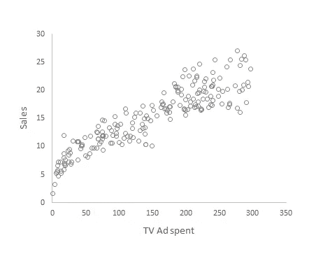

# 回归分析简介[使用 Excel]

> 原文：<https://towardsdatascience.com/introduction-to-regression-analysis-using-excel-398ae1c3d604?source=collection_archive---------45----------------------->

## 简单和多元线性回归介绍。使用 Excel 的数据分析工具库实现和构建预测模型。

不熟悉 Python 或者 R 之类的工具？

完全没问题！您仍然可以使用 Excel 执行回归分析。而且你不需要有任何编程知识来做到这一点。

在数据分析方面，Excel 无疑是一个非常强大的工具。您可以进行数据清理，使用数据透视表进行分析，设计视觉效果等等。

如果你想了解更多关于使用 Excel 进行数据分析的知识，这里有一些很好的资源可以参考。

数据清理:[清理 Excel 电子表格数据的 10 种超级简洁的方法](https://trumpexcel.com/clean-data-in-excel/)

数据分析:【Excel 数据分析介绍

相当惊人吧！

但是等等。还有呢！

Excel 有一个名为“数据分析工具库”的加载项，允许您执行各种统计操作，包括只需单击一个按钮的回归。

既然我们已经谈了足够多的 Excel，让我们继续回归。

## 什么是回归？

我是简单的术语；回归是确定因变量和一组自变量之间关系的过程。

考虑下面的例子:


下表显示了电视广告费用与相应销售收入之间的关系。

如果你需要找到两个变量之间的关系，最简单的方法就是画一个散点图，就像这样。



观察这个情节，我们可以说花在电视上的广告和销售收入之间存在正相关关系。

这是正相关的迹象。

现在，假设我们需要量化这种关系。你会怎么做？

同样，这很简单。只要画一条最符合散点图中显示的所有点的线，线方程就会给你变量之间的关系。


```
Sales = 0.0555*(TV) + 6.9748
```

这是回归的基本思想。它是通过用一个函数拟合所有的点来量化变量之间的关系。

用于确定最佳拟合线的方法超出了本文的范围。但是如果你感兴趣，这是通过一种叫做[普通最小二乘法](https://en.wikipedia.org/wiki/Ordinary_least_squares)的技术完成的。

我们刚刚看到的例子叫做**简单线性回归**，它只涉及一个独立变量或特征(电视广告成本)。

但同样的回归概念可以扩展到多个自变量或特征，称为**多元线性回归**。

例如，看看这张表。


这里，我们有花费在电视、广播和报纸上的广告费用以及相应的销售收入。

我们不能在 2D 平面上显示这种关系，但是线性回归的概念仍然可以用来确定所有这些点的最佳拟合函数。

并且该函数将具有以下形式:

```
Sales = 0.0544*(TV) + 0.1070*(Radio) + 0.0003*(Newspaper) + 4.6251
```

这就是回归背后的基本思想。

现在让我们看看如何使用 Excel 实现回归。

第一步是添加数据分析工具库

## 添加数据分析工具库

默认情况下，数据分析工具库不可用，您需要单独激活外接程序。

要激活，进入*文件- >选项- >插件*，然后激活*分析工具箱*。一旦你激活了插件，它应该出现在工具栏的*数据*标签下。

一旦您添加了数据分析工具库并下载了 Excel 文件中的数据，请进入下一步。

## 执行回归

要执行回归，请转到数据分析工具，并从可用选项中选择回归。选择回归后，应该会出现以下窗口。


在输入 Y 范围中输入因变量范围，在输入 X 范围中输入自变量范围。然后按，确定。

您已经成功地完成了使用 Excel 执行回归！

现在让我们看看如何解释结果。

## 解释结果

一旦您执行了回归，您的结果页面应该看起来像这样。


如果你看一下第三个表，有第一列名为系数。该列给出多元线性回归方程中每个变量的系数值。

```
Sales = 0.0544*(TV) + 0.1070*(Radio) + 0.0003*(Newspaper) + 4.6251
```

表中计算的其他度量用于比较性能、统计显著性和其他因素。这些度量需要对统计学有很好的理解，因此我在这篇介绍性文章中没有讨论所有这些。

一旦你执行了回归，你可以做两件事。

1.  分析变量之间的关系
2.  建立预测模型

既然我们已经讨论了分析变量之间的关系，那么让我们来看看如何建立一个预测模型。

## 构建预测模型

预测模型只不过是通过提供自变量的值来预测因变量的值的过程。

同样，我们的多元线性回归方程是预测模型函数，如果我们输入自变量的值，我们就可以获得销售额的预测值。

例如，如果您想预测以下广告支出组合的销售收入，

电视= 100

无线电= 200

报纸= 500

将这些值输入多元线性回归方程。这将给你 31.6377 的销售收入，这是预测的收入。

# 结论

我希望你已经很好地理解了什么是回归，使用 Excel 实现，分析关系和建立预测模型。

当然，这只是回归的介绍，一旦你熟悉了本文中的基础知识，你还可以探索许多其他的概念。

你可以在这里下载包含本文[中的数据和步骤的 excel 文件。](https://drive.google.com/file/d/1lrK4M6WAnNShYVYiJjSuy2v29abc9SR2/view?usp=sharing)