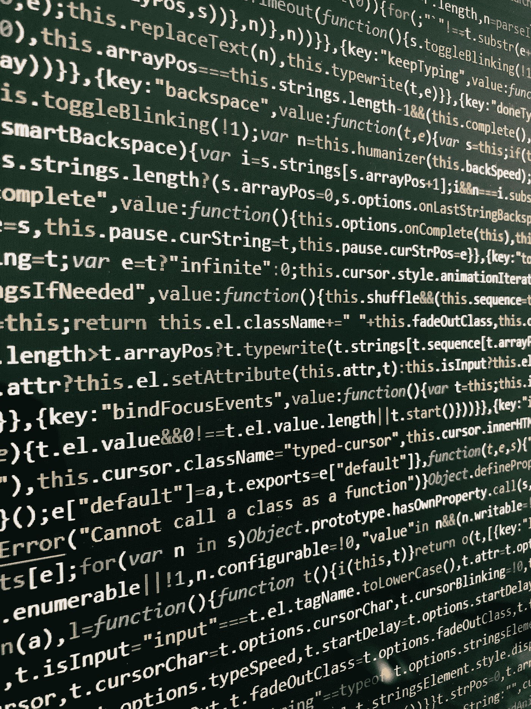
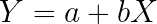
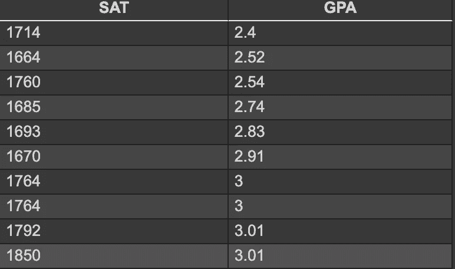
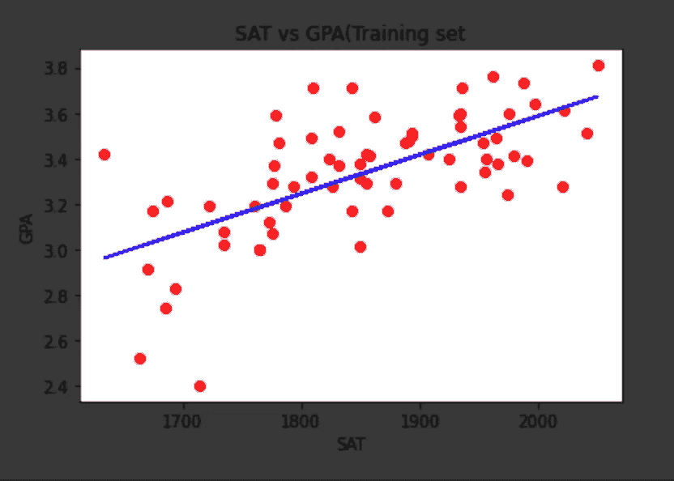
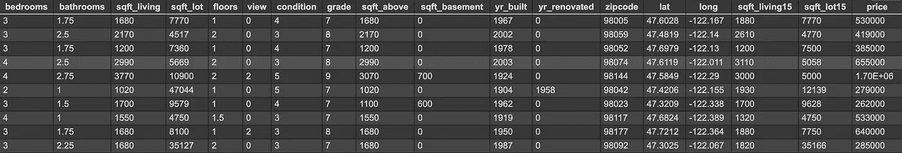
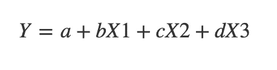

# 初学者机器学习中的回归技术介绍。

> 原文：<https://towardsdatascience.com/introduction-to-regression-techniques-in-machine-learning-for-beginners-2e5d3346d986?source=collection_archive---------52----------------------->

## 学习和实现机器学习的基础知识



由 [Unsplash](https://unsplash.com?utm_source=medium&utm_medium=referral) 上的 [Roozbeh Eslami](https://unsplash.com/@roozbeheslami?utm_source=medium&utm_medium=referral) 拍摄的照片

当谈到机器学习时，应用程序是巨大的，但允许开发人员在一系列模型之间进行选择的各种方法和技术也是巨大的。然而，如果没有对各种可用的回归模型的全面理解，机器学习的基础是不完整的。本文的目标是为初学者和有抱负的爱好者提供在该领域探索和进步所需的技能和框架。欢迎来到未来的开端。

# **线性回归:cout < <《你好世界》；的数据**

那么回归到底是什么？回归是一种统计工具，有助于识别和实现给定数据集的因变量和自变量之间的关系。然而，当谈到具体的线性回归时，我们考虑一个自变量和一个因变量之间的线性关系。我们将使用相对简单的数据集来理解这些概念。



y:因变量

x:独立变量

答:拦截

b:X 的常数

现在，上述方程是线性回归的数学表示，对于给定的一组数据，可以形成各种这样的回归线。然而，最佳拟合回归是最适合给定数据集的回归，并产生最佳的可能预测。

# **我们的数据集是什么？**

我们的数据集构成了任何给定模型的预测基础，并且必须为我们的预测提供准确的反映。对于任何可用于实现机器学习模型的数据集，必须对其进行清理和排序。本文将描述各种这样的数据处理方法。



上面提供的数据集显示了提供个人 SAT 分数和 GPA 的数据，从而为我们提供了线性回归应用的理想场景。快照仅包含 10 个数据点，然而，实际数据集包含 84 个数据点。

**让我们开始编码**

***导入库***

我们将使用 python 作为我们的主要语言进行编码，要实现这些模型，我们的第一步应该是导入所有必需的库，在这种情况下。

```
import numpy as npimport pandas as pdimport matplotlib.pyplot as plt
```

**NumPy** :增加了对大型多维数组和矩阵的支持。

**pandas** :它提供数据结构和操作，用于操纵数值表和时间序列。

**matplotlib** :是一个用于图形化表示的库。

***导入数据集***

```
dataset = pd.read_csv('data.csv')x = dataset.iloc[:,:-1].valuesy = dataset.iloc[:,-1].values
```

接下来，我们使用“pd.read_csv”导入给定的数据集，并将其存储在一个变量中。使变量尽可能不言自明是有益的。
最后，我们必须将自变量分配给变量 x，将因变量分配给变量 y，我们通过使用。iloc”方法为实现选择相应的列。

***分割数据集***

将数据集分成两部分——训练集和测试集。训练集用于训练您的模型，并使其从数据集“学习”，而测试数据集将允许我们测试我们训练的模型并检查其准确性。

sklearn 库用于各种数据处理功能。我们用这个库把我们的因变量(x)和自变量(y)分成各自的测试集和训练集。

```
from sklearn.model_selection import train_test_splitx_train, x_test, y_train, y_test = train_test_split(x,y , test_size = 0.2, random_state=0)
```

***神奇发生在哪里:训练你的第一个机器学习模型***

接下来，我们再次使用我们的 sklearn 库，通过数据集的训练集分区来训练我们的模型。我们以回归变量的名称创建一个对象，并用它来调用线性回归。

```
from sklearn.linear_model import LinearRegressionregressor = LinearRegression()regressor.fit(x_train,y_train)
```

我们的预测是什么？

```
y_pred = regressor.predict(x_test)
print(y_pred)
```

我们简单地使用上面的命令来为我们训练的“x_train”模型预测“x_test”。

**长什么样？**

现在，我们必须可视化我们的结果，以了解我们的回归线如何匹配我们的数据点。我们使用 Matplotlib 来做这件事。

```
plt.scatter(x_train,y_train, color = 'red')plt.plot(x_train,regressor.predict(x_train) , color='blue')plt.title('salary vs experience(Training set')plt.xlabel('years of experience')plt.ylabel('saslary')plt.show()
```



# 多变量回归

我们随后的回归模型将处理多个变量，这是机器学习中的一个重要里程碑，因为各种结果取决于不止一个独立变量。多变量回归是通向大量此类应用的大门。

让我们考虑一个将用于所有后续模型的数据集。



与之前的数据集相比，我们当前的数据集看起来要复杂得多。这是因为有大量的列作为影响我们结果的多变量因素。



```
from sklearn.linear_model import LinearRegressionregressor = LinearRegression()regressor.fit(X_train, y_train)
```

我们将使用 sklearn 导入我们的模型，并在我们的 X_train 和 y_train 数据分区上实现它。

***预测我们的结果***

这一次，我们将预测模型的实际结果，我们将通过实现以下代码行来做到这一点。

```
y_pred = regressor.predict(X_test)np.set_printoptions(precision=2)print(np.concatenate((y_pred.reshape(len(y_pred),1), y_test.reshape(len(y_test),1)),1))
```

我们使用 regressor 对象调用 X_test 分区上的 predict 方法，然后使用后续代码行同时打印 y_pred 和 y_test。这有助于我们比较预测值和期望值。

# **最后的话**

上面的文章是对数据世界的简要介绍，它基于使用数据作为一个强大的工具来进行准确预测的想法。我将写各种其他的回归和分类模型，以及它们在这个基础上的应用。敬请关注。

};