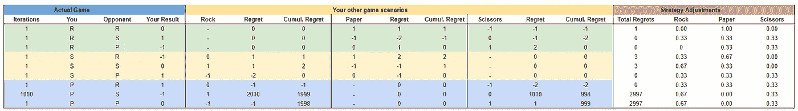

# 强化学习中的后悔介绍

> 原文：<https://towardsdatascience.com/introduction-to-regret-in-reinforcement-learning-f5b4a28953cd?source=collection_archive---------17----------------------->

## 有时候后悔是改善的好方法

照片由[在](https://unsplash.com/@freetousesoundscom?utm_source=medium&utm_medium=referral) [Unsplash](https://unsplash.com?utm_source=medium&utm_medium=referral) 上免费使用声音

**更新**:学习和练习强化学习的最好方式是去[http://rl-lab.com](http://rl-lab.com/)

> “最终，我们只后悔没有抓住机会”
> **刘易斯·卡罗尔**

# 介绍

几乎可以肯定的是，每个人一生中都有后悔的事情(实际上是很多事情)。后悔没有在价格还能承受的时候买票，后悔没有做出职业决定，后悔个人或社会的举动，等等……当然，后悔是有苦味的，尽管它可能具有教育意义，但现实是机会往往会失去，并且没有回头路。

但在训练机器或算法时，情况可能就不一样了。

# 遗憾

你最后悔的行动是本应该(更有可能)使用或采取的行动。所以采取这个行动的概率和你后悔没采取行动的程度成正比。

从数学上来说，后悔被表达为一个可能的行动的回报(奖励或回报)和已经实际采取的行动的回报之间的差异。如果我们将收益函数表示为 ***u*** ，则公式变为:

***后悔= u(可能的行动)- u(采取的行动)***

显然，我们感兴趣的是'*'可能行动的收益胜过' ***采取行动*** '的收益的情况，所以我们考虑积极的遗憾，忽略零和消极的遗憾。*

*如前所述，使用一个行为而不是实际使用的行为的概率与它产生的遗憾成正比。*

*例如，如果我们采取行动 a1，得到 u(a1) = 1，那么我们计算出 u(a2)= 2，u(a3) = 4，u(a4) = 7。相应的后悔将是后悔(a2) = u(a2) - u(a1) = 1，后悔(a3) = 3，后悔(a4) = 6。
总遗憾是遗憾(a1) +遗憾(a2) +遗憾(a3) +遗憾(a4) = 0 + 1 + 3 + 6 = 10。*

*很容易看出最后悔的动作是 a4。为了在数字上反映这一点，我们更新了我们的策略，表示为σ，例如σ(a2) = 1/10 = .1，σ(a3) = 3/10 = .3，σ(a4) = 6/10 = .6。*

*显然，你可能会问，为什么不显式地给动作 a4 一个概率 1 (σ(a4) = 1)？仅仅是因为当面对另一个演员时，比如在游戏中，后悔的概念被使用。在游戏中以确定性的方式进行游戏会给你的对手一个反击你的策略并赢得胜利的机会。*

## *石头剪刀布示例*

*考虑一个[石头剪刀布](https://en.wikipedia.org/wiki/Rock_paper_scissors) (RPS)的游戏，其点数系统如下:*

*   *损失-1 分*
*   *抽签(两个相同类型的项目)的结果是 0 分*
*   *赢给获胜者 1 分*

**

*[石头剪刀布](https://en.wikipedia.org/wiki/Rock_paper_scissors)游戏的支付格*

*下表给出了玩这个游戏的不同组合，以及结果和如何改进策略。*

**

*表格的第一部分(实际游戏)显示了你与对手的比赛，以及每集的“Y **我们的结果**”。“**迭代**”列是针对 ex: R 对 R，或 S 对 P 等的相同组合发生的发作次数*

*第二部分(你的其他游戏场景)包含假设对手以同样的方式玩游戏，你为了提高(或不提高)你的结果可以玩的场景。它也显示了没有玩一个给定动作的遗憾。
积云遗憾列包含累计遗憾，累计遗憾是遗憾的总和。*

*对累积遗憾的需求源于这样一个事实，即独立计算遗憾，并不能捕捉到在其他游戏或剧集中发生的事情。这意味着算法没有从它的经验中学习。*

*作为一个人，你在记忆中保留你以前玩过的游戏，以及如何利用这些过去的经验。但是为了让一个算法做同样的事情，应该有一个考虑到以前发生过的事情的计算。*

*第三部分(策略调整)，计算每个动作(石头、布、剪刀)的概率，以最大化你的结果，总是假设对手以同样的方式玩。*

*这些概率被计算为 ***(对行动的累积后悔)/总后悔*** 。其中总遗憾是同一行的正累积遗憾的总和。如果总遗憾为零，我们为每个行动分配相等的概率(检查第二行)。*

**

*上表第一行，你打了 R，对手打了 R，所以结果是平局(0)。如果你出了 P 而对手出了 R 那就更好了，所以你的后悔是 1 没出 P
策略调整说明你不后悔石头，也不后悔剪刀但是你后悔没用纸。
第二排，你用 R 对 S 获胜，策略调整部分显示 2 局后，你没有遗憾。*

*随着情节的继续，我们看到策略的变化达到了平衡，每个动作应该用 1/3。
PS。这是 RPS 中的最佳策略，因为它使所有 3 个动作的概率相等，因此移动是对手不可预测的。*

## *极端情况*

*现在，如果一个场景比其他场景播放得多会发生什么？
例如，在下表中，S 对 S 这一集发生了 1000 次，结果是 1000 次平局。这导致在这些情况下后悔 1000，并且策略转向 100%的时间使用石头。*

**

*在下面的例子中，P 对 S 发生了 1000 次，导致 1000 次损失，2000 次后悔没有用石头，1000 次后悔没有用剪刀。
因此，该策略被调整为 67%的时间使用石头，33%的时间使用剪刀。*

**

*但是，下面的例子中有一个陷阱，R vs S 出现 1000 次，结果是千胜万败，无怨无悔。因为没有遗憾，所以算法不更新策略。*

**

## *密码*

*下面是 Google Colab 书籍的链接，其中包含一个简单的后悔算法的代码。
**重要提示:为了运行或编辑代码，你需要复制一本书。***

* [## 简单 RPS 示例

colab.research.google.com](https://colab.research.google.com/drive/1FB57Jfi1llITSL6DUyUr_9P7lsXmOP-8#scrollTo=_9p-AnRTy8rI) 

# 自娱自乐后悔

到目前为止，我们假设对手一直以同样的方式玩，使用同样的策略。然而，这不可能是真的！任何对手最终都会发现你策略中的任何偏差，并加以利用。

所以训练不能针对固定的策略。为了补救这种情况，我们使用自我游戏。Self Play 不是训练一个演员对抗一个固定的策略，而是训练所有演员互相对抗。这是通过“复制”第一个演员所做的序列，并将其应用于其他演员来完成的。因此，每个演员现在都维护自己的数据结构，其中包含自己的策略、遗憾等。在每一集之后，每个演员都从自己的角度计算结果，以及可以(可能)做些什么来改善结果。

## 密码

下面的链接指向一个 Google Colab 书籍，它实现了一个简单的后悔自我游戏。

**重要提示:为了运行或编辑代码，你需要复制一本书。**

 [## RPS 自我游戏示例

colab.research.google.com](https://colab.research.google.com/drive/1FB57Jfi1llITSL6DUyUr_9P7lsXmOP-8#scrollTo=-ej-kJVb8j0y) 

有趣的是，我们注意到，无论两个参与者从什么策略开始，他们都收敛到 RPS 游戏的最佳策略，即每个动作的概率都是 1/3。这确保了所有行动的可能性相等，并防止任何可能被对手利用的偏差。

# 结论

本文介绍了简单直观的后悔技巧。它允许玩家通过跟踪过去游戏的遗憾来达到平衡游戏，使未来游戏与积极的遗憾成比例。这项技术是更精细的技术的基础，比如反事实后悔最小化(CFR)和深度 CFR。*