# 强化学习简介

> 原文：<https://towardsdatascience.com/introduction-to-reinforcement-learning-c99c8c0720ef?source=collection_archive---------36----------------------->

## 经典强化学习算法的高级结构概述

图片来自[https://unsplash.com/photos/iar-afB0QQw](https://unsplash.com/photos/iar-afB0QQw)

强化学习(RL)是机器学习的一个不断发展的子集，也是人工智能的一个最重要的前沿领域，因为它在过去几年里随着机器人、游戏和其他许多领域的大量成功应用而获得了极大的普及。它表示一组处理顺序决策的算法，并且能够根据本地环境做出智能决策。

RL 算法可以被描述为一种模型，该模型向代理指示它应该在封闭环境中采取哪组动作，以便最大化预定义的整体回报。一般来说，代理人尝试不同的行动，评估获得的总回报。经过多次尝试后，该算法会学习哪些行为会带来更大的回报，并建立一种行为模式。由于这一点，它能够告诉代理在每种情况下采取哪些行动。

RL 的目标是捕捉更复杂的结构，并使用比经典机器学习更具适应性的算法，事实上，与经典机器学习算法相比，RL 算法在行为上更加动态。

# 应用程序

让我们看看一些基于 RL 的应用示例:

*   *机器人* - RL 可用于高维控制问题，也可用于各种工业应用。
*   *文本挖掘* - RL 和一个文本生成模型，可以用来开发一个系统，这个系统能够生成长文本的高度可读的摘要。
*   *交易执行* -金融行业的主要公司使用 RL 算法来改进他们的交易策略。
*   *医疗保健* - RL 可用于药物剂量，以及优化慢性临床试验患者的治疗等。
*   *游戏*——RL 因作为用于解决不同游戏和实现超人性能的主要算法而闻名。

# 演员

RL 算法基于马尔可夫决策过程(MDP)。马尔可夫决策过程是一种特殊的随机时间控制决策过程。RL 算法的主要参与者是:

*   *代理*:在环境中执行动作以优化长期回报的实体；
*   *环境*:代理人做决策的场景；
*   *状态集* ( *S* ):环境所有可能状态的集合，状态描述环境的当前状况；
*   *动作集合* ( *A* ):代理可以执行的所有可能动作 A 的集合；
*   *状态转移模型 P(s0 | s，a)* :描述对于每个状态 *s* 、*s0*和动作 *a* ，当 agent 在状态 *s* 执行动作 a 时，环境状态在*s0*发生变化的概率；
*   *奖励(r = R(s，a))* :指示在状态 s 采取行动 a 的即时实际价值奖励的函数；
*   *插曲(rollout)* :从 *0* 到最终值 *L* 变化的 *t* 的一系列状态 st 和动作 at(称为视界，最终可以是无限的)；代理在其环境的给定状态下启动；在每个时间步 *t* 处，代理观察当前状态 *s_t ∈ S* 并因此采取行动*A _ t∈A*；根据状态转换模型，状态演变成新的状态 *s_(t+1)* ，其仅取决于状态 *s_t* 和动作*a _ t*；代理获得奖励*r _ t*；然后代理观察到新的状态*S(t+1)∈S*，循环重新开始；

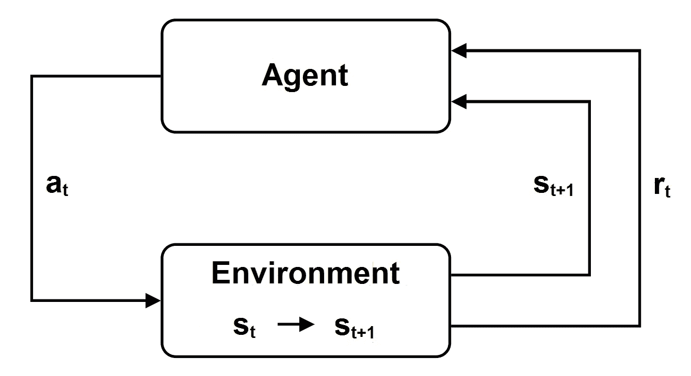

作者图片

*   *策略功能*:策略可以是确定性的( *π (s)* )或随机的( *(a|s)* ):确定性策略π (s)表示当环境处于状态 s ( *a = π (s)* )时代理执行的动作 a；随机策略 *π (a|s)* 是描述当环境处于状态 *s* 时代理执行动作 *a* 的概率的函数。一旦指定了策略，新的状态只依赖于策略和状态事务模型；
*   *Return G_t* :根据当前时间步和后续每个时间步的即时奖励，以及折扣因子γ < 1，每集结束时获得的带折扣的总长期奖励:

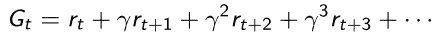

*   价值函数 *V(s)* :从状态 s 开始，在当前时间步长 *t* 的一集结束时的预期长期回报:

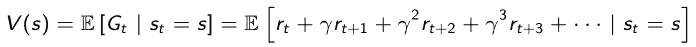

*   Q-Value 或 Action-Value function *Q(s，a)* :从当前时间步的状态 *s* 开始，执行动作 *a* 的一集结束时的预期长期收益；
*   *贝尔曼方程*:大部分 RL 算法中的理论核心；根据它，当前价值函数等于当前报酬加上在下一步评估的自身，并折现γ(我们回忆一下，在方程*中 P* 是模型转换模型):

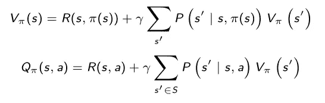

# 最优策略

随着策略的改变，动作值函数的最大值被称为最优动作值函数 *Q*(s，a)* ，并且根据贝尔曼方程由下式给出

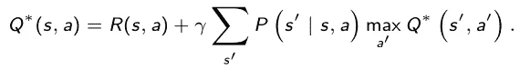

那么最优策略 *π*(s)* 由最大化动作值函数的动作给出:

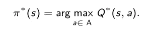

问题是，在大多数实际情况下，状态转移模型和报酬函数是未知的，因此有必要从采样中学习它们，以便估计最佳行动值函数和最佳策略。由于这些原因，使用 RL 算法，以便在环境中采取行动，观察和学习模型的动态，估计最优值函数和最优策略，并提高回报。

# 勘探开发困境

探索是对新数据点的训练，而开发是对以前获取的数据的使用。如果我们在每次迭代中不断寻找最佳行动，我们可能会停留在有限的一组状态中，而无法探索整个环境。为了摆脱这个次优集合，通常使用一种叫做ϵ-greedy:的策略，当我们选择最佳行动时，选择随机行动的ϵ概率很小。

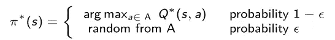

# 方法

当我们实现一个 *RL* 算法时，我们可以使用 3 种主要的方法:

*   *基于价值的方法-* 基于价值的算法通过不断改进其估计值来逼近最优价值函数或最优行动价值函数。通常值函数或动作值函数是随机初始化的，然后不断更新直到收敛。基于值的算法保证收敛到最优值。
*   *基于策略的方法-* 基于策略的算法寻找一个策略，使得在每个状态下执行的动作是最优的，以在未来获得最大的回报。它在每一步重新定义策略，并根据这个新策略计算值函数，直到策略收敛。基于策略的方法也保证收敛到最优策略，并且通常比基于值的算法花费更少的迭代来收敛。
*   *基于模型的方法-* 基于模型的算法从原始环境开始学习虚拟模型，代理学习如何在虚拟模型中执行。它在学习阶段使用减少数量的与真实环境的交互，然后基于这些交互建立新的模型，使用该模型模拟进一步的情节，并获得虚拟模型返回的结果。

# 基于价值的方法

## 价值函数逼近

价值函数逼近是最经典的价值方法之一。其目标是通过迭代逼近最优行动值函数 *Q*(s，a)* 来估计最优策略 *π*(s)* 。我们开始考虑一个参数动作值函数 *Q^(s，a，w)* ，其中 *w* 是一个参数向量。我们随机初始化向量 *w* 并迭代每集的每一步。对于每次迭代，给定状态 *s* 和动作 *a* ，我们观察奖励 *R(s，a)* 和新状态*s’*。根据获得的回报，我们使用梯度下降更新参数:

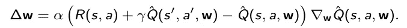

等式中，α是学习率。可以证明这个过程是收敛的，得到的作用值函数就是我们对最优作用值函数的逼近。在大多数实际情况下，参数动作值函数 *Q^(s，a，w)* 的更好选择是神经网络，然后参数矢量 *w* 由神经网络的权重矢量给出。

*值函数逼近算法:*

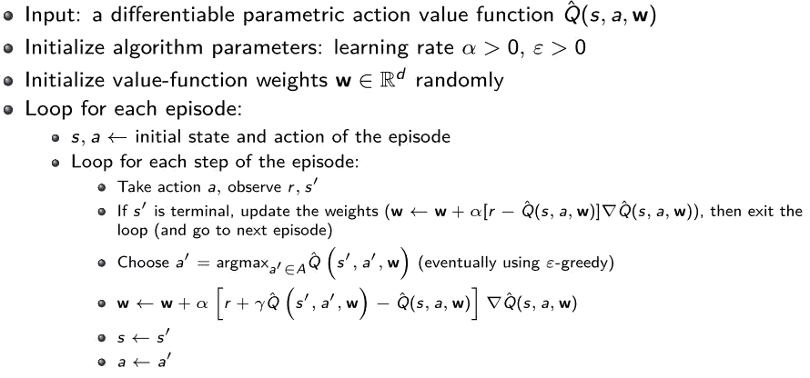

## 深度 Q-网络

深度 q 网络是深度学习和 RL 的组合，因为它是值函数近似算法，其中参数动作值函数 *Q^(s，a，w)* 是深度神经网络，特别是卷积神经网络。此外，深度 Q 网络主要使用两种技术来克服不稳定学习

*   *目标网络-* 模型更新可能非常不稳定，因为每次模型更新自身时，真实的目标都会改变。解决方案是创建一个目标网络 *Q^(s',a',w')* ，它是训练模型的副本，更新频率较低，例如每千步更新一次(我们将目标网络的权重表示为*w’*)。在使用梯度下降的每个模型更新中，目标网络代替模型本身用作目标:

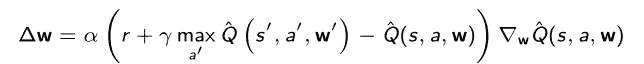

*   *体验回放-* 在所描述的算法中，使用来自同一集的数据执行若干连续更新，这可能导致过拟合。为了解决这个问题，创建了一个经验重放缓冲区，存储所有不同剧集的四元组( *s* 、 *a* 、 *r* 、*s’*)，并在每次模型更新时随机选择一批元组。这种解决方案有 3 个优点:减少过度拟合，用小批量提高学习速度，重用过去的元组以避免遗忘。

## 拟合 Q 迭代

另一种流行的基于值的算法是拟合 Q 迭代。考虑确定性的情况，在这种情况下，根据某个函数 *f，*，新状态*s’*由状态 s 和动作 a 唯一确定，那么我们可以写出*s’= f(s，a)* 。设 *L* 为地平线，可能是无限的，我们回忆地平线是所有剧集的长度。该算法的目标是估计最佳动作值函数。根据贝尔曼方程，最佳动作值函数 *Q*(s，a)* 可以看作是一个算子 *H* 对动作值函数 *Q(s，a)* 的应用:

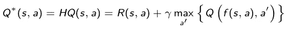

现在考虑时间范围 *N* 小于或等于时间范围 *L* ，并且由 *Q_N (s，a)* 表示通过将刚刚定义的算子 *H* 应用于动作值函数*Q _(n1)(s，a)* 而定义的在 *N* 步上的动作值函数，其中

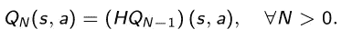

可以表明，这个序列的*N*-阶跃动作值函数 *Q_N (s，a)* 收敛到最优动作值函数 *Q*(s，a)* 为 *N → L* 。由于这一点，有可能建立一种算法来逼近最优动作值函数 *Q*(s，a)* ，在 *N* 上迭代。

*拟合 Q 迭代算法:*

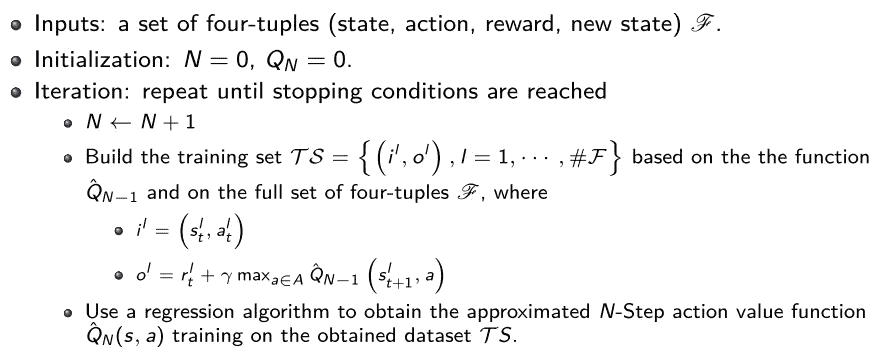

Fitted Q 迭代的完整实现可以在 GitHub
([https://github.com/teopir/ifqi](https://github.com/teopir/ifqi))上找到。

## 拟合 Q 迭代应用示例:山上的汽车

考虑一辆由点质量建模的汽车，它以如下形式在山上行驶:

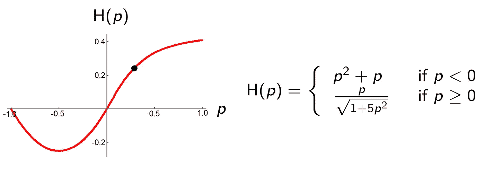

作者图片

控制问题的目标是在最短的时间内将汽车带到山顶，同时防止汽车的位置 p 变得小于 *-1* 并且其速度 *v* 超出区间 *[-3，3】*。在位置 *p = 1* 到达山顶。

*状态空间-* 这个问题有一个二维(汽车的位置 *p* 和速度 *v* )的(连续)状态空间，我们希望位置的绝对值小于等于 *1* ，速度的绝对值小于等于 *3* :

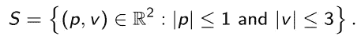

每隔一个位置和速度的组合被认为是一个终端状态。

*动作空间-* 动作 *a* 直接作用于汽车的加速度，并且
只能假设两个极值(全加速( *a* = 4)或全减速( *a -4* ))。因此，动作空间是由集合给出的

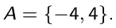

*系统动力学-* 时间离散化为 *0.1* 秒的时间步长。给定时间步长 t 处的状态( *p* ， *v* )和动作 *a* ，我们能够计算时间步长 *t + 1* 处的状态( *p* ， *v* )，用数值方法求解与描述系统动态的位置和速度相关的两个微分方程:

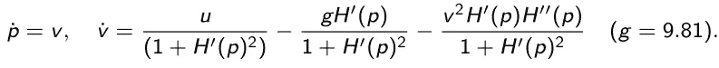

当然，为了我们的目的，理解这些方程的含义并不重要，重要的是理解在时间步长 *t* 的给定状态和动作，时间步长 *t + 1* 的状态是唯一确定的。

*奖励函数-* 奖励函数 *r(s，a)* 通过以下表达式定义:

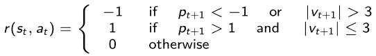

如果位置小于 *-1* 或者速度的绝对值大于 *3* 因为我们到达了终止状态但是没有到达山顶，奖励是*-1*；如果位置大于 1 并且速度的绝对值小于 3，奖励是 *1* ，因为我们到达了遵守速度限制的山顶；否则奖励为 *0* 。

*折扣因子-* 衰减因子γ被选择为等于 0.95。

*初始点* -开始时，汽车停在山脚下( *p* 、 *v* ) = ( *0.5* 、 *0* )。

*回归器-* 使用的回归器是一个额外的树回归器。

对 *N = 1* 到 *50* 执行拟合的 q 迭代，结果是对于 *N > 20* 动作值函数 *Q^_N* (s，a)和 *Q^_(N+1)(s，a)* (对( *p* ， *v* )的所有组合计算)之间的均方误差迅速减小到 *0* 为此，使用动作状态函数 *Q^_20(s，a)* 研究结果。

左图中我们可以看到根据动作值函数 *Q^_20(s，a)* 为
( *p* ， *v* )的每种组合选择的动作(红色区域代表减速，绿色区域代表加速，蓝色区域代表减速和加速的动作值相等)。

根据动作值函数 *Q^_20(s，a)* 的最佳轨迹如右图所示。

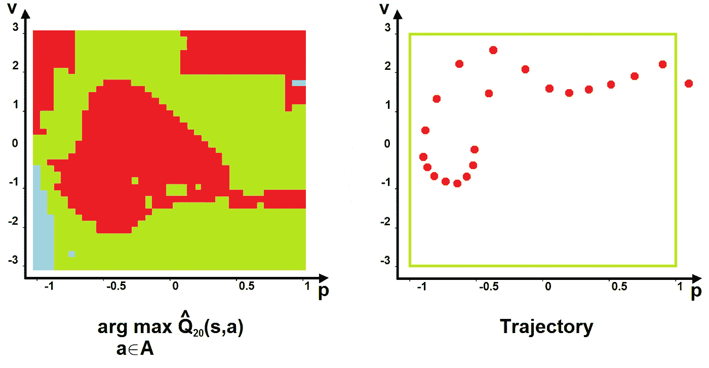

作者图片

# 策略值方法

## 政策梯度

政策梯度是最经典的基于政策的方法。策略梯度法的目标是在参数化策略 *π (a|s，θ)* 下，找到使价值函数 *V (s，θ)* 最大化的参数矢量 *θ* 。

我们开始考虑一个参数策略 *π (a|s，θ)* 关于参数向量 *θ* 可微；特别地，在这种情况下，我们选择随机策略(在这种情况下，该方法被称为随机策略梯度，然而，确定性策略的情况非常类似)。

我们随机初始化向量 *w* 并在每一集迭代。对于每个时间步长 *t* ，我们生成一个三元组序列( *s* ， *a* ， *r* )，根据参数策略 *π (a|s，θ)* 选择动作。对于结果序列中的每个时间步，我们计算总的长期奖励，并根据所获得的奖励计算折扣 *G_t* :

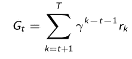

然后，使用梯度更新过程来修改参数向量 *θ_t*

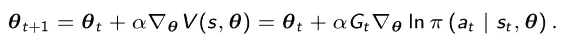

在等式中，α > 0 是学习率。

可以证明这个过程是收敛的，得到的过程就是我们的近似最优策略。

*策略梯度算法:*

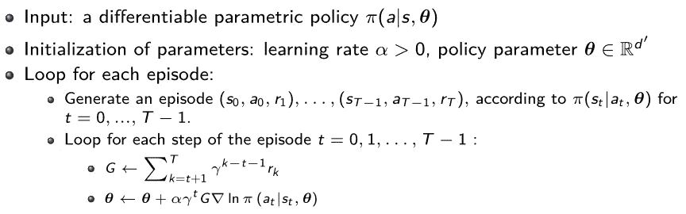

## 参数策略的示例

最常用的参数策略是 Softmax 策略和高斯策略*。*

*Softmax 策略*
Softmax 策略由一个 soft max 函数组成，该函数将输出转换为概率的
分布，主要用于离散动作的情况:

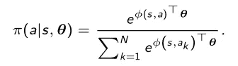

在这种情况下，梯度更新的显式公式由下式给出

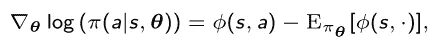

其中 *φ(s，a)* 是与状态和动作相关的特征向量。

*高斯策略*
高斯策略用于连续动作空间的情况，由高斯函数给出

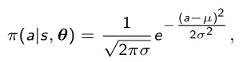

其中 *(s)* 由φ(s) T *θ给出，* φ(s，a)为特征向量， *σ* 可以是固定的，也可以是参数化的。在这种情况下，我们还有梯度更新的显式公式:

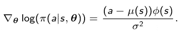

## 政策梯度的利与弊

*优点*

*   与基于价值的
    方法相比，政策梯度方法是一个更简单的流程。
*   它允许动作相对于状态是连续的。
*   相对于其他方法，它通常具有更好的收敛特性。
*   当动作和状态集很大时，它避免了存储器使用和计算时间的增长，因为目标是学习一组参数，其大小远小于状态集和动作集的大小。
*   它可以学习随机政策。
*   它允许使用ϵ-greedy 方法，这样代理人可以有一个采取随机行动的概率ϵ。

*缺点*

*   策略梯度方法通常收敛于局部最优，而不是全局最优。
*   它通常具有很高的方差(但是可以通过一些技术来降低)。

## 政策梯度应用示例:CartPole

CartPole 是一种游戏，其中一根杆子通过一个未驱动的关节连接到一辆沿着无摩擦轨道移动的车上。杆子开始直立。

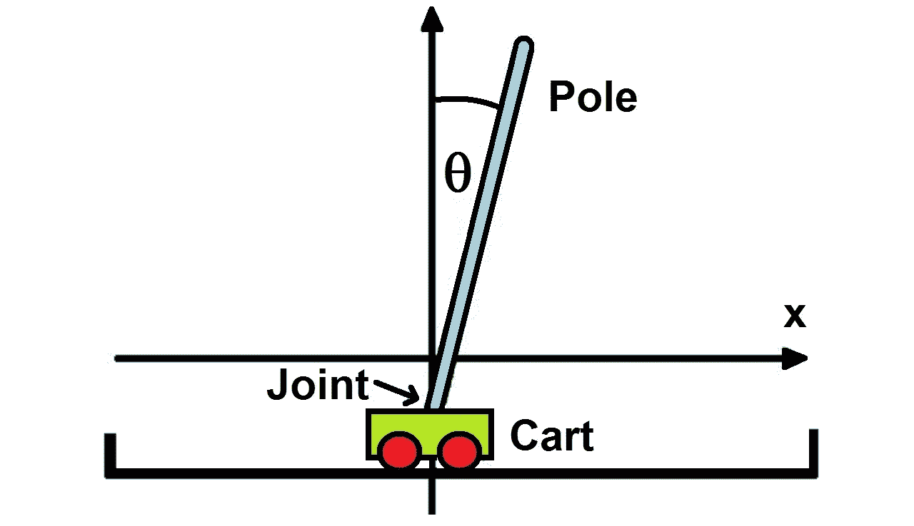

作者图片

目标是通过增加和减少小车的速度来防止杆子倒下。

*状态空间-* 单个状态由 4 个元素组成:

*   推车位置
*   推车速度
*   磁极角度
*   极点角速度

当杆子落下时游戏结束，也就是杆子角度超过 *12* ，或者推车位置到达显示器边缘。

*行动空间-* 代理只能采取两种行动:

*   向左移动杆子
*   向右移动杆子

*奖励-* 每采取一个步骤(包括终止步骤)，奖励增加 *1* 。这显然是因为我们希望实现尽可能多的步骤。

使用 Softmax 策略的梯度策略方法解决问题，折扣因子 *γ = 0.95* ，学习率 *α = 0.1* 。对于每一集，最大迭代次数为 1000 次。

在大约 60 个时期(其中 1 个时期等于 20 个连续的情节)之后，代理学习一个策略，由于这个策略，我们获得了等于 1000 的奖励，这意味着在该情节的所有 1000 个步骤中杆子都没有落下。

在这些图中，我们可以看到动作的选择是如何随杆角度和小车速度(左图)以及杆角速度和小车速度(右图)而变化的。红色区域是选择向左移动动作的地方，绿色区域是选择向右移动动作的地方，黄色区域是选择一个动作或另一个动作的概率相似的地方。

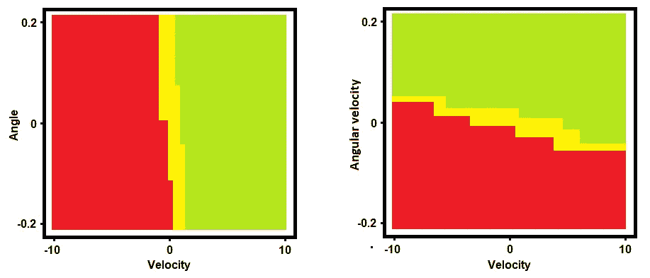

作者图片

一个很有意思的结果是，如果 *γ* 大于 0.9，单集奖励随着历元数增长，达到最大值 1000，而如果 *γ* 小于 0.9，经过一些历元后，单集奖励停止增长。这意味着，在这个问题中，下一步的奖励对于找到最佳策略非常重要，这实际上是合理的，因为学习如何防止杆子落下的基本信息是知道在每一集里它落下了多少步。

在 GitHub 上，可以找到这个例子的许多不同的实现。

## 演员-评论家方法

另一种流行的基于政策的方法是演员批评法。它不同于策略梯度方法，因为它同时估计策略和值函数，并更新两者。

在政策梯度中，参数向量 *θ* 使用长期报酬 *G_t* 进行更新，但这种估计通常具有较高的方差。为了解决这个问题并减少结果的巨大变化，演员-评论家方法的思想是从总报酬中减去折扣 *G_t* 基线 *b(s)* 。

所获得的值 *δ = Gt - b(s)* ，即所谓的时间差分误差，用于更新参数矢量 *θ* 来代替长期报酬 *G_t* 。基线可以有几种形式，但最常用的是价值函数 *V(s)* 的估计。

如同在基于值的方法中，值函数 *V(s)* 可以用神经网络学习，其输出是近似值函数 *V^(s，w)* ，其中 *w* 是权重向量。然后，在每次迭代中，时间差误差 *δ* 不仅用于调整参数矢量 *θ* ，还用于更新权重矢量 *w* 。

这种方法被称为演员-评论家方法，因为:

*   评论家估计价值函数 *V(s)* 。
*   参与者按照评论家建议的方向更新策略分布(如在策略梯度方法中)。

*演员-评论家算法:*

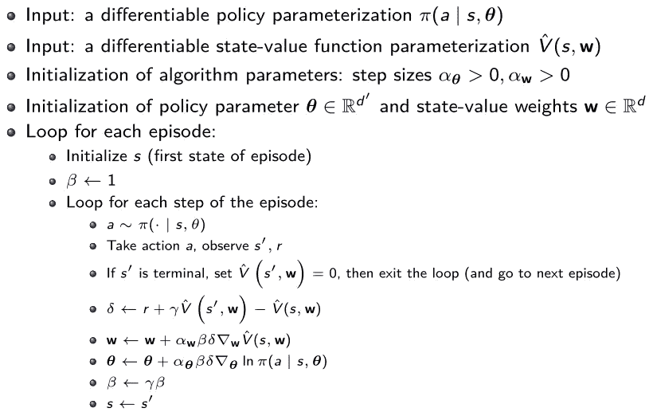

# 基于模型的方法

如已经强调的，基于模型的方法从原始环境开始创建虚拟模型，并且代理学习如何在虚拟模型中执行。基于模型的方法开始考虑基本参数模型，然后运行以下 3 个步骤:

1.  *Acting* :基础策略 *π_0(a_t|s_t)* 用于选择在真实环境中执行的动作，以收集三元组(state、action、new state)给出的一组观察值；
2.  *模型学习*:从收集的经验中，推导出新的模型 *m(s，a)* ，以使模型新状态与真实新状态之间的最小二乘误差最小；可以使用监督学习算法来训练模型，以最小化来自采样轨迹的最小平方误差；
3.  *规划*:根据新的模型更新价值函数和策略，以便在下一次迭代中用于选择要在真实环境中执行的动作。

最常用来表示系统动态的模型之一是高斯过程，其中预测使用高斯分布对观测值进行插值。另一种可能性是使用高斯混合模型，这是一种概率模型，它假设所有数据点都是从具有未知参数的有限数量的高斯分布的混合中生成的。这是对 *k* 的一种概括，意味着聚类包含了关于数据的协方差结构以及潜在高斯中心的信息。

*基于模型的方法示例算法:*

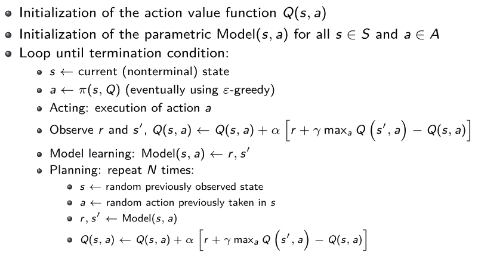

## 模型预测控制

模型预测控制是刚刚描述的方法的发展。所描述的基于模型的算法易受漂移的影响:小误差沿着轨迹快速积累，并且搜索空间太大，任何基本策略都无法覆盖全部。由于这个原因，轨迹可能到达模型还没有被学习的区域。如果没有围绕这些区域的适当模型，就不可能规划最佳控制。

为了解决这个问题，不是在开始时学习模型，而是在轨迹期间连续地执行模型的采样和拟合。然而，前面的方法在再次拟合模型之前执行所有计划的动作。

在模型预测控制中，整个轨迹被优化，但是仅执行第一个动作，然后新的三元组( *s* 、 *a* 、*s’*)被添加到观测值中，并且再次进行规划。这允许在再次观察到当前状态时采取纠正措施。对于随机模型来说，这尤其有用。

通过不断改变计划，MPC 不容易受到模型中问题的影响。新算法运行 5 个步骤，其中前 3 个与以前的算法相同(动作、模型学习、规划)。然后我们有:

1.  *演技*
2.  *模型学习*
3.  *策划*
4.  *执行*:执行第一个计划动作，观察结果状态*s’*；
5.  *数据集更新*:新的三元组( *s* ， *a* ，*s’*)被追加到数据集；转到第 3 步，每隔 *N* 次转到第 2 步(正如已经看到的，这意味着规划在每一步都执行，并且模型在轨迹的每 *N* 步都被拟合)。

## 基于模型的方法的优点和缺点

基于模型的 RL 具有很强的优势，即在样本很少的情况下非常有效，因为许多模型至少在局部附近表现为线性。

一旦模型和回报函数已知，最优控制的规划就不需要额外的采样。通常，学习阶段是快速的，因为不需要等待环境响应，也不需要为了恢复学习而将环境重置到某个状态。

不利的一面是，如果模型不准确，我们可能会学到与现实完全不同的东西。另一点没有价值是，基于模型的算法仍然使用无模型的方法来构建模型或在计划和模拟阶段。

## 结论

本文是许多经典 RL 算法的高级结构概述。然而，令人遗憾的是，每个型号系列中都有很多我们没有涉及到的变体。例如，在深 Q 网络家族中，双深 Q 网络给出了非常有趣的结果。

RL 的主要挑战在于准备仿真环境和选择最合适的方法。这些方面高度依赖于要执行的任务，并且非常重要，因为许多现实世界的问题具有巨大的状态或动作空间，必须被有效和全面地表示。

其他主要任务是优化奖励以获得期望的结果，建立系统以使学习过程在合理的时间内收敛到最优，并避免过度适应和遗忘。

# 作者

我关于走向数据科学的文章:[https://medium.com/@marcodelpra](https://medium.com/@marcodelpra)

我的 LinkedIn 个人资料:【https://www.linkedin.com/in/marco-del-pra-7179516/ 

领英集团 *AI 学习:*[https://www.linkedin.com/groups/8974511/](https://www.linkedin.com/groups/8974511/)

# 参考

1.  理查德·萨顿和安德鲁·巴尔托。*强化学习:安
    简介*。
2.  文森特·弗朗索瓦·拉韦特、彼得·亨德森、里亚沙特·伊斯兰、马克·g·贝勒马尔、乔埃勒·皮诺。*深度强化学习简介。*
3.  达米恩·恩斯特，皮埃尔·格茨，路易斯·韦汉高。*基于树的批处理模式
    强化学习*。机器学习研究杂志 6(2005)
    503–556。
4.  [https://github.com/openai/gym](https://github.com/openai/gym)
5.  [https://github.com/teopir/ifqi](https://github.com/teopir/ifqi)