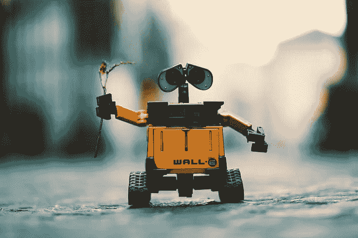
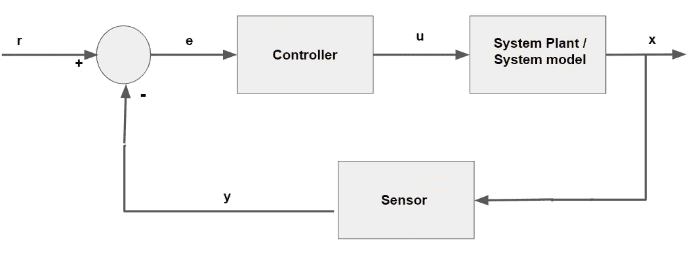

# 机器人控制系统介绍

> 原文：<https://towardsdatascience.com/introduction-to-robotic-control-systems-9ec17c8ac24f?source=collection_archive---------17----------------------->

PC:pick pik([https://www . pick pik . com/wall-e-robot-toy-cute-wallpaper-romantic-2954](https://www.pickpik.com/wall-e-robot-toy-cute-wallpaper-romantic-2954))

机器人学是工程学和计算机科学之间的交叉学科。机器人技术的主要目标是生产计算机可编程的机器，能够以更高的速度和精度完成任务。在当前时代，机器人的应用数不胜数，例如运输重物(在物流管理中)、自动化制造、自动驾驶汽车和无人驾驶飞行器等等。

了解**控制系统**的概念对每个初学者来说都是入门机器人的必要条件。控制系统有助于控制机器人的运动和功能。为了理解控制系统，我们首先需要理解机器人学中使用的一些术语。

反馈控制系统(作者供图)

*   **状态**——机器人系统产生输出被称为状态。通常我们用 **x** 来表示，状态取决于其先前的状态、施加到致动器的激励(信号)以及环境的物理特性。状态可以是姿态、速度、速率、角速度、力等等。
*   **估计** -机器人无法确定准确的状态 **x** ，但它们可以**使用附着在它们身上的传感器来估计**x。这些估计用 **y** 表示。机器人工程师的责任是选择足够好的传感器或很好地校准传感器，以便它们能产生 **y ~ x.**
*   **参考** -我们希望达到的目标状态，用 **r.** 表示
*   **误差**—**参考值和估计值**之间的差异称为误差。
*   **控制信号** -控制器产生/输出的刺激称为控制信号，用 **u.** 表示
*   **动力学** -也称为系统设备/系统模型，它表示系统在非静态条件下的行为。动态受环境影响，环境可能变化或不总是线性的。例如，地板类型(混凝土/木材)、空气阻力、坡度等。

工程师的主要职责始终是构建一个控制器，该控制器反应并产生控制信号 **u，**，使得 **e~0 & x~r.**

让我给你举一个上面讨论的关键术语的例子。假设你正在建造一个自动驾驶机器人。你应该为你的机器人配备一个巡航控制器。这里，

*   你的机器人的速度(x)就是状态
*   来自首选传感器(例如车轮编码器)的估计当前速度(y)
*   你希望达到的速度是参考值(r)
*   误差仅仅是 r 和 y 之间的差异
*   控制器产生的增加或降低速度的电压就是你的控制信号(u)
*   摩擦和空气阻力等环境特征可能会影响系统的动态特性。你应该在设计控制系统方程之前考虑它们

注意:一个机器人可以有一个或多个用于不同目的的控制器。例如，一个控制器用于巡航控制，另一个控制器用于控制机器人手的线性运动，一个控制器用于手的旋转运动等。

我们需要控制器，因为动态(系统设备)随时间变化。例如当机器人在斜坡上向上移动，然后在斜坡上向下移动，或者首先在光滑的混凝土上移动，然后在铺有地毯的地板上移动。因此，设计控制器的最佳方式是充分了解环境的物理特性。这将有助于列出控制器设计中需要考虑的要素。

在我结束之前，让我们看看控制器的理想特性。我们已经看到了第一个要求，

1.  控制器应该将误差减小到接近零， **e~0，**它应该将估计值带到参考值， **y~r**
2.  他们需要**健壮，**不应该依赖于我们不知道的东西。如果机器人的环境有任何变化，它们应该能够适应。
3.  它们必须**稳定**，也就是说它们不应该失控。
4.  他们需要动作流畅。
5.  控制器需要**响应**。它应该足够快，以便在令人满意的时间内使输出达到基准电平

总之，我们给控制器一个参考状态。控制器还具有传感器反馈，利用参考状态和传感器反馈控制器产生达到参考状态所需的控制信号。这个控制信号被馈送到“系统”。系统动态特性决定了系统对该控制输入的反应。如果控制器是好的，希望“系统”将达到我们期望的参考状态。

希望这篇关于机器人控制系统的简短介绍对初学者有所帮助。