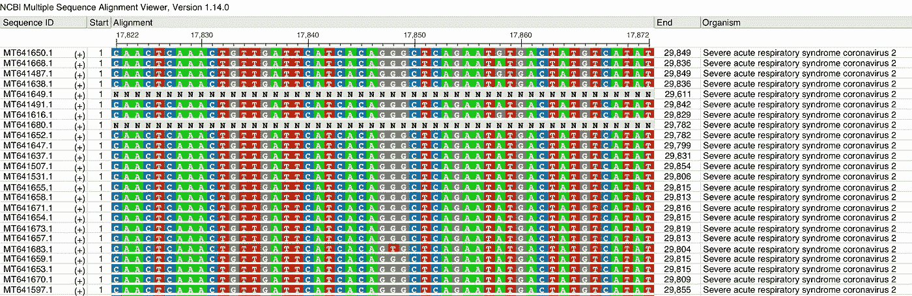

# Biopython 序列比对简介

> 原文：<https://towardsdatascience.com/introduction-to-sequence-alignments-with-biopython-f3b6375095db?source=collection_archive---------19----------------------->

## 在 Biopython 中使用序列比对软件包装器

上周，我开始用 Biopython 库摆弄 Python 中的一些生物信息学工具。[在我之前的帖子](https://medium.com/@wvsharber/introduction-to-genbank-and-bioinformatics-with-python-8a25a0f15e3f)中，我介绍了生物信息学领域，并提供了一个用 Biopython 的 API 接口从 GenBank 下载数据的例子。今天，我想转到分析 DNA 序列数据的下一个典型步骤——比对过程。我将对序列比对进行介绍，然后给出一个使用 Biopython 过滤一些数据并运行比对软件的简单示例。

**序列比对介绍**

当处理生物序列数据(DNA、RNA 或蛋白质)时，生物学家通常希望能够将一个序列与另一个序列进行比较，以便对序列的功能或进化做出一些推断。就像您不希望使用数据表中数据在错误的列进行分析一样，为了从序列数据中做出可靠的推断，我们需要确保我们的序列数据组织良好或“对齐”不幸的是，序列数据没有漂亮的标签，比如日期、每加仑英里数或马力。相反，我们所拥有的只是序列中的位置编号，而且只与该序列相关。幸运的是，许多序列在相关生物之间高度保守或相似(并且所有生物在某种程度上都是相关的！).如果我们相当确定我们已经从来自多个生物体的相同序列中获得了数据，我们可以将这些数据放入一个我们称之为比对的矩阵中。如果你只是比较两个序列，这叫做*成对比对*。如果您正在比较三个或更多序列，这被称为*多序列比对* (MSA)。

利用序列中每个分子的位置和身份，我们可以推断出每个分子在基质中的相对位置。有时序列中会有差异，比如在一个大多数序列都是 C 的位置，我们发现一个序列带有 g，这被称为单核苷酸多态性(SNP)。在其他时候，我们发现一个序列缺少一个存在于其他序列中的分子，或者一个序列有一个额外的分子。前者是删除，而后者是插入，统称为“插入”当用 indels 比对序列时，我们必须通过在剩余的序列上添加缺口来解释这些额外的或缺失的分子。这些微小的差异通常是序列数据中有趣的部分，因为变异是我们如何对序列的功能或进化做出推断的。以下是 SNPS 和因德尔斯签订的管理服务协议的几个例子。

```
Example 1\. Multiple Sequence Alignment with a Single Nucleotide Polymorphism (SNP) in Sequence 3 at position 3\.      1 2 3 4 5 6 7 8 <- Nucleotide Positions
Seq1 G T **C** G C A A A 
Seq2 G T **C** G C A A A
Seq3 G T **G** G C A A AExample 2\. Multiple Sequence Alignment with an insertion in Sequence 1 at position 6. 1 2 3 4 5 6 7 8
Seq1 G T C G C **A** A A 
Seq2 G T C G C **-** A A
Seq3 G T C G C **-** A A
```

上面两个例子中，序列长度短，序列个数少，序列间相似度高。因此，直观地排列序列非常容易。然而，如果您有数百个序列，有数千或数万个位置要对齐，您可能不想全部手动对齐！相反，有一些程序使用算法来排列序列。

对于算法来说，比对是非常有趣的问题。首先，您希望通过对齐序列来最小化它们之间的差异。对于不同的序列区域，该算法有两种选择:(1)在比对中添加一个缺口，说明“该区域对于该序列是唯一的，并且在其他序列中没有类似的东西，”或者(2)将不相似的序列比对在一起，实质上说明“这些在这里是不同的，但是周围的序列足够相似以保持位置结构相同。”如果算法的唯一目标是最小化差异，它只会不断增加差距！相反，大多数比对算法的第二个目标也是最小化缺口的数量，并且当缺口被引入时，它们被给予惩罚分数。由于要跨许多序列和序列中的许多位置执行两种优化，这些程序的计算时间和内存需求可能非常大。我已经等了几个小时甚至几天来完成跑步！

尽管排列序列很费时间，但结果在遗传和进化研究中至关重要。序列之间的相似性和差异可以告诉你一个生物体与另一个生物体的进化关系，或者一个基因与另一个基因相比的功能。不建立序列之间的关系，你就不能做出这种推论。我已经掩饰了进入这个过程的一些更好的细节和假设，但是，在本质上，比对是分子生物学世界的数据框架。

**使用 Biopython 进行序列比对**

在我之前的文章中，我从 GenBank 下载了新型冠状病毒病毒(又名新冠肺炎病毒)样本的序列数据。我想将这些序列相互比较，以进行一些进化分析，但这首先需要比对！因此，继续我离开的地方，我将使用 Biopython 使用多序列比对软件 MUSCLE 来创建我的 MSA。

生物信息学 python 库 Biopython 有几个用于操作和构建序列比对的工具。`Bio.AlignIO`和`Bio.Align`模块包含这些工具。您可以读取和写入路线文件，转换其类型，并使用路线软件界面来创建路线。因为对齐软件相当慢，所以创建该软件的 Python 实现效率不是很高。相反，Biopython 只是使用包装器来执行用其他更快的语言编写的软件。它基本上与从命令行运行这些软件相同，但是 Biopython 让您有机会完全在 python 中构建工作流。Biopython 为九个常用的比对软件提供了包装器(在本文撰写之时)，您可以通过运行下面一行来查看这些包装器:`import Bio.Align.Applications; dir(Bio.Align.Applications)`。

使用包装器非常类似于在命令行中使用它们。使用对齐的所有参数设置实例化一个对象，然后执行该对象。下面，我展示了如何将我的新型冠状病毒数据过滤成完整的序列，然后使用 MUSCLE 来排列这些序列。(**注意:**你需要先装上 MUSCLE 才可以。你可以[在这里](http://www.drive5.com/muscle)下载肌肉。将可执行文件重命名为“muscle”会很有帮助然后，您应该确保`muscle`在您的 PATH 中，即在`usr/local/bin`目录中。只需将下载并重命名的副本复制并粘贴到该目录中。)

```
from Bio import SeqIO
from Bio.Align.Applications import MuscleCommandline#Read in unfiltered data
unfiltered = SeqIO.parse("../../data/raw/SARS-CoV-2.gbk", "genbank")#Drop data without (close to) full length sequences
full_length_records = []
for record in unfiltered:
    if len(record.seq) > 29000:
        full_length_records.append(record)#Write filtered data to file
SeqIO.write(full_length_records, "../../data/raw/SARS-CoV-2.fasta", "fasta")#Align sequences with MUSCLE (using parameters to make the alignment
#process as fast as possible)
muscle_cline = MuscleCommandline(input="SARS-CoV-2.fasta", 
                                 out="SARS-CoV-2_aligned.fasta", 
                                 diags = True, 
                                 maxiters = 1, 
                                 log="../../data/raw/align_log.txt")
muscle_cline()
```

正如我前面提到的，运行校准需要相当长的时间。有一些在线服务可以比你在本地机器上更快地运行你的比对。如果你时间不够，这些可能会有用。此外，看起来有一些新兴的技术可以利用 Hadoop 和 Spark 等系统来并行化这一过程，但在推荐之前，我想进一步了解这些技术。

对齐完成后，您可以使用多种对齐查看器之一对其进行目视检查。不幸的是，这不是一个容易从命令行完成的过程，所以 Biopython 没有试图给你这种能力。是的，您可以读取与`Bio.AlignIO`模块的对齐，并通过切片来迭代滚动，但这不是很有效。这是我用 NCBI 的多序列比对查看器打开的一个比对实例，这是一个基于浏览器的选项。



多序列比对示例，用 NCBI 多序列比对查看器查看。

这就是我本周关于对齐的文章的结尾。下周，我将利用这里创建的比对继续分析新型冠状病毒数据。像往常一样，如果你有问题或意见，请告诉我！感谢阅读！