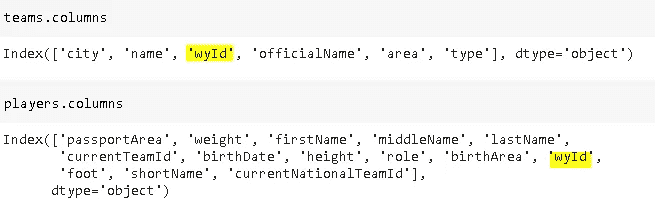
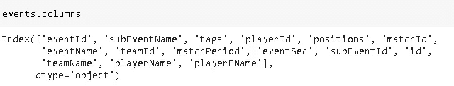
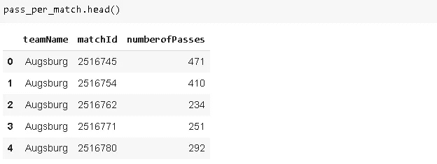
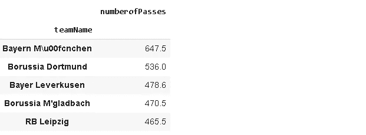
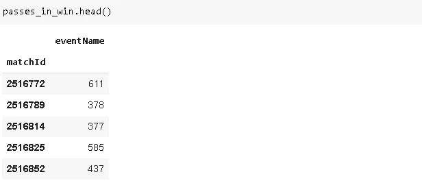
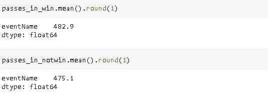

# 熊猫体育分析简介

> 原文：<https://towardsdatascience.com/introduction-to-sports-analytics-with-pandas-ad6303db9e11?source=collection_archive---------28----------------------->

## 德国德甲足球比赛分析。


[Bermix 工作室](https://unsplash.com/@bermixstudio?utm_source=unsplash&utm_medium=referral&utm_content=creditCopyText)在 [Unsplash](https://unsplash.com/s/photos/football-analytics?utm_source=unsplash&utm_medium=referral&utm_content=creditCopyText) 拍摄的照片

体育分析是数据科学的一个主要分支。数据收集技术和数据分析的进步使得团队根据数据分析调整策略变得更有吸引力。

数据分析为团队表现和球员表现提供了有价值的见解。如果明智而系统地使用，数据分析最有可能让团队领先于竞争对手。

一些俱乐部有一整个团队致力于数据分析。利物浦是使用数据分析的先锋，我认为这是他们成功的重要部分。他们是上届英超冠军，也是 2019 年欧冠冠军。

在本帖中，我们将使用熊猫从 2017-18 赛季的德国德甲比赛中得出有意义的结果。这些数据集可以从[的链接](https://figshare.com/collections/Soccer_match_event_dataset/4415000/5)下载。我们将使用论文[足球比赛时空比赛事件公共数据集](https://www.nature.com/articles/s41597-019-0247-7)中介绍的部分数据集。

数据集以 JSON 格式保存，可以很容易地读入 pandas 数据帧。

```
import numpy as np
import pandas as pdevents = pd.read_json("/content/events_Germany.json")
matches = pd.read_json("/content/matches_Germany.json")
teams = pd.read_json("/content/teams.json")
players = pd.read_json("/content/players.json")events.head()
```


(图片由作者提供)

事件数据帧包含比赛中发生的事件的细节。例如，第一行告诉我们，球员 15231 在比赛 2516739 的第三秒从位置(50，50)到(50，48)做了一次“简单的传球”。

事件数据帧包括球员和球队 id，但不包括球员和球队名称。我们将使用合并功能从球队和球员数据帧中添加他们。



(图片由作者提供)

Id 存储在球队和球员数据帧的“wyId”列中。

```
#merge with teams
events = pd.merge(
events, teams[['name','wyId']],left_on='teamId',right_on='wyId'
)
events.rename(columns={'name':'teamName'}, inplace=True)
events.drop('wyId', axis=1, inplace=True)#merge with players
events = pd.merge(
events, players[['wyId','shortName','firstName']],
left_on ='playerId',right_on='wyId'
)
events.rename(columns={'shortName':'playerName', 'firstName':'playerFName'}, inplace=True)
events.drop('wyId', axis=1, inplace=True)
```

我们根据包含 id 的列合并数据帧，然后重命名新列。最后，删除“wyId”列，因为 Id 已经存储在 events 数据帧中。



(图片由作者提供)

# **每场比赛的平均传球次数**

主导比赛的球队通常传球次数更多。一般来说，他们更有可能赢得这场比赛。当然，也有一些例外。

让我们检查一下每支球队每场比赛的平均传球次数。我们将首先创建一个数据帧，其中包含球队名称、比赛 ID 和比赛中完成的传球次数。

```
pass_per_match = events[events.eventName == 'Pass']\[['teamName','matchId','eventName']]\
.groupby(['teamName','matchId']).count()\
.reset_index().rename(columns={'eventName':'numberofPasses'})
```



(图片由作者提供)

奥格斯堡在比赛 2516745 中进行了 471 次传球。这是每场比赛传球数量排名前五的球队名单。

```
pass_per_match[['teamName','numberofPasses']]\
.groupby('teamName').mean()\
.sort_values(by='numberofPasses', ascending=False).round(1)[:5]
```



(图片由作者提供)

拜仁慕尼黑传球次数最多并不奇怪。近年来他们一直统治着德甲联赛。

# **球员平均传球长度**

可以基于许多事情来评估一次通过。有些传球非常成功，使得得分变得非常容易。

我们将关注传球的量化评估，即长度。有些球员非常擅长长传。

位置列包含球在 x 和 y 坐标上的初始和最终位置。我们可以根据这些坐标计算长度。让我们首先创建一个只包含通道的数据帧。

```
passes = events[events.eventName=='Pass'].reset_index(drop=True)
```

我们现在可以计算长度。

```
pass_length = []
for i in range(len(passes)):
    length = np.sqrt(((passes.positions[i][0]['x'] -    
    passes.positions[i][1]['x'])**2)\ + 
    ((passes.positions[i][0]['y'] - 
    passes.positions[i][1]['y'])**2))pass_length.append(length)passes['pass_length'] = pass_length
```

groupby 函数可以用来计算每个球员的平均传球长度。

```
passes[['playerName','pass_length']].groupby('playerName')\
.agg(['mean','count']).\
sort_values(by=('pass_length','mean'), ascending=False).round(1)[:5]
```


(图片由作者提供)

我们列出了平均传球长度和传球次数排名前五的球员。传球次数很重要，因为只传球 3 次对平均值来说意义不大。因此，我们可以过滤那些少于一定数量的通道。

# **胜利和失败的平均传球次数**

让我们比较一下胜利和失败比赛的平均传球次数。我将用勒沃库森的比赛作为例子。

我们首先需要从“matches”数据框架中添加比赛的获胜者。

```
events = pd.merge(events, matches[['wyId','winner']], left_on='matchId', right_on='wyId')events.drop('wyId', axis=1, inplace=True)
```

我们现在可以创建一个 dataframe，它只包含团队 ID 为 2446(b . Leverkusen 的 Id)的事件。

```
leverkusen = events[events.teamId == 2446]
```

如果“获胜者”列中的值等于 2446，则获胜者是 b .勒沃库森。为了计算 B. Leverkusen 赢得的比赛的平均传球次数，我们需要根据 winner 和 eventName 列过滤数据帧。然后我们将应用 groupby 和 count 来查看每场比赛的传球次数。

```
passes_in_win = leverkusen[(leverkusen.winner == 2446) & (leverkusen.eventName == 'Pass')][['matchId','eventName']].groupby('matchId').count()passes_in_notwin = leverkusen[(leverkusen.winner != 2446) & (leverkusen.eventName == 'Pass')][['matchId','eventName']].groupby('matchId').count()
```



(图片由作者提供)

通过应用均值函数，我们可以很容易地得到平均通过次数。



(图片由作者提供)

虽然多传球并不意味着一定会赢，但它会帮助你控制比赛，增加你得分的机会。

体育分析的范围远远超出了我们在这篇文章中所做的。然而，在不熟悉基础知识的情况下，掌握更高级技术的知识将更加困难。

数据可视化也是体育分析的基础。球队和球员如何管理球场，射门和传球的位置，以及球场上覆盖最广的区域提供了宝贵的见解。

我也会写一些关于某些事件如何在球场上可视化的帖子。感谢您的阅读。如果您有任何反馈，请告诉我。

# **参考文献**

[1] Pappalardo 等，(2019)足球比赛时空匹配事件公共数据集，自然科学数据 6:236，[https://www.nature.com/articles/s41597-019-0247-7](https://www.nature.com/articles/s41597-019-0247-7)

[2]https://figshare.com/articles/Events/7770599