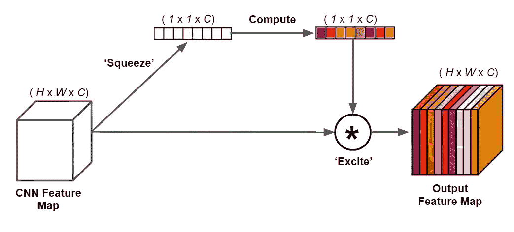

# 压缩激励网络简介

> 原文：<https://towardsdatascience.com/introduction-to-squeeze-excitation-networks-f22ce3a43348?source=collection_archive---------39----------------------->

## 基于注意力的机制来提高你的深度 CNN

挤压和激励网络( [SENet](https://arxiv.org/abs/1709.01507) )是 2017 年 [Imagenet 分类挑战赛](http://image-net.org/challenges/LSVRC/2017/)的获胜者，比 2016 年的获胜者相对提高了约 25%。SENets 引入了一个关键的架构单元——挤压和激励模块(SE 模块),这对性能的提升至关重要。SE 模块还可以轻松添加到其他架构中，额外开销很低。


照片由[里卡多·维亚纳](https://unsplash.com/@ricardoviana?utm_source=medium&utm_medium=referral)在 [Unsplash](https://unsplash.com?utm_source=medium&utm_medium=referral) 上拍摄

# SE 模块介绍

典型地，CNN 通过从空间维度提取信息并将它们存储在信道维度中来工作。这就是为什么当我们在 CNN 中深入时，特征地图的空间维度会缩小，而频道会增加。当考虑一个特定 CNN 层的输出特征图时，所有通道被同等加权。

我们知道，CNN 中的早期层负责捕捉基本特征，如边缘、拐角和线条，而后期层则捕捉更高级别的特征，如面部和文本。因此，这是有道理的

SE 块的主要思想是:**基于每个通道的重要程度(挤压)，为特征图的每个通道分配不同的权重(激励)。**



SE 块可视化。作者创建的图像。

# 技术解释

SE 模块可以分为 3 个主要部分——挤压、计算和激励。在这里，我将更详细地介绍它们。

1.  **【挤压】**操作

在 CNN 图层的输出要素地图上执行全局平均池。这实质上是在空间维度(H×W)上取所有激活的平均值，给出每个通道一个激活。这样做的结果是一个形状矢量(1 x 1 x C)。

2.**计算**

来自前一个操作的向量通过两个连续的完全连接的层。这用于完全捕获从空间地图聚集的通道相关。ReLU 激活在第一 FC 层之后执行，而 sigmoid 激活在第二 FC 层之后使用。在该论文中，还有一个缩减率，使得第一 FC 层的中间输出具有较小的尺寸。这一步的最终输出也有一个形状(1 x 1 x C)。

3.**【励磁】**运行

最后，计算步骤的输出被用作每声道权重调制向量。它只是简单地与大小为(H x W x C)的原始输入特征图相乘。这根据它们的“重要性”缩放每个通道的空间图。

SE 模块可以很容易地与许多现有的 CNN 集成。在这篇论文中，ResNets、VGG 和 Inception 等架构的精度显著提高，但额外的计算成本很低。

# 代码示例

这里有一个示例代码片段，您可以尝试一下。写于 [PyTorch](https://pytorch.org/) 。如您所见，添加挤压和激励模块的功能非常简单！在大约 10 行代码中，我们有一个来自 [moskomule](https://github.com/moskomule/senet.pytorch) 的模块化实现，可以很容易地实现到大多数深度 CNN。

```
class SELayer(nn.Module):
    def __init__(self, channel, reduction=16):
        super(SELayer, self).__init__()
        self.avg_pool = nn.AdaptiveAvgPool2d(1)
        self.fc = nn.Sequential(
            nn.Linear(channel, channel // reduction, bias=False),
            nn.ReLU(inplace=True),
            nn.Linear(channel // reduction, channel, bias=False),
            nn.Sigmoid()
        )def forward(self, x):
        b, c, _, _ = x.size()
        y = self.avg_pool(x).view(b, c)
        y = self.fc(y).view(b, c, 1, 1)
        return x * y.expand_as(x)
```

# 结论

SE 模块的主要吸引力在于其简单性。仅从图中，我们可以理解挤压-激发过程中涉及的功能和步骤。此外，它们可以添加到模型中，而不会增加太多的计算成本，所以每个人都应该尝试将其集成到他们的深度学习架构中！

# 参考

 [## 压缩和激励网络

### 卷积神经网络(CNN)的核心构件是卷积算子，它使网络能够…

arxiv.org](https://arxiv.org/abs/1709.01507) [](https://pytorch.org/) [## PyTorch

### 开源深度学习平台，提供从研究原型到生产部署的无缝路径。

pytorch.org](https://pytorch.org/)