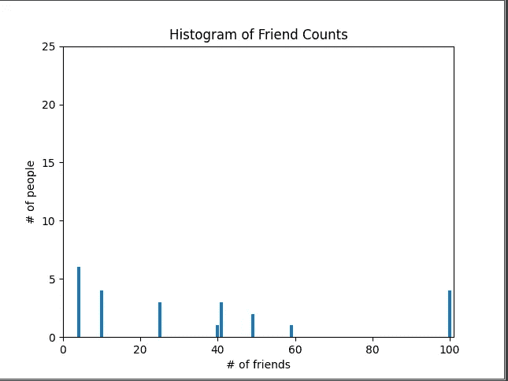

# Python 中的统计学简介

> 原文：<https://towardsdatascience.com/introduction-to-statistics-in-python-6f5a8876c994?source=collection_archive---------41----------------------->

## 数据分析

## 统计学在数据分析中至关重要。我们将回顾一些关于统计学的基础知识，以及如何在 Python 编程语言中应用它


克里斯·利维拉尼在 [Unsplash](https://unsplash.com/s/photos/statistics?utm_source=unsplash&utm_medium=referral&utm_content=creditCopyText) 上的照片

# 什么是统计

统计学是一门关于数据收集、组织、分析、解释和展示的学科。在将统计学应用于科学、工业或社会问题时，习惯上是从要研究的统计总体或统计模型开始。

## 中心趋势:

是概率分布的中心值或典型值。它也可以被称为分布的中心或位置。通俗地说，集中趋势的度量通常被称为平均值。

## 分散:

是分布被拉伸或压缩的程度。统计离差度量的常见例子有方差、标准差和四分位距。

## 相关性:

或相关性是两个随机变量或二元数据之间的任何统计关系，无论是否是因果关系。在最广泛的意义上，相关性是任何统计上的关联，尽管它通常指的是一对变量线性相关的程度。

## 辛普森悖论:

这是概率和统计中的一种现象，在这种现象中，一种趋势出现在几组不同的数据中，但当这些数据组合在一起时就会消失或逆转。

# 什么是高级数据分析

数据分析解决方案提供了一种利用业务数据的便捷方式。但是，市场上的解决方案数量可能会令人望而生畏，许多解决方案似乎涵盖了不同类别的分析。组织如何理解这一切？首先了解不同类型的分析，包括描述性、诊断性、预测性和规范性分析。

*   **描述性分析**告诉你过去发生了什么。
*   **诊断分析**帮助你理解过去为什么会发生一些事情。
*   **预测分析**预测未来最有可能发生的事情。
*   **规范性分析**推荐您可以采取的行动来影响这些结果。

# Python 中的应用统计方法

想象一下，我们必须对工作中每个成员的朋友数量进行一些数据分析。朋友的数量将在 Python 列表中描述，如下所示:

```
num_friends = [100, 49, 41, 40, 25, 100, 100, 100, 41, 41, 49, 59, 25, 25, 4, 4, 4, 4, 4, 4, 10, 10, 10, 10,
]
```

我们将使用 matplotlib 在直方图中显示朋友数量:

看到直方图会是



直方图朋友计数器

## 中心倾向

*   意思是

我们想知道朋友数量的平均值

```
def mean(x):
    return sum(x) / len(x)
```

应用此方法将获得的价值为多少朋友喜欢

```
35.791666666666664
```

*   中位数

**中位数**是对集中趋势的简单衡量。为了找到**中值**，我们按照从最小值到最大值的顺序排列观察值。如果有奇数个观察值，**中值**是中间值。如果有偶数个观察值，**中值**是两个中间值的平均值。

运用这种方法会给我们带来结果

```
25.0
```

*   分位点

中位数的一个概括是分位数，它表示小于某个数据百分位的值。(中值表示小于 50%数据的值。)

```
def quantile(x, p):
    *"""returns the pth-percentile value in x"""* p_index = int(p * len(x))
    return sorted(x)[p_index]
```

对 num_friends 应用分位数方法，因为百分位是 0.8，将会有结果

```
59
```

*   模式(或最常见的值)

将返回 num_friends 的应用模式方法

```
[4]
```

# 结论

学习统计学有助于我们更多地了解数据分析或数据科学的基本概念。还有很多关于统计学的东西，比如假设检验、相关性或估计，我还没有讲过。因此，请随意了解更多关于它们的信息。

# 参考

《从零开始的数据科学》Joel Grus 著

[](https://www.logianalytics.com/predictive-analytics/comparing-descriptive-predictive-prescriptive-and-diagnostic-analytics/) [## 比较描述性、预测性、规范性和诊断性分析

### 如今，大多数组织都强调数据驱动业务决策，这是理所当然的。但是数据本身并不是…

www.logianalytics.com](https://www.logianalytics.com/predictive-analytics/comparing-descriptive-predictive-prescriptive-and-diagnostic-analytics/) [](https://en.wikipedia.org/wiki/Statistics) [## 统计数字

### 统计学是一门关于收集、组织、分析、解释和展示…

Dispersionen.wikipedia.org](https://en.wikipedia.org/wiki/Statistics)