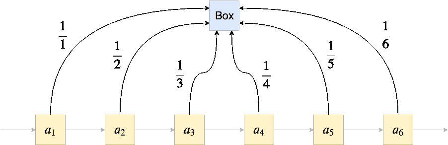
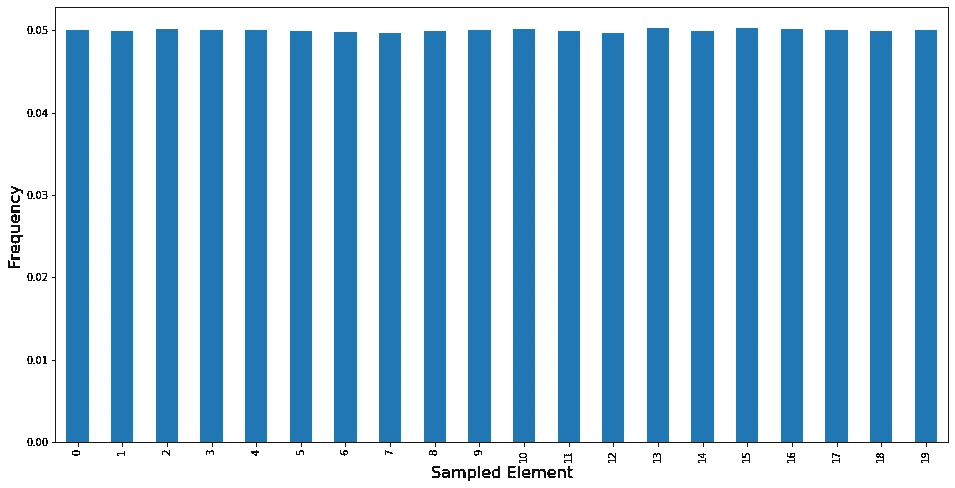

# 流式算法简介

> 原文：<https://towardsdatascience.com/introduction-to-streaming-algorithms-b71808de6d29?source=collection_archive---------12----------------------->

## **用 Python 解释和实现的各种算法**


乔恩·弗洛布兰特在 [Unsplash](https://unsplash.com?utm_source=medium&utm_medium=referral) 上的照片

在过去，编程意味着永远记住内存限制。虽然在 1990 年拥有 32mb 内存是一笔财富，但现在有时甚至在一台家用电脑上拥有 32gb**内存都不够。随着硬盘、RAM 和 GPU 内存的增长，可用的数据量也在增长。因此，拥有一套内存高效算法仍然是很重要的。**

# 两个小例子

一个典型的例子是互联网交换机，它监控不同的 IP 互相发送数据包。交换机的一个常见任务是找出*最重要的*，即一对两个 IP 地址，与其他对相比，IP₁在这些地址上与 IP₂的通信非常频繁。这很有趣，因为这可能是一个拒绝服务攻击的指示器。


照片由[Webaroo.com.au](https://unsplash.com/@webaroo?utm_source=medium&utm_medium=referral)在 [Unsplash](https://unsplash.com?utm_source=medium&utm_medium=referral) 上拍摄

这听起来是个简单的问题，对吗？只需实现从 IP 对(IP₁、IP₂)到从 IP₁到 IP₂.的通信数量的映射在 Python 中，这可以是字典、计数器类的实例或邻接矩阵。然后就可以在数据结构中搜索最高的 *k* 计数，输出对应的 IP 地址。


42.42.42.42 经常满腹狐疑地和 182.162.77.12 交谈，154.78.122.56 也经常满腹狐疑地和 43.111.23.122 交谈。这也许值得研究一下。

但是现在想想这些数据结构的大小。一个更大的交换机可以接收来自数百万个 IP(T21)的请求，并将它们路由到尽可能多的其他 IP。

> 这意味着我们最终可能会拥有数百万乘以数百万的 IP 对。

这一点，再加上交换机通常较低的存储容量，引发了许多问题。这种方法是不可能的:我们需要一种比存储所有内容占用更少内存的算法。一种方法是使用[计数分钟草图](https://en.wikipedia.org/wiki/Count%E2%80%93min_sketch)。你也可以在 YouTube 上搜索“重量级人物”，如果你感兴趣，可以找到一些很好的解释和例子。

现在我听到你们中的一些人说:

> 我为什么要关心网络的东西？我是一个机器学习的家伙，咄！—你

嗯，还有一个来自机器学习世界的著名例子:**梯度下降**！

如果我们处理足够小的数据集，它可以完全适合(GPU) RAM，我们可以使用批量梯度下降，即一次将完整的数据放入内存并进行处理。然而，大多数时候我们的工作记忆太小，使得有必要使用*随机梯度下降*或*小批量梯度下降*，它们是所谓的*流算法*的例子。另一个例子是 Hoeffding 树算法，我在这里描述了[。](/introducing-hoeffdings-inequality-for-creating-storage-less-decision-trees-b5135e65e51e)

在本文中，我想向您展示几个流算法的例子，包括您可以使用的 Python 实现！除了让你意识到这个问题，我已经做到了。；)

# **直觉**

对于流算法，我指的是能够处理非常大的，甚至可能是*无界的*数据集，并且仅使用恒定数量的 RAM 来计算一些期望的输出的算法。

如果数据集是无界的，我们称之为*数据流。*在这种情况下，如果我们在某个位置 *n* 停止处理数据流，我们期望我们的算法有一个**解，对应于到这一点**看到的数据。

在下文中，假设我们的硬盘上有一个巨大的数据集，我们想要处理它而不需要立刻将它加载到我们的 RAM 中(因为我们不能),或者有一个输出数据流的源，例如 Twitter 上的传入 tweets。两种情况都以同样的方式处理。

我将用大型数据集的语言来表述即将出现的例子，因为我们知道它们是有限的，我不必一直提到我们停止读取数据流。

我们进一步假设我们可以准确地传递数据**一次**。

# **一个平缓的开始**

让我们通过两个简单的例子来熟悉如何设计流算法。

## 寻找最小值

假设有一个非常大的数字列表，对你的内存来说太大了。你想找出这个列表的最小值。在 Python 中，经典的解决方法是这样的:

```
print(min(my_list))
```

但这是假设`my_list`已经在 RAM 中。那么，我们如何用另一种方式来解决这个问题呢？也许你已经找到了解决方案:

> 只要一个数字接一个数字地读数据集，只要发现一个更小的数字，就更新最小值。

更准确地说:读取第一个元素，并声明它是最小值。然后读取第二个元素，如果它小于当前最小值(第一个元素)，就声明它是最小值。否则，什么都不做。

然后读取第三个元素，如果它小于当前最小值，就声明它是最小值。否则，什么都不做。

然后读取第四个元素，如果它小于当前最小值，则声明它为最小值。否则，什么都不做。

好吧，我停下来，你知道这是怎么回事。这基本上行得通，因为


使用这个公式，你可以很容易地通过[归纳](https://en.wikipedia.org/wiki/Mathematical_induction)证明算法是正确的。读取第一个元素后，结果是正确的，因为 *a* ₁ < ∞，因此 min(*a*₁)=*a*₁.归纳步骤正是公式(想想吧！).但是说够了，让我们回到正轨。

在 Python 中，我们可以使用下面这个非常简单的类来解决它:

```
from math import inf

class StreamingMinimum:
    def __init__(self):
        self.result = inf  # Immediately replaced by the 1st element

    def update(self, element):
        self.result = min(self.result, element)
```

您可以通过以下方式使用它

```
import numpy as np

stream = iter(np.random.randn(10000))  # Simulate a stream
s = StreamingMinimum()

for element in stream:
    s.update(element)

print(s.result)
```

很简单，对吧？让我们增加一点难度。

## 寻找平均值

同样的设置:大数据集，但是现在我们要找的是均值而不是最小值。


当然，你知道公式！

所以，我们现在的问题如下:

> 当我们已经有了前 *n* 个元素的均值时，如何计算 *n+1* 个元素的均值？

一个简单的解决方案是使用下面的标识，您可能在稍加思考后就会想到:


我们可以看到，我们不仅必须存储旧的平均值，而且还必须跟踪元素的数量 *n，*，因为这在公式*中是需要的。*在计算最小值的情况下，这是没有必要的。

这个类是这样的:

```
class StreamingMean:
    def __init__(self):
        self.result = 0
        self.n = 0

    def update(self, element):
        self.result = (self.result * self.n + element) / (self.n+1)
        self.n += 1
```

您可以像以前一样再次测试这段代码。用`StreamingMean`类代替`StreamingMinimum`就行了。

健全性检查:结果大约为 0，这也是我们对标准正态分布随机变量的预期。同样:检查这个算法的正确性是一个简单的归纳练习。

既然你现在知道它是如何工作的，让我们来看一个更有趣的算法。

# 储层取样

假设您有一个大型数据集，并且想要对一个对象进行统一采样。你怎么能这样做？好吧，如果你知道数据集的大小 *n* ，你可以在 1 和 *n 之间均匀地抽取一个随机数 *k* ，*扫描数据集，取第 *k* 第*个元素。*

但是现在想象一下，你有一个数据流，你事先不知道有多少元素进来，也不知道什么时候想停止读取数据流。现在变得越来越困难，因为你不知道从哪个范围抽取随机指数。但是这个问题也有一个简单的解决方法，叫做[油藏取样](https://en.wikipedia.org/wiki/Reservoir_sampling)。

> 这个想法是这样的:你有一个单独的盒子(容器)来存放元素。扫描数据流时，以一定概率用当前元素替换框内内容。


典型的水库。来源:超级马里奥世界

如果我把这个想法留给你一个人，也许过一段时间你就能算出概率。跳过 *n 个*元素后的目标是能够以 1/ *n 个*的概率将每个元素放入盒子中。

在最简单的情况下，从某个恒定概率 *p* 开始。但是，举例来说，第一个元素出现在盒子里的概率是(1- *p* ) *ⁿ，*对于任何一个 *p* < 1 来说都是指数级的小，而不是我们所寻找的。

解决这个问题的一个办法是:我们扫描序列的时间越长，就必须降低交换的概率。什么是简单衰变率？1/ *n* 怎么样？让我们试试。

起初，盒子是空的。我们扫描第一个元素，用第一个元素填充盒子(概率 1/1=1)。到目前为止一切顺利。

现在我们来看第二个元素。我们用 1/2 的概率替换盒子里的内容。这一步之后，第一个元素在盒子里的概率是 1/1 * 1/2 = 1/2，第二个元素在盒子里面的概率是 1/2。完美！我们再做一个。

到达第三个元素，它以 1/3 的概率替换盒子内的元素。第一个元素还在盒子里的概率是多少？就是它熬过了第一个**(好吧，这个很容易)** **第二个第三个互换机会**的概率:1/1 * 1/2 * 2/3 = 1/3。看起来不错！第二个元素呢？它必须在**第二次和第三次互换机会**中存活下来，这种机会发生的概率为 1/2 * 2/3 = 1/3。好像管用！事实上，它确实如此，正如一个人可以用… *归纳*看到的那样！



代码如下:

```
from random import random

class ReservoirSampler:
    def __init__(self):
        self.result = None
        self.n = 0

    def update(self, element):
        self.n += 1
        if random() < 1 / self.n:  # Satisfied with prob. 1/n.
            self.result = element
```

我们可以快速检查一下它是否有效。让我们从大小为 20 的数据集重复采样。我们预计在大约 5%的情况下抽取每个元素。

```
results = []

for _ in range(1000000):
    r = ReservoirSampler()
    for s in range(20):
        r.update(s)

    results.append(r.result)
```

可视化`results`给出了以下内容:



我们可以看到，在所有试验中，每种元素都被取样了大约 5%。完美！

# 结论

我们已经看到，即使在今天，内存高效的算法也是必要的。处理非常大的数据集的聪明技巧仍然是相关的，幸运的是，聪明人已经在这个领域投入了很多努力。

在本文中，我向您展示了三个非常简单的算法示例，它们应该可以教您如何解决内存极度受限的问题。

下一次，如果你的数据再一次不适合你的内存，考虑一下是否有办法以流的方式处理它！

我希望你今天学到了新的、有趣的、有用的东西。感谢阅读！

**作为最后一点，如果你**

1.  **想支持我多写点机器学习和**
2.  **无论如何都计划获得一个中等订阅，**

**为什么不做** [**通过这个环节**](https://dr-robert-kuebler.medium.com/membership) **？这将对我帮助很大！😊**

*说白了，给你的价格不变，但大约一半的订阅费直接归我。*

非常感谢，如果你考虑支持我的话！

> *如有问题，在*[*LinkedIn*](https://www.linkedin.com/in/dr-robert-k%C3%BCbler-983859150/)*上写我！*