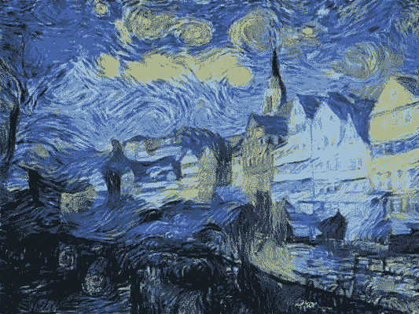
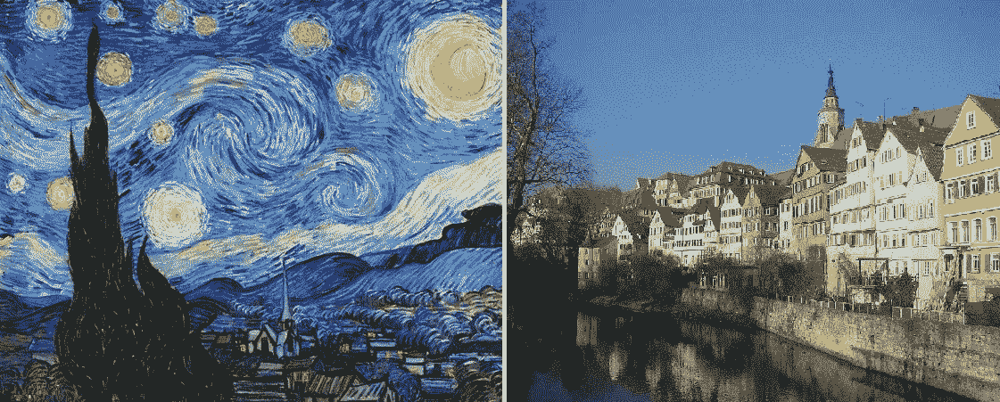
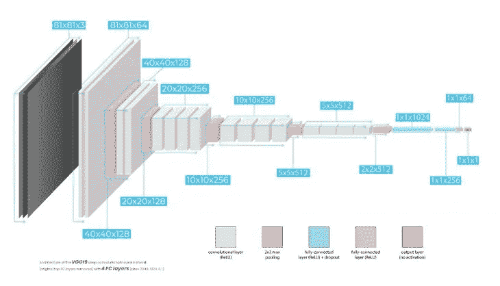
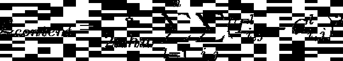
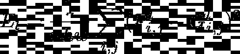
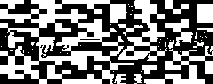
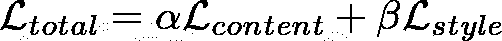

# PyTorch 风格转换简介

> 原文：<https://towardsdatascience.com/introduction-to-style-transfer-with-pytorch-339ba2219621?source=collection_archive---------42----------------------->

## [神经网络的应用](https://medium.com/tag/applied-neural-networks)

## 卷积神经网络的新用途



我电脑旁的艺术。

你知道神经网络不相信左右脑分离吗？

典型的例子:左边的图像不是由人手的笔触创建的，而是由卷积神经网络创建的！

这表明神经网络并不局限于复杂的数学和统计学。稍加帮助，他们甚至可以创造艺术！这篇文章旨在解释风格转移的概念，正如加蒂丝等人在这篇[有趣的研究论文](https://www.cv-foundation.org/openaccess/content_cvpr_2016/papers/Gatys_Image_Style_Transfer_CVPR_2016_paper.pdf)中所定义的那样。

## 什么是风格转移？

风格转移是由 Leon A. Gatys 等人开发的卷积神经网络的一种新颖应用。它允许对图像的“内容”和“风格”进行精确的数学定义。有了内容和风格，我们可以定义一种新的损失函数来描述两个图像之间的风格和内容的差异。然后，通过反向传播，我们可以更新一个图像的像素，以更紧密地匹配另一个图像的样式或内容。



**左**:梵高的星夜。**右图**:安德烈亚斯·普雷夫克拍摄

这些图像分别包含文章简介中图像的样式和内容。

## 对 ConvNets 的一点回顾

卷积神经网络是以这样一种方式独特设计的，即它们擅长识别和分离视觉输入中的模式。

下面是它们工作原理的大概描述:

1.  图像被传递到 ConvNet 的第一个卷积层。
2.  第一个卷积层让图像通过一组过滤器，这些过滤器检测像垂直线和水平线这样的简单图案。这些图案被提取并作为新的图像通道输出(每个滤镜一个)。
3.  然后，这些新的镜像通道被馈送到下一个卷积层，并重复该过程。本质上，网络是在检测模式中的模式！
4.  有时，卷积层的输出可能会经过一个池层。池层本质上抛弃了“细节”,但保留了全局模式。这允许一个 ConvNet 将它所知道的推广到以前从未见过的图像。

## 定义网络

图像风格传输最初在卷积网络上执行，该网络包含由池层分隔的 5 个组中的 16 个卷积层。这个网络叫做 VGG19。每个组在输入中找到模式，然后将这些模式传递到池层，丢弃一些细节，但保留大图。



最左边的黑色方块是原始图像。被网络过滤还原。

我们将使用 PyTorch 预先培训的 VGG 网络开始:

## 定义图像内容

根据我们对 ConvNets 的了解，它们保持一般模式，但开始丢弃网络深层的细节。记住这一点，就很容易理解为什么图像的“内容”被定义为网络深层的输出。

我们将使用第 10 个卷积层的输出来定义图像的“内容”。我们将这一层命名为 **conv4_2** ，因为它是第四叠卷积层中的第二层。

下面是一个从网络中提取所选图层内容的函数。这些层是根据它们在链接的研究论文中的用途选择的。请注意， **conv4_2** 也在其中。其余的将用于确定风格:

使用 **conv4_2** 来描述“内容”给了我们想要模拟的一般结构。使用较浅的图层保留更多细节，使用较深的图层丢弃更多细节。您可以根据自己的艺术喜好选择使用不同的图层。

## 定义风格

如果您知道如何计算样本空间的相关矩阵(通常被视为相关值的热图)，那么这将看起来很熟悉，而且相当容易。

回想一下，任何给定卷积层的输出都是一组新的镜像通道，每个通道描述输入中的一些模式或特征。这些通道中的每一个都包含输入图像的过滤版本，该版本突出显示某些特征或图案。然后，我们将风格定义为这些不同特征之间的相关性，并使用 [Gramian 矩阵](https://en.wikipedia.org/wiki/Gramian_matrix)计算相关性。

还记得图像通道只是像素值的 2D 网格。然后，为了确定来自单个卷积层的不同模式信道之间的相关性，我们执行以下操作:

1.  对给定图层输出的每个通道进行矢量化。换句话说，分解像素值网格，从每个输出通道创建一个行向量。
2.  将所有这些行向量一个接一个地堆叠起来，创建一个二维矩阵。姑且称这个矩阵为 ***S*** *。*
3.  将这个新的 ***S*** 矩阵乘以它的转置。这个结果就是格拉米矩阵。

下面是一个小函数，它用两行代码为我们完成了这项工作:

为了更好地感受图像的“风格”,我们为 5 个不同的卷积层分别创建了 5 个独立的格拉米矩阵。

```
conv1_1
conv2_1
conv3_1
conv4_1
conv5_1
```

你可能想知道这 5 层是如何被选择来代表输入图像的“风格”的。简而言之，我选择使用与作者相同的层。请随意尝试不同的层！

# 定义损失

因为我们希望创建一个包含一个父图像的样式和另一个父图像的内容的新图像，所以我们必须定义一个考虑样式和内容的损失函数。

## 内容损失

内容流失很容易！内容损失被正式定义为两幅图像的内容之间的均方误差。图像的内容被定义为层 **conv4_2** 的输出。



如果上面的等式令人困惑，那也没关系。使用线性代数可以大大简化这个方程:

回头看看`get_features()`的代码片段，您会看到该函数返回了一个字典，其中包含以下各层的所有特征通道:

```
conv1_1
conv2_1
conv3_1
conv4_1
**conv4_2**
conv5_1
```

`c_features`和`t_features`仅仅是`get_features()`应用于内容模板图像和目标图像时的输出。因此，将代码与等式匹配，我们看到张量 ***T*** 和 ***C*** 在代码中定义如下:

```
T = t_features['conv4_2']
C = c_features['conv4_2']
```

## 风格丧失

风格损失在数学上稍微复杂一点，但实现起来很简单。通过首先计算目标图像的格拉米矩阵和样式模板图像的格拉米矩阵的均方误差来找到样式损失:



这里， ***P*** 和 ***G*** 是目标图像和样式模板图像的格拉米矩阵。上标 ***l*** 表示计算 Gramians 的图层输出:

```
**conv1_1 --> E_1 
conv2_1 --> E_2
conv3_1 --> E_3
conv4_1 --> E_4**
conv4_2 --> N/A (used for content loss)
**conv5_1 --> E_5**
```

同样，这些层输出存储在由`get_features()`返回的字典中。

接下来，我们求出每个误差项的加权和:



权重 ***w*** 只是用户出于艺术偏好而选择的。每一层的错误都会对最终艺术表现的结果产生不同的影响。

下面是计算风格损失的代码:

## 全损

总损失是风格和内容损失的线性组合:



其中，α和β是比例因子。α/β的比率将决定新目标图像中的样式/内容比率。在实践中，β会大得多，因为风格误差的尺度小得多。

# 把所有的放在一起

最后要做的事情是把前馈和反向传播结合起来。这一次，我们不更新网络参数！相反，我们正在更新我们的目标图像的像素值，以便它迭代地处理我们的样式图像的样式和我们的内容图像的内容:

不要害怕使用代码中的参数来实现您想要的艺术风格。这需要一些练习，并不是每一组图像都像你期望的那样。好好享受吧！

如果你想看我的关于风格转移的完整 Jupyter 笔记本(包括我遗漏的一些助手功能)，你可以在这里找到它。

现在，我将留给你这张结合了抽象艺术和积云的航拍照片:)


**内容:** [普林斯顿环境学院](https://www.princeton.edu/news/2018/01/10/spotty-coverage-climate-models-underestimate-cooling-effect-daily-cloud-cycle)。**风格:** [杰森·恰内利](https://www.cianellistudios.com/)