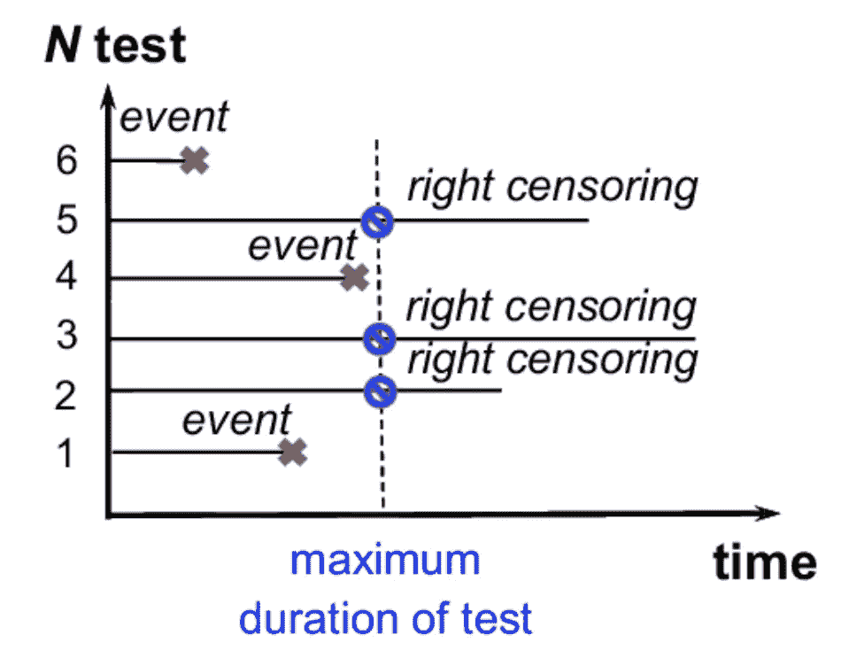
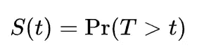
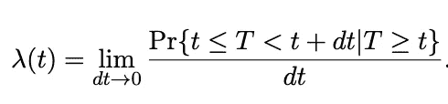
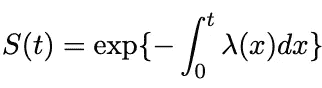

# 生存分析导论

> 原文：<https://towardsdatascience.com/introduction-to-survival-analysis-6f7e19c31d96?source=collection_archive---------11----------------------->

来源: [pixabay](https://pixabay.com/photos/man-wilderness-nature-river-1246233/)

## 了解生存分析的基本概念，以及可以用来做什么任务！

在这个竞争异常激烈的时代，所有企业都面临着客户流失/保留的问题。快速给出一些背景，当客户停止使用公司的服务(停止购买、取消订阅等)时，就会发生流失。).保留是指保持企业的客户活跃(活跃的定义在很大程度上取决于商业模式)。

直觉上，公司希望通过防止流失来增加保留率。通过这种方式，他们与客户的关系更长久，因此潜在的利润也更高。此外，在大多数情况下，公司留住一个客户的成本远低于获得一个新客户的成本，例如，通过绩效营销。对于企业来说，保留的概念与[客户终身价值](https://en.wikipedia.org/wiki/Customer_lifetime_value) (CLV)密切相关，企业希望最大化客户终身价值。但是这是另一篇文章的主题。

通过这篇文章，我想开始一个关注生存分析的简短系列，生存分析通常是统计学习中一个被低估但非常有趣的分支。在这篇文章中，我提供了生存分析及其构建模块的一般介绍。首先，我解释了所需的概念，然后描述了分析事件时间数据的不同方法。开始吧！

# **生存分析简介**

**生存分析**是一个统计学领域，专注于分析某一事件发生前的预期时间。最初，这一统计学分支是围绕在临床试验中测量药物治疗对患者存活率的影响而发展起来的。例如，想象一组癌症患者接受某种新的治疗。生存分析可用于根据患者的预期寿命分析该治疗的结果。

然而，生存分析并不局限于调查死亡，也可以用于确定机器故障前的时间，或者——乍听起来可能有点违反直觉——某个平台的用户转向高级服务。这是可能的，因为生存分析关注的是事件发生前的时间，而不是将事件定义为负面事件。适用于最流行的生存分析方法的条件是:

*   感兴趣的事件被清楚地定义和很好地指定，因此对于它是否发生没有模糊性，
*   对于每个受试者，该事件只能发生一次——这在死亡的情况下很明显，但如果我们将分析应用于流失，这可能是一个更复杂的情况，因为流失的用户可能会被重新激活并再次流失。

我们已经确定，生存分析用于建模**时间到事件序列**，换句话说，就是生存期(因此也是 Python 库的名称，它是这种分析的首选工具)。一般来说，我们可以用生存分析来尝试回答这样的问题:

*   有百分之几的人会活过某个特定的时间？
*   幸存者的死亡率/失败率是多少？
*   特定特征(例如，年龄、性别、地理位置等特征)是如何实现的。)影响生存概率？

简要描述了生存分析的一般思想后，是时候介绍一些对彻底理解这个主题至关重要的概念了。

[斯科特·格雷厄姆](https://unsplash.com/@sctgrhm?utm_source=unsplash&utm_medium=referral&utm_content=creditCopyText)在 [Unsplash](https://unsplash.com/s/photos/accountant?utm_source=unsplash&utm_medium=referral&utm_content=creditCopyText) 上拍照

## 审查

删失可以描述为生存分析领域中的缺失数据问题。当关于存活时间的信息不完整时，观察结果被删截。有不同种类的审查，例如:

*   右审查，
*   区间审查，
*   左侧审查。

为了使本节简短，我们只讨论最常遇到的一个— **右删截**。让我们回到癌症治疗的例子。想象一下，对新药效果的研究持续了 5 年(这是一个任意的数字，实际上没有任何依据)。可能发生的情况是，5 年后，一些患者存活下来，因此没有经历死亡事件。与此同时，该研究的作者与一些患者失去了联系——他们可能已经搬到了另一个国家，他们可能真的已经死亡，但从未得到证实。这些病例受到右删截的影响，即他们的真实存活时间等于或大于观察到的存活时间(在这种情况下，研究的 5 年)。下图说明了右删截。

[来源](https://www.researchgate.net/figure/An-example-of-a-single-right-censoring-type-I_fig1_307997559)

删失的存在也是我们在生存分析中不能用简单 OLS 解决问题的原因。这是因为 OLS 有效地绘制了一条最小化误差平方和的回归线。但是对于删失数据，误差项是未知的，因此我们不能最小化 MSE。应用一些简单的解决方案，如使用审查日期作为死亡事件的日期，或删除审查的观察结果，可能会严重影响结果。

有关不同类型审查的信息，请点击[此处](https://en.wikipedia.org/wiki/Survival_analysis#Censoring)。

## 生存函数

**生存函数**是时间的函数( *t* ，可以表示为

其中 *Pr()* 代表概率，而 *T* 代表从样本中随机观察到的感兴趣事件的时间。我们可以将生存函数解释为感兴趣的事件(例如，死亡事件)在时间 *t.* 之前不发生的概率

生存函数的取值范围在 0 和 1(包括 0 和 1)之间，并且是 *t.* 的非递增函数

## 危险函数

我们可以将**风险函数**(或风险率)视为受试者在一小段(或更准确地说，无限短)时间间隔内经历感兴趣事件的概率，假设受试者一直存活到所述间隔开始。危险函数可以表示为:

其中，分子中的表达式是在给定时间间隔内感兴趣的事件发生的条件概率，前提是该事件以前没有发生过。 *dt* 中的分母是所考虑的时间间隔的宽度。当我们将前者除以后者时，我们有效地获得了事件在单位时间内的发生率。最后，当区间宽度变为零时，取极限值，我们最终得到瞬时发生率，即某一事件在特定时间点发生的风险。

你可能想知道为什么用这么短的时间间隔来定义风险率。其原因在于，连续随机变量等于特定值的概率为零。这就是为什么我们需要考虑事件在很短的时间间隔内发生的概率。

技术说明:为了在理论上正确，重要的是要提到危险函数实际上不是一个概率，名称*危险率*是更合适的名称。这是因为尽管分子中的表达式是概率，但分母中的 *dt* 实际上可以导致大于 1 的危险率值(在较低的区间中仍然限制为 0)。

最后，生存函数和危险函数相互关联，如下式所示:

给这个等式一点上下文，括号中的积分称为累积风险，可以解释为从时间点 0 到 *t* 受试者面临的风险的总和。

由[贾斯汀·吕贝克](https://unsplash.com/@jluebke?utm_source=unsplash&utm_medium=referral&utm_content=creditCopyText)在 [Unsplash](https://unsplash.com/s/photos/crossroads?utm_source=unsplash&utm_medium=referral&utm_content=creditCopyText) 上拍摄

# 不同的生存分析方法

由于生存分析是一个不同的统计方法的整个领域，用于处理时间到事件序列，自然有许多不同的方法可以遵循。在高层次上，我们可以将他们分为三大类:

*   **非参数化** —通过这些方法，我们对数据的基本分布不做任何假设。也许这一组中最受欢迎的例子是卡普兰-迈耶曲线，简而言之，这是一种估计和绘制作为时间函数的生存概率的方法。
*   **半参数**——正如你可能已经猜到的，这个群体介于两个极端之间，很少做出假设。最重要的是，没有关于风险函数/风险率形状的假设。这一组中最受欢迎的方法是 **Cox 回归**，我们可以用它来确定风险函数和一组解释变量(预测值)之间的关系。
*   **参数化** —你可能在做研究时遇到过这种方法。这个想法是使用一些统计分布(一些流行的包括指数分布、对数分布、威布尔分布或洛马克斯分布)来估计一个受试者将存活多久。通常，我们使用最大似然估计(MLE)来拟合数据的分布(或者实际上是分布的参数),以获得最佳性能。

这个简短列表中提到的方法绝不是详尽的，还有许多更有趣的方法来使用基于机器或深度学习的技术分析时间到事件的数据。我会尽量在下面的帖子中涵盖最有趣的内容，敬请关注:)

# 结论

在这篇文章中，我试图对生存分析领域提供一个简短而全面的介绍。我认为，在谈论不同的数据科学解决方案时，这一领域经常被忽略。然而，通过使用一些简单的(或者根本不那么简单！)解决方案我们可以为公司或利益相关者提供有价值的见解，并产生实际的增值。

这篇文章只是一个简短系列的开始，我将在下面继续添加以下部分。如果你有问题或建议，请在评论中告诉我，或者在 [Twitter](https://twitter.com/erykml1) 上联系我。

同时，你可能会喜欢我的其他一些文章:

 [## 生存分析导论:卡普兰-迈耶估计量

### 了解用于生存分析的最流行的技术之一，以及如何用 Python 实现它！

towardsdatascience.com](/introduction-to-survival-analysis-the-kaplan-meier-estimator-94ec5812a97a)  [## 用 Tableau 提升你的 Kaplan-Meier 曲线

### 方便访问整个公司的生存分析！

towardsdatascience.com](/level-up-your-kaplan-meier-curves-with-tableau-bc4a10ec6a15)  [## 生存分析导论:尼尔森-艾伦估计量

### 了解如何使用非参数方法来估计累积风险函数！

towardsdatascience.com](/introduction-to-survival-analysis-the-nelson-aalen-estimator-9780c63d549d)