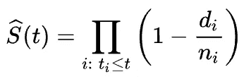
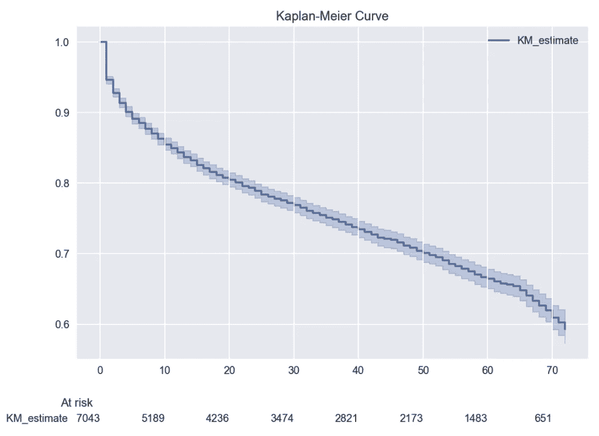
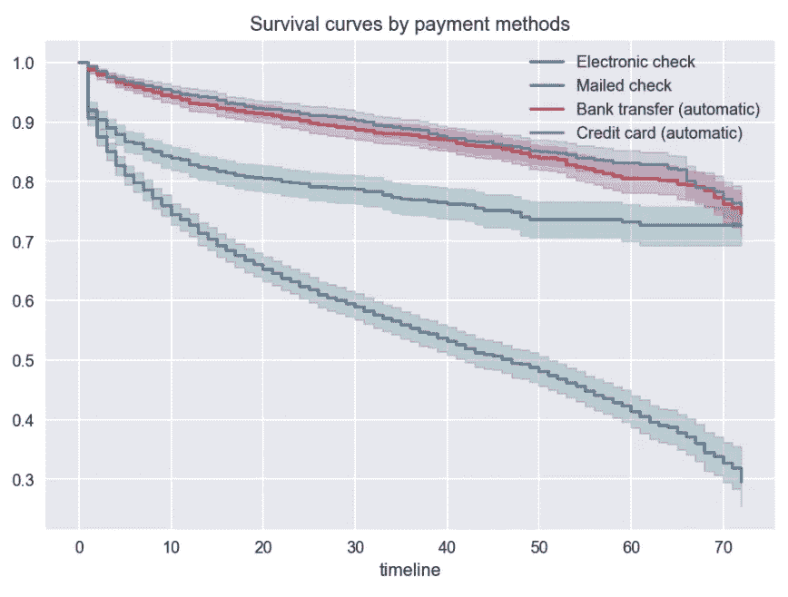
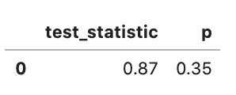
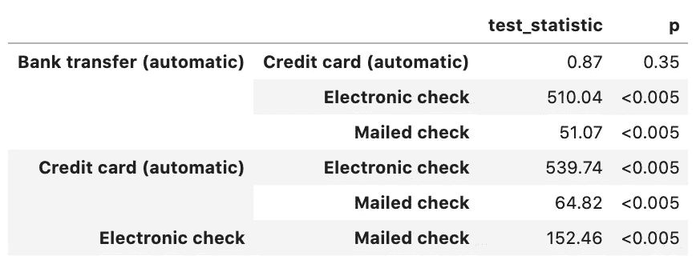
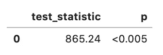
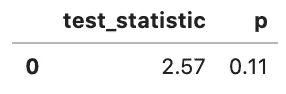

# 生存分析导论:卡普兰-迈耶估计量

> 原文：<https://towardsdatascience.com/introduction-to-survival-analysis-the-kaplan-meier-estimator-94ec5812a97a?source=collection_archive---------6----------------------->


托拜厄斯·图利乌斯在 [Unsplash](https://unsplash.com/s/photos/survival?utm_source=unsplash&utm_medium=referral&utm_content=creditCopyText) 拍摄的照片

## 了解用于生存分析的最流行的技术之一，以及如何用 Python 实现它！

在我的[上一篇文章](/introduction-to-survival-analysis-6f7e19c31d96)中，我描述了生存分析的潜在用例，并介绍了理解用于分析事件时间数据的技术所需的所有构件。

我继续这个系列，解释可能是最简单，但非常有见地的生存分析方法——卡普兰-迈耶估计量。在理论介绍之后，我将向您展示如何使用流行的`lifelines`库在 Python 中进行分析。

# 1.卡普兰-迈耶估计量

**Kaplan-Meier 估计量**(也称为乘积极限估计量，稍后您会看到原因 **)** 是一种将生存概率作为时间函数进行估计和绘图的非参数技术。这通常是进行生存分析的第一步，因为这是最简单的方法，需要的假设最少。为了使用卡普兰-迈耶方法进行分析，我们假设如下:

*   感兴趣的事件是明确的，并且在明确指定的时间发生。
*   所有观察的存活概率是相同的，它们何时进入研究并不重要。
*   删截的观测值与继续被跟踪的观测值具有相同的生存前景。

在现实生活中，我们永远不知道真实的生存函数。这就是为什么使用 Kaplan-Meier 估计量，我们从收集的数据中逼近真实的生存函数。估计值被定义为在相同情况下存活了一定时间的观察值的分数，由以下公式给出:



其中:

*   t_i 是至少一个事件发生的时间，
*   d_i 是在时间 t_i 发生的事件数，
*   n_i 代表已知存活到时间 t_i 的个体数量(他们尚未发生死亡事件或已被审查)。或者换句话说，在 t_i 时刻有风险的观测值的数量。

从公式中的乘积符号，我们可以看到与该方法的另一个名称，乘积极限估计量的联系。在时间 *t* 的生存概率等于在时间 *t* 的生存机会百分比与之前各时间的乘积。

我们最常与这种生存分析方法联系在一起的，以及我们通常在实践中看到的是**卡普兰-迈耶曲线**——卡普兰-迈耶估计量随时间变化的曲线。我们可以使用这些曲线作为探索工具——比较队列、接受或不接受某种治疗的群体、行为集群等之间的生存函数。

生存线实际上是一系列递减的水平台阶，在给定足够大的样本量的情况下，这些台阶接近人口真实生存函数的形状。在实践中，该图通常伴随着置信区间，以显示我们对点估计的不确定性——宽置信区间表明高度不确定性，可能是因为研究只包含少数参与者——这是由观测值死亡和被删截引起的。有关使用格林伍德方法计算置信区间的更多详细信息，请参见[2]。


图片由作者提供

存活曲线的解释非常简单，y 轴代表受试者存活到时间 *t* 后仍未经历感兴趣事件的概率，x 轴代表该概率。生存函数(由 Kaplan-Meier 估计器近似)的每次下降都是由至少一次观测中发生的感兴趣的事件引起的。

垂直线的实际长度代表在时间 *t* 经历该事件的处于风险中的观察的部分。这意味着，在两个不同的时间经历该事件的单个观察(实际上不是同一个，而是简单的单个)可以导致差异大小的下降，这取决于处于风险中的观察的数量。这样，下落的高度也可以告诉我们有风险的观察次数(即使没有报告和/或没有置信区间)。

当没有观察经历感兴趣的事件或一些观察被删截时，存活曲线没有下降。


图片来自 [Pixabay](https://pixabay.com/?utm_source=link-attribution&utm_medium=referral&utm_campaign=image&utm_content=1209820) 的[免费照片](https://pixabay.com/photos/?utm_source=link-attribution&utm_medium=referral&utm_campaign=image&utm_content=1209820)

# 2.对数秩检验

我们已经学会了如何使用卡普兰-迈耶估计量来逼近一个群体的真实生存函数。我们知道我们可以绘制多条曲线来比较它们的形状，例如，通过我们的移动应用程序的用户使用的操作系统。然而，我们仍然没有一个工具，将真正允许比较。嗯，至少比目测曲线更严谨。

这时**对数秩检验**开始发挥作用。这是一个统计测试，比较两组(或更多，请参见 Python 实现)之间的存活概率。检验的零假设表明所考虑的组之间的生存功能没有差异。

对数秩检验使用与 Kaplan-Meier 估计量相同的假设。此外，还有**比例风险假设**——风险比(请参见上一篇文章中关于风险率的提示)在整个研究期间应保持不变。在实践中，这意味着如果生存曲线交叉，对数秩检验可能不是一个合适的检验。但是，这仍然是一个争论激烈的话题，请看[4]和[5]。

为了简洁起见，我们不涉及测试背后的数学。如果你有兴趣，请看[这篇文章](https://en.wikipedia.org/wiki/Logrank_test)或【3】。

# 3.Kaplan-Meier 的常见错误

在这一部分，我想提一下在使用 Kaplan-Meier 估计器时可能会出现的一些常见错误。

## 删除审查的数据

删除删失数据可能很诱人，因为它会显著改变卡普兰-迈耶曲线的形状，但是，这可能会导致严重的偏差，因此我们在拟合模型时应该始终包括它。

## 解释曲线的端点

在解释存活曲线的终点时要特别注意，因为接近研究终点的任何大的下降都只能通过到达该时间点的少数观察来解释(这也应该通过更宽的置信区间来指示)

## 二分法连续变量

通过**二分法**，我的意思是使用中间值或“最佳”分界点来创建任何连续指标的“低”和“高”分组。这种方法会产生多种问题:

*   寻找“最佳”分界点可能非常依赖于数据集，并且不可能在不同的研究中重复。此外，通过进行多重比较，我们冒着增加假阳性几率的风险(在生存函数中发现差异，而实际上没有差异)。
*   二分法通过强制所有测量值为二进制值来降低统计检验的能力，这反过来会导致需要更大的样本量来检测效果。还值得一提的是，在生存分析中，所需的样本量是指对感兴趣事件的观察次数。
*   当进行二分法时，我们对观察值之间的风险分布做出了错误的假设。让我们假设我们用 50 岁作为年轻患者和老年患者的分界线。如果我们这样做，我们假设一个 18 岁的人和一个 49 岁的人在同一个风险组，但在大多数情况下这是不正确的。

## 仅考虑一个预测因素

Kaplan-Meier 估计量是一种单变量方法，因为它最多使用一个变量/预测值来逼近生存函数。因此，结果很容易出现偏差，要么夸大了信号，要么遗漏了信号。这是由所谓的**遗漏变量偏差**引起的，这导致分析假设多个预测因子的潜在影响应仅归因于我们考虑的单个预测因子。因此，应该使用多变量方法，如 Cox 回归。

# 4.Python 中的示例

是时候把我们在实践中学到的东西付诸实施了。我们从导入所有需要的库开始。

然后，我们加载数据集，并做一些小的调整，使其与`lifelines`库配合良好。为了进行分析，我们使用流行的*电信客户流失*数据集(此处或我的 GitHub 上的[可用)。该数据集包含电话/互联网提供商的客户信息，包括他们的任期、他们使用哪种服务、一些人口统计数据以及最终指示流失的标志。](https://www.kaggle.com/blastchar/telco-customer-churn?select=WA_Fn-UseC_-Telco-Customer-Churn.csv)

对于此分析，我们使用以下各列:

*   `tenure` —客户在公司工作的月数，
*   `churn` —客户是否翻炒的信息(二进制编码:如果事件发生则为 1，否则为 0)。
*   `PaymentMethod` —客户使用了哪种付款方式。

对于最基本的场景，我们实际上只需要事件发生时间和指示感兴趣的事件是否发生的标志。

`KaplanMeierFitter`的工作方式类似于`scikit-learn`中已知的类:我们首先实例化类的对象，然后使用`fit`方法使模型适合我们的数据。在绘图时，我们指定`at_risk_counts=True`来额外显示关于在特定时间点有风险的观察数量的信息。



通常，我们会对中位存活时间感兴趣，即平均 50%的人口已经死亡的时间点，或者在这种情况下，被搅动。我们可以使用下面一行来访问它:

```
kmf.median_survival_time_
```

然而，在这种情况下，该命令返回`inf`，因为我们可以从生存曲线中看到，我们实际上没有观察到数据中的那个点。

我们已经看到了基本的用例，现在让我们把分析复杂化，并为支付方式的每个变体绘制生存曲线。我们可以通过运行以下代码来做到这一点:

运行代码块会生成以下图形:



我们可以看到，电子支票的生存概率肯定是最低的，而自动银行转账/信用卡的曲线非常相似。这是使用对数秩检验来检验它们是否真的不同的绝佳时机。

下表列出了结果。



通过查看 p 值 0.35，我们可以看到没有理由拒绝零假设，即生存函数是相同的。在这个例子中，我们只比较了两种付款方式。然而，我们肯定可以测试更多的组合。有一个很好用的函数叫做`pairwise_logrank_test`，可以让对比变得非常容易。



在表格中，我们可以看到之前的对比，以及所有其他组合。银行转账和信用卡是我们不应该拒绝零假设的唯一案例。此外，我们应该谨慎解释对数秩检验的结果，因为我们可以在上面的图中看到，银行转账和信用卡支付的曲线实际上是交叉的，因此违反了比例风险的假设。

使用生命线库，我们还可以很容易地测试另外两个东西。第一个是多变量对数秩检验，其中零假设表明所有组具有相同的“死亡”产生过程，因此它们的生存曲线是相同的。



测试的结果表明，我们应该拒绝零假设，所以生存曲线是不相同的，这一点我们已经在图中看到了。

最后，我们可以测试特定时间点的存活率差异。回到示例，在图中，我们可以看到曲线在 t = 60 左右相距最远。让我们看看这种差异是否有统计学意义。



通过查看测试的 p 值，没有理由拒绝零假设，即在该时间点的存活率没有差异。

# 5.结论

在这篇文章中，我描述了一个非常流行的进行生存分析的工具——Kaplan-Meier 估计量。我们还介绍了比较两个/多个生存函数的对数秩检验。所描述的方法是一个非常受欢迎的方法，但是，也不是没有缺陷。在结束之前，让我们看看 Kaplan-Meier 估计量/曲线的优缺点。

**优势:**

*   给出总体的平均视图，也是按组。
*   不需要很多功能—只需要关于事件发生时间和事件是否实际发生的信息。此外，我们可以使用任何描述组的分类特征。
*   自动处理阶级不平衡，因为几乎任何比例的死亡审查事件是可以接受的。
*   由于它是一种非参数方法，所以很少对数据的基本分布进行假设。

**劣势:**

*   我们无法评估预测因子对生存概率的影响程度。
*   我们无法同时考虑多个观察因素，例如，原产国和手机操作系统。
*   删截和存活之间的独立性假设(在时间 *t，*删截的观察结果应该与未删截的观察结果具有相同的预后)可能不适用/不现实。
*   当底层数据分布(在某种程度上)已知时，该方法不如一些竞争技术准确。

总之，即使有一些缺点，Kaplan-Meier 生存曲线也是进行生存分析的一个很好的起点。在这样做的同时，我们可以获得关于生存的潜在预测因素的有价值的见解，并通过一些更先进的技术加速我们的进展(我将在未来的文章中描述)。

你可以在我的 [GitHub](https://github.com/erykml/medium_articles/blob/master/Statistics/kaplan_meier.ipynb) 上找到本文使用的代码。一如既往，我们欢迎任何建设性的反馈。你可以在[推特](https://twitter.com/erykml1?source=post_page---------------------------)或评论中联系我。

如果您对这篇文章感兴趣，您可能也会喜欢本系列中的其他文章:

[](/introduction-to-survival-analysis-6f7e19c31d96) [## 生存分析导论

### 了解生存分析的基本概念，以及可以用来做什么任务！

towardsdatascience.com](/introduction-to-survival-analysis-6f7e19c31d96) [](/level-up-your-kaplan-meier-curves-with-tableau-bc4a10ec6a15) [## 用 Tableau 提升你的 Kaplan-Meier 曲线

### 方便访问整个公司的生存分析！

towardsdatascience.com](/level-up-your-kaplan-meier-curves-with-tableau-bc4a10ec6a15) [](/introduction-to-survival-analysis-the-nelson-aalen-estimator-9780c63d549d) [## 生存分析导论:尼尔森-艾伦估计量

### 了解如何使用非参数方法来估计累积风险函数！

towardsdatascience.com](/introduction-to-survival-analysis-the-nelson-aalen-estimator-9780c63d549d) 

# 6.参考

[1]卡普兰，E. L .，&迈耶，P. (1958)。不完全观测值的非参数估计。*美国统计协会杂志*， *53* (282)，457–481。—此处[可用](https://web.stanford.edu/~lutian/coursepdf/KMpaper.pdf)

[2] S .索耶(2003 年)。生存分析中的格林伍德和指数格林伍德置信区间—此处[可用](https://www.math.wustl.edu/~sawyer/handouts/greenwood.pdf)

[3] Kaplan-Meier 生存曲线和对数秩检验—此处[可用](https://stat.ethz.ch/education/semesters/ss2011/seminar/contents/handout_2.pdf)

[4]非比例风险——那又怎样？—此处[可用](http://bbs.ceb-institute.org/wp-content/uploads/2016/06/Andy-Stone-Non-Proportional-Hazards-So-What.pdf)

[5]g .布略蒂斯和 l .比林汉姆(2011 年)。穿越生存曲线:对数秩检验的替代方法。*选拔赛*， *12* (S1)，A137。