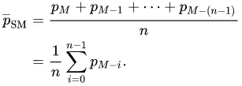
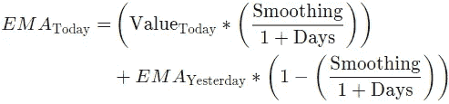
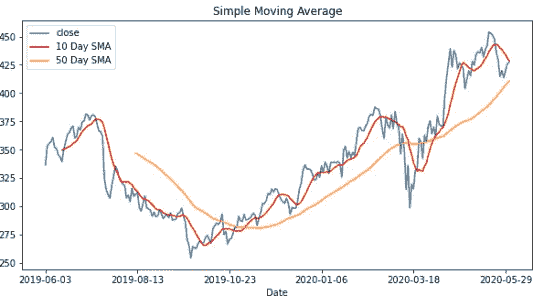
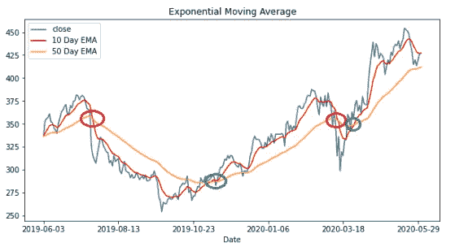
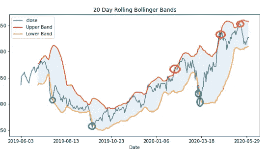
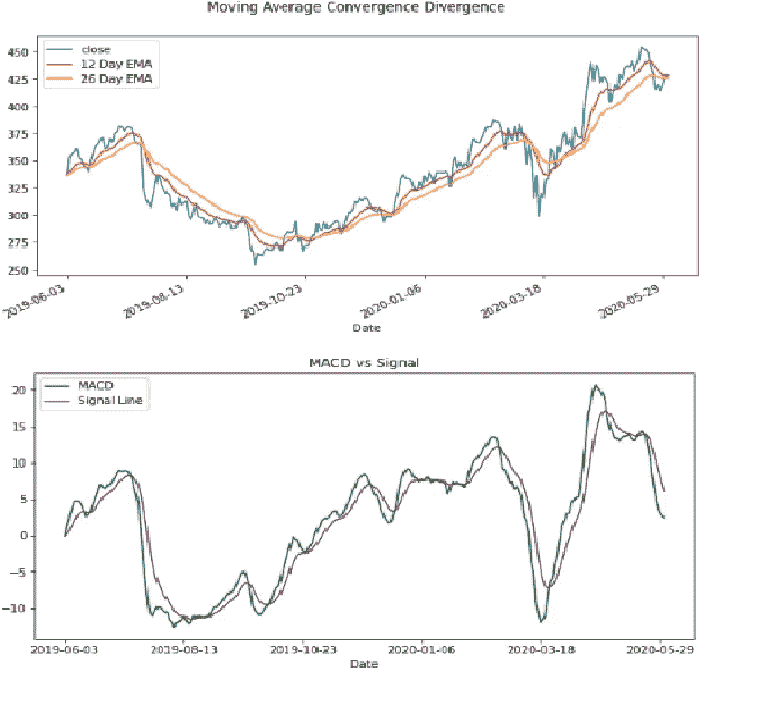

# 技术指标介绍及其 Python 实现

> 原文：<https://towardsdatascience.com/introduction-to-technical-indicators-and-its-implementation-using-python-155ae0fb51c9?source=collection_archive---------43----------------------->

## 建立你自己的技术指标图表，以创建和实施交易策略

# **技术指标是做什么的？**

技术指标是从股票价格(高、低、开、闭)和交易量的运动模式中产生的信号。这些信号又被用来预测未来的价格走势。技术分析师在历史数据中寻找指标，用它们来寻找交易的进场点和出场点。技术分析师不同于基本面分析师，基本面分析师通过观察基本面和内在价值来评估股票的表现。

鸣谢:图片来自 Unsplash

技术指标大致分为两大类:

1.**叠加图:**它们使用与价格相同的标度，并被绘制在股价图上价格的上方。例子:移动平均线，布林线

2.**振荡指标:**这些技术指标在局部最大值和局部最小值之间振荡，绘制在价格图的上方或下方。例子:MACD

我们将涉及的技术指标的一些基本示例如下:

1.简单移动平均线

2.加权移动平均数(WMA)

3.指数移动平均线

4.移动平均收敛发散(MACD)

5.布林线

# **移动平均线:**

均线是广泛使用的技术分析指标之一。这是一个在日常生活中听说过的概念，如果不是关于股票的话。移动平均通过过滤曲线中的各种噪声来平滑曲线。由于移动平均线是基于历史价格而不是实际价格，人们可能会观察到它相对于真实股价曲线的曲线滞后。常用的均线有 5、10、20、50、200 日均线。

在移动平均线中，进一步分类为简单移动平均线(SMA)、加权移动平均线(WMA)和指数移动平均线(EMA)。

# **简单移动平均线:**

简单移动平均线(SMA)是所有股票价格的非常基本的平均值或算术平均值，这意味着所有股票价格的总和除以周期数。

简单移动平均线来源:维基百科

# **加权移动平均:**

在加权移动平均线(WMA)中，每个价格点被赋予不同的权重。在将各种权重乘以各自的股票价格后，这些权重的总和除以总周期数。在简单移动平均线的情况下，股票价格被赋予相等的权重。

来源:Sap.com

# **指数移动平均:**

指数移动平均线(EMA)是一个 3 步过程。为此，我们使用简单移动平均线计算第一根均线。其次，我们计算乘数的平滑因子。第三，我们把这个乘数应用到前一天的均线上。在这个过程中，我们会给最新的价格分配更高的权重。

来源:Investopedia

# **移动平均线收敛发散:**

移动平均线收敛发散(MACD)是一个振荡的技术指标。它通过发现股票价格的两条移动平均线之间的关系来显示股票所遵循的动量。一般是用 12 期均线减去 26 期指数移动平均线(EMA)计算出来的。许多交易者用这个作为进场信号，并以某种方式解读，让他们洞察自己的交易决策。

MACD 线:MACD 的 9 日均线叫做信号线，它是在 MACD 线上运行均线得到的。现在这条线被绘制在 MACD 线的顶部，这有助于分析交叉、分叉和陡坡。通过这条线，分析师能够解读买入和卖出信号。如果 MACD 越过了它的信号线，交易者可能会买入股票，如果它越过了信号线，就会卖出。

# **布林线:**

布林线的概念最初是由约翰·布林格提出的。这些波段由上下波段组成，位于均线上下两个标准差范围内。

分析的方法是首先假设它们是价格目标的上限和下限。如果股价跌破较低的价格带，这可能表明买入触发，反之亦然。

# **使用 Python 的技术指标:**

我尝试过使用 python 来构建这些技术指标。我已经使用 IEX API 获得了“网飞”股票价格的收盘价，并将其直接加载到数据框架中进行进一步分析。请看下面的代码:

**形状记忆合金分析:**

10 天和 50 天的 SMA

上面的内容非常直观地向我们展示了价格走势和交叉的趋势。

**均线分析:**

10 天和 50 天的均线

当长期(50 天)均线穿过短期(10 天)均线时，我们可以推断价格已经正式开始下跌，这应该是卖出信号。同样，当短期移动平均线穿过长期移动平均线时，这是买入信号。

**布林线分析:**

20 天移动平均线的布林线

这里有更多的概念叫做挤压和突破。当带子靠得更近时，就会发生挤压。交易员认为这是一个波动性较低的时期，预计未来波动性将会增加。这又被认为是未来贸易机会的可能性。突破显示股价穿过布林线的点。

布林线帮助我们识别买入和卖出信号，这也可以从上面的图表中看出。只要股价突破波段，就可以推断出信号。如果股价低于较低的波段，就存在买入该股票的机会，同样，如果股价穿过较高的波段，现在就是卖出的时候

**MACD 分析:**

MACD vs 信号线

从第二张图中，我们可以观察到一些交叉的发生。当 MACD 线穿过信号线时，我们可以假设特定股票的价格上涨，反之亦然，当信号线穿过 MACD 线时

# **再者:**

在这篇文章中，我提到了一些技术指标，初学者可以从这些指标开始，慢慢地探索各种复杂性和许多其他指标。如需进一步阅读，可以浏览下面这篇关于 Investopedia 的文章:

 [## 移动平均(MA)定义

### 在统计学中，移动平均线是一种计算方法，用于通过创建一系列平均值来分析数据点

www.investopedia.com](https://www.investopedia.com/terms/m/movingaverage.asp) 

***来自《走向数据科学》编辑的提示:*** *虽然我们允许独立作者根据我们的* [*规则和指导方针*](/questions-96667b06af5) *发表文章，但我们并不认可每个作者的贡献。你不应该在没有寻求专业建议的情况下依赖一个作者的作品。详见我们的* [*读者用语*](/readers-terms-b5d780a700a4)*。*