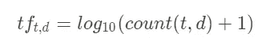
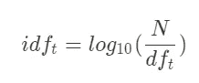
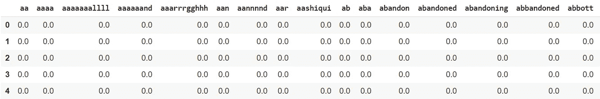
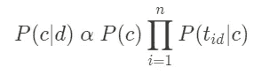
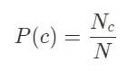
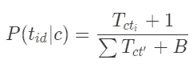
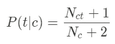
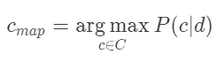

# Python 文本分类简介

> 原文：<https://towardsdatascience.com/introduction-to-text-classification-with-python-c9db137b9d80?source=collection_archive---------24----------------------->


照片由[阿尔方斯·莫拉莱斯](https://unsplash.com/@alfonsmc10?utm_source=unsplash&utm_medium=referral&utm_content=creditCopyText)在 [Unsplash](https://unsplash.com/s/photos/bookshelf?utm_source=unsplash&utm_medium=referral&utm_content=creditCopyText) 拍摄

## 基于朴素贝叶斯模型的文本分类。

在过去的几年里，在线学习的影响力越来越大。使用它已经有很多应用，从市场营销、生物信息学、城市规划等等。机器学习是一种从数据中学习表示的方法，因此我们可以使用它来提取知识或基于它预测标签。这种方法的应用之一是文本分类。

文本分类是我们将文本分类到它们所属的类别的任务。在机器学习成为一种趋势之前，这项工作大多由几个标注者手工完成。这在未来会成为一个问题，因为数据变得越来越大，光是做这件事就要花很多时间。因此，我们应该使任务自动化，同时也获得更高的准确性。

在本文中，我将向您展示如何使用 Python 进行文本分类。对于数据集，我们将使用一个名为真实与否的 Kaggle 竞赛的数据集。灾难推文的 NLP。我还在 Google Colab 上做了这个笔记本，你可以在这里[找到它](https://colab.research.google.com/drive/1nIJDAhMHeBrOtkyicQW1Z7Iykb2kB6mA?usp=sharing)。

# 概述

本文将分为几个部分:

*   **清洗正文**
*   **用 TF-IDF 权重建立文档术语矩阵**
*   **朴素贝叶斯的概念**
*   **使用 Python 实现**

# 该过程

## 清理文本

我们要做的第一步是准备和清理数据集。清理数据集是删除任何无意义的单词或无用的术语(如标签、提及、标点等等)的必要步骤。

为了清理文本，我们可以利用 re 之类的库来删除带有模式的术语，利用 NLTK 来删除单词，例如停用词。我还解释了如何使用 Python 一步一步地清理文本，您可以在这里看到，

[](/cleaning-text-data-with-python-b69b47b97b76) [## 使用 Python 清理文本数据

### 你需要的只是 NLTK 和 re 库。

towardsdatascience.com](/cleaning-text-data-with-python-b69b47b97b76) 

这是一些文本在预处理前的样子，

```
**Our Deeds are the Reason of this #earthquake May ALLAH Forgive us all****Forest fire near La Ronge Sask. Canada****All residents asked to 'shelter in place' are being notified by officers. No other evacuation or shelter in place orders are expected****13,000 people receive #wildfires evacuation orders in California** **Just got sent this photo from Ruby #Alaska as smoke from #wildfires pours into a school** **#RockyFire Update => California Hwy. 20 closed in both directions due to Lake County fire - #CAfire #wildfires****#flood #disaster Heavy rain causes flash flooding of streets in Manitou, Colorado Springs areas****I'm on top of the hill and I can see a fire in the woods...****There's an emergency evacuation happening now in the building across the street****I'm afraid that the tornado is coming to our area...**
```

执行该任务的代码如下所示，

```
**# # In case of import errors
# ! pip install nltk
# ! pip install textblob**import re
from textblob import TextBlob
import nltk
from nltk.stem import WordNetLemmatizer
from nltk.corpus import stopwords**# # In case of any corpus are missing 
# download all-nltk**
nltk.download()df = pd.read_csv('train.csv')
test = pd.read_csv('test.csv')stop_words = stopwords.words("english")def text_preproc(x):
  x = x.lower()
  # x = ' '.join(wordnet.lemmatize(word, 'v') for word in x.split())
  x = ' '.join([word for word in x.split(' ') if word not in stop_words])
  x = x.encode('ascii', 'ignore').decode()
  x = re.sub(r'https*\S+', ' ', x)
  x = re.sub(r'@\S+', ' ', x)
  x = re.sub(r'#\S+', ' ', x)
  x = re.sub(r'\'\w+', '', x)
  x = re.sub('[%s]' % re.escape(string.punctuation), ' ', x)
  x = re.sub(r'\w*\d+\w*', '', x)
  x = re.sub(r'\s{2,}', ' ', x)
  return xdf['clean_text'] = df.text.apply(text_preproc)
test['clean_text'] = test.text.apply(text_preproc)
```

这是清洁步骤后的结果，

```
**deeds reason may allah forgive us****forest fire near la ronge sask canada****residents asked place notified officers evacuation shelter place orders expected****people receive evacuation orders california****got sent photo ruby smoke pours school****update california hwy closed directions due lake county fire****heavy rain causes flash flooding streets manitou colorado springs areas****i top hill see fire woods****there emergency evacuation happening building across street****i afraid tornado coming area**
```

> 还有，记笔记！确保从 NLTK 下载所有的包和语料库(基本上是单词的集合)。

## 使用 TF-IDF 权重构建术语-文档矩阵

在我们清理完数据之后，现在我们可以构建一个文本表示，这样计算机就可以轻松地读取数据。我们将使用术语-文档矩阵作为文本的表示。

**术语-文档矩阵(TDM)** 是一个矩阵，其中行代表每个文档，列代表每个术语(词)，单元格用数字填充。

单元格由每个文档的字数组成。我们可以用来填充它的一种方法叫做词频——逆文档频(TF-IDF)。

**词频—逆文档频率(TF-IDF)** 是一个文档上的一个词的频率(词频)和一个词在所有文档上的逆频率(逆文档频率)的乘积。

**词频(TF)** 是计算文档中一个词的数量的公式。因为单词之间的数量不同，我们应用以 10 为底的对数来重新调整它。它看起来像这样，



**逆文档频率(IDF)** 是一个计算所有文档上单词稀有度的公式。如果数量很少，这个词就很常用。但如果大一点，这个词就不那么频繁了。这个公式将被用作 TF 的权重，它看起来像这样，



要创建术语-文档矩阵(TDM ),我们可以使用 sklearn 库中名为 TfidfVectorizer 的函数。代码看起来会像这样，

```
**vectorizer = TfidfVectorizer()****X = vectorizer.fit_transform(df['clean_text']).toarray()
df_new = pd.DataFrame(X, columns=vectorizer.get_feature_names())****X_test = vectorizer.transform(test['clean_text']).toarray()
test_new = pd.DataFrame(X_test, columns=vectorizer.get_feature_names())**
```

当您编写代码时，您必须非常小心对每个数据集使用哪个函数。对于训练数据，请确保使用 fit_transform 方法，因为它将根据训练数据中的项数进行拟合，并将其转换为矩阵。

同时，在测试数据上，确保您使用了 transform 方法，因为它会将文本转换为具有相同数量的训练数据列的矩阵。如果我们也对其使用 fit_transform，它将根据测试数据的项数创建一个矩阵。因此，它在列上不会有相同的维度，所以请确保检查您将使用的方法。

如果我们做对了，它会给出具有相同列维数的矩阵，以及一个类似这样的矩阵，



## 朴素贝叶斯的概念

有了矩阵后，现在我们可以将它应用到模型中。我们将使用的模型是朴素贝叶斯。

朴素贝叶斯是一种机器学习模型，通过计算数据属于某个类的概率来解决监督学习任务。

它基于贝叶斯原理，并假设文档中的每个术语都是相互独立的。计算这个的公式是这样的，



让我解释一下它的每一部分，

*   P(c|d)代表文档属于一个类别的概率，
*   阿尔法符号对应于两边的比例，
*   P(c)是通过计算一个类别的数量与文档总数的比例而得到的该类别的先验概率。公式看起来像这样，



其中 Nc 是数据集中相应类的数量，N 是数据集中文档的数量。

*   P(t id | c)的乘积是文档(d)中属于类别(c)的每一项的概率结果的乘积。公式看起来像这样，



其中，T ct 对应于类别内的该项的数量，T CT’的总和对应于给定类别的项的总数，B 代表训练数据集上不同词汇的数量，1 代表模型的平滑以避免零。

P(t id | c)公式会根据我们对问题的表述而不同。前一个问题把它表述为一个多项式问题，我们计算一个类中有多少确切的项。我们有时称这个模型为**多项式朴素贝叶斯**。

还有一个模型叫做**伯努利朴素贝叶斯**，这里 P(t id | c)的计算是不同的。它将计算包含该术语的文档数量占所有文档总数的比例。公式看起来像这样，



其中 Nct 对应于包含该类别的术语的文档总数，Nc 对应于该类别的文档总数。

在我们计算每个概率后，我们将选择概率最高的最佳类。



## 使用 Python 的实现

在我向您解释了这些概念之后，让我们继续讨论实现。对于这一步，我将使用 scikit-learn 库来完成。

当我们建立模型时，要知道的重要方面是模型是否给出了很好的结果，尤其是在看不见的数据上，所以我们有信心使用它。我们可以通过一个叫做交叉验证的概念来做到这一点。代码看起来像这样，

```
from sklearn.naive_bayes import MultinomialNB, BernoulliNB
from sklearn.model_selection import KFold
from sklearn.metrics import f1_scoreX = df_new.values
y = df.target.valueskfold = KFold(n_splits=10)**# Define the model**
nb_multinomial = MultinomialNB()
nb_bernoulli = BernoulliNB()**# As a storage of the model's performance**
def calculate_f1(model):
 metrics = []

 for train_idx, test_idx in kfold.split(X):
   X_train, X_test = X[train_idx], X[test_idx]
   y_train, y_test = y[train_idx], y[test_idx]
   model.fit(X_train, y_train)
   y_pred = model.predict(X_test)
   metrics.append(f1_score(y_test, y_pred))

 **# Retrieve the mean of the result**
 print("%.3f" % np.array(metrics).mean()) calculate_f1(nb_multinomial)
>>> 0.681calculate_f1(nb_bernoulli)
>>> 0.704
```

calculate_f1 函数是怎么回事？

*   首先，它将模型作为输入。
*   然后，它将在 k 次中进行交叉验证，在每次循环中，它将数据集分为训练和测试数据集，然后模型拟合训练数据并预测测试数据上的标签。
*   最后，我们计算每个交叉验证分数的平均值。

在此基础上，我们得出了伯努利朴素贝叶斯模型的得分(0.704)优于多项式朴素贝叶斯模型的得分(0.681)。

因此，我们将使用伯努利朴素贝叶斯作为我们的模型来预测真实的测试集数据。代码看起来像这样，

```
from sklearn.naive_bayes import BernoulliNBdef predict_to_csv(model, X, y):
  model.fit(X, y)
  X_test = test_new.values
  y_pred = model.predict(X_test) **# Preparing submission**
  submission = pd.DataFrame()
  submission['id'] = test['id']
  submission['target'] = y_pred
  submission.to_csv('file_name.csv', index=False) **# Validate**
  submission = pd.read_csv('file_name.csv')
  print(submission.head()) nb_bernoulli = BernoulliNB()
X = df_new.values
y = df.target.valuespredict_to_csv(nb_bernoulli, X, y)
>>> id  target
0   0        1
1   2        0
2   3        1
3   9        0
4  11        1
```

正如我们在上面看到的，我们用真实的训练数据拟合模型，并预测测试数据的标签。之后，我们创建一个数据框并将结果保存为 CSV 格式。最后你可以把那个提交给 Kaggle，你就知道结果好不好了。

# 最后的想法和建议

我想给你一些建议。对于这项任务，朴素贝叶斯是一个很好的机器学习模型，但还有很多空间来改进结果。您可以使用任何其他模型，如支持向量机、决策树、递归神经网络等等。

此外，您可以执行一些特征工程来移除数据上的无意义信息，或者您可以调整模型上的超参数。

终于，我们到了这篇文章的结尾。希望你从中有所收获，有想法可以在下面评论下来。此外，如果你对我的帖子感兴趣，你可以关注我的媒体来了解我的下一篇文章。

## 参考

[1] Pedregosa 等人，2011 年。sci kit-learn:Python 中的机器学习， *JMLR 12，第 2825–2830 页*。
[2]曼宁等，2011。信息检索导论。*剑桥大学出版社*，*第 234–265 页。*
【3】麦卡勒姆 a .和尼甘 K. 1998。朴素贝叶斯文本分类的事件模型比较。 *Proc。AAAI/ICML-98 文本分类学习研讨会，第 41-48 页。*
【4】哈立德，I. A. 2020。使用 Python 创建简单的搜索引擎。*走向数据科学。*[https://towardsdatascience . com/create-a-simple-search-engine-using-python-412587619 ff 5](/create-a-simple-search-engine-using-python-412587619ff5)
[https://www.kaggle.com/c/nlp-getting-started](https://www.kaggle.com/c/nlp-getting-started)
【6】[https://en.wikipedia.org/wiki/Naive_Bayes_classifier](https://en.wikipedia.org/wiki/Naive_Bayes_classifier)