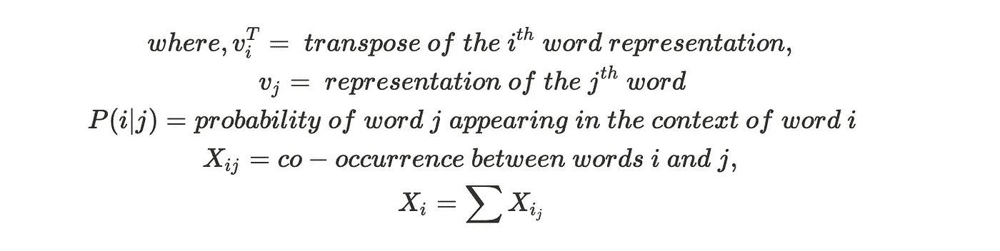
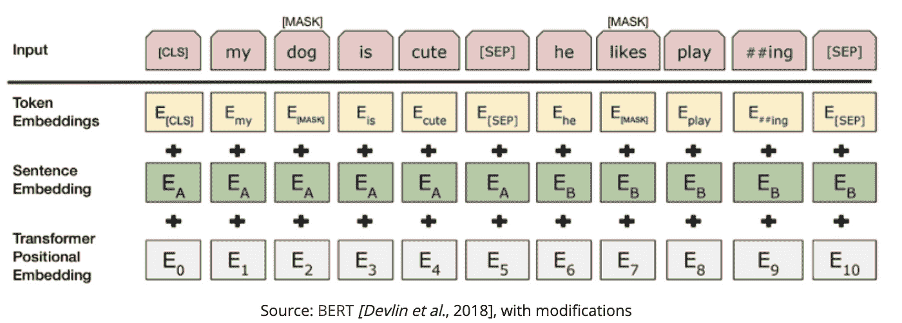

# 语言处理的文本表示法介绍—第 2 部分

> 原文：<https://towardsdatascience.com/introduction-to-text-representations-for-language-processing-part-2-54fe6907868?source=collection_archive---------17----------------------->


在 [Unsplash](https://unsplash.com?utm_source=medium&utm_medium=referral) 上由 [Jaredd Craig](https://unsplash.com/@jaredd_craig?utm_source=medium&utm_medium=referral) 拍照

## 更好地表现文本和语言的高级技术

在[之前的文章](https://medium.com/@sundareshchandran/introduction-to-text-representations-for-language-processing-part-1-dc6e8068b8a4)中，我们讨论了将文本输入机器学习或人工智能算法的离散文本表示。我们学习了一些技术，它们的工作原理，它们各自的优点和缺点。我们还讨论了离散文本表示的缺点&它如何忽略了单词的定位&没有试图解释单词的相似性或内在含义。

在本文中，我们将研究文本的分布式文本表示&它如何解决离散表示的一些缺点。

# 分布式文本表示:

分布式文本表示是指一个单词的表示与另一个单词不独立或不互斥，并且它们的配置通常表示数据中的各种度量和概念。所以关于一个单词的信息沿着它所代表的向量分布。这不同于离散表示，在离散表示中，每个单词都被认为是唯一的&彼此独立。

一些常用的分布式文本表示有:

*   共生矩阵
*   Word2Vec
*   手套

# 共生矩阵:

同现矩阵，顾名思义，考虑的是彼此邻近的实体的同现。使用的实体可以是一个单词，可以是一个双字母组合，甚至是一个短语。主要地，单个字被用于计算矩阵。它帮助我们理解语料库中不同单词之间的关联。

让我们看一个使用前一篇文章中讨论的 CountVectorizer 的例子&将其转换为连续表示，

```
from sklearn.feature_extraction.text import CountVectorizerdocs = ['product_x is awesome',
        'product_x is better than product_y',
        'product_x is dissapointing','product_y beats product_x by miles', 
'ill definitely recommend product_x over others']# Using in built english stop words to remove noise
count_vectorizer = CountVectorizer(stop_words = 'english')
vectorized_matrix = count_vectorizer.fit_transform(docs)# We can now simply do a matrix multiplication with the transposed image of the same matrix
co_occurrence_matrix = (vectorized_matrix.T * vectorized_matrix)
print(pd.DataFrame(co_occurrence_matrix.A, 
                   columns=count_vectorizer.get_feature_names(),
                   index=count_vectorizer.get_feature_names()))
```

# 输出:

```
awesome  beats  better  definitely  dissapointing  ill  miles  \\
awesome              1      0       0           0              0    0      0   
beats                0      1       0           0              0    0      1   
better               0      0       1           0              0    0      0   
definitely           0      0       0           1              0    1      0   
dissapointing        0      0       0           0              1    0      0   
ill                  0      0       0           1              0    1      0   
miles                0      1       0           0              0    0      1   
product_x            1      1       1           1              1    1      1   
product_y            0      1       1           0              0    0      1   
recommend            0      0       0           1              0    1      0                  product_x  product_y  recommend  
awesome                1          0          0  
beats                  1          1          0  
better                 1          1          0  
definitely             1          0          1  
dissapointing          1          0          0  
ill                    1          0          1  
miles                  1          1          0  
product_x              5          2          1  
product_y              2          2          0  
recommend              1          0          1
```

每个单词的表示是它在共现矩阵中对应的行(或列)

如果我们想了解与 product_x 相关的单词，我们可以过滤该列，并分析正在与 *product_y* &进行比较的 *product_x* 与它相关的正面形容词比负面形容词多。

# 优势:

*   寻找单词关联的简单表示法
*   与离散技术不同，它考虑句子中单词的顺序
*   这种方法产生的表示是全局表示。也就是说，它使用整个语料库来生成表示

# 缺点:

*   类似于 CountVectorizer & TF-IDF 矩阵，这也是一个稀疏矩阵。这意味着它的存储效率不高&在上面运行计算效率很低
*   词汇表越大，矩阵越大(不可扩展到大词汇表)
*   使用这种技术并不能理解所有的单词联想。在上面的例子中，如果你查看 *product_x* 列，有一行名为 *beats。*在这种情况下，仅通过查看矩阵无法确定 beats 的上下文

# Word2Vec

Word2Vec 是一个著名的表示单词嵌入的算法。它是由托马斯·米卡洛夫于 2013 年在研究论文《向量空间中单词表示的高效估计》中开发的

这是一种基于预测的单词表示方法，而不是基于计数的技术，如共生矩阵

> *单词嵌入是单词的向量表示。每个单词由固定的向量大小表示，同时捕捉其与其他单词的语义&句法关系*

word2vec 的架构是一个浅层的单隐层网络。隐藏层的权重是单词的嵌入&我们通过损失函数(正常的反向投影)来调整它

这种架构类似于自动编码器，其中有一个编码器层和一个解码器层，中间部分是输入的压缩表示，可用于降维或异常检测用例。

word2vec 通过两种方法/技术构建矢量表示:

*   **CBOW** —尝试在周围单词的上下文中预测中间的单词。因此，简单来说，它试图填补空白，即在给定的上下文/周围单词的情况下，什么单词更适合。数据集越小，效率越高。与 Skip-Gram 相比，训练时间更短
*   **Skip-Gram** —尝试从目标单词预测周围的上下文单词(与 CBOW 相反)。倾向于在较大的数据集中表现得更好，但需要更长的训练时间

Word2vec 能够使用简单的矢量算法捕获单词之间的多种相似度。像“男人对女人就像国王对王后”这样的模式可以通过像“国王”这样的算术运算获得——“男人”+“女人”=“王后”，其中“王后”将是单词本身最接近的向量表示。它还能够处理句法关系，如现在时和过去时，以及语义关系，如国家与首都的关系

让我们看看使用 gensim 的 word2vec 实现

```
# pip install --upgrade gensim or conda install -c conda-forge gensim# Word2Vec expects list of list representation of words, the outer list represents
# the sentence, while the inner list represents the individual words in a sentence
# Ex: ["I love NLP", "NLP is awesome"] -> [["I", "love", "NLP"], ["NLP", "is", "awesome"]]import gensim
sentences = ["ML is awesome", "ML is a branch of AI", "ML and AI are used interchangably nowadays", 
             "nlp is a branch and AI", "AI has fastforwarded nlp",
             "RL is also a branch of AI", "word2vec is a high dimensional vector space embedding",
            "word2vec falls under text representation for nlp"]# Preprocessing sentence to convert to format expected by w2v
sentece_list=[]
for i in sentences:
    li = list(i.split(" "))
    sentece_list.append(li)print(sentece_list)# Training Word2Vec with Skip-Gram (sg=1), 100 dimensional vector representation,
# with 1 as min word count for dropping noise terms, 4 parallel workers to run on
# Window of 4 for computing the neighbours & 100 iterations for the model to converge
model = gensim.models.Word2Vec(Bigger_list, min_count=1, 
				workers=4, size = 100, iter=100, sg=1, window=4)model.wv['word2vec']model.wv.most_similar(positive=['word2vec'])
```

# 输出

```
# Sentence List
[['ML', 'is', 'awesome'],
 ['ML', 'is', 'a', 'branch', 'of', 'AI'],
 ['ML', 'and', 'AI', 'are', 'used', 'interchangably', 'nowadays'],
 ['nlp', 'is', 'a', 'branch', 'and', 'AI'],
 ['AI', 'has', 'fastforwarded', 'nlp'],
 ['RL', 'is', 'also', 'a', 'branch', 'of', 'AI'],
 ['word2vec',
  'is',
  'a',
  'high',
  'dimensional',
  'vector',
  'space',
  'embedding'],
 ['word2vec', 'falls', 'under', 'text', 'representation', 'for', 'nlp']]# 100-dimensional vector representation of the word - "word2vec"
array([-2.3901083e-03, -1.9926417e-03,  1.9080448e-03, -3.1678095e-03,
       -4.9522246e-04, -4.5374390e-03,  3.4716981e-03,  3.8659102e-03,
        9.2548935e-04,  5.1823643e-04,  3.4266592e-03,  3.7806653e-04,
       -2.6678396e-03, -3.2777642e-04,  1.3322923e-03, -3.0630219e-03,
        3.1524736e-03, -8.5508014e-04,  2.0837481e-03,  5.2613947e-03,
        3.7915679e-03,  5.4354439e-03,  1.6099468e-03, -4.0912461e-03,
        4.8913858e-03,  1.7630701e-03,  3.1557647e-03,  3.5352646e-03,
        1.8157288e-03, -4.0848055e-03,  6.5594626e-04, -2.7539986e-03,
        1.5574660e-03, -5.1965546e-03, -8.8450959e-04,  1.6077182e-03,
        1.5791818e-03, -6.2289328e-04,  4.5868102e-03,  2.6237629e-03,
       -2.6883748e-03,  2.6881986e-03,  4.0420778e-03,  2.3544163e-03,
        4.8873704e-03,  2.4868934e-03,  4.0510278e-03, -4.2424505e-03,
       -3.7380056e-03,  2.5551897e-03, -5.0872993e-03, -3.3367933e-03,
        1.9790635e-03,  5.7303126e-04,  3.9246562e-03, -2.4457059e-03,
        4.2443913e-03, -4.9923239e-03, -2.8107907e-03, -3.8890676e-03,
        1.5237951e-03, -1.4327581e-03, -8.9179957e-04,  3.8922462e-03,
        3.5140023e-03,  8.2534424e-04, -3.7862784e-03, -2.2930673e-03,
       -2.1645970e-05,  2.9765235e-04, -1.4117253e-03,  3.0826295e-03,
        8.1492326e-04,  2.5406217e-03,  3.3184432e-03, -3.5381948e-03,
       -3.1870278e-03, -2.7319558e-03,  3.0047926e-03, -3.9584241e-03,
        1.6430502e-03, -3.2808927e-03, -2.8428673e-03, -3.1900958e-03,
       -3.9418009e-03, -3.3188087e-03, -9.5077307e-04, -1.1602251e-03,
        3.4587954e-03,  2.6288461e-03,  3.1395135e-03,  4.0585222e-03,
       -3.5573558e-03, -1.9402980e-03, -8.6417084e-04, -4.5995312e-03,
        4.7944607e-03,  1.1922724e-03,  6.6742860e-04, -1.1188064e-04],
      dtype=float32)# Most similar terms according to the trained model to the word - "Word2Vec"
[('AI', 0.3094254434108734),
 ('fastforwarded', 0.17564082145690918),
 ('dimensional', 0.1452922821044922),
 ('under', 0.13094305992126465),
 ('for', 0.11973076313734055),
 ('of', 0.1085459440946579),
 ('embedding', 0.06551346182823181),
 ('are', 0.06285746395587921),
 ('also', 0.05645104497671127),
 ('nowadays', 0.0527990460395813)]
```

在几行代码中，我们不仅能够将单词训练和表示为向量，还可以使用一些内置的函数来使用向量运算来查找最相似的单词、最不相似的单词等。

有两种方法可以找到向量之间的相似性，这取决于它们是否被归一化:

*   **如果归一化:**我们可以计算向量之间的简单点积，以确定它们有多相似
*   **如果没有归一化:**我们可以使用下面的公式计算向量之间的余弦相似度


余弦相似度与余弦距离的关系

关于所有可能的参数和功能，您可以参考下面的 gensim 文档:

[](https://radimrehurek.com/gensim/models/word2vec.html) [## gensim:面向人类的主题建模

### 这个模块实现了 word2vec 系列算法，使用了高度优化的 C 例程、数据流和…

radimrehurek.com](https://radimrehurek.com/gensim/models/word2vec.html) 

关于余弦相似性的更多细节，请参考下面的维基文章

 [## 余弦相似性

### 余弦相似性是内积空间的两个非零向量之间的相似性的度量。它被定义为…

en.wikipedia.org](https://en.wikipedia.org/wiki/Cosine_similarity) 

该架构的确切工作方式&训练算法&如何发现单词之间的关系超出了本文的范围&值得单独写一篇文章

原文可以在下面找到:

 [## 向量空间中单词表示的有效估计

### 我们提出了两种新的模型架构，用于从非常大的数据中计算单词的连续向量表示…

arxiv.org](https://arxiv.org/abs/1301.3781) 

# 优势:

*   能够捕捉不同单词之间的关系，包括它们的句法和语义关系
*   嵌入向量的大小很小&很灵活，不像前面讨论的所有算法，嵌入的大小与词汇量成比例
*   由于无人监管，标记数据的人工工作更少

# 缺点:

*   Word2Vec 不能很好地处理词汇外的单词。它为 OOV 单词分配随机向量表示，这可能是次优的
*   它依赖于语言单词的局部信息。一个词的语义表示只依赖于它的邻居&可能被证明是次优的
*   新语言培训的参数不能共享。如果你想用一种新的语言训练 word2vec，你必须从头开始
*   需要相对较大的语料库来使网络收敛(特别是如果使用 skip-gram

# 手套

单词表示的全局向量是 NLP 中经常使用的另一种著名的嵌入技术。这是斯坦福大学的 Jeffery Pennington、Richard Socher 和 Christopher D Manning 在 2014 年发表的一篇论文的结果。

它试图克服上面提到的 word2vec 的第二个缺点，通过学习单词的局部和全局统计来表示它。也就是说，它试图包含基于计数的技术(共现矩阵)和基于预测的技术(Word2Vec)的精华，因此也被称为用于连续单词表示的**混合技术**

在手套中，我们试图加强下面的关系


其可以被重写为，



因此，本质上，我们正在构造忠实于 P(i|j)的词向量 Vi 和 Vj，P(I | j)是从共现矩阵全局计算的统计

GloVe 的棘手部分是目标函数的推导，这超出了本文的范围。但是我鼓励你阅读这篇论文，它包含了它的推导过程，以进一步理解它是如何被转化为一个优化问题的

[](https://www.semanticscholar.org/paper/Glove%3A-Global-Vectors-for-Word-Representation-Pennington-Socher/f37e1b62a767a307c046404ca96bc140b3e68cb5) [## [PDF] Glove:单词表示的全局向量|语义学者

### 最近的学习单词向量空间表示的方法已经成功地捕获了细粒度的语义和语义

www.semanticscholar.org](https://www.semanticscholar.org/paper/Glove%3A-Global-Vectors-for-Word-Representation-Pennington-Socher/f37e1b62a767a307c046404ca96bc140b3e68cb5) 

为了改变，而不是从零开始构建手套向量，让我们了解如何利用在数十亿条记录上训练的令人敬畏的预训练模型

```
import gensim.downloader as api# Lets download a 25 dimensional GloVe representation of 2 Billion tweets
# Info on this & other embeddings : <https://nlp.stanford.edu/projects/glove/>
# Gensim provides an awesome interface to easily download pre-trained embeddings
# > 100MB to be downloaded
twitter_glove = api.load("glove-twitter-25")# To find most similar words
# Note : All outputs are lowercased. If you use upper case letters, it will throw out of vocab error
twitter_glove.most_similar("modi",topn=10)# To get the 25D vectors
twitter_glove['modi']twitter_glove.similarity("modi", "india")# This will throw an error
twitter_glove.similarity("modi", "India")
```

# 输出:

```
# twitter_glove.most_similar("modi",topn=10)
[('kejriwal', 0.9501368999481201),
 ('bjp', 0.9385530948638916),
 ('arvind', 0.9274109601974487),
 ('narendra', 0.9249324798583984),
 ('nawaz', 0.9142388105392456),
 ('pmln', 0.9120966792106628),
 ('rahul', 0.9069461226463318),
 ('congress', 0.904523491859436),
 ('zardari', 0.8963413238525391),
 ('gujarat', 0.8910366892814636)]# twitter_glove['modi']
array([-0.56174 ,  0.69419 ,  0.16733 ,  0.055867, -0.26266 , -0.6303  ,
       -0.28311 , -0.88244 ,  0.57317 , -0.82376 ,  0.46728 ,  0.48607 ,
       -2.1942  , -0.41972 ,  0.31795 , -0.70063 ,  0.060693,  0.45279 ,
        0.6564  ,  0.20738 ,  0.84496 , -0.087537, -0.38856 , -0.97028 ,
       -0.40427 ], dtype=float32)# twitter_glove.similarity("modi", "india")
0.73462856# twitter_glove.similarity("modi", "India")
KeyError: "word 'India' not in vocabulary"
```

# 优势

*   在类比任务中，它往往比 word2vec 表现得更好
*   它在构造向量时考虑词对到词对的关系&因此与从词-词关系构造的向量相比，倾向于向向量添加更多的含义
*   与 Word2Vec 相比，GloVe 更容易平行化，因此训练时间更短

# 不足之处

*   因为它使用了共现矩阵&全局信息，所以与 word2vec 相比，它的内存开销更小
*   类似于 word2vec，它没有解决多义词的问题，因为词和向量是一对一的关系

# 荣誉提名:

下面是一些高级语言模型，在掌握了上述表示法之后，应该对它们进行探索

# 工程与后勤管理局

从语言模型嵌入是 Matthew E. Peters 等人在 2018 年 3 月以深度语境化单词表示的名义发表的论文。

它试图通过在向量表示和它所表示的单词之间建立多对一的关系来解决 word2vec & GloVe 的缺点。也就是说，它结合了上下文并相应地改变了单词的向量表示。

它使用字符级 CNN 将单词转换为原始单词向量。这些进一步输入双向 LSTMs 进行训练。向前和向后迭代的组合创建了分别表示单词前后的上下文信息的中间单词向量。

原始单词向量和两个中间单词向量的加权和给出了最终的表示。

原始 ELMO 纸

 [## 深层语境化的词汇表征

### 我们介绍了一种新的深度上下文化的单词表示，它模拟了(1)单词的复杂特征…

arxiv.org](https://arxiv.org/abs/1802.05365) 

# 伯特

BERT 是谷歌 AI 团队以 BERT 的名义发表的一篇论文:2019 年 5 月出来的语言理解深度双向转换器的预训练。这是一种新的自我监督学习任务，用于预训练变压器，以便针对下游任务对其进行微调

BERT 使用语言模型的双向上下文，即它试图屏蔽从左到右和从右到左，以创建用于预测任务的中间标记，因此有术语双向。

BERT 模型的输入表示是标记嵌入、分段嵌入和位置嵌入的总和，遵循模型的掩蔽策略来预测上下文中的正确单词。



它使用一种转换网络和注意力机制，学习单词之间的上下文关系，并进行微调，以承担其他任务，如 NER 和问答配对等。

原文可以在下面找到:

 [## BERT:用于语言理解的深度双向转换器的预训练

### 我们介绍了一种新的语言表示模型，称为 BERT，代表双向编码器表示…

arxiv.org](https://arxiv.org/abs/1810.04805) 

# 摘要

分布式文本表示是能够处理 NLP 中复杂问题陈述的强大算法。

单独地，它们可以用于理解和探索语料库，例如，探索语料库中的单词&它们如何彼此关联。但是，当与用于解决问题陈述的监督学习模型结合时，它们的优势和重要性才真正显现出来，例如问答、文档分类、聊天机器人、命名实体识别等等。

如今，它们在猜想中被频繁地使用 CNNs & LSTMs 来求解&是许多最新成果的一部分。

希望你喜欢这个系列！

# 回购链接:

[](https://github.com/SundareshPrasanna/Introduction-to-text-representation-for-nlp/tree/master) [## SundareshPrasanna/自然语言处理的文本表示介绍

### 为 SundareshPrasanna/Introduction-to-text-re presentation-for-NLP 开发创建一个帐户…

github.com](https://github.com/SundareshPrasanna/Introduction-to-text-representation-for-nlp/tree/master) 

喜欢我的文章？给我买杯咖啡

 [## sundaresh 正在创作与数据科学相关的文章，并且热爱教学

### 嘿👋我刚刚在这里创建了一个页面。你现在可以给我买杯咖啡了！

www.buymeacoffee.com](https://www.buymeacoffee.com/sundaresh)