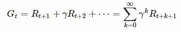
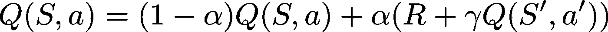
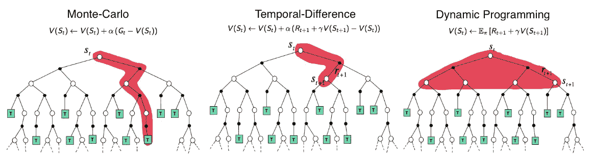
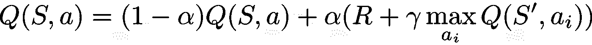

# 介绍强化学习的致命问题

> 原文：<https://towardsdatascience.com/introduction-to-the-deadly-triad-issue-of-reinforcement-learning-53613d6d11db?source=collection_archive---------21----------------------->

作者图片

当我了解深度强化学习时，我阅读了致命三合问题，但找不到任何令人满意的简单解释(除了科学论文)。因此，我写了两篇文章用直觉(因此很少用数学)解释它是什么，然后是如何处理的。

这个问题表明，当一个人试图结合*TD-学习(或引导)*、*偏离策略*学习和*函数逼近*(如深度神经网络)时，可能会出现不稳定和发散。

# 强化学习问题

我认为你熟悉强化学习问题的典型表述。如果没有，请查看以下一个(或多个)来源:

 [## 强化学习:什么是，算法，应用，例子

### 强化学习被定义为一种机器学习方法，它关注的是软件代理应该如何采取…

www.guru99.com](https://www.guru99.com/reinforcement-learning-tutorial.html) 

Arxiv Insights 的视频，非常清晰完整

大卫·西尔弗的精彩讲座(每次 1.5 小时)

我将使用通常的符号。

# 学习价值函数

我们想要解决 RL 问题的方法是学习价值函数。特别是，我们对 Q 值函数感兴趣，对于我们所处的任何状态，以及我们选择的任何行动，都会给我们带来回报(行动有多好)。

Q 值函数**给出的不是执行这个动作后获得的奖励**，而是执行这个动作后，如果你遵循你的策略，你将获得的所有奖励的总和(潜在折扣)，称为**回报**:

回报方程

## 使用随机ε-贪婪策略

如果代理人想知道一个动作有多好，他首先要尝试一下。这将把他带到另一个状态，在那里他可以在不同的行动之间再次选择。这个想法是:

1.  探索:尝试许多动作
2.  利用:更多地使用积极的高回报行为，以获得最佳策略。

因此，一个经典的方法是首先尝试完全随机的行动，这样你就可以了解每个状态下哪个行动是好的，哪个是坏的，并逐步优先考虑给你最积极回报的行动。

因此，策略在这里(在强化学习的大部分时间里)**随机**，这意味着它随机地行动。
注意不要将其与一致随机混淆，我这里不是说代理完全随机地选择动作，它试图以更高的概率选择好的动作而不是坏的动作，但是它必须探索、测试它不知道结果的动作，因此不能有完全确定的策略。

基于贝尔曼方程，有不同的方法来学习该函数，例如动态编程、蒙特卡罗方法和自举。

## 动态规划

如果你有一个精确的环境模型(例如，在一个特定的状态下执行一个特定的动作，你将获得什么样的回报和状态)，你可以使用动态编程来计算你的状态和动作的值。

然而，对于有许多状态和动作的环境，或者随机的环境，获得环境的模型是非常昂贵的。因此，人们更喜欢使用蒙特卡罗技术(比如 AlphaGo 的 Deepmind)。

## 蒙特卡洛

使用蒙特卡罗，代理通过选择它来更新他所考虑的动作的值，然后遵循他的策略直到情节终止(它到达最终状态)。然后，它可以汇总他通过这一集获得的所有回报，并获得回报的近似值。重复这个过程足够多次将最终收敛到状态动作的真实 Q 值。

如果你有很长的一集，这也是非常昂贵的，因为你必须等待一集结束才能获得回报。

## 时差学习

为了找到正确的 Q 值，我们可以观察到，对于每个状态/动作对的**,它应该收敛于回报(奖励的贴现总和)。状态动作/对的回报是:**

1.  这次行动获得的报酬(R)
2.  下一个状态/动作的返回，在下一个状态中选择下一个动作后获得，由其 Q 值近似

为什么经纪人要等剧集结束？他可以做以下事情:

1.  从状态 S，根据 Q 值(以ε-贪婪的方式)选择一个动作( *a*
2.  观察奖励( *R* )和新状态(*S’*)
3.  再次选择一个动作( *a'* )，观察它的 Q 值
4.  使用这个新状态和动作的 Q 值作为剩余回报的近似**:**

这里，出于稳定性原因，该值用α因子逐步更新。

这是对 *SARSA 算法*的描述。它使用自举技术，该技术在于使用下一个值的估计来估计该值(而不是等待整个剧集)。

下图说明了这三种技术是如何工作:

*大卫·西尔弗的 RL 课程* [*第四讲*](http://www0.cs.ucl.ac.uk/staff/d.silver/web/Teaching_files/MC-TD.pdf) *:“无模型预测”*

TD-learning 和 Monte Carlo 混合存在，它们被归入 *TD( λ)* 族。

# q 学习

SARSA 是一种基于策略的学习技术，这意味着它遵循自己的策略来学习价值函数。另一个想法是直接使用 next 的 Q 值的最大值来计算回报。
这被称为 Q-Learning，具体如下:

1.  从状态 S，根据 Q 值(以ε-贪婪的方式)选择一个动作( *a* )
2.  观察奖励( *R* )和新状态(*S’*)
3.  使用下一状态的最大 Q 值来更新当前 Q 值:

因此，代理使用了最佳的可能 Q 值，即使他没有采取相应的行动。这是连贯的，因为他总是选择最佳行动来结束。因此，这有助于加快学习过程。

这被称为偏离策略学习，因为你不再使用当前遵循的策略来更新你的 Q 值函数(而是一个贪婪的策略)。

政策外学习有优点也有缺点，你可以在这里查阅[。](https://datascience.stackexchange.com/questions/13029/what-are-the-advantages-disadvantages-of-off-policy-rl-vs-on-policy-rl)

# 函数逼近(神经网络)

当状态和动作的数量过多时，或者当在连续的环境中进化时(这意味着在计算机上是相同的)，人们不能为每个可能的状态或状态-动作对创建一个价值函数。

因此，这个想法是使用函数逼近，如神经网络。然后将状态输入神经网络，并获得每个动作的 Q 值作为输出。因此，这是容易处理的，然后我们可以使用梯度上升技术将这个神经网络变成一个良好的 Q 值函数近似值，告诉我们为每张图像按下哪个按钮(或按钮组合)。

作者图片

使用近似法的一个明显的优点是，你可以得到相似状态的相似值(这似乎是一致的和有用的)，但是我们将在下一篇文章中看到这一点。

# 致命的黑社会问题

致命的三位一体问题是这样一个事实，即自举、偏离策略学习和函数逼近的结合最终会导致很多不稳定，或者没有收敛。在下一篇文章中，我会解释为什么会发生这种情况以及如何处理。