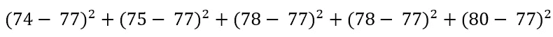

# 描述统计学导论

> 原文：<https://towardsdatascience.com/introduction-to-the-descriptive-statistics-a050b5ec99fb?source=collection_archive---------35----------------------->

约翰尼·麦克朗在 [Unsplash](https://unsplash.com?utm_source=medium&utm_medium=referral) 上的照片

## 对最基本和广泛使用的描述性统计方法有清晰和详细的理解

描述性统计对数据进行总结、展示和分析，使其更容易理解。如果数据集很大，从原始数据中很难看出任何意义。使用描述性统计技术，数据可以变得更加清晰，模式可能出现，一些结论可能是显而易见的。

但是描述性统计不允许我们得出超出分析部分的任何结论。它没有证实我们所做的任何假设。为此你需要学习推理统计学。我在这一页的末尾添加了一些研究推断统计学的链接。

> **有几种通用类型的统计方法来描述数据:**

1.  集中趋势的度量:平均值、中间值、众数
2.  变异的度量:范围、标准偏差和四分位数范围
3.  五个数摘要:第一个四分位数，第二个四分位数，第三个四分位数，最小值和最大值
4.  数据的形状:对称、左偏和右偏。

在本文中，我将解释所有四种统计方法及其属性。

## 集中趋势测量

有三种常用的方法来表示数据集的中心。这些被称为集中趋势的度量。

它们是:

平均

中位数

方式

> **的意思是**

这是最基本的。可能你们大多数人已经知道了。

我们计算平均值的方法是将所有值相加，然后除以值的个数。以下是一个数据集示例:

12, 18, 20, 16

平均值为= (12 + 18 +20 + 16)/4 = 16.5

数据集的平均值对极值**敏感**。例如，在上面的数据集中，如果还有一个这样的值:

12, 18, 20, 16, 150

平均值变为:

(12 + 18 +20 + 16 + 150)/5 = 43.2

因为一个值，平均值发生了剧烈变化。平均值变得比数据集的其余值大得多，除了 150。它并不代表整个数据集。

> 当数据集中存在极值时，平均值不能很好地代表整个数据集。

修整数据集的平均值将代表整个数据集。如果我们只是从上面的数据集中修剪极值数据 150，平均值将再次变为 16.5，并且它将再次表示数据集中的大部分数据。

> 修整极值是统计学和数据科学中的常用技术。

> **中值**

在一组数值数据中，中位数是介于前 50%数据和后 50%数据之间的数据点。这是一个数据集，例如:

13, 19, 12, 21, 9, 15, 24, 11, 14

在找到中位数之前，我们需要对数据进行排序。对数据排序后，它变成:

9, 11, 12, 13, 14, 15, 19, 21, 24

中位数是中间点。在这个数据集中，它是 14。

如果我们还有一个数据，并且数据的数量和这个一样，那会怎么样呢？

9, 11, 12, 13, 14, 15, 19, 21, 24, 28

在这种情况下，中位数是两个中间值的平均值。

媒体是= (14 + 15)/2 = 14.5

**让我们给这个数据集添加一个极值:**

9, 11, 12, 13, 14, 15, 19, 21, 24, 28, 278

这个更新数据集的中位数是 15。

> 所以，中值对极值不敏感。

> **模式**

众数是数据集中出现频率最高的值。

这是一个数据集示例:

23, 45, 34, 32, 45, 12, 23, 37, 45

这里 45 出现了 3 次，23 出现了 2 次，其余值出现了 1 次。所以，数据集的众数是 45。

如果所有数据在数据中只出现一次，则没有模式。

如果有更多的数字出现相同的次数，他们都是模式。如果上面的数据集被修改为:

23, 45, 34, 32, 45, 12, 23, 37, 45, 23

这里 45 和 23 都出现了 3 次。因此，23 和 45 都是数据集的模式。

> 如果所有数据在数据中只出现一次，则没有模式。

## 变化的度量

上面讨论的中心测量并不总是描述数据集和得出结论的最佳方式。比如说。这里有两个数据集:

数据 1:74，75，78，78，80

数据 2: 69，74，78，78，86

这些数据集的均值、中值和众数完全相同。请自己检查一下。

三种最常用的变化测量方法是:

范围

标准偏差

四分位间距

> **范围**

数据集的范围是数据集的最大值和最小值之差。上面提到的数据 1 的范围是 6，数据 2 的范围是 17。所以，这给了我们更多关于数据集分布的视角。

> **标准差**

标准差代表数据集与数据平均值的偏差。

计算这个要比前几个复杂一点。计算标准差的步骤如下:

第一步:计算平均值

第二步:取平均值的差值

第三步:取这些差值的平方并相加

第四步:将结果除以值的总数。这个数字被称为方差

第五步:求方差的平方根

标准偏差的公式如下:

让我们来算一个例子:

使用上面的数据 1:

数据 1:74，75，78，78，80

第一步:平均值= 77

**第二步和第三步:**我从平均值中取每个值的差，然后平方它们

计算后得出 24。

**第四步:**用这个数除以数据集中值的个数，得到方差。我们有五种价值观。所以，方差= 24/5 = 4.8。

**第五步:**取方差的平方根，得出标准差为 2.19。

如果对上面的 data 2(data 2:69，74，78，78，86)进行同样的处理，将得到 5.6。请随意自己尝试。

你可以看到标准差给出了数值分布的概念。换句话说，这些值是如何相互变化的。

> 数据集中的值变化越大，标准差就越大。

以下是一些与标准差相关的趋势:

1.  对于钟形分布，99.7%的数据位于平均值两侧的 3 个标准偏差内
2.  大约 95%的数据应该在平均值的 2 个标准偏差之内。
3.  大约 68%的数据位于数据的一个标准偏差内。

请看这张来自[维基百科](https://en.wikipedia.org/wiki/Standard_deviation)的图片:

来源:[维基百科](https://en.wikipedia.org/wiki/Standard_deviation)

> **四分位数范围**将在下面的“五个数摘要”部分解释，因为它与这五个数有关。

## 五个数摘要

这五个数字是:

> **第一个四分位数**

将数据中最底层的 25%和最顶层的 75%分开。看看下面的例子。在下图中，Q1 是第一个四分位数。

> **第二个四分位数**

第二个四分位数实际上是将数据中前 50%和后 50%分开的中间值。在下图中，Q2 代表第二个四分位数。

> **第三个四分位数**

将后 75%的数据与前 25%的数据相除。Q3 代表下图中的第三个四分位数。

让我们看看这个例子。这是一个经过排序的数据集 d:

d = 33，36，38，40，41，44，49，53，56，61，66，71

这里有 12 个值。第一、第二和第三四分位数的位置如下:

让我们来计算一下。

第一个四分位数:(38 + 40)/2 = 38

第二个四分位数是:(44 + 49)/2 = 46.5

第三个四分位数是:(56 + 61)/2 = 58.5

你可能会想，我们这里有三个度量:第一、第二和第三四分位数。怎么是五数总结！

> **另外两个度量是最大值和最小值。**

它们不言自明。我相信你知道它们是什么。

但是我们需要理解它们的含义。在此之前，我们需要了解一个更重要的术语。

即***【IQR】***。

IQR 是第三个四分位数(Q3)和第一个四分位数(Q1)之间的差值。所以，IQR 代表了中间 50%数据的变化。**上述数据集的 IQR 为 58.5–38 = 20.5。**

> IQR 在确定极值或异常值时非常有用，我们在计算均值和中值时讨论过。

数据集的合理下限是

Q1-1.5 * IQR

数据集的合理上限是

Q3 + 1.5 * IQR

上述数据集 d 的下限是:

38–1.5 * 20.5 = 7.25

数据集 d 的上限是:

58.5 + 1.5* 20.5 = 89.25

如果您注意到，数据集中的所有值都在下限和上限的计算范围之间。因此，该数据集中没有异常值或极值。

## 数据的形状

数据的形状表示数据在整个范围内的分布。在统计学中有三种主要的分布类型。

> **对称**

当低于平均值的值与高于平均值的值以相同的方式分布时，该分布称为对称分布。

这条曲线也就是我之前提到的钟形曲线。

> 对于对称形状的数据，平均值和中值是相同的

> **左倾**

当大部分数据位于分布的上部时，数据集的形状是左偏的。

以下是 left_skewed 数据集的属性:

a.最小值和中值之差大于最大值和中值之差。

b.最小值和第一个四分位数之间的差值大于最大值和第三个四分位数之间的差值。

c.第一个四分位数和中位数之间的差异大于第三个四分位数和中位数之间的差异。

> 在左斜的形状中，尾巴位于左侧。

> **右倾**

当大部分数据位于分布的较低部分时，该曲线是右偏曲线。

这些是右偏数据集的属性:

a.最小值和中值之差小于最大值和中值之差。

b.最小值和第一个四分位数之间的差值小于第三个四分位数和最大值之间的差值。

c.第一个四分位数和中位数之间的差值小于第三个四分位数和中位数之间的差值。

> 在右斜的形状中，尾巴位于右侧

## 结论

这些是描述性统计中最基本和最主要的度量类型。没有人再手工计算它们了。数据科学家或分析师使用 python 或 R 之类的编程语言来推导它们。这些参数每天都在研究、统计和数据科学中使用。所以，清楚地理解它们对理解数据是很重要的。

欢迎在推特上关注我，喜欢我的脸书页面。

> **更多阅读:**

 [## 置信区间的完整指南，以及 Python 中的示例

### 对统计学中一个非常流行的参数——置信区间及其计算的深入理解

towardsdatascience.com](/a-complete-guide-to-confidence-interval-and-examples-in-python-ff417c5cb593)  [## 数据科学家使用 Python 进行假设检验的完整指南

### 用样本研究问题、解决步骤和完整代码清楚地解释

towardsdatascience.com](/a-complete-guide-to-hypothesis-testing-for-data-scientists-using-python-69f670e6779e)  [## 使用直方图和箱线图理解数据，并举例说明

### 了解如何从直方图和箱线图中提取最多的信息。

towardsdatascience.com](/understanding-the-data-using-histogram-and-boxplot-with-example-425a52b5b8a6)  [## 熊猫数据可视化的终极备忘单

### 熊猫的所有基本视觉类型和一些非常高级的视觉…

towardsdatascience.com](/an-ultimate-cheat-sheet-for-data-visualization-in-pandas-4010e1b16b5c)  [## 想在 12 周内成为数据科学家？

### 花钱前再想一想

towardsdatascience.com](/want-to-become-a-data-scientist-in-12-weeks-3926d8eacee2)  [## 成为数据科学家的一系列免费课程

### 链接到知名大学的高质量课程，可以免费学习。循序渐进地学习这些课程，以…

towardsdatascience.com](/series-of-free-courses-to-become-a-data-scientist-3cb9fd591739)