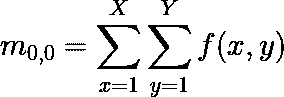
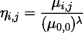
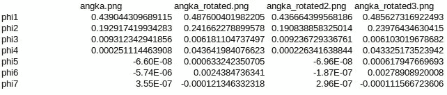

# 不变矩及其在特征提取中的应用

> 原文：<https://towardsdatascience.com/introduction-to-the-invariant-moment-and-its-application-to-the-feature-extraction-ee991f39ec?source=collection_archive---------23----------------------->

## 通过真实代码理解概念

雅各布·欧文斯在 [Unsplash](https://unsplash.com?utm_source=medium&utm_medium=referral) 上的照片

# 介绍

首先要明白什么是不变量，什么是矩分别？在图像处理中，不变量(I)是图像的一个属性(在这种情况下是一个函数)，如果我们对图像进行变换(旋转、缩放、模糊等),这个属性**不会改变或者只改变一点点**。

如果 D 是退化算子(图像的变换函数)，f(x，y)是原始图像(其中 x 和 y 是图像的像素坐标，f 的输出是像素的强度)，则

(1)

通常，不变量被写成一个向量

(2)

其中 n 是我们应用于图像的变换次数。在理想条件下，给定(1 ),那么如果我们映射来自图像数据集的所有不变向量，我们将发现不同对象的不同群集，因为不同对象具有显著不同的 I 值。

不变量有很多种，每一种都有一组不同转换函数。我们都知道图像最基本的变换是旋转、缩放、平移等。不变矩是不变方法之一。它利用了某种特殊的瞬间功能。

**矩(m)是函数(图像，f(x，y))到多项式基或多项式形式的投影**。

(3)

其中 X 和 Y 是图像在 X 轴和 Y 轴上的总像素。力矩(r)的阶数定义为

(4)

I 和 j 的一些组合具有直观的意义，例如

*   **m0，0 是图像的质量**。

(5)

**它只是所有像素强度的总和。**如果图像只是一个纯黑色(这里我们认为完美的黑色像素= 0，白色= 1)，那么质量为 0。

*   **m1，0/m0，0 和 m0，1/m0，0 是图像的重心**。

(6)

(7)

比如一张大小为 20x20 的纯白图像，图像的重心在哪里？让我们编写代码来解决这个问题，因为图像是一个普通图像，图像的形状是正方形，那么 **m1，0/m0，0 和 m0，1/m0，0 是相同的**。

而**的结果是 10.5** 所以**重心在(10.5，10.5)** 。这是有道理的，一个扁平的矩形物体应该有一个重心在中间。

还有很多。中心力矩(μ)定义为

(8)

其中 x '和 y '是图像在 x 轴(m1，0/m0，0)和 y 轴(m0，1/m0，0)上的重心。所以很明显

(9)

然后归一化中心矩(η)定义为

(10)

其中λ是

(11)

不变矩有 7 个矩(ɸ)，它们是使用归一化中心矩定义的，例如

(12)

(13)

(14)

(15)

(16)

(17)

(18)

**我们可以将这 7 个矩(12–18)视为不变矩**的 7 个特征。

# 特征抽出

让我们用(12–18)公式来测试等式(1)。例如，我们有这个手写的数字 2(来自 [MNIST 数据集](http://yann.lecun.com/exdb/mnist/))。

angka.png

**我们旋转了图片**所以我们会得到

angka_rotated.png

angka_rotated2.png

angka_rotated3.png

**在这种情况下，旋转图片是一个退化操作符(D)** 。让我们用(12-18)来计算它们的不变矩。这是代码

对所有图像(原始图像和所有旋转后的图像)运行此代码，结果是

让我们计算原始图像`angka.png`与所有其他图像之间的欧几里德距离(d)。**欧几里德距离的值越小，根据不变矩值**物体与原始物体越相似。如果数据有 N 维(在这种情况下，我们有 7 个矩，所以有 7 维),那么

(19)

其中`p bar`(本例中为`angka.png`)为参考点，`p`为点。结果是

看起来最接近原始图像的值是我们将它旋转 180 度时的版本。

我们仍然不知道在这个实验背景下“相似的”ɸ有多大。我们需要比较值。让我们检查另一个数字。我们要试试 6 码的。

6.png

这个对比是

如果你注意，它看着 phi 5 到 phi 7 它的值总是相似的(接近 0)。甚至不同的数字`6.png`也有相似的值。

他们的欧几里德距离是

在上表中，您可以看到`6.png` **与原始图像相比具有明显的不变矩值，并且它是旋转变量**。

让我们在数据集中选取另一个数字 2。

2.png

它的不变矩值是

从这个比较中，我们得到`angka.png`和`2.png`之间的`d`的值是`0.080392465667106`。它仍然比`6.png`小，这证明了`**2.png**` **比** `**6.png**` **与原始图像**更相似。在这种情况下，不变矩成功地区分了基于(1)中的定义给出的样本图像。

# 关闭

这就是我们如何利用不变矩从图像中提取特征。下一篇文章也许我会试着用不变矩来分类一张图片。另一篇文章再见。

# 参考

马，岳超&李，思宁&陆，魏。(2018).基于支持向量机的部分扫描低空风切变识别。机械工程进展。10.168781401775415.10.1177/1687814017754151.

http://zoi.utia.cas.cz/files/chapter_moments_color1.pdf 于 2020 年 7 月 23 日进入