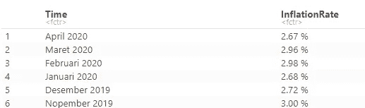
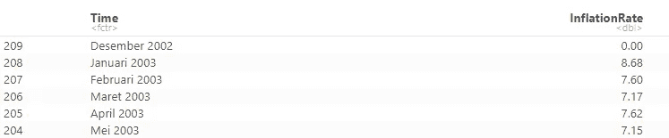
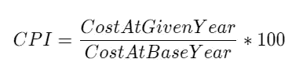
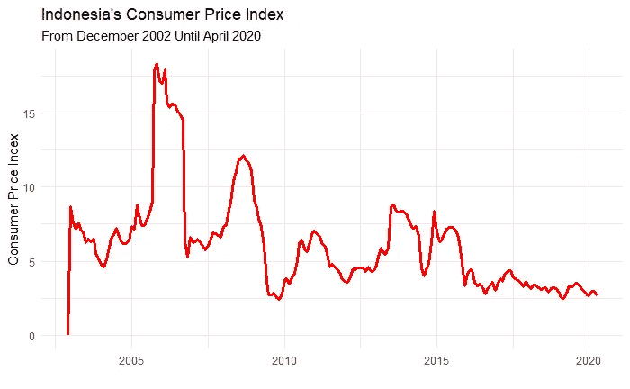
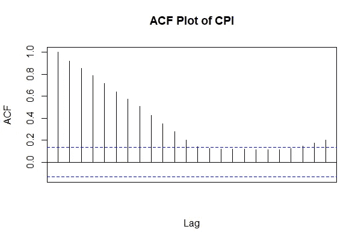
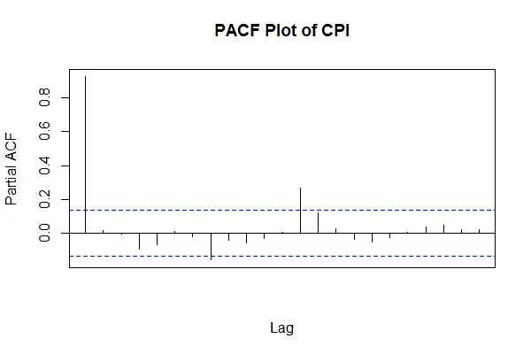
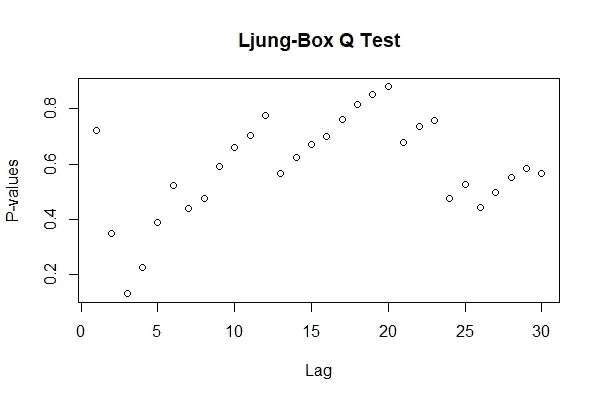
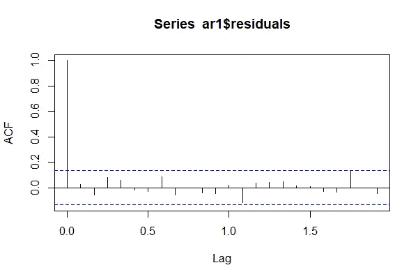
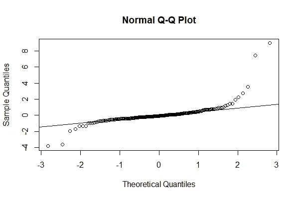
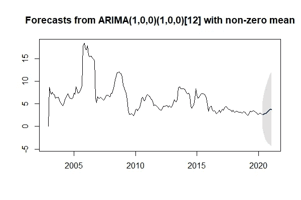

# R 时间序列分析导论

> 原文：<https://towardsdatascience.com/introduction-to-time-series-analysis-with-r-a2f97650baa3?source=collection_archive---------15----------------------->


克里斯·利维拉尼在 [Unsplash](https://unsplash.com/s/photos/stock?utm_source=unsplash&utm_medium=referral&utm_content=creditCopyText) 上的照片

## 从探索，到预测。使用印度尼西亚 2002 年 12 月至 2020 年 4 月的消费者价格指数(CPI)数据

时间序列数据是以固定的时间间隔观察到的数据，可以每天、每月、每年等进行测量。时间序列有很多应用，特别是在金融和天气预报方面。在本文中，我将向您介绍如何使用 r 分析和预测时间序列数据。对于数据本身，我将为您提供一个来自印度尼西亚银行 2002 年 12 月至 2020 年 4 月的消费者价格指数(CPI)数据的示例。

# 行动（或活动、袭击）计划

在我们开始分析之前，我会告诉你我们必须做的步骤。步骤是这样的，

*   首先，我们必须**收集和预处理数据**，并且，我们应该知道我们使用的数据的领域知识，
*   然后，我们对时间序列**进行可视化和统计分析**，
*   然后，我们**基于其自相关性识别完美模型**，
*   然后，我们**诊断模型**是否满足独立性假设，最后，
*   我们可以用这个模型来做预测

# 预处理数据

如前所述，我们将对印度尼西亚 2002 年 12 月至 2020 年 4 月的 CPI 数据进行时间序列分析。我们可以从印尼银行得到数据。不幸的是，我们必须首先将数据从网站复制到电子表格中，然后从中生成一个. csv 数据。数据在我们导入后是这样的，

```
library(tidyverse)
data <- read.csv("data.csv")
colnames(data) <- c("Time", "InflationRate")
head(data)
```



在进行分析之前，我们必须先对其进行预处理。尤其是在“InflationRate”列中，我们必须删除“%”符号并将其转换为数字类型，如下所示，

```
**# Pre-process the data**
data$InflationRate <- gsub(" %$", "", data$InflationRate)
data$InflationRate <- as.numeric(data$InflationRate)
data <- data[order(nrow(data):1), ]
tail(data)
```

然后，我们得到的数据会像这样，



这样，我们可以使用 ts 函数从“InflationRate”列创建一个时序对象

```
cpi <- ts(data$InflationRate, frequency = 12, start = c(2002, 12))
```

有了 cpi 变量，我们可以进行时间序列分析。

# 分析

首先，我们来介绍一下居民消费价格指数(CPI)。CPI 是衡量消费品在其基年的某一时刻的价格变化的指数。公式看起来像这样，



公式

每个月都会测量每个 CPI 值。这是代码和代码结果的图表，

```
library(ggplot2)**# Make the DataFrame**
tidy_data <- data.frame(
  date = seq(as.Date("2002-12-01"), as.Date("2020-04-01"), by = "month"),
  cpi = cpi
)
tidy_data**# Make the plot**
p <- ggplot(tidy_data, aes(x=date, y=cpi)) +
  geom_line(color="red", size=1.1) +
  theme_minimal() +
  xlab("") +
  ylab("Consumer Price Index") +
  ggtitle("Indonesia's Consumer Price Index", subtitle = "From December 2002 Until April 2020")
p**# Get the statistical summary
# Returns data frame and sort based on the CPI** tidy_data %>%
  arrange(desc(cpi))
tidy_data %>%
  arrange(cpi)
```



根据图表，我们看不到任何趋势或季节性模式。尽管它看起来是季节性的，但每年的高峰期不在同一个月，所以它不是季节性的。然后，这个图也没有增加或减少的趋势。因此，此图是静态的，因为数据的统计属性(如均值和方差)不会因时间而产生任何影响。

除了图表之外，我们还可以从数据中测量统计摘要。我们可以看到最大的通货膨胀发生在 2005 年 11 月，CPI 为 18.38。然后，最小通货膨胀发生在 2009 年 11 月，CPI 为 2.41。有了这些信息，我们可以得出结论，这些数据没有季节性模式。

# 模型识别

在我们分析了数据之后，我们就可以根据数据进行建模。在这种情况下，我们将考虑两种模型，即自回归(AR)模型和移动平均(MA)模型。在使用模型之前，我们必须根据数据的自相关性确定哪个模型最适合数据，哪个滞后适合模型。为了识别这一点，我们将制作自相关函数(ACF)图和部分自相关函数(PACF)图，如下图所示，这是代码。

```
acf(cpi, plot = T, main = "ACF Plot of CPI", xaxt="n")
pacf(cpi, plot = T, main = "ACF Plot of CPI", xaxt="n")
```



左:ACF 图，右:PACF 图

根据上面的图，我们如何为这些数据选择完美的模型。要在 AR 和 MA 模型之间进行选择，我们可以看到下面的总结:


情节解读

该总结指出，如果 ACF 曲线在滞后 p 之后变窄，PACF 曲线截止到接近 0，则 AR(p)将符合模型。然后，如果 ACF 曲线在滞后 Q 之后截止到接近 0，并且 PACF 曲线变窄，则 MA(q)模型将符合模型。如果两个图都是拖尾，那么我们可以用 ARMA(p，q)模型来拟合。对于那些仍然对 tail off 和 cut off 感到困惑的人来说，tail off 意味着值逐渐减小，而不是下降到接近 0。那么截止意味着自相关在前一个滞后之后降低到接近 0。

基于该信息，我们可以看到 ACF 图逐渐减小(变小),并且 PACF 图在滞后-1 之后减小到接近 0。因此，对于这个模型，我们将在下一步使用 AR(1)模型。

# 模型诊断

为了确保该模型可以用于预测和其他测量，我们必须使用 Ljung 盒测试来测试该模型。下面是实现这一点的代码，

```
library(FitAR)
acf(ar1$residuals)
res <- LjungBoxTest(ar1$residuals, k=2, StartLag=1)
plot(res[,3],main= "Ljung-Box Q Test", ylab= "P-values", xlab= "Lag")
qqnorm(ar1$residuals)
qqline(ar1$residuals)
```



左:Q 测试图，中:残差自相关，右:QQ 图

根据这些图，我们可以看到 Q-test 图的 p 值高于 0.05，ACF 图显示另一个滞后之间没有显著性，最后，我们可以看到 QQ 图几乎符合直线，因此我们可以假设这已经是正常的。因此，我们可以用模型来做预测。

# 预测

在我们建立模型并进行测试之后，现在我们可以使用下面的代码进行预测，

```
library(forecast)
futurVal <- forecast(ar1, h=10, level=c(99.5))
plot(futurVal)
```

这是结果，



# 结论

预测是我能给你看的最后一部作品。我希望，通过这个时间序列分析的学习案例，你可以根据你的问题进行时间序列分析。这篇文章只是展示了如何进行分析的基本原理，而不是解决使用 ARIMA 模型和我使用的静态数据的问题。我希望我能在以后与你分享如何分析非平稳时间序列数据。

# **参考文献**

[1]查特吉，s .，[时间序列分析使用 ARIMA 模型在 R](https://datascienceplus.com/time-series-analysis-using-arima-model-in-r/) (2018)，[*datascienceplus.com*](https://datascienceplus.com/time-series-analysis-using-arima-model-in-r/)。
【2】hynd man，r . j .&Athanasopoulos，G. (2018) [*预测:原理与实践*](https://otexts.com/fpp2/) ，第二版，OTexts。

## 感谢您阅读我的文章，您也可以在下面查看我以前的文章:

[](/greater-accuracy-does-not-mean-greater-machine-learning-model-performance-771222345e61) [## 更高的准确性并不意味着更好的机器学习模型性能

### 我们可以定量地衡量机器学习模型的性能，但不仅仅是准确性，还有很多…

towardsdatascience.com](/greater-accuracy-does-not-mean-greater-machine-learning-model-performance-771222345e61) [](/this-is-how-i-will-learn-data-science-if-i-got-back-my-own-time-e9148c909ce9) [## 如果我有自己的时间，我会这样学习数据科学

### 感觉不知所措和筋疲力尽让我在释放数据科学技能方面表现不佳。这个…

towardsdatascience.com](/this-is-how-i-will-learn-data-science-if-i-got-back-my-own-time-e9148c909ce9) [](/tidy-data-with-r-f3d078853fc6) [## 用 R 整理数据

### 为什么你应该在它上面投资更多，为什么这使你的分析变得容易得多

towardsdatascience.com](/tidy-data-with-r-f3d078853fc6)