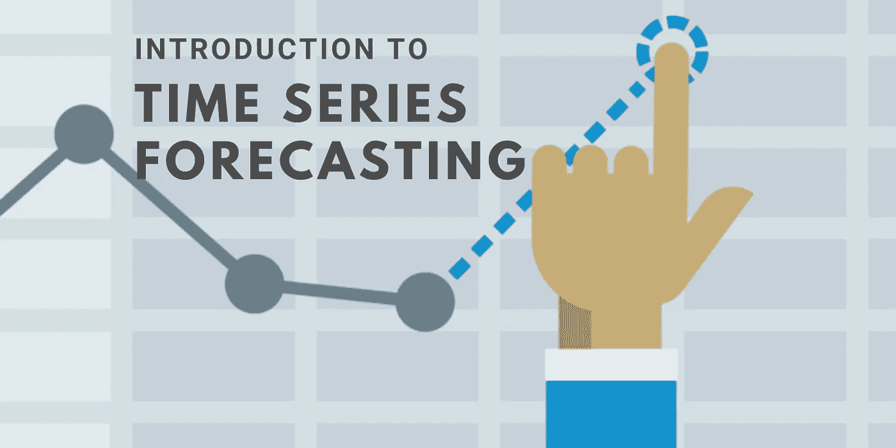
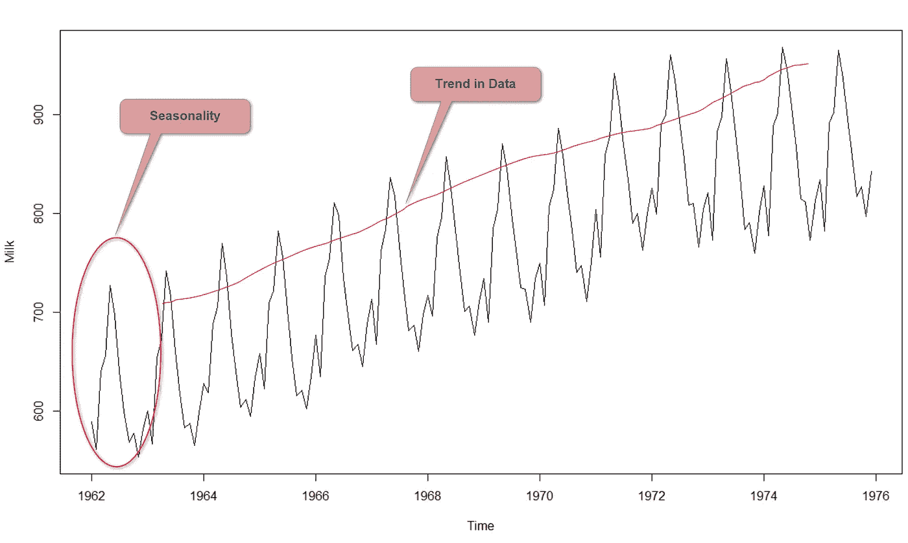
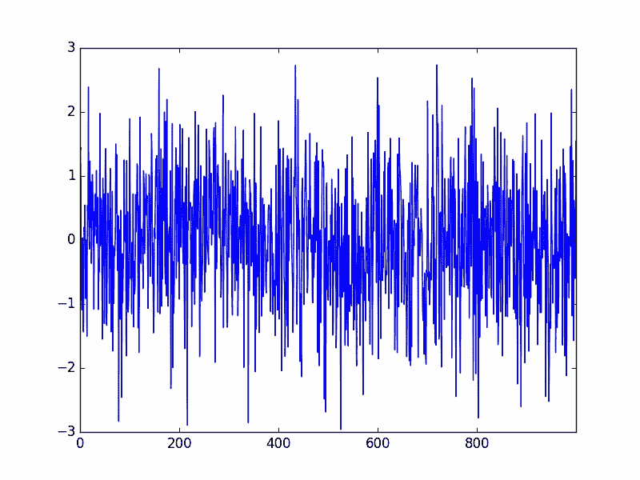
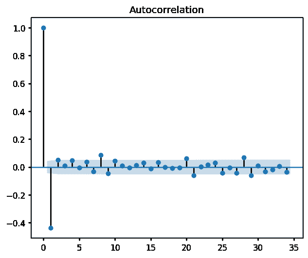
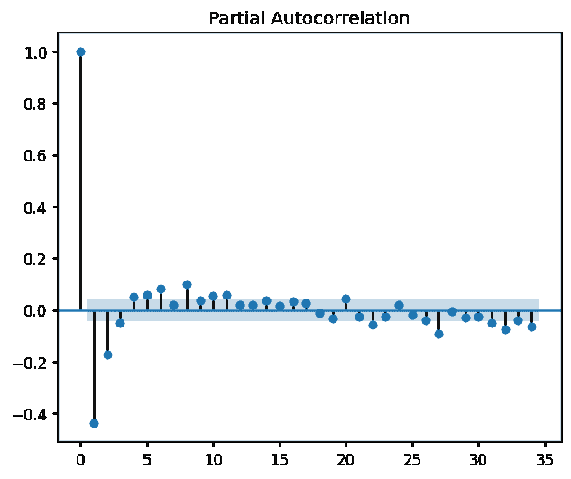
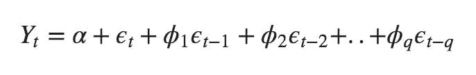
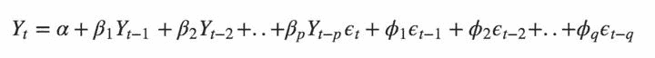
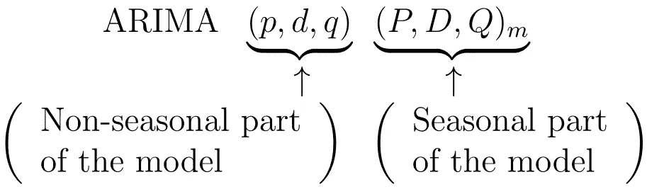

# 时间序列预测简介

> 原文：<https://towardsdatascience.com/introduction-to-time-series-forecasting-7e03c4bd83e0?source=collection_archive---------17----------------------->

## 介绍时间序列，以及与时间序列分析和预测相关的基本概念和建模技术。

作者图片

时间序列预测是机器学习的重要领域之一。当涉及到时间成分的预测问题时，这是非常重要的。

这些天我在做基于时间序列分析和预测的项目任务。所以，我在这个领域做了一些研究，认为这将对我和那些开始时间序列预测的人有益，以一些记录的方式做出那些发现。

本文的目的是介绍时间序列，以及与时间序列分析和预测相关的基本概念和建模技术。

# 什么是时间序列？

时间序列可以被定义为在规则的时间间隔内记录的一系列指标。根据频率的不同，时间序列可以是每年、每季度、每月等。

时间序列与常规回归问题有两点不同。第一个是**时间相关的**。在线性回归模型中，观察值是独立的，但是在这种情况下，观察值依赖于时间。还有**季节性趋势，**特定于特定时间范围的变化。

时间序列预测有两种方法。

1.  **单变量时间序列预测**:只有两个变量，一个是时间，一个是预测的领域。
2.  **多元时间序列预测:**包含多个变量，其中一个变量为时间，其他变量为多个参数。

在进行时间序列分析时，需要考虑一些特殊的特征。他们是，

## **1。趋势**

趋势显示数据随时间增加或减少的总体趋势。

## 2.季节性

时间序列中的季节性是在 S 个时间段内重复的规则变化模式，其中 S 定义了该模式重复之前的时间段数。

举个例子，我们想想几年后的冰淇淋销量，会出现夏季销量高，冬季销量低的情况。因此，这种模式会在特定的年份重复出现。所以 S 应该是 12。

图片鸣谢:[https://I2 . WP . com/radacad . com/WP-content/uploads/2017/07/trend seasonal . png](https://i2.wp.com/radacad.com/wp-content/uploads/2017/07/trendseasonal.png)

## 3.静止的

平稳性是指时间序列的统计特性，即**均值、**方差和**协方差**不随时间变化。

图片鸣谢:[https://cdn . analyticsvidhya . com/WP-content/uploads/2018/09/ns5-e 1536673990684 . png](https://cdn.analyticsvidhya.com/wp-content/uploads/2018/09/ns5-e1536673990684.png)

*   在第一个图中，平均值随时间变化(增加),导致上升趋势。
*   在第二个图中，序列中没有趋势，但是序列的方差是随时间变化的。
*   在第三个图中，随着时间的增加，分布变得更接近，这意味着协方差随时间而变化。

图片鸣谢:[https://cdn . analyticsvidhya . com/WP-content/uploads/2018/09/ns6-e 1536674898419 . png](https://cdn.analyticsvidhya.com/wp-content/uploads/2018/09/ns6-e1536674898419.png)

在该图中，所有三个属性都是随时间恒定的，就像平稳时间序列一样。

我们可以用几种方法来识别时间序列是否平稳。

1.  **视觉测试**，简单地通过查看每个情节来识别系列。
2.  **ADF (Augmented Dickey-Fuller)测试**，用于确定数列中单位根的存在。
3.  **KPSS(科维亚特科夫斯基-菲利普斯-施密特-申)**测验

## 通过差分使时间序列平稳

为了使用时间序列预测模型，首先，我们需要将任何非平稳序列转换为平稳序列。一种方法是使用差分法。简单地执行差分来去除变化的平均值。

在这种方法中，当前值减去前一个值。时间序列的复杂性导致需要进行多次差分来消除季节性。

**季节差异**是一个值和一个滞后值之间的差异，滞后值是 *S* 的倍数。

差分的正确顺序是获得近似平稳序列所需的最小差分，该序列大致具有恒定的平均值。并且 ACF 图尽可能快地达到零。

## 4.白噪声

图片鸣谢:[https://3 qeqpr 26 caki 16 dnhd 19 SV 6 by 6v-WP engine . net DNA-SSL . com/WP-content/uploads/2017/01/White-Noise-Series-Line-plot . png](https://3qeqpr26caki16dnhd19sv6by6v-wpengine.netdna-ssl.com/wp-content/uploads/2017/01/White-Noise-Series-Line-Plot.png)

简单地说,“白色”意味着所有频率都被同等地表示,“噪声”是因为没有模式，只是随机变化。

如果一个时间序列的均值为零，方差不变，滞后之间的相关性为零，那么它就是一个白噪声。高斯白噪声、二进制白噪声和正弦白噪声是白噪声的例子。

接下来，让我们看看什么是 ACF 和 PACF 图。

# 自相关函数

作者图片

这概括了两个变量之间关系的强度。为此，我们可以使用皮尔逊相关系数。

皮尔逊相关系数是介于-1 和 1 之间的数字，分别表示负相关或正相关。

我们可以计算时间序列观测值与先前时间步长的相关性，称为滞后。因为相关性是用以前同一系列的值计算的，所以这被称为序列相关或自相关。

滞后时间序列的自相关图称为相关图或自相关图。

# 部分自相关函数

作者图片

PACF 描述了一个观察和它的滞后之间的直接关系。它通过去除中间观测值之间的关系来总结时间序列中的观测值与先前时间步的观测值之间的关系。

观测值和前一时间步观测值的自相关由直接相关和间接相关组成。这些间接相关性由在中间时间步长的观测相关性的线性函数组成。部分自相关函数消除了这些间接相关性。

现在，让我们讨论一些用于时间序列预测的模型。

# AR 模型

**自回归(仅 AR)模型**是一种仅依赖于自身滞后的模型。

图片鸣谢:[https://www . machine learning plus . com/WP-content/uploads/2019/02/Equation-1-min . png](https://www.machinelearningplus.com/wp-content/uploads/2019/02/Equation-1-min.png)

# 马模型

**移动平均模型**是一种仅依赖于滞后预测误差的模型，即各滞后的 AR 模型的误差。

图片鸣谢:[https://www . machine learning plus . com/WP-content/uploads/2019/02/Equation-2-min . png？ezimgfmt=ng:webp/ngcb1](https://www.machinelearningplus.com/wp-content/uploads/2019/02/Equation-2-min.png?ezimgfmt=ng:webp/ngcb1)

# ARMA 模型

**自回归-移动平均**过程是分析平稳时间序列的基本模型。ARMA 模型是关于 AR 和 MA 模型的融合。

AR 模型解释了动量效应和均值回复效应，MA 模型捕捉了白噪声条件下观察到的冲击效应。这些冲击效应可以被认为是影响观察过程的意外事件，如意外收入、战争、攻击等。

# ARIMA 模型

**A** uto- **R** 过度**I**integrated**M**oving**A**verage 又名 ARIMA 是一类基于其自身滞后和滞后预测误差的模型。任何显示模式且不是随机白噪声的非季节性时间序列都可以用 ARIMA 模型建模。

ARIMA 模型有三个特征:

*   p 是 AR 项的阶数，其中 Y 的滞后数用作预测值
*   q 是 MA 项的顺序，滞后预测误差的数量应达到该顺序。
*   d 是使数列平稳所需的最小差分数。

图片鸣谢:[https://www . machine learning plus . com/WP-content/uploads/2019/02/Equation-4-min . png？ezimgfmt=ng:webp/ngcb1](https://www.machinelearningplus.com/wp-content/uploads/2019/02/Equation-4-min.png?ezimgfmt=ng:webp/ngcb1)

# 萨里玛模型

在季节性 ARIMA 模型中，季节性 AR 和 MA 项使用数据值和误差进行预测，滞后时间是 m(季节性跨度)的倍数。

图片来源:[https://miro.medium.com/max/875/0*7QNGRNyQreHmHkQp.png](https://miro.medium.com/max/875/0*7QNGRNyQreHmHkQp.png)

**非季节性术语(p，d，q)** :可以用 ACF 和 PACF 图来表示。通过检查早期滞后的尖峰，ACF 指示 MA 项(q)。同样，PACF 表示 AR 项(p)。

**季节术语(P、D、Q 和 m)** :针对这种需要，检验滞后为 *m* 倍数的模式。大多数情况下，前两三个季节倍数就足够了。以同样的方式使用 ACF 和 PACF。

除了上面讨论的模型，还有一些模型，如向量自回归(VAR)，ARCH/GARCH 模型，LSTMs 等。

# 结论

时间序列分析最重要的用途是它帮助我们根据过去预测一个变量的未来行为。所以，希望你对什么是时间序列，以及时间序列分析的基本概念有一个基本的了解。以及 AR、MA、ARIMA 和萨里玛模型的直觉。

感谢您的阅读！

## 参考

[1] N. Tyagi，I [时间序列分析导论:时间序列预测机器学习方法&模型](https://www.analyticssteps.com/blogs/introduction-time-series-analysis-time-series-forecasting-machine-learning-methods-models) (2020)，Analyticssteps.com

[2] S. Prabhakaran，[machinelearningplus.com ARIMA 模型——用 Python 编写的时间序列预测完全指南](https://www.machinelearningplus.com/time-series/arima-model-time-series-forecasting-python/)

[3] J. Brownlee **、**、[自相关和偏相关的温和介绍](https://machinelearningmastery.com/gentle-introduction-autocorrelation-partial-autocorrelation/) (2017)，机器学习掌握

[4] J. Brownlee，[白噪声时间序列与 Python](https://machinelearningmastery.com/white-noise-time-series-python/) (2017)，机器学习掌握

[5] J. Brownlee，[如何用 Python 创建时间序列预测的 ARIMA 模型](https://machinelearningmastery.com/arima-for-time-series-forecasting-with-python/) (2017)，机器学习掌握

[6]奥泉，[金融数据时间序列分析四](https://medium.com/auquan/time-series-analysis-for-finance-arma-models-21695e14c999) — ARMA 模型(2017)，[medium.com/auquan](https://medium.com/auquan)