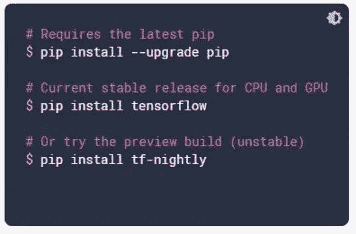
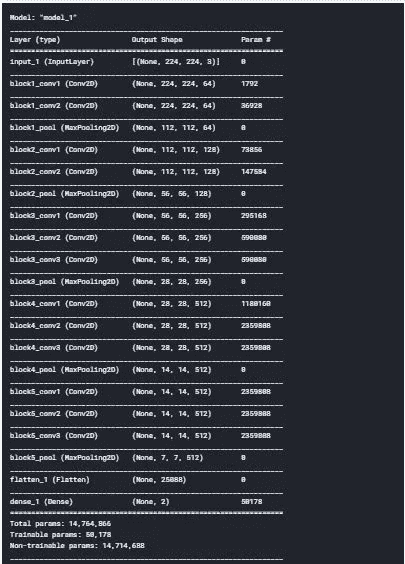
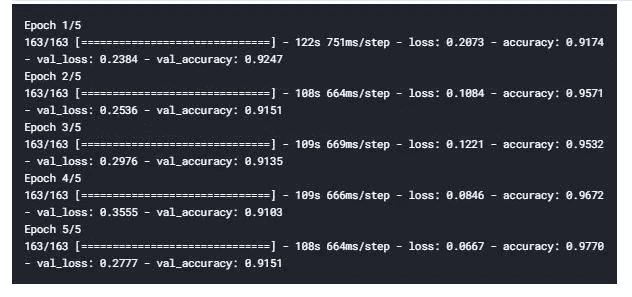

# 迁移学习简介

> 原文：<https://towardsdatascience.com/introduction-to-transfer-learning-c59f6f27e3e?source=collection_archive---------42----------------------->

## 从零开始学习迁移的综合指南

瑟奎拉在 [Unsplash](https://unsplash.com/s/photos/space?utm_source=unsplash&utm_medium=referral&utm_content=creditCopyText) 上拍摄的[照片](https://unsplash.com/@shotbycerqueira?utm_source=unsplash&utm_medium=referral&utm_content=creditCopyText)

# 介绍

我们人类有能力将在一项任务中获得的知识转移到另一项任务中，任务越简单，利用知识就越容易。一些简单的例子是:

*   懂数学统计→学机器学习
*   知道如何骑自行车→学习如何骑摩托车

到目前为止，大多数机器学习和深度学习算法都是为了解决特定的任务而设计的。如果任何分布发生变化，这些算法都要重新构建，并且很难重新构建和重新训练，因为这需要计算能力和大量时间。

迁移学习是关于如何使用一个预先训练好的网络，并将其应用到我们的定制任务中，将它从以前的任务中学到的东西进行迁移。

迁移学习是我们采用 VGG 16 和 ResNet 等架构的地方，这些架构是许多架构和大量超参数调整的结果，基于他们已经了解的内容，我们将这些知识应用于新的任务/模型，而不是从零开始，这称为迁移学习。

一些迁移学习模型包括:

*   例外
*   VGG16
*   VGG19
*   Resnet，ResnetV2
*   InceptionV3
*   MobileNet

## 利用迁移学习实现医学应用

在这个应用程序中，我们将检测这个人是否患有肺炎。我们使用 Kaggle 数据集进行分类。下面给出了数据集和代码的链接。

**数据集链接:**

 [## 胸部 x 光图像(肺炎)

### 5，863 张图片，2 个类别

www.kaggle.com](https://www.kaggle.com/paultimothymooney/chest-xray-pneumonia) 

**代码链接:**

 [## ajaymuktha/深度学习

### permalink dissolve GitHub 是超过 5000 万开发人员的家园，他们一起工作来托管和审查代码，管理…

github.com](https://github.com/ajaymuktha/DeepLearning/blob/master/TransferLearning/transfer-learning.ipynb) 

数据集由训练集和测试集组成，子文件夹为 normal 和 pneumonia。肺炎文件夹包含患有肺炎的人的胸部 x 光图像，而正常文件夹包含正常人的图像，即没有肺部疾病。

# 安装 Tensorflow

如果你的 PC 或笔记本电脑没有 GPU，你可以使用 Google Colab，或者使用 Jupyter Notebook。如果您使用您的系统，请升级 pip，然后安装 TensorFlow，如下所示

tensorflow.org

## 导入库

## 调整图像大小

在这里，我们将所有的图像调整到 224*224，因为我们使用 VGG16 模型，它接受 224*224 大小的图像。

## 训练和测试路径

我们将为培训指定培训和测试路径。

## 导入 VGG16

这里，我们将为我们的应用程序导入 VGG16 模型权重。我们应该为模型声明一个**图像大小**，我们已经在上一步中完成了，参数 3 表示图像将接受 RGB 图像，即彩色图像。为了训练我们的模型，我们使用 **imagenet** 权重和 **include_top = False** 意味着它将从模型中移除最后几层。

## 训练层

像 VGG16、VGG19、Resnet 和其他模型已经在成千上万的图像上被训练，并且这些权重用于分类成千上万的类，所以我们使用这些模型权重来分类我们的模型，所以我们不需要再次训练模型。

## 班级数量

我们使用 **glob** 来找出我们模型中的类的数量。train 文件夹中的子文件夹数量代表了模型中的类数量。

## 变平

无论我们从 VGG16 得到什么输出，我们都要将其展平，我们从 VGG16 中移除了最后的层，以便我们可以保留自己的输出层。我们用问题陈述中的类别数替换最后一层。我们认为 softmax 是我们的激活函数，我们把它附加到 x 上。

## 模型

我们将它包装成一个模型，其中输入指的是我们从 VGG16 获得的内容，输出指的是我们在上一步中创建的输出层。

模型摘要

上图是我们模型的总结，在密集层中，我们有两个节点，因为我们有两个不同的类别**肺炎**和**正常。**

[Justino Neto](https://unsplash.com/@justinoneto?utm_source=unsplash&utm_medium=referral&utm_content=creditCopyText) 在 [Unsplash](https://unsplash.com/s/photos/space?utm_source=unsplash&utm_medium=referral&utm_content=creditCopyText) 上拍摄的照片

## 编制

我们使用类别交叉熵作为损失，adam 优化器和准确性作为度量来编译我们的模型。如果你不知道这些术语的意思，我会在文章的最后提到我博客的链接，在那里我会清楚地解释所有这些术语。

## 预处理

我们将在训练图像上应用一些变换以避免过度拟合，如果我们不执行，我们将在训练集和测试集的准确性之间得到很大的差异。

我们执行一些几何变换，如水平翻转图像，垂直翻转，放大，缩小和许多其他可以执行的操作，我们应用它，这样我们的模型就不会过度学习我们的训练图像。我们使用 **ImageDataGenerator** 类执行上述方法。

我们不为测试集应用变换，因为我们只使用它们来评估，对我们的测试集做的唯一任务是重新缩放图像，因为在训练部分，我们定义了可以馈入网络的图像的目标大小。

**flow_from_directory** 将把图像增强过程连接到我们的训练集。我们需要提到我们的训练集的路径。**目标尺寸**是应该输入神经网络的图像尺寸。**批次大小**被定义为一个批次中图像的数量，**类别模式**是明确的，因为我们只有两个输出。

现在我们定义从目录中导入测试图像的测试集。我们定义的批量大小、目标大小和班级模式与训练集中提到的相同。

## 符合模型

我们将拟合我们的模型，并将时期的数量声明为 5，每个时期的步骤将是训练集的长度，验证步骤将是测试集的长度。

太棒了，我们达到了大约 97.7%的准确率和 91.5%的验证准确率，这就是迁移学习的力量。希望你喜欢这篇关于迁移学习的教程。如果你想知道人工神经网络和卷积神经网络如何与应用一起工作，请查看我下面的博客:

 [## 人工神经网络导论

### 你深度学习的第一步

towardsdatascience.com](/introduction-to-artificial-neural-networks-ac338f4154e5)  [## 用 Tensorflow 构建人工神经网络

### 如何使用 TensorFlow 构建神经网络的分步教程

towardsdatascience.com](/building-an-ann-with-tensorflow-ec9652a7ddd4)  [## 卷积神经网络简介

### 关于卷积神经网络如何工作的直觉

medium.com](https://medium.com/dataseries/introduction-to-convolutional-neural-networks-5a227f61dd50)  [## 使用张量流的图像分类器

### 如何创建图像分类器的分步指南

towardsdatascience.com](/image-classifier-using-tensorflow-a8506dc21d04)