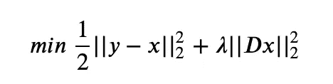
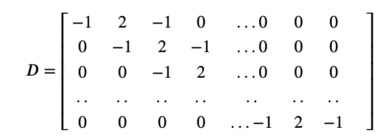
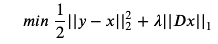
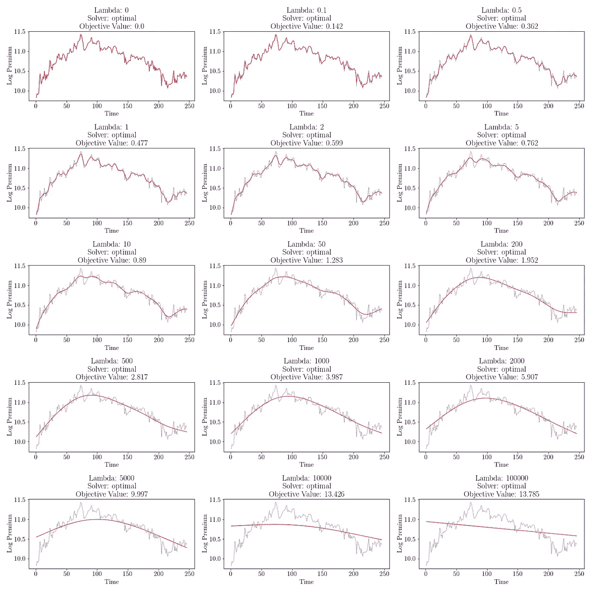
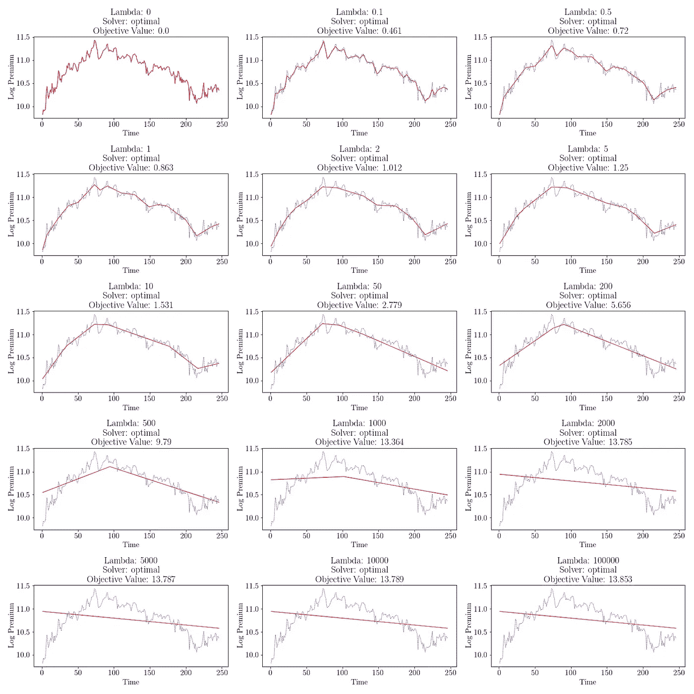

# Python 中趋势过滤及其应用简介

> 原文：<https://towardsdatascience.com/introduction-to-trend-filtering-with-applications-in-python-d69a58d23b2?source=collection_archive---------15----------------------->

## 从嘈杂的时间序列数据中揭示潜在趋势

# **内容**

1.  趋势过滤简介
2.  趋势滤波背后的最小化问题
    惠普之间的区别& L1 趋势滤波
3.  Python 中新加坡 COE 保费的应用趋势过滤

# **简介**

最近，我一直在做一个项目，涉及一些量化投资策略的时间序列建模。具体而言，该战略的一个关键组成部分涉及为不同的制度制定不同的投资方法。这种识别是有用的，因为当金融市场的基本动态发生变化时，在一种制度下行之有效的策略可能在另一种制度下也行不通。

举个简单的例子，众所周知，当市场陷入困境时，资产类别相关性往往会显著增加。因此，在资产配置中考虑协方差的模型将不得不相应地改变它们的假设，这必然会影响最优的投资组合配置。为了制定差异化战略，人们可以简单地识别金融市场中的两种不同机制:扩张和收缩。

为了使这种方法有用，[基于制度的投资策略](https://www.jpmorgan.com/jpmpdf/1158630464604.pdf)，尤其是中长期投资策略，需要解决两个问题:

1.  需要考虑哪些相关制度？
2.  我们如何根据这些制度划分不同的时间段？

一个简单而有效的制度分类是将一个时间序列分成上升期和下降期。事实上，*Mulvey&Han**(2016)*在他们的论文 [*识别经济体制:降低大学捐赠基金的下行风险&基金会*](https://jpm.pm-research.com/content/43/1/100) *中应用了这一方法。*通过进行蒙特卡罗模拟并在季度基础上确定“增长”和“收缩”制度，他们能够证明根据制度类型调整支出规则的改进的最优性，这主要通过对下行风险的积极和动态管理来实现。

然而，金融时间序列往往非常嘈杂，为了实现稳健的季度到季度制度识别，平滑是必要的。这就是趋势过滤的用武之地。

# **趋势过滤**

趋势过滤的目标是通过过滤掉“噪音”来平滑时间序列。趋势过滤算法面临两个目标之间的权衡。首先，它希望最小化实际序列和平滑序列之间的残留“噪声”。把这想象成算法想要尽可能真实地保持原始序列。第二，它希望最大化过滤序列的平滑度，这往往与第一个目标相矛盾。

在数学上，我们的目标是最小化以下目标函数:



H-P 滤波目标函数

y 是实际时间序列，而 x 是估计的滤波时间序列。损失函数的第一部分代表最小化实际序列和拟合序列之间残差平方和的目标。损失函数的第二部分表示对平滑度的要求。Dx 捕捉每组三个点之间的平滑度。



平滑度惩罚的三维矩阵

最后，𝜆是正则化参数。可以把它看作是在我们最小化残差和最大化平滑度这两个目标之间进行权衡。我们将在后面看到𝜆如何影响过滤趋势的例子。

到目前为止展示的模型描述了趋势过滤的 *Hodrick-Prescott (H-P)* 版本。或者，我们可以采用 [L1 趋势滤波](https://web.stanford.edu/~boyd/papers/pdf/l1_trend_filter.pdf)。关键的区别是平滑的惩罚，这是从 L2 改为 L1 规范。对于那些熟悉回归的人来说，这类似于正则化套索和岭回归之间的区别。像 H-P 滤波一样，L1 滤波也有助于平滑时间序列。结果的关键区别在于，L1 滤波产生了对潜在趋势的*分段线性*估计。当我们稍后看应用的例子时，这将变得清楚。

数学上，目标函数现在变成:



L1 滤波目标函数

正如 [L1 趋势过滤](https://web.stanford.edu/~boyd/papers/pdf/l1_trend_filter.pdf)的作者解释的那样:

> 估计趋势斜率的扭结、打结或变化可被解释为时间序列潜在动态的突变或事件。

*Mulvey & Han* 实际上应用了 L1 趋势滤波算法来平滑他们的财务时间序列，这可以说更适合于季度之间的体制识别和体制变化的情况。

# 一个应用实例:新加坡 COE 保险费

为了说明趋势过滤的实际作用，并理解 L1 趋势过滤和惠普趋势过滤之间的区别，让我们考虑一下新加坡 COE 保费的时间序列。我正在进行的一个项目是使用多变量 LSTMs 来了解新加坡 COE 保费的动态，因此我认为使用这个时间序列来提供趋势过滤的简单介绍会很有趣。

对于下面的例子，我把保费记录作为基本的时间序列。

**Python 实现**

```
import pandas as pd
import numpy as np
import cvxpy 
import scipy
import cvxopt 
import matplotlib.pyplot as plty = pd.read_csv('coe_premium.csv')
y = y['premium'].to_numpy()
y = np.log(y)n = y.size
ones_row = np.ones((1, n))
D = scipy.sparse.spdiags(np.vstack((ones_row, -2*ones_row, ones_row)), range(3), n-2, n)
```

*对于那些不熟悉 spdiags 的人，请参考文档* [*这里*](https://docs.scipy.org/doc/scipy/reference/generated/scipy.sparse.spdiags.html) *了解更多细节。*

在上面的代码中，我已经导入了底层的时间序列并转换为日志。然后，我定义了作为构建损失函数/目标函数的一部分的 D 矩阵。

如果您想要一份' *coe_premium.csv* '文件的副本来亲自尝试，请随时与我联系以获取副本，因为它实际上是我用于训练神经网络的公共数据的工程和插值版本。

我定义了一个𝜆列表进行实验，这样我们可以看到参数对估计的过滤趋势的影响。

```
lambda_list = 
[0, 0.1, 0.5, 1, 2, 5, 10, 50, 200, 500, 1000, 2000, 5000, 10000, 100000]
```

最后，我遍历𝜆的列表，首先估计过滤后的趋势，并并排绘制结果，以查看改变𝜆:的影响

```
solver = cvxpy.CVXOPT
reg_norm = 2fig, ax = plt.subplots(len(lambda_list)//3, 3, figsize=(20,20))
ax = ax.ravel()ii = 0for lambda_value in lambda_list: x = cvxpy.Variable(shape=n)    # x is the filtered trend that we initialize objective = cvxpy.Minimize(0.5 * cvxpy.sum_squares(y-x) 
                  + lambda_value * cvxpy.norm(D@x, reg_norm)) # Note: D@x is syntax for matrix multiplication problem = cvxpy.Problem(objective)
    problem.solve(solver=solver, verbose=False) ax[ii].plot(np.arange(1, n+1), y, , linewidth=1.0, c='b')
    ax[ii].plot(np.arange(1, n+1), np.array(x.value), 'b-', linewidth=1.0, c='r')
    ax[ii].set_xlabel('Time')
    ax[ii].set_ylabel('Log Premium')
    ax[ii].set_title('Lambda: {}\nSolver: {}\nObjective Value: {}'.format(lambda_value, prob.status, round(obj.value, 3))) ii+=1

plt.tight_layout()
plt.savefig('results/trend_filtering_L{}.png'.format(reg_norm))
plt.show()
```

就是这样！cvxpy 库为你做了大部分的优化工作，所以你所需要的只是这几行代码。

也就是说，选择正确的参数更像是一门艺术，而不是一门科学，这真的取决于你试图解决什么问题。因此，搜索不同的参数以了解模型输出如何相应地变化，并选择最适合您的项目目的的正则化通常很有用。

这些是**惠普趋势过滤**的可视化:



惠普趋势过滤结果

从上面的可视化中，我们可以看到，随着参数𝜆从 0 增加到 100，000，算法的优先级从很好地拟合原始时间序列转移到获得趋势的更平滑版本。当𝜆处于其最大值时，该算法主要集中在平滑序列上，它只是为整个序列估计一条直线(最平滑的)。另一方面，当𝜆 = 0 时，该算法完全忽略平滑，并给我们原始时间序列以最小化残差。

要获得上述过程的 L1 版本，我们只需更改以下内容:

```
solver = cvxpy.ECOS
reg_norm = 1
```

由于超出本文范围的原因，优化器(变量*解算器*)必须改变，因为不同的优化器处理不同类型的优化问题。

这些是 **L1 趋势过滤**的结果:



L1 趋势过滤结果

当我们比较 L1 趋势滤波和 H-P 趋势滤波的结果时，我们注意到三个关键结果。首先，就像在 H-P 趋势滤波中一样，增加𝜆增加了估计趋势的平滑度。第二，与 H-P 趋势滤波器不同，在估计的时间序列中有更明显的扭结，或突然更剧烈的变化。如前所述，这是因为我们改变了平滑的惩罚。这一结果背后的数学原理超出了本次讨论的范围，但对于感兴趣的人，可以在 [L1 趋势过滤](https://web.stanford.edu/~boyd/papers/pdf/l1_trend_filter.pdf)中找到。第三，我们注意到，当我们增加𝜆.值时，该算法比 H-P 趋势滤波更快地达到“直线”估计趋势

我希望这份关于趋势过滤的温和实用的介绍对那些对时间序列分析和预测感兴趣的人有用！