# 数据科学线性代数 Ep1 使用 Python 的向量和矩阵简介

> 原文：<https://towardsdatascience.com/introduction-to-vectors-and-matrices-using-python-for-data-science-e836e014eb12?source=collection_archive---------21----------------------->

## 数据科学线性代数的主要组成部分入门

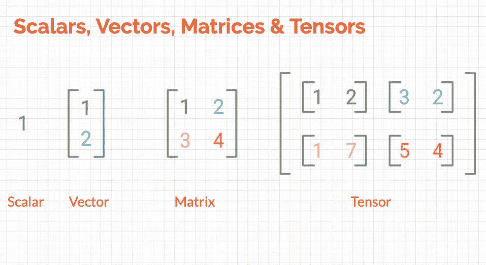

现在，我们已经为学习数据科学的数学奠定了[基础，是时候开始学习系列的第一个主题**线性代数了。这篇文章是线性代数系列的第一篇，在这篇文章中，我介绍了我们将来会用到的代数的基本组成部分。它短小精悍，重点突出。**](/practical-reasons-to-learn-mathematics-for-data-science-1f6caec161ea)

您也可以在此按部就班地关注我:

我们将在本帖中讨论的主题:

*   标量、向量、矩阵和张量的重要定义和符号。
*   **使用**[**NumPy**](/numpy-essentials-for-data-science-25dc39fae39)**创建矢量和矩阵。**
*   **转置一个矩阵(2D 阵列)并对它们进行编码。**
*   **使用 NumPy 在矩阵中加法和广播**

那么，让我们开始吧…

# 重要的定义和符号

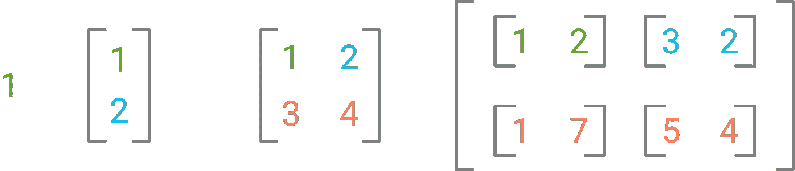

来自 L-R:标量、向量、矩阵和张量

**标量:**任何单个数值都是标量，如上图所示。它只是用小写和斜体表示。例如:`*n*`

**向量:**数字(数据)数组是一个向量。您可以假设数据集中的一列是一个特征向量。

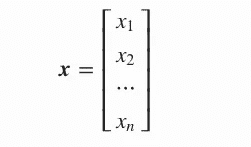

特征向量 **x**

向量通常用小写、斜体和粗体类型的变量(特征)名称来表示。比如:`***x***`

**矩阵:**矩阵是一个形状为 *(m×n)* 的二维数组，有 m 行 n 列。

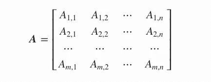

m 行 n 列的矩阵

每个元素都可以通过它的行和列到达，并用下标表示。例如，A₁,₁返回第一行第一列的元素。

矩阵用大写、斜体和粗体的变量名表示。比如:`***A***`

**张量:**一般来说，一个 n 维数组，其中 **n > 2** 称为张量。但是矩阵或向量也是有效的张量。

# 使用 NumPy 创建向量和矩阵

现在我们知道了它们是如何定义的，让我们看看我们将如何使用 NumPy 来查看我们的数学运算。如果你想知道为什么是 NumPy 或者你需要一个关于 NumPy 的复习，请查看下面的链接:

[](/numpy-essentials-for-data-science-25dc39fae39) [## 数据科学的数字基础

### 帮助您掌握正确的 Numpy 主题以开始数据科学的参考指南

towardsdatascience.com](/numpy-essentials-for-data-science-25dc39fae39) 

因为 vector 是一个数组，NumPy 有各种创建数组的方法。首先，安装 NumPy 并将其导入[您的工作区/环境:](/ideal-python-environment-setup-for-data-science-cdb03a447de8?source=---------9------------------)

```
import numpy as np
```

然后创建一个数组需要你从库中使用`array()`方法:

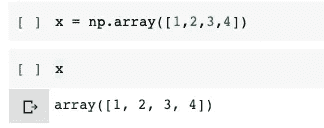

然后，您可以使用`shape`属性检查数组的形状:

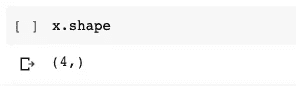

创建一个矩阵也很简单，你只需要将一个 [2D 列表](/python-fundamentals-for-data-science-6c7f9901e1c8?source=---------6------------------)传递给数组方法:

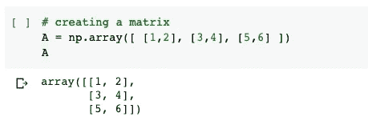

# **转置一个矩阵(2D 阵列)并对它们进行编码**

转置一个矩阵成为一个非常重要的话题，因为它进一步有助于计算矩阵的逆矩阵和其他数据操作，其中你想要镜像你的数据帧的轴。

转置矩阵会将行向量转换为列向量，反之亦然，这由上标 T 表示:

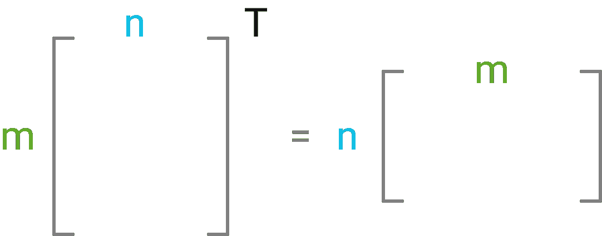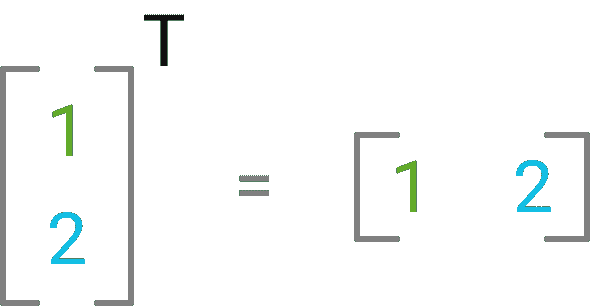

下面是一个正方形矩阵(行数和列数相同)在轴互换后的样子:

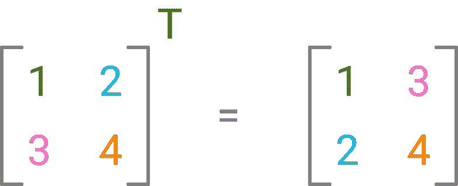

方阵转置

如果矩阵不是正方形，这是矩阵形状的变化:

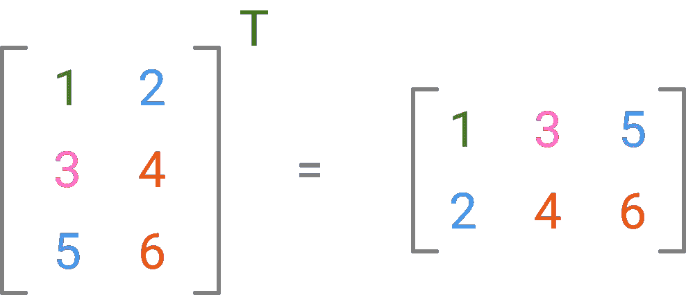

非方阵转置

## **换位的后续代码:**

有两种转置矩阵的方法，你可以使用 T 属性或者简单地使用转置方法:

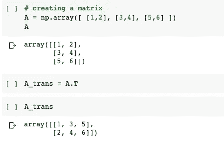

使用 T 属性

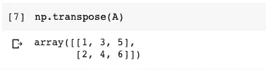

使用`transpose`方法

我们还可以检查矩阵(2D 阵列)的形状变化:

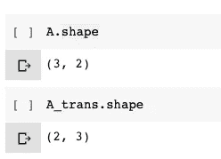

# **矩阵中的加法和广播**

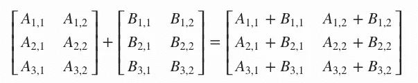

2 个矩阵的加法

加法只是您希望在众多操作中执行的另一个简单操作。

我们可以添加相同形状的矩阵:

***A + B = C***

矩阵 A 中的每个单元都与矩阵 B 中的相应元素相加，总和存储在结果矩阵 C 中的相应位置，如左图所示。

现在，你可能会问，如果我们必须将两个不同形状的矩阵相加，或者将一个标量添加到一个矩阵中，会怎么样？NumPy 已经用广播解决了这个问题:

## 广播

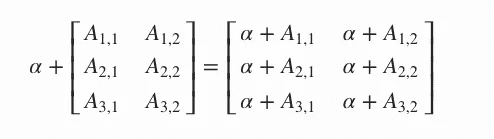

向矩阵添加标量

广播是一种通过将自身扩展到矩阵的所有元素来将标量或不同形状的向量添加到矩阵的技术。标量被添加到矩阵的每个元素中，这就是它被称为“广播”的原因。

假设我们有两个不同形状的矩阵，如下图所示:

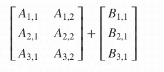

在这种情况下，矩阵 B(较小的矩阵)会自我扩展以匹配矩阵 A(较大的矩阵)的形状，如下所示:

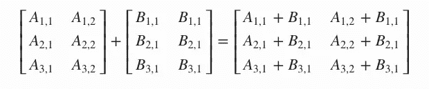

您可以使用这个 Google Colab 笔记本来检查其他组合并试验代码:

[](https://colab.research.google.com/drive/1-amF1d2wOoVxOXQRf5wKZ4yNfctyBF20?usp=sharing) [## 谷歌联合实验室

### 标量、向量、矩阵和张量介绍。

colab.research.google.com](https://colab.research.google.com/drive/1-amF1d2wOoVxOXQRf5wKZ4yNfctyBF20?usp=sharing) 

本系列的下一篇文章是关于矩阵和向量的乘法，将于下周初发表。在此之前，敬请关注 Harshit，继续学习**数据科学。**

# Harshit 的数据科学

通过这个渠道，我计划推出几个覆盖整个数据科学领域的[系列](/hitchhikers-guide-to-learning-data-science-2cc3d963b1a2?source=---------8------------------)。以下是你应该订阅[频道](https://www.youtube.com/channel/UCH-xwLTKQaABNs2QmGxK2bQ)的原因:

*   该系列将涵盖每个主题和子主题的所有必需/要求的高质量教程，如 [Python 数据科学基础](/python-fundamentals-for-data-science-6c7f9901e1c8?source=---------5------------------)。
*   解释了为什么我们在 ML 和深度学习中做这些事情的数学和推导。
*   与谷歌、微软、亚马逊等公司的数据科学家和工程师以及大数据驱动型公司的首席执行官的播客。
*   [项目和说明](/building-covid-19-analysis-dashboard-using-python-and-voila-ee091f65dcbb?source=---------2------------------)实施到目前为止所学的主题。

你可以在 [Twitter](https://twitter.com/tyagi_harshit24) 、 [LinkedIn](https://www.linkedin.com/in/tyagiharshit/) 或 [Instagram](https://www.instagram.com/upgradewithharshit/?hl=en) 上与我联系(在那里我谈论健康和福祉。)