# R 中的向量介绍

> 原文：<https://towardsdatascience.com/introduction-to-vectors-in-r-6ccae4748f2e?source=collection_archive---------48----------------------->

## 学习如何使用 R 中的向量来分析您的赌博结果。学习在 R 中创建向量，命名它们，从中选择元素，并比较不同的向量。


让我们去一趟*统计员天堂*，也就是众所周知的拉斯维加斯！

由于 R 和你的新数据分析技能，你将学会如何提升你在牌桌上的表现，并获得一些利润。完成本教程后，您将能够轻松跟踪您的下注进度，并分析您过去的行动。

# 创建一个向量

**Vectors** 是一维数组，可以存储数值数据、字符数据或逻辑数据。它们是存储数据的简单工具。例如，你可以把你每天的收益和损失储存在赌场里。

在 R 中，用组合函数`[**c()**](https://www.rdocumentation.org/packages/base/versions/3.6.2/topics/c)` 创建一个向量。你把向量元素用逗号分隔在括号之间。例如:

```
numeric_vector <- c(1, 2, 3)
character_vector <- c("a", "b", "c")
```

一旦你在 R 中创建了这些向量，你就可以用它们来做计算。

## 让你试试

创建一个包含三个元素的向量:`TRUE`、`FALSE`和`TRUE`(按此顺序)

## 解决办法

```
boolean_vector <- c(TRUE, FALSE, TRUE)
```

## 给你尝试(2)

在维加斯呆了一周，你还是没有赚大钱。所以，你决定开始使用你的新数据分析技能。

在开始分析之前，您决定收集上周的结果:

对于扑克:

*   周一你赢了 140 美元。
*   星期二你输了 50 美元。
*   星期三你赢了 20 美元。
*   周四你输了 120 美元。
*   星期五你赢了 240 美元。

对于轮盘赌:

*   周一你损失了 24 美元。
*   星期二你输了 50 美元。
*   星期三你赢了 100 美元。
*   周四你损失了 350 美元。
*   星期五你赢了 10 美元。

你只玩过扑克和轮盘赌。将赢/输分配给变量。

## 解决办法

```
# Poker winnings from Monday to Friday
poker_vector <- c(140, -50, 20, -120, 240)# Roulette winnings from Monday to Friday
roulette_vector <- c(-24, -50, 100, -350, 10)
```

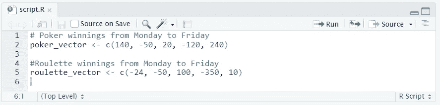

分配给向量的赢和输。

# 命名一个向量

作为一名数据分析师，对所使用的数据有一个清晰的认识是很重要的。因此，理解每个元素指的是什么是至关重要的。

在之前的练习中，我们用您这一周的奖金创建了一个向量。每个向量元素指的是一周中的某一天，但是很难区分哪个元素属于哪一天。

通过用`names()`函数给向量的元素命名来显示向量本身。这里有一个例子:

```
some_vector <- c("John Doe", "poker player"
```

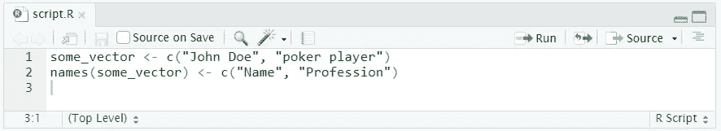

正在使用的 names()函数示例。

这段代码首先创建一个向量`some_vector`，然后给这两个元素命名。第一个元素被命名为`Name`，而第二个元素被标记为`Profession`。将内容打印到控制台会产生以下输出:

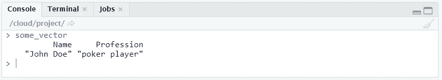

第一个元素被赋予名称 name，第二个被赋予职业。

## 让你试试

用一周中的每一天，说出上一个练习中你的扑克和轮盘向量的元素。

## 解决办法

```
# Poker winnings from Monday to Friday
poker_vector <- c(140, -50, 20, -120, 240)# Roulette winnings from Monday to Friday
roulette_vector <- c(-24, -50, 100, -350, 10)# Assign days as names of poker_vector
names(poker_vector) <- c("Monday", "Tuesday", "Wednesday", "Thursday", "Friday")# Assign days as names of roulette_vector
names(roulette_vector) <- c("Monday", "Tuesday", "Wednesday", "Thursday", "Friday")
```

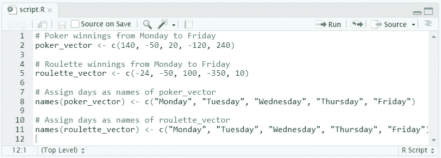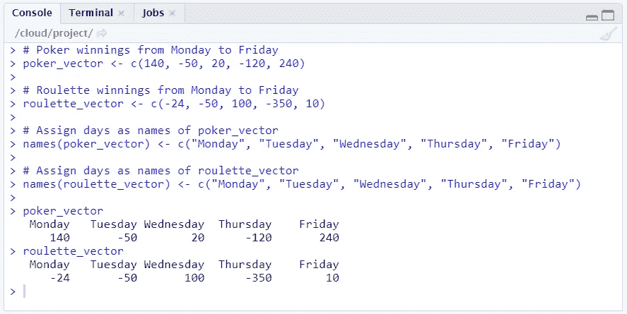

扑克和轮盘赌工作周每天的收益现在都贴上了标签。

## 给你尝试(2)

在前面的练习中，键入和重新键入信息(如一周中的每一天)可能会令人厌烦和沮丧。有一种更有效的方法可以做到这一点，即把一周中的日子向量分配给一个**变量**。

就像您处理扑克和轮盘赌收益一样，您也可以创建一个包含星期几的变量。这样，您可以使用和重复使用它。

创建一个包含一周中各天的向量。使用这个向量来设置你的扑克和轮盘向量的名称。您将获得与上一个练习相同的输出。

## 解决办法

```
# Poker winnings from Monday to Friday
poker_vector <- c(140, -50, 20, -120, 240)# Roulette winnings from Monday to Friday
roulette_vector <- c(-24, -50, 100, -350, 10)# The variable days_vector
days_vector <- c("Monday", "Tuesday", "Wednesday", "Thursday", "Friday")# Assign the names of the day to roulette_vector and poker_vector
names(poker_vector) <- days_vector
names(roulette_vector) <- days_vector
```

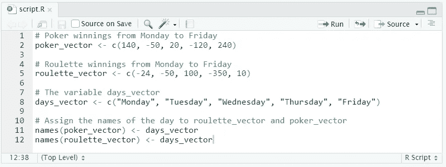

使用向量来指定一周中的日期是一种更有效的方法。

# 计算总奖金

现在您已经有了扑克和轮盘赌的收益名称，您可以开始一些数据分析了。

您希望了解以下类型的信息:

*   你一周内每天的总盈利或亏损是多少？
*   你这一周总共损失了多少钱？
*   你是在玩扑克还是轮盘赌赢钱/输钱？

为了得到答案，你必须对向量进行算术运算。

如果你对 R 中的两个向量求和，它取元素的和。例如，以下三个语句完全等效:

```
c(1, 2, 3) + c(4, 5, 6)
c(1 + 4, 2 + 5, 3 + 6)
c(5, 7, 9)
```

您也可以使用代表向量的变量进行计算:

```
a <- c(1, 2, 3) 
b <- c(4, 5, 6)
c <- a + b
```

## 让你试试

总日利润是每天在扑克上实现的利润/损失和每天在轮盘上实现的利润/损失的总和。

给一个变量分配你每天总共赢了/输了多少钱(扑克和轮盘)。

## 解决办法

```
# Poker winnings from Monday to Friday
poker_vector <- c(140, -50, 20, -120, 240)
roulette_vector <- c(-24, -50, 100, -350, 10)
days_vector <- c("Monday", "Tuesday", "Wednesday", "Thursday", "Friday")
names(poker_vector) <- days_vector
names(roulette_vector) <- days_vector# Assign to total_daily how much you won/lost on each day
total_daily <- poker_vector + roulette_vector# Print the total won/lost per day
total_daily
```

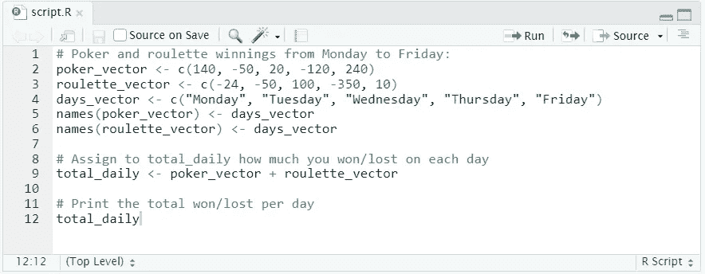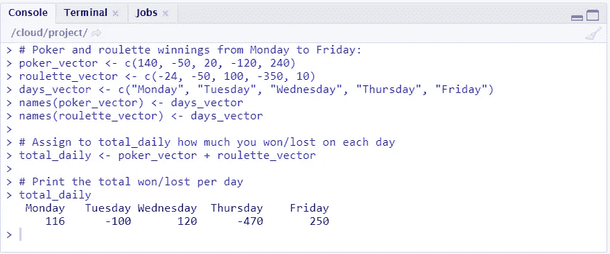

## 给你尝试(2)

基于之前的分析，看起来你有好有坏的日子。你这一周可能总共损失了多少钱？

要回答这个问题，使用函数`[**sum()**](https://www.rdocumentation.org/packages/base/versions/3.6.2/topics/sum)`。它计算一个向量的所有元素的和。例如，要计算您玩扑克输/赢的钱的总数:

```
total_poker <- sum(poker_vector)
```

计算你用轮盘赌赢/输的钱的总数。

在你有了轮盘和扑克的总数之后，计算一周所有的收益/损失的总和。

## 解决办法

```
# Poker winnings from Monday to Friday
poker_vector <- c(140, -50, 20, -120, 240)
roulette_vector <- c(-24, -50, 100, -350, 10)
days_vector <- c("Monday", "Tuesday", "Wednesday", "Thursday", "Friday")
names(poker_vector) <- days_vector
names(roulette_vector) <- days_vector# Total winnings with poker
total_poker <- sum(poker_vector)# Total winnings with roulette
total_roulette <- sum(roulette_vector)# Total winnings overall
total_week <- total_poker + total_roulette# Print out total_week
total_week
```

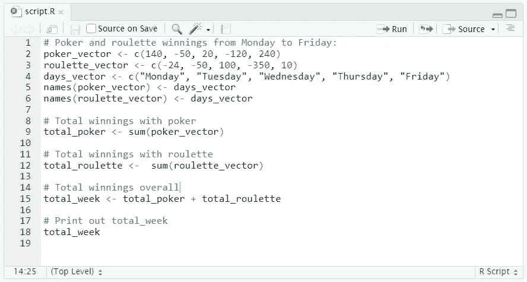

轮盘赌和扑克的总数是一周所有收益和损失的总和。

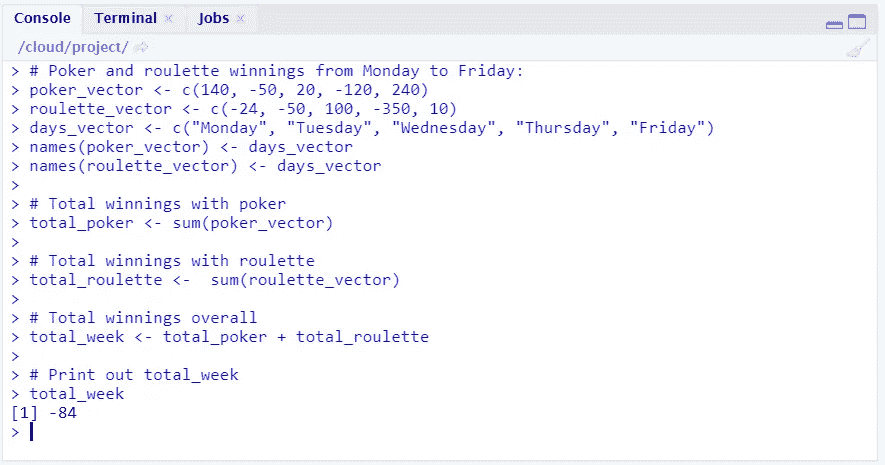

看起来你这个星期输了钱。

# 比较总奖金

看起来你在赔钱。你需要更深入的分析来调整你的策略。

有没有可能你在一个游戏里比另一个游戏里强？也许你在扑克中的总收益比在轮盘赌中的总收益高。

## 让你试试

像上一个练习一样计算扑克和轮盘赌的总收益。通过比较，检查您在扑克中的总收益是否高于轮盘赌。打印出比较的结果。

## 解决办法

```
# Poker winnings from Monday to Friday
poker_vector <- c(140, -50, 20, -120, 240)
roulette_vector <- c(-24, -50, 100, -350, 10)
days_vector <- c("Monday", "Tuesday", "Wednesday", "Thursday", "Friday")
names(poker_vector) <- days_vector
names(roulette_vector) <- days_vector# Calculate total gains for poker and roulette
total_poker <- sum(poker_vector)# Check if you realized higher total gains in poker than in roulette
total_poker > total_roulette
```

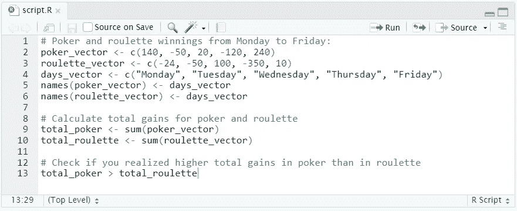

使用>运算符检查您从扑克中获得的总收益是否大于从轮盘中获得的总收益。

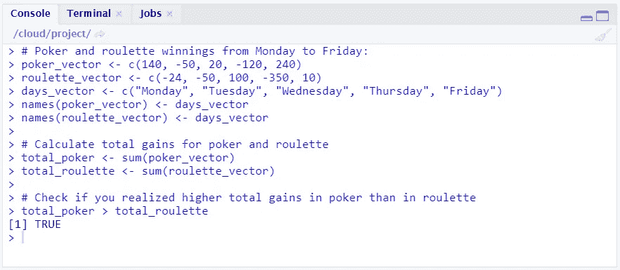

看起来你应该专注于扑克。

# 向量选择:好时光

看来你比轮盘赌更擅长玩扑克。

让我们调查一下你在工作周开始和结束时的表现。你确实在周末喝了几杯“假期”酒…

## 选择单个元素

为了研究这一点，您将只关注选择的`total_vector`。换句话说，我们的目标是选择向量的特定元素。要选择向量的元素，可以使用方括号(矩阵、数据框等也是如此)。在方括号之间，指示要选择的元素。例如，要选择向量的第一个元素，可以使用`poker_vector[1]`。要选择第二个元素，请使用`poker_vector[2]`，其余元素依此类推。请注意，第一个元素的索引是 1，而不是 0(与许多其他编程语言一样)。

## 选择范围(方法 1)

让我们来分析一下你周中的成绩。

要从向量中选择多个元素，请使用方括号中的向量来指示应该选择哪些元素。例如，要选择一周的第一天和第五天，请使用方括号中的向量`c(1,5)`。`poker_vector[c(1,5)]`会给出`poker_vector`的第一个和第五个元素。

## 选择范围(方法 2)

另一种方法是将选择向量定义为一个范围。也就是`c(2,3,4)`可以缩写成`2:4`。然后，我们可以使用`poker_vector[2:4]`来查找周中的结果。

## 选择范围(方法 3)

您也可以使用向量元素的名称(例如，星期一、星期二等)而不是它们的数字位置来选择元素。例如，`poker_vector["Monday"]`将选择名为`"Monday"`的元素。这是`poker_vector`的第一个元素，因为`"Monday"`是第一个元素的名称。

## 让你试试

将周三的扑克结果赋给一个变量。

## 解决办法

```
# Poker winnings from Monday to Friday
poker_vector <- c(140, -50, 20, -120, 240)
roulette_vector <- c(-24, -50, 100, -350, 10)
days_vector <- c("Monday", "Tuesday", "Wednesday", "Thursday", "Friday")
names(poker_vector) <- days_vector
names(roulette_vector) <- days_vector# Defined a new variable based on a selection
poker_wednesday <- poker_vector[3]
```

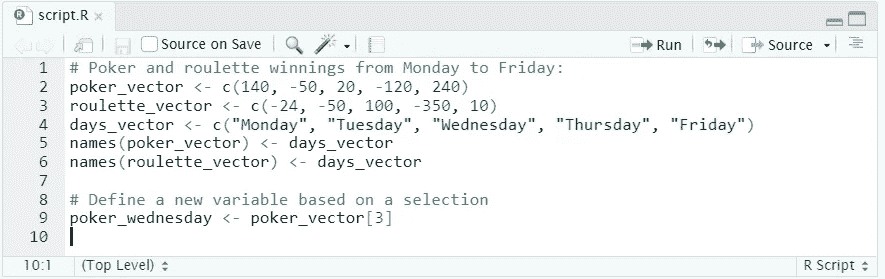

由于周三是工作周的第三天，我们将使用指数 3。

## 给你尝试(2)

将星期二、星期三和星期四的扑克结果赋给一个变量。

```
# Poker winnings from Monday to Friday
poker_vector <- c(140, -50, 20, -120, 240)
roulette_vector <- c(-24, -50, 100, -350, 10)
days_vector <- c("Monday", "Tuesday", "Wednesday", "Thursday", "Friday")
names(poker_vector) <- days_vector
names(roulette_vector) <- days_vector# Define a new variable based on a selection (Method 1)
poker_midweek <- poker_vector[c(2,3,4)]# Method 2 - abbreviating the vector range
poker_midweek <- poker_vector[2:4]# Method 3 - using the names of the elements
poker_midweek <- poker_vector[c("Tuesday", "Wednesday", "Thursday")]
```

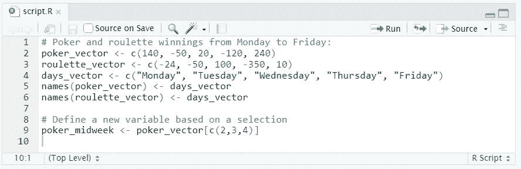

#星期二、星期三和星期四对应于指数 2、3 和 4。

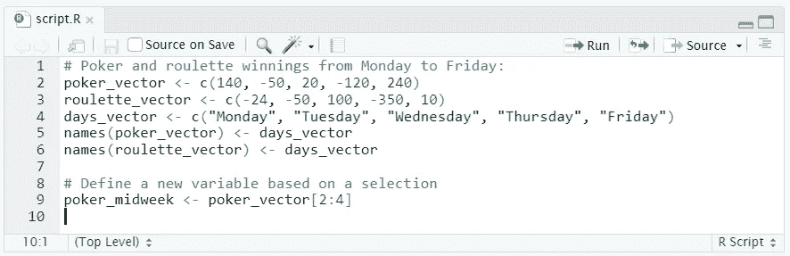

我们本可以使用 2:4，而不是 c(2，3，4)。向量 2:4 放在方括号中，以选择元素 2 到 4。

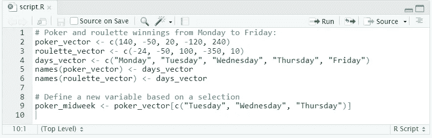

可以使用元素名称代替数字来选择元素。

# 通过比较选择—步骤 1

R 已知的(逻辑)比较运算符有:

*   `<`不到
*   `>`对于大于
*   `<=`小于或等于
*   `>=`对于大于或等于
*   `==`为彼此平等
*   `!=`因彼此不相等

我们可以在向量上使用这些比较运算符。举个例子，

```
> c(4, 5, 6) > 5
[1] FALSE FALSE TRUE
```

如果比较运算符规定的条件是`TRUE`或`FALSE`，该命令测试向量的每个元素。在示例中，这将检查向量的每个元素是否都大于 5。

## 让你试试

检查扑克向量中的哪些元素是正的(即> 0)。

## 解决办法

```
# Poker winnings from Monday to Friday
poker_vector <- c(140, -50, 20, -120, 240)
roulette_vector <- c(-24, -50, 100, -350, 10)
days_vector <- c("Monday", "Tuesday", "Wednesday", "Thursday", "Friday")
names(poker_vector) <- days_vector
names(roulette_vector) <- days_vector# Which days did you make money on poker?
selection_vector <- poker_vector > 0# Print out selection_vector
selection_vector
```

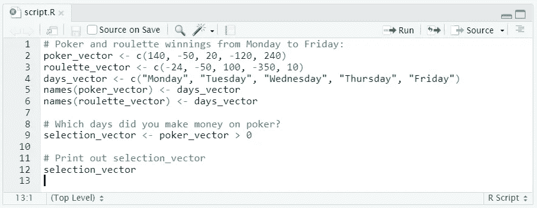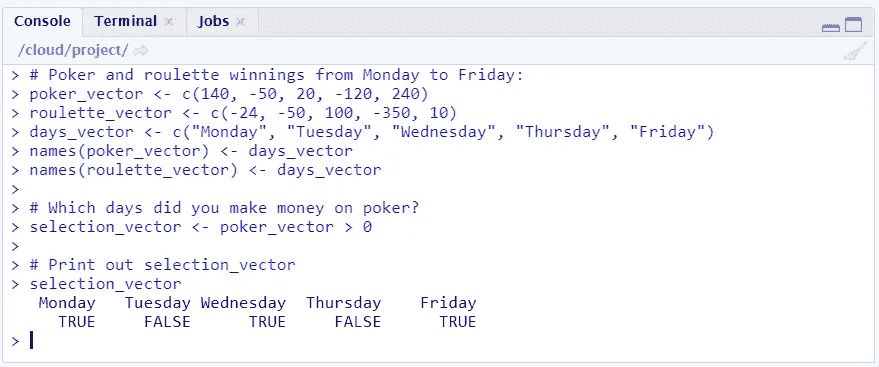

我们得到一个逻辑向量，告诉我们在工作周中什么时候在扑克上赚了钱(标记为 TRUE)。

# 比较选择—第二部分

使用比较将使您的数据分析更容易。你可以简单地要求 R 只返回那些你在扑克中实现正回报的日子，而不是选择一部分日子来调查你自己(像以前一样，你在星期二、星期三和星期四之间选择)。

使用`selection_vector <- poker_vector > 0`，你可以找到你有正扑克回报的日子。假设你不仅想知道你赢的那几天，还想知道你在那几天赢了多少。

您可以通过将`selection_vector`放在`poker_vector`后面的方括号中来选择所需的元素:

```
poker_vector[selection_vector]
```

当您传递一个方括号中的逻辑向量时，r 知道该怎么做:它只会选择与`selection_vector`中的`TRUE`相对应的元素。

## 让你试试

将您在有利可图的扑克日赢得的金额分配给一个变量。

## 解决办法

```
# Poker winnings from Monday to Friday
poker_vector <- c(140, -50, 20, -120, 240)
roulette_vector <- c(-24, -50, 100, -350, 10)
days_vector <- c("Monday", "Tuesday", "Wednesday", "Thursday", "Friday")
names(poker_vector) <- days_vector
names(roulette_vector) <- days_vector# Which days did you make money on poker?
selection_vector <- poker_vector > 0# Select from poker_vector these days
poker_winning_days <- poker_vector[selection_vector]
```

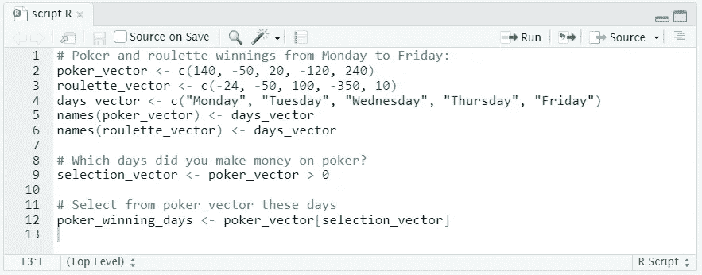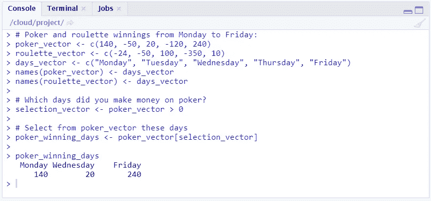

我们得到一个向量，其中只有我们的获胜日及其相应的扑克收益。

## 给你尝试(2)

就像你玩扑克一样，确定哪一天你在轮盘赌上实现了正回报。创建一个变量，包含轮盘赌的正奖金。

## 解决办法

```
# Poker winnings from Monday to Friday
poker_vector <- c(140, -50, 20, -120, 240)
roulette_vector <- c(-24, -50, 100, -350, 10)
days_vector <- c("Monday", "Tuesday", "Wednesday", "Thursday", "Friday")
names(poker_vector) <- days_vector
names(roulette_vector) <- days_vector# Which days did you make money on roulette?
selection_vector <- roulette_vector > 0# Select from poker_vector these days
roulette_winning_days <- roulette_vector[selection_vector]
```

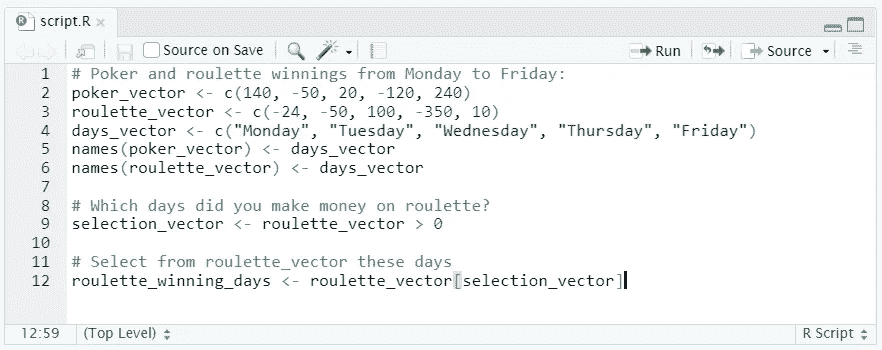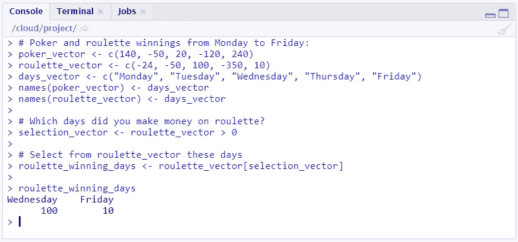

轮盘赌只有周三和周五有正收益。

# 笔记

所有图片，除非特别注明，均归作者所有。横幅图像是使用 [Canva](https://www.canva.com/) 创建的。