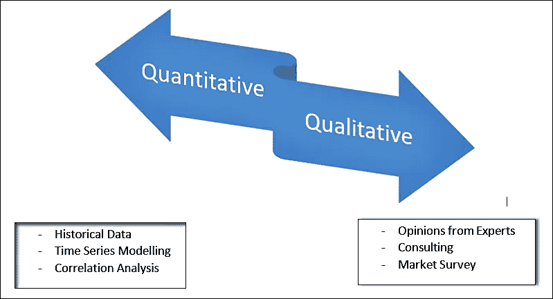

# 商业预测入门指南

> 原文：<https://towardsdatascience.com/introductory-guide-to-business-forecasting-bc84dc55968e?source=collection_archive---------48----------------------->

## 理解如何在商业分析中解释预测。

[M. B. M.](https://unsplash.com/@m_b_m?utm_source=medium&utm_medium=referral) 在 [Unsplash](https://unsplash.com?utm_source=medium&utm_medium=referral) 上拍摄的照片

**预测**不仅仅是应用时间序列模型和进行预测，也是评估业绩和做出更好商业决策的手段。在这篇博客中，我们不是关注预测背后的数学，而是关注在商业分析领域中预测是如何被解释的，以及与之相关的不同方法。从定义开始，商业预测是一种根据过去和现在的数据预测或估计未来的方法。现在，这些数据可以

*   历史数据，例如，优步的股票价格或沃尔玛的销售数据。
*   O 来自在该领域拥有专业知识的专家的意见，可能有助于评估未来事件并确定趋势。
*   **K** 例如，亚马逊根据地区跟踪促销活动，以提高销售额，并提出更好的定价策略。

## 为什么预测？

在零售分析领域，这将有助于确定我们需要更多库存商品的月份或周数。例如，与一年中的其他时间相比，在新年期间，大多数零售商店都有更多的库存商品。

在人力资源分析领域，预测将用于确定雇用更多员工的周期，以便项目得到利用。

在生产行业，它将帮助我们了解何时推出新产品或服务，以及围绕它的预期成本和利润，从而帮助利益相关者预先制定战略规划。

## 预测方法

业务分析师使用两种常规方法进行预测，它们是:

*   定量方法
*   定性方法

基本预测方法

**定量**方法与历史数据(若干年的数据)以及与之相关的事实相关联。例如，NSE 股票的股价。这些方法看的是**趋势**，有助于回答股票是向上走还是向下走。人口、科技文化、天气的变化都被考虑在内，以便对未来做出更好的预测。现在有一些使用定量预测的经验法则，那就是:

1.  需要至少两个季节的数据(需要 2017 年 1 月至 2019 年 12 月的数据来更好地预测 2010 年 1 月)。
2.  预测窗口应与数据窗口相同(月预测模型不能用于预测周或日预测)。

定量分析下常用的方法有

*   **天真方法**:假设下期需求与本期保持不变。例如，如果某款鞋六月份的销售额是 10 美元，那么七月份的销售额至少是 10 美元。这种方法通常用于创建一个**基线模型**，为未来提供一个良好的起点。
*   **移动平均法:**它提供一段时间内的数据印象，在数据非常少(仅 6 -9 个月的数据)时使用。在这种方法中，我们创建了一个 x 周期的窗口，并取其中值的平均值，这给出了未来的估计值。例如，如果 1 月至 3 月的销售数据为$10-$20-$30，那么考虑 3 个月的时间窗，Apr 的估计值将为(10+20+30/3) = $20，而 5 月的估计值将为(20+30+20/3 ) = $23。
*   **指数平滑:**它使用加权移动平均法，并将季节性作为一个因素来考虑。它更稳健，在有大量数据的情况下使用。例如，特定地区的服装材料需求预测取决于季节及其持续时间的年度变化。

**定性方法**不需要数学，但这是一种最需要咨询和意见的方法。以下是一些简单的方法:

*   **执行意见:**在这种方法中，业务分析师与公司首席执行官、人力资源主管、销售&营销等主要利益相关者坐在一起。简单地听取他们对未来会发生什么的看法。这将有助于战略性地规划未来的路线图，识别风险并计划减轻风险。
*   **德尔菲法:**在这种方法中，选择一组可能在不同公司工作的专家，他们的反馈以调查、访谈或电话讨论的形式进行。这将为他们如何看待未来提供一个共识。这些人的反馈将有助于创建更好的预测。
*   **Salesforce composite 和市场调查:** Salesforce composite 只不过是来自销售人员的估计。由于这些人在市场中有直接的可见性，从他们那里获取反馈将有助于提出更好的预测和库存管理。同样，消费者通过市场调查获得的反馈将有助于评估产品的受欢迎程度或关注领域。这将有助于对现有产品的修改进行战略规划或推出升级版本。

## 时间范围(预测间隔)

根据预测区间，预测可分为三大类

1.  **短期:**这种预测具有以周(2-3)为单位的预测窗口，用于业务频繁变化的情况。例如，超市倾向于每周或每两周管理一次库存，这样产品就不会库存过多或不足。
2.  **中期:**这种预测中的预测窗口通常从一个季度到一年不等，用于需要销售计划或预算的情况。
3.  **长期:**任何一种预测间隔超过一年的预测都被称为长期预测。它用于通过在市场中引入新服务或新设施来战略性地转变组织。例如，特斯拉模型车的下一个版本是一年前在生产或营销发生之前设计的。

## 结束注释

我们已经看到了定量和定性预测以及它们在商业分析中的应用，但是没有一种标准化的技术可以适用于所有情况。每个组织都选择不同的方式进行预测。此外，预测的时间范围也会影响它，时间越短，预测可能越准确。例如，迪士尼乐园通过从游客那里获取关于他们的体验和期望的反馈来进行每日预测，他们使用这些反馈来制定策略，并根据天数(如工作日或周末)提出新的主题，以使未来的游客满意。

以下是一些关于商业预测的参考视频: