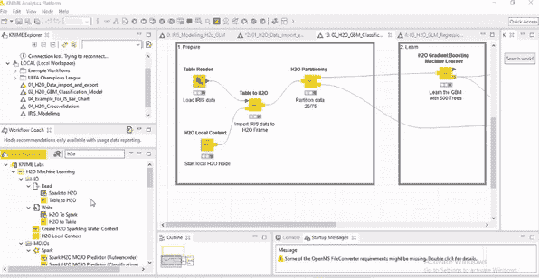
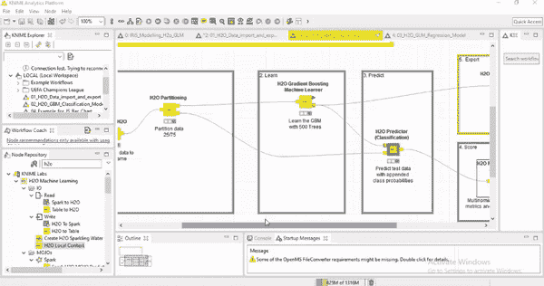

# KNIME 和 H2O 集成入门指南

> 原文：<https://towardsdatascience.com/introductory-guide-to-knime-and-h2o-integration-cb76c993946f?source=collection_archive---------47----------------------->

使用引导分析解决业务问题。

斯蒂芬·道森在 [Unsplash](https://unsplash.com?utm_source=medium&utm_medium=referral) 上拍摄的照片

**KNIME** 分析平台正在被数据分析和工程团队广泛采用。通过使用**节点**的简单拖放功能，工作流被创建，这形成了自动化的基础。由于易于访问并且是开源的，它在那些不属于编码背景的人中间变得越来越流行，并且仍然可以在 KNIME 的帮助下自动完成任务。

它支持数据范围的功能，如数据争论、数据可视化和借助**扩展**的跨平台集成，这意味着如果需要，我们可以将其他语言(Java、R、Python)编写的脚本注入工作流。其中一个方面就是集成 **H2O 的功能。**

# 什么是 H2O？

**H2O** 是一个机器学习平台，支持*线性可伸缩性*、*内存处理*，帮助支持海量数据集构建可伸缩的 ML 模型。凭借预测分析能力和精通的 ML 算法(如 **XGBOOST** 、 **DeepLearning** 和 **AutoML、**)的支持，它越来越多地被数据科学界采用。凭借对 **R** 、 **Python** 以及现在 **KNIME、**的支持，它扩大了自己的知名度。

# **入门**

**H2O 框架**隶属于 KNIME 实验室**扩展**。它支持广泛的功能，从转换数据到本地环境，操作操作，预测建模，统计和输出结果模型。

探索 H2o 扩展

> L ets 借助它在 IRIS 数据集上构建基于 GBM 的分类器模型，从而理解了这种集成。

## 步骤 1:创建 H2O 上下文

T 他 **H2O 上下文**的作用就像实例化器允许我们在本地运行的 **H2O 实例**中创建对象。在它的帮助下，数据表可以转换为 H2O 框架*(H2O 环境中的表)*旨在实现基于 H2O 的 ML 模型。

**注意:**如果在本地运行，H2O 将与 KNIME 分析平台共享计算资源。

## 步骤 2:导入数据

为了利用高速算法，第一步总是将数据导入到“ **H2O 帧”**中的 **H2O 实例**。

这是由“ **H2O 表到帧**节点完成的。

该节点期望一个数据输入以及一个 **H2O 上下文**，它只不过是“ **H2O 本地上下文**”节点。同样，反过来也可以使用“ **H2O 框架到表**”来完成，这样就可以将数据流连接到常规的 KNIME 节点。

数据准备

## 步骤 3:构建模型

一旦数据准备完成，我们就可以利用基于问题域的最大似然函数。H2O 支持以下算法:

*   **广义线性模型(GLM)**
*   **梯度增压机(GBM)**
*   **朴素贝叶斯，**
*   **随机森林，**
*   **主成分分析 PCA 和**
*   **K-均值聚类**

为了简单起见，让我们考虑**分类**问题，其中我们需要根据其萼片和花瓣特征来识别鸢尾花的种类。

为了建立模型，我们将数据分成两部分—在 ***H2O 划分节点*的帮助下训练和测试 **(75:25)** 。**同样，我们可以在其配置中指定分区比例和采样类型。

数据划分

数据的训练部分被馈送到 **GBM 学习器节点。**我们可以对其进行配置，以改变算法参数，如*树深度*、*要构建的模型数量*、*学习率*以及*特征包含和排除*。

模型结构

运行 GBM 模型，并将得到的模型参数馈送到 ***H2O 预测节点*。**该节点获取测试数据并产生结果。它也可以被配置成产生单独的类别概率。

模型预测法

## 步骤 4:解释结果

仅仅知道得到的类概率是不够的，借助 ***计分器节点*** *混淆矩阵*和*准确度统计*也可以得到

结果生成

## **第五步:保存模型**

模型结果可以保存为 [*MOJO 对象*](http://docs.h2o.ai/h2o/latest-stable/h2o-docs/productionizing.html#about-pojo-mojo) ，然后可以用于部署。

# 结束注释

由此我们看到，在 KNIME 中为分类模型开发工作流是多么容易。我花了不到 3 - 4 分钟就完成了。

看看他们在这里提供的完整教程系列

## [KNIME _ H2O _ 机器 _ 学习](https://hub.knime.com/knime/spaces/Examples/latest/04_Analytics/15_H2O_Machine_Learning/)

我创建的虹膜分类工作流程可以在这里找到:

[克尼姆 _ H2O _ 分类](https://github.com/Gaurav9112/KNIME-Workflow-Examples/tree/master/H2o_KINIME_Integration/GBM%20Classification)