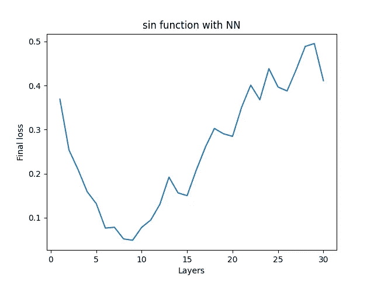
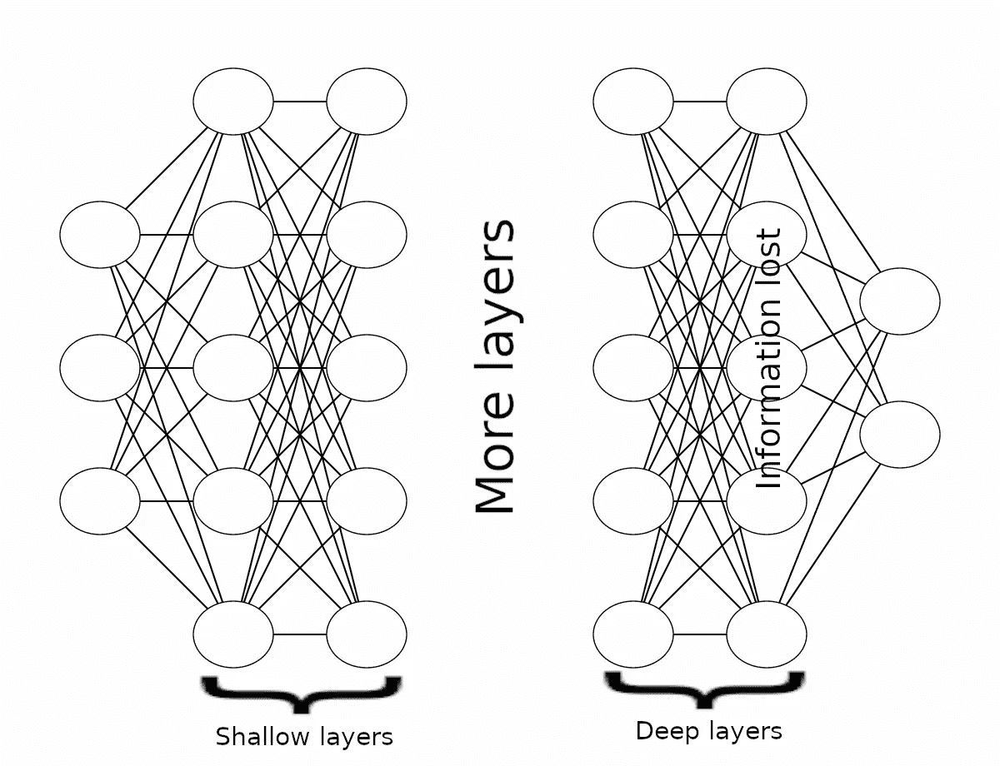
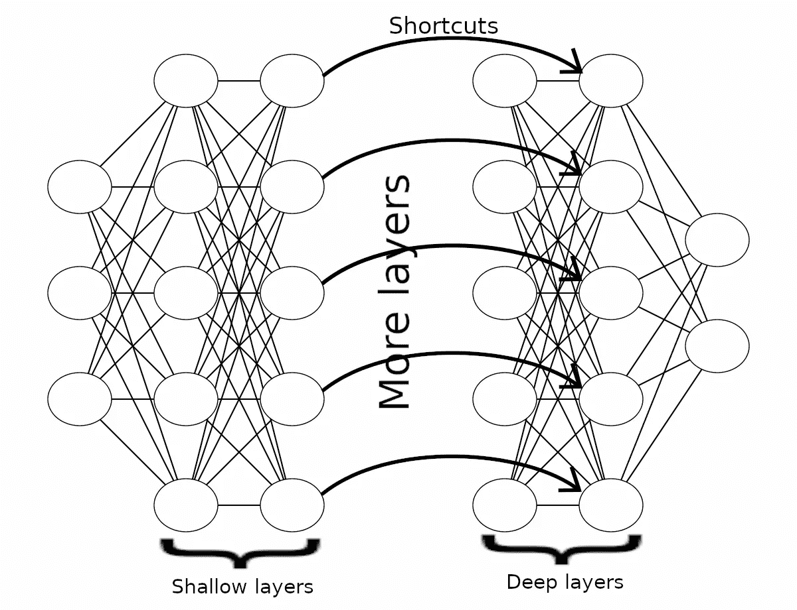
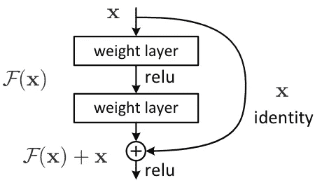
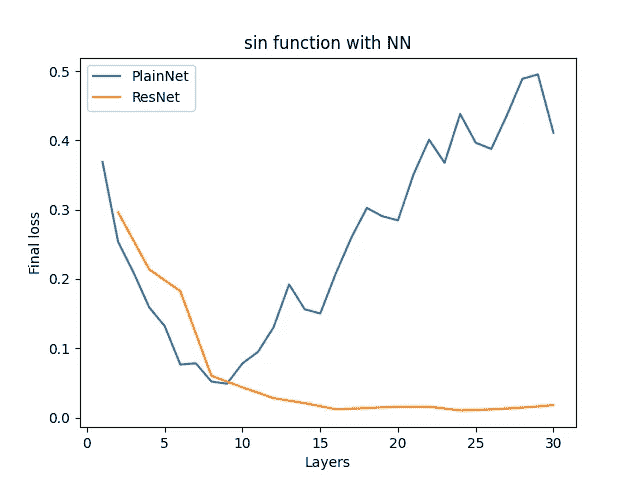
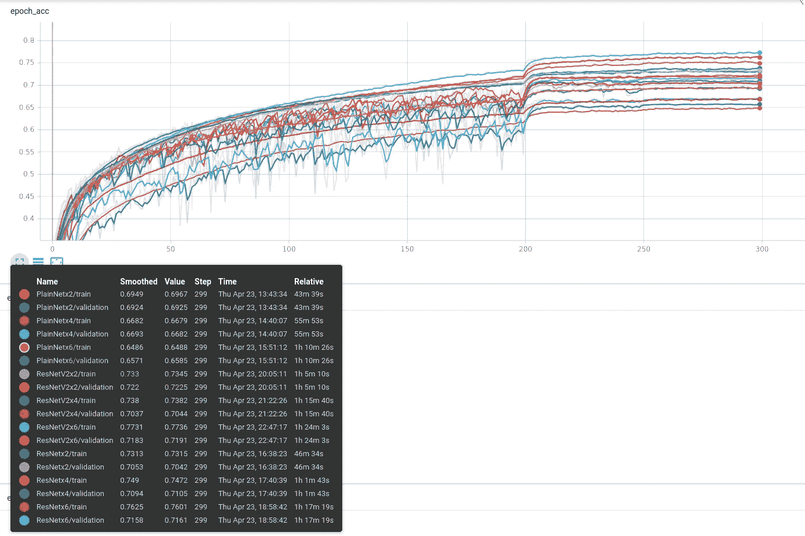
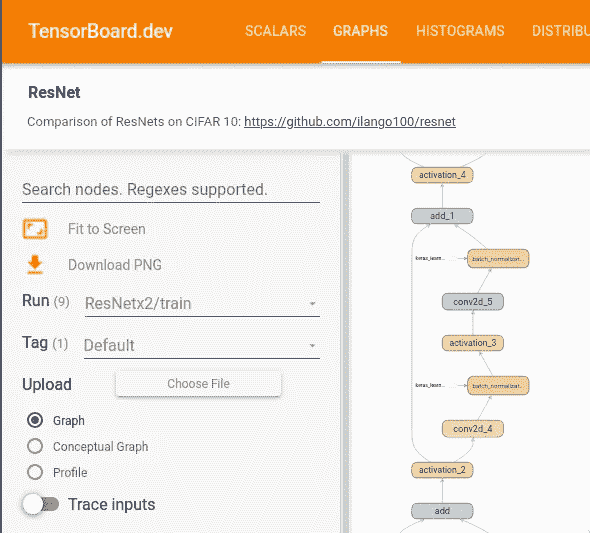
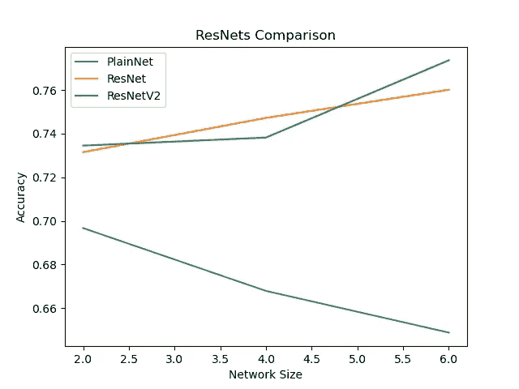

# 残差神经网络背后的直觉

> 原文：<https://towardsdatascience.com/intuition-behind-residual-neural-networks-fa5d2996b2c7?source=collection_archive---------8----------------------->

## 了解剩余网络是如何工作的，以及它们是如何自然产生的

越深越好？(里卡多·佩拉蒂在 [Unsplash](https://unsplash.com?utm_source=medium&utm_medium=referral) 上拍摄)

深度神经网络——因为层数多而“深”，已经在许多机器学习任务中走了很长的路。但是有多深呢？再来看图像分类的流行案例: [AlexNet](https://en.wikipedia.org/wiki/AlexNet) 普及堆叠 CNN 图层。它由 5 个回旋层组成。很快，人们相信叠加更多的卷积层会带来更好的精度。 [Inception](https://arxiv.org/abs/1409.4842) 是首批通过使用非常深入的架构来展示更好性能的架构之一。它使用了 22 个卷积层。现在，为了获得更高的精度，我们能到达的最深处是什么？

让我们建立一个玩具数据集，并在其上用具有越来越多完全连接层的神经网络进行训练:

这创建了“sin 函数”数据集，创建了具有 1 到 30 个隐藏层的神经网络，在数据集上训练它们。人们可能会认为损耗值应该是递减的，然后在某一点饱和并保持不变。但是结果是不同的:

神经网络损耗随层数增加？

什么？！最初，当具有 1 个隐藏层时，我们具有高损耗，其中增加层数实际上减少了损耗，但是当超过 9 层时，损耗增加。这里我们是为 ***历元=20*t*** 进行训练，意思是更大的模型需要更多的训练历元。我们在 9 层获得最低损耗，但在此之上，损耗会增加。这里需要注意的重要一点是**没有过度配合**，因为这只是我们考虑的训练损失。这是否意味着层数越多，性能越差？

# 为什么会这样？

让我们试着直观地理解这个问题。如果一个“浅层”模型能够达到一定的精度，那么它们更深层的对应模型至少应该具有相同的精度。但是，当模型变得更深时，各层传播来自浅层的信息变得越来越困难，并且信息丢失。这被称为**退化问题**。

[ResNet 论文](https://arxiv.org/abs/1512.03385)关于这个问题的研究:

> 当更深的网络能够开始收敛时，退化问题就暴露出来了:随着网络深度的增加，精度达到饱和(这可能不足为奇)，然后迅速退化。

为了解决这个问题，较深的层必须直接传播来自较浅的层的信息，即身份映射。

随着更多的层被添加到网络中，从浅层传播信息变得更加困难。

在我们的例子中，9 层模型是性能最好的。在具有 30 层的模型中，也存在相同的 9 层，如果另外的 21 层传播与第 9 层相同的结果，则整个模型将具有相同的损耗。所以现在这个问题简化为让那些层学习“恒等函数”， *f(x) = x* 。

# 用“捷径”解决问题

我们能改变我们的网络来避免这种信息丢失吗？一个直观的解决方法是把浅层和深层直接连接起来，这样信息直接传递到深层，像 identity 函数一样。

救援的捷径！

这里我们绕过中间层，将浅层连接到深层。在我们的例子中，我们可以将第 9 层神经元直接连接到第 30 层，然后深度模型将与浅层模型一样运行。这样，信息直接作为标识函数传递。这是残留网络背后的直觉。

通过“捷径”或“跳过连接”，我们的意思是一个神经元的结果被直接添加到深层的相应神经元。当添加时，中间层将学习它们的权重为零，从而形成恒等函数。现在，让我们正式看看剩余学习。

# 剩余学习

设 *g(x)* 为各层学习的函数。让我们考虑 *h(x) = g(x)+x* ，具有跳跃连接的层。这里 *+x* 术语表示跳过连接。

在 *h(x)=g(x)+x* 中，+x 项将带来原始值，层 g(x)只需学习**值**的变化，或**余数**或δx。无论在 *g(x)* 中学习什么，都只是余数，正或负，以将 x 修改为所需值。因此得名“剩余学习”。

要使 *h(x)* 成为恒等函数，余数 *g(x)* 就必须成为零函数，这是**非常容易学的**，即把所有的权重都设置为零。然后 *h(x) = 0+x = x* ，这就是所需的恒等函数。这将有助于克服退化问题。

在没有跳跃连接的情况下，必须修改权重和偏差值，以使其对应于单位函数。从头开始学习恒等函数非常困难，层中的非线性加剧了这种困难，并导致退化问题。

> 利用剩余学习重新公式化，如果恒等式映射是最优的，则求解器可以简单地将多个非线性层的权重驱向零，以逼近恒等式映射。

# 残差神经网络

让我们看看残差神经网络或“ResNets”的构建块，即残差块。

剩余块[1]

这里，跳过连接有助于将标识功能带到更深的层。在残块中，有人可能会注意到两点:

1.  为什么在添加跳过连接后应用 relu？
2.  为什么一个残块有两个重量层？

对于 1，如果我们在加法之前执行了 relu，那么所有的余数都是正的或零。仅学习到该标识的正增量，这显著降低了学习能力。例如在 sin 函数中，sin(3 *π* /2) = -1，这将需要负余数。类似地，使用 sigmoid 也将是不利的，因为它仅产生 0 到 1 内的残基。理想情况下，我们希望来自权重层(跨越任何数值范围)的**无约束响应被添加到跳过层，然后应用激活以提供非线性。这有助于模型学习任何函数。**

对于 2，如果我们使用单个权重层，则在 relu 之前添加跳过连接，得到 F(x) = Wx+x，这是简单的线性函数。这相当于只有一个权重层，添加跳过连接没有意义。所以我们需要**在增加跳跃连接**之前至少有一个非线性，这是通过使用两层来实现的。

正如我们在上一节中看到的，这些块中的权重层正在学习残差。这些模块可以堆叠得越来越多，但性能不会下降。

# 履行

足够的理论，让我们看看我们如何实现剩余块:

这是残差块的简单实现。我们可以多次调用这个函数来堆叠越来越多的块。在这里，我们可以在图像的情况下用卷积层代替密集层。此残差块的一个约束条件是，图层输出必须与输入具有相同的形状，但有解决方法。

让我们用实验来验证这些结果是否如我们描述的那样工作。我们逐步构建更深层次的模型，并在 sin 函数数据集上对其进行训练，类似于上面的示例，这次使用的是残差块。结果是:

ResNets 没有降级问题！

上面的图表清楚地验证了这个结果的全部意义！我们看到，当我们增加层数时，ResNet 的性能并没有下降。其实是在进步，更好！在 sin 函数数据集上训练平原网和结果网的代码在下面的 github 报告中:

 [## ilango100/resnet

### 此储存库包含残差神经网络的 tensorflow 实现。作为比较，三个网络…

github.com](https://github.com/ilango100/resnet) 

ResNet 的这一特性有助于训练非常深入的模型，产生了几个流行的神经网络，即 ResNet-50、ResNet-101 等。我们能更深入吗？瞧着吧， [ResNet-1001](https://github.com/KaimingHe/resnet-1k-layers) ！

# CIFAR-10 的结果

研究玩具数据集有助于理解 ResNet。现在，是一些真实世界数据集的时候了。上面的 github repo 有代码在 CIFAR-10 上构建和训练 ResNets 和 PlainNets 的多种配置。您可以在那里看到所有的实现细节。它是使用 Tensorflow (Keras API)构建的。

在 CIFAR-10 上的训练结果可以在这个[张量板实验](https://tensorboard.dev/experiment/n2VONYJsRRC1nGLI18aLag)中得到。可以看到 PlainNet 和 ResNet 不同深度的对比:

[Tensorboard 让生活更轻松！](https://tensorboard.dev/experiment/n2VONYJsRRC1nGLI18aLag)

运行名称为 ***网络 x 尺寸*** 。在“图形”选项卡中，您可以可视化网络架构。我们可以在 ResNet 模型中看到跳跃连接，而在 PlainNets 中则看不到。

[ResNet 及其跳过连接](https://tensorboard.dev/experiment/n2VONYJsRRC1nGLI18aLag/#graphs)

绘制精度值与网络大小的关系图，我们可以清楚地看到，对于 PlainNet，精度值随着网络大小的增加而降低，显示了我们之前看到的同样的性能下降问题。至于 ResNet，随着网络深度的增加，我们看到了准确性的提高。

规模不断扩大的网络的训练精度

看着这些图表，你可能想知道，ResNetV2 是什么。ResNetV2 是经过一些改进的 ResNet。这将是另一篇文章的主题！

# 结论

这里的关键要点是:

*   神经网络中的层数越多并不总是意味着性能越好。非常深的网络往往会降低性能。
*   残余网络通过捷径或跳过连接，通过将浅层短路到深层来解决退化问题。
*   我们可以堆叠越来越多的剩余块，而不会降低性能。这使得能够建立非常深的网络。

参考资料:

[1]，何，，，任，，【2015】