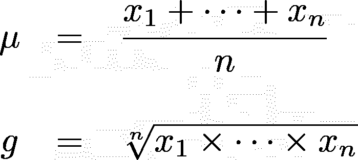
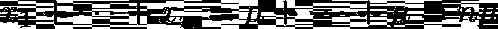
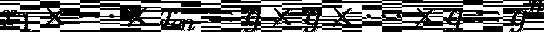
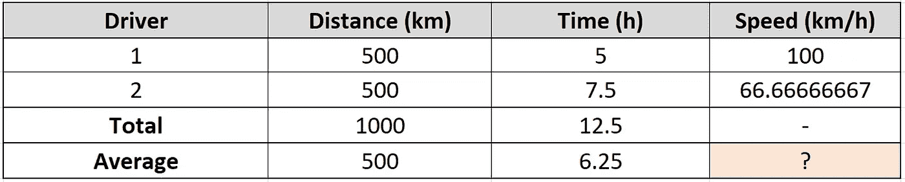
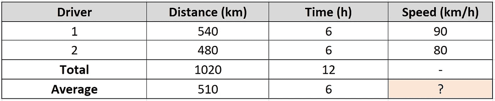
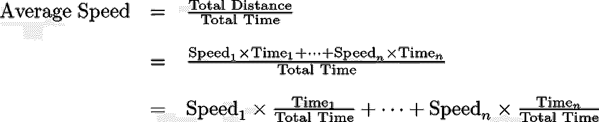
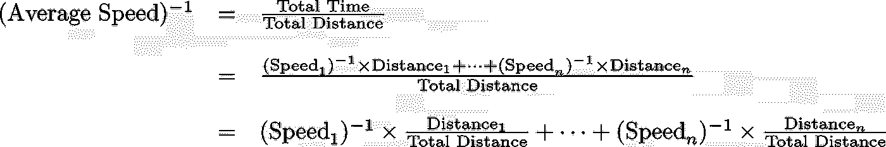
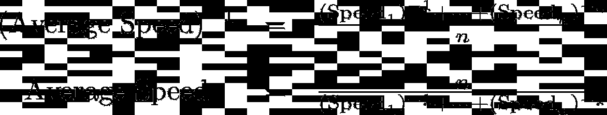

# 算术、几何和调和平均数的直觉

> 原文：<https://towardsdatascience.com/intuition-of-the-arithmetic-geometric-and-harmonic-mean-74c6715e3cf6?source=collection_archive---------16----------------------->

## 关于概率统计的思考

## 什么是“平均值”，我们如何找到它？忘记公式——提高数学水平。

# 如何理解“平均”这个概念

## 公式是用来计算的，不是用来理解的

当人们教你统计概念时，你通常会得到一个等式，它是一些量的公式，比如算术平均值。公式很好，但它们是在考虑计算的情况下设计的。通常，这个方程会把未知数放在一边，所有已知量放在另一边。

像这样。

算术和几何平均公式，为计算而优化

不幸的是，这种观点并不能帮助学生很好地理解“平均值”这样的概念。因此，不难发现人们误用统计数据，例如，在金融回报数据上使用算术平均值，而几何平均值更有意义。

通过重新排列等式，您可以获得另一种视角，这使得“平均值”的概念对于不同类型的数据来说更清晰、更通用。

例如，如果我们有一些数量，我们将这些数量**相加**得到一个总结果(例如，今天得到 3 美元，明天得到 5 美元，得到 3+5 = 8 美元)，那么我们可以使用算术平均值来告诉我们这些数量，当重复相加时，会得到相同的总结果。

算术平均值的另一种观点，更好理解

如果我们有数量要用**乘以**来得出最终数字(例如，股票投资组合的月回报率)，那么很明显，几何平均数更合适。

几何平均数的另一种观点，更好理解

例如，如果你有 1 美元，某一天它翻倍到 2 美元，第二天，它以 8 到 16 美元的倍数增长，如果它以几何平均数增长 2 天，情况也是一样的。几何平均数 g 满足 g*g=2*8=16，所以 g=4。

## **语境很重要！**

重要的是要知道适当的“平均”只有在上下文中才有意义。如果让你“求 2 和 8 的平均值”，你应该不会觉得有什么意义。因为 2+8 = 5+5，所以如果是两天收到的美元的平均数，那么 2 和 8 的平均数可能是 5。但如果是日增长率，也可能是 4，因为 2 * 8 = 4 * 4。如果我们不知道这些数字是从哪里来的，我们就不知道哪个是正确的。

# 更难的平均值:调和平均值

什么是调和平均值，什么时候使用？

## 一个激励人心的例子:公路旅行的平均速度

两个人开车穿越这个国家。由于长途驾驶会很累，两人同意轮流驾驶。

下面的两个表格显示了两种可能的行程，用不同的方式划分距离和时间。问题:旅行的平均速度是多少？

**(1)两个司机行驶的距离相等，但行驶的时间不同。**

为了算出平均速度，我们看到一号和二号车手的速度分别是 100 和 66.666 km/h，我们取这个数字的平均值，得到 **83.333 km/h** 。对吗？

但也许你读过一些关于如何平均利率的东西。你知道算术平均值不正确，需要使用调和平均值。(你可以阅读维基百科关于调和平均数的页面来证实这一点)。你还记得调和平均数的公式…

…而你计算出 H = 2/(1/100+1/66.666)=**80km/H**。

**②两个司机开不同的距离，用了同样多的时间。**

看到最后一个例子后，您知道不要使用算术平均值，因为“调和平均值对于计算平均比率是正确的。”

你发现平均速度是 2/(1/80 + 1/90) = **84.71 km/h** 。

但是你很快就会发现，这其实是不正确的。这就是为什么你不应该盲目地遵循公式。

## 如何求平均速度

为了计算平均速度，我采用了与计算算术和几何平均值相同的方法。我构建了一个平行世界，在那里每个人都是一样的，行为也是一样的，我希望这个平行世界中的行为产生与我的数据相同的结果。如果我们想象两个司机都以平均速度驾驶，那么他们必须以什么速度驾驶才能在相同的时间内行驶相同的距离？

(1)他们需要在 12.5 小时内行驶 1000 km，所以这是 1000/12.5= 80 km/h，注意这是我们之前计算的调和平均值，还要注意两位车手行驶的距离相同。

**平均速度=谐波平均值**

(2)他们需要在 12 小时内走完 1020 km，所以 1020/12 = 85 km/h，注意这不是之前算出来的调和平均值。这是 80 和 90 的算术平均值，请注意，两位驾驶员驾驶的持续时间相同。

**平均速度=算术平均值(？)**

# 调和平均数什么时候合适？

人们常说调和平均数适合于求比率的平均值。甚至维基百科也声明“它适用于需要平均[利率](https://en.wikipedia.org/wiki/Rate_(mathematics))的情况。”但是我上面给出的例子在两种情况下都有比率，调和平均值不适合第二个例子。

我认为调和平均数相当于加权算术平均数，平均利率的关键问题是不同的利率如何加权。

基于公路旅行示例的下列推导，考虑下列等式。

第一行只是平均速度的直观视图。

在第二行，分子是每个司机的距离总和。你可以用量纲分析来证实这一点(L =长度，T =时间):速度有量纲 L/T，时间有量纲 T，所以速度和时间的乘积就是给出一个量纲为 L 的量，到目前为止还好吗？

如果我们现在把这些项分开，我们可以得到第三行。时间分数是无量纲的(T/T ),给出了在 iᵗʰ驾驶员的速度下花费的时间比例。它是速度的加权算术平均值，**乘以时间**！如果每个速度下花费的时间相等，那么它就是速度的算术平均值。请注意，示例(2)中两个驾驶员的时间相等，这就是算术平均值正确的原因。

我们现在进行第二次推导，但我们首先取所有速度的倒数，这样单位就反过来了(每小时每公里)。

第一行是从平均速度的直观角度。

第二行，我们拆分分子，但这次我们需要确保单位是时间。速度的倒数以小时/公里为单位，乘以距离就是小时的单位。

我们把分数分开得到第三行。这一次，它是倒数速度的加权平均值，以倒数速度行驶的总距离的比例进行加权。

如果我们现在让所有的 n 个距离都是相同的长度…

…那么倒数平均速度就是倒数速度的算术平均值。再次取倒数，将单位恢复为 L/T，我们得到调和平均值。

回到原来的问题:什么是调和平均数，什么时候用？

**调和平均值是单位倒置的速率数据的算术平均值。什么时候用？见下文。**

# **费率数据的实用要点**

*   幸运的是，现实世界中的许多数据集在某个维度上会有相同的值。例如，人们可能以不同的速度工作，但是他们被要求完成同样的任务，走同样的距离，等等。
*   分子单位相同——取调和平均值。(例如，都以不同的速度行进，但距离相同)。
*   分母单位相同—取算术平均值(例如，所有人以不同的速度行驶，但时间相同)。
*   两个单位都不相同——使用我充实的一些想法构建了一个加权算术/调和平均值。

我希望我的想法能帮助你更批判性地思考数学和数据。