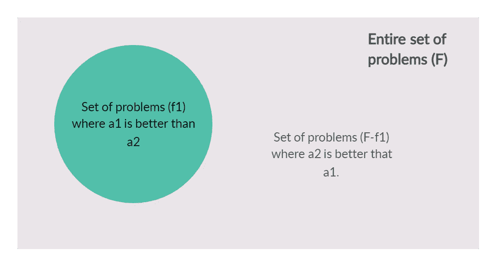

# 没有免费的午餐定理背后的直觉

> 原文：<https://towardsdatascience.com/intuitions-behind-no-free-lunch-theorem-1d160f754513?source=collection_archive---------35----------------------->

由我在加拿大设计[https://www.canva.com/](https://www.canva.com/)

## 无论是玉米卷还是机器学习问题的完美解决方案，没有什么是免费的。

在这篇文章中，我将试图揭开与机器学习相关的“没有免费的午餐”这一概念的神秘面纱，并探讨可以在我们的数据科学之旅中帮助我们的关键要点。

# 背景:

*   天下没有免费的午餐，这是一个源自 20 世纪初的释义，用来传达不可能不劳而获的观点。谚语中的“免费午餐”指的是美国酒吧以前的普遍做法，即提供“免费午餐”来吸引喝酒的顾客。
*   这在科学、金融、经济、技术等许多领域都有应用。我们的重点是它在统计学中的应用。
*   大卫·休谟，19 世纪最伟大的经验主义者之一，提出了这样一个问题“我们如何证明从我们所见的事物中概括出我们所未见的事物？”
*   许多年后，David Wolpert 给出了这个问题的数学形式，并给出了“没有免费的午餐”定理，该定理限制了学习者的能力。

# 定理:

> 任何一对算法在所有可能的问题上的平均性能都是相同的。

这意味着，如果一个算法在某一类问题上表现良好，那么它必然会在所有剩余问题上的性能下降。

考虑用 F 表示的问题的样本空间。f1 是 F 的子集，在其上算法 a1 的性能优于 a2。在剩下的一组问题(F-f1)上，a2 的表现会比 a1 好。

https://creately.com/与[一起制造](https://creately.com/)

数学表示:

1.  假设 X 是一个大的有限特征搜索空间。
2.  假设 Y 是成本值或目标值的一个大的有限空间。
3.  |X|和|Y|是空间的大小。
4.  一个目标函数或代价函数 f 由 f: X → Y 表示。
5.  f 是所有可能的目标函数的空间。
6.  f1，f2..是 f 空间中的一些目标函数。
7.  m 是取自 X 和 y 的样本量。
8.  样品用表示

9.P(f)是每个目标函数 f 在 x 的所有特征上的概率分布。

10.P(f)取决于问题的类型和所用算法的选择。

11.使用下面的公式测量在目标函数 *f* 上迭代 *m* 次的算法 *i* 的性能。

12.这个定理可以翻译成下面的形式。

*   对于任意一对算法 *a1* 和 *a2。*

*   研究论文中给出了这方面的数学证明，这超出了本文的范围。

# 这对我们有什么好处:

*   在机器学习问题中，使用算法的思想是找出特征 X 和目标 y 之间的关系或函数映射。
*   每种机器学习算法都对数据做出假设，并在此基础上进行归纳和预测。
*   模型的性能取决于假设与数据中潜在模式的关联程度。
*   意思是说，在解决数据科学中的所有问题时，没有一种算法是肤浅的。
*   没有对底层数据的最佳了解，就没有免费的午餐(最佳预测)。数据科学家的工作是生成有洞察力的数据，并将其传递给模型，以做出更好的概括，进而做出更好的预测。
*   了解每个算法所做的假设通常有助于我们选择正确的模型。
*   除非我们正在寻找一个可以解决所有问题的主算法，否则我们不会关心一下子解决世界上所有的问题，而是关心一个特定的问题，并专注于选择一个性能最佳的算法，即使它在其他边缘情况或其他问题上的性能低于平均水平。

# 结论

机器学习模型遵循垃圾输入垃圾输出协议(即预测取决于我们训练模型的数据质量)。对这些定理进行了大量的研究，他们中的一些人可能会认为这个定理并不适用于所有情况。我们最好把注意力放在有助于我们更好地理解数据和构建最佳性能模型的点上。

***注:文中提到的几点只是我对没有免费的午餐定理的看法和理解。你们中的一些人可能有不同的观点，请在评论中发表你的观点。***

**资源:**

大卫·h·沃伯特和威廉·g·麦克雷迪于 1997 年发表的《没有免费的午餐》研究论文[https://ti.arc.nasa.gov/m/profile/dhw/papers/78.pdf](https://ti.arc.nasa.gov/m/profile/dhw/papers/78.pdf)

 [## 天下没有免费的午餐

### “天下没有免费的午餐”(或者，“天下没有免费的午餐”或其他…

en.wikipedia.org](https://en.wikipedia.org/wiki/There_ain%27t_no_such_thing_as_a_free_lunch)  [## 主算法

### 在我第二次阅读时，我非常喜欢和欣赏这本书。这次最大的不同是我…

www.goodreads.com](https://www.goodreads.com/book/show/24612233-the-master-algorithm) 

感谢你花时间阅读这篇文章。希望对你有帮助。如果你有任何疑问，请随时联系我。