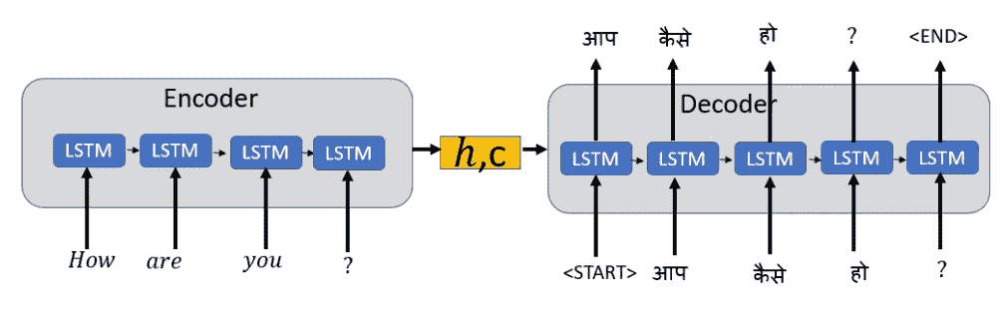
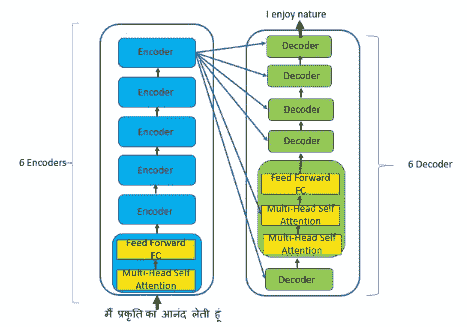

# 自然语言处理中伯特双向变压器的直观解释

> 原文：<https://towardsdatascience.com/intuitive-explanation-of-bert-bidirectional-transformers-for-nlp-cdc1efc69c1e?source=collection_archive---------9----------------------->

## 一种理解 BERT 的直观方法——来自用于理解语言的转换器的双向编码器表示

由[狮式战斗机·珀奇克](https://unsplash.com/@laviperchik?utm_source=unsplash&utm_medium=referral&utm_content=creditCopyText)在 [Unsplash](https://unsplash.com/s/photos/child-reading-book?utm_source=unsplash&utm_medium=referral&utm_content=creditCopyText) 上拍摄的照片

***在本帖中，我们将用直观的方式来了解 NLP 中的进步，包括 BERT。使 BERT 如此强大和受欢迎的预训练策略，以及 BERT 对大多数 NLP 任务的微调。***

## 自然语言处理算法的发展

考虑一下，如果你想学一门新的语言，说印地语，你就很懂英语了。

第一件事是在已知语言的背景下理解新语言的每个单词的意思。你还将了解该语言的同义词和反义词，以获得更好的词汇。这将帮助你理解语义关系。这是 [**Word2Vec 和**](/word-embeddings-for-nlp-5b72991e01d4) 中使用的基本概念

word2vec 和 GloVe word 嵌入。来源:[https://nlp.stanford.edu/projects/glove/](https://nlp.stanford.edu/projects/glove/)和[https://developers . Google . com/machine-learning/crash-course/embeddings/translating-to-a-low-dimension-space](https://developers.google.com/machine-learning/crash-course/embeddings/translating-to-a-lower-dimensional-space)

下一步是将简单短句从英语翻译成印地语。你会听英语句子中的每个单词，然后根据训练，你会把每个单词从英语逐字翻译成印地语。这与 [**编码器和**](/intuitive-explanation-of-neural-machine-translation-129789e3c59f) **中使用的概念相同。**

编码器-解码器

你现在可以翻译短句，但要翻译较长的句子，你需要注意句子中的某些单词，以便更好地理解上下文。这是通过向编码器-解码器模型添加注意机制来实现的。 [**注意机制**](/sequence-2-sequence-model-with-attention-mechanism-9e9ca2a613a) 让你注意到句子中特定的输入单词，以便更好地翻译，但仍然逐字阅读句子。

注意机制

您现在擅长翻译，并且希望提高翻译的速度和准确性。您需要某种并行处理，并且了解上下文以理解长期的依赖性。 [**变形金刚**](/simple-explanation-of-transformers-in-nlp-da1adfc5d64f) 解决了这一要求。

变形金刚(电影名)

我们来看下面的两句话

*推荐信被寄到你的* ***地址***

*全球各地的领导人需要* ***称呼*** *他们在新冠肺炎的人民。*

同一个词“ ***地址*** ”在不同的语境中有不同的含义。你需要把句子作为一个整体来看，以理解句法和语义。**来自语言模型的 ELMo 嵌入**查看整个句子以理解语法、语义和上下文，从而提高 NLP 任务的准确性。

你现在开始通过阅读大量文本来学习语言(**迁移学习**)。获得的知识现在被转移和微调，以应用于各种语言任务，如文本分类，翻译文本等。，这个模型被**通用语言模型微调(ULM-Fit)**

你使用变形金刚是为了速度、准确性和理解长期依赖性，也是为了从大量的词汇中学习，以便对语言有很强的理解，这种模式就是**生成式预训练变形金刚(GPT)** 。它只使用变压器的解码器部分。你也可以应用所学的知识(**迁移学习**)，开始从左向右解释单词(**单向**)。

随着你学习语言的不同方面，你意识到接触各种文本对应用迁移学习非常有帮助。你开始阅读书籍，以建立强大的词汇和对语言的理解。当一个句子中的某些单词被屏蔽或隐藏时，那么根据你的语言知识，从左到右和从右到左阅读整个句子(**双向**)。您现在可以更准确地预测屏蔽词(**屏蔽语言建模**)。就像填空一样。也可以预测两句话什么时候有关联或者没有关联(**下一句预测**)。这是一个简单的工作 **BERT:来自变压器的双向编码器表示。**

这是对 NLP 中不同进步的直观解释。

## 来自变压器的双向编码器表示:BERT

> BERT 旨在通过联合调节所有层中的左右上下文来预训练来自未标记文本的深度双向表示。

*   **BERT 具有深度双向表示，意味着模型从左到右和从右到左学习信息**。与从左到右模型或者从左到右和从右到左模型的浅层连接相比，双向模型非常强大。
*   **BERT 框架分两步:预训练和微调**
*   **根据从图书语料库** (800M 单词)**和英语维基百科**(2500m 单词)中提取的未标注数据进行预训练
*   **BERT 预训练模型可以通过一个额外的输出层进行微调，以解决多个 NLP 任务**，如文本摘要、情感分析、问答聊天机器人、机器翻译等。
*   BERT 的一个与众不同的特点是它的**跨不同任务的统一架构**。预训练的架构和用于各种下游任务的架构之间的差别很小。
*   **BERT 使用掩蔽语言模型(MLM)在预训练期间使用左右上下文来创建深度双向转换器**。

# 伯特建筑

BERT 架构是一种多层双向变压器编码器。我们有两个版本的 BERT: **BERT base** 和 **BERT large** 。

**BERT base 有 12 个编码器，12 个双向自关注头，1.1 亿个参数**

**BERT large 有 24 个编码器，带有 24 个双向自关注头和 3.4 亿个参数**

> BERT 是一个两步框架:预训练和微调。

*“序列”是指输入给 BERT 的令牌序列，可以是单句或两句打包在一起*

## 输入序列

每个序列的第一个标记总是唯一的分类标记**【CLS】**。成对的句子被打包成一个序列，并用一个特殊的符号**分开。对于给定的标记，其输入表示是通过对相应的标记、段和位置嵌入求和来构建的。**

## 输出层

**除了输出层，预训练和微调都使用相同的架构。相同的预训练模型参数用于为不同的下游任务初始化模型。**

# 预训练伯特

> BERT 使用两种无监督策略:掩蔽语言模型(MLM)和下一句预测(NSP)作为预训练的一部分。

在预训练期间，BERT 模型在不同预训练任务的未标记数据上被训练。**根据从图书语料库** (8 亿字)**和英语维基百科**(2500 万字)中提取的未标记数据对 BERT 进行预训练

## 掩蔽语言模型(MLM)

BERT 中的双向条件允许每个单词间接“看到自己”为了训练深度双向表示，我们使用 MLM 随机屏蔽 15%的输入标记，然后预测这些屏蔽的标记。

MLM 就像填空一样，我们**随机屏蔽 15%的输入标记来预测原始词汇 id** 。**在 BERT 中，我们预测屏蔽的令牌，而不是重建整个输入。我们仅在预训练中使用[MASK]标记，它们不用于微调，因为它们会造成不匹配**。为了缓解这一问题，我们并不总是用实际的[MASK]标记替换被屏蔽的单词。

**在随机选择的 15%屏蔽令牌中，**

*   **80%的时候，我们用[MASK]标记替换屏蔽词**
*   **10%的时候，用随机令牌替换**
*   **剩余 10%的时间，是不变的。**

**MLM 也被称为完形填空任务**

伯特与 MLM 和 NSP 一起进行赛前训练

## 下一句预测(NSP)

NSP 用于在预训练期间理解句子之间的关系。当我们有两个句子 A 和 B 时，B 有 50%的时间是跟在 A 后面的实际下一个句子，标记为 ***IsNext*** ，有 50%的时间是从标记为 ***NotNext*** 的语料库中随机抽取的句子。

NSP 有助于自然语言处理任务，如问答(QA)和自然语言推理(NLI)。

# 微调伯特

有两种策略可以应用于下游任务的预训练语言表示:**基于特征和微调。**

伯特使用微调方法。微调方法效果更好，因为它允许通过反向传播来调整语言模型。

> 为了微调 BERT 模型，我们首先使用预训练的参数进行初始化，然后使用来自下游任务的标记数据对所有参数进行微调。

每个下游任务都有单独的微调模型，但用相同的预训练参数进行初始化。对于每个任务，我们只需将特定于任务的输入和输出插入到 BERT 中，并端到端地微调所有参数。

**微调是在预先训练好的 BERT 的基础上增加一层未经训练的神经元作为前馈层。**

**预培训很昂贵，而且是一次性的，但是微调却不贵。**

## 应用微调的优势

*   **利用迁移学习:**预先训练的 BERT 已经编码了大量关于语言的语义和句法信息。因此，训练微调模型所需的时间较少。
*   **需要更少的数据:**使用预训练的 BERT，我们需要非常少的特定于任务的微调，因此需要更少的数据来获得任何 NLP 任务的更好性能。

## 结论:

BERT 设计用于使用来自变压器的编码器预先训练深度双向表示。BERT 预训练通过联合调节所有层中的左右上下文来使用未标记的文本。预训练的 BERT 模型可以通过额外的输出层进行微调，以便为各种 NLP 任务创建最先进的模型。

## 参考资料:

[BERT:用于语言理解的深度双向转换器的预训练](https://arxiv.org/pdf/1810.04805.pdf)

 [## 谷歌研究/bert

### 这是一个 24 个较小的 BERT 模型的版本(只有英语，未封装，用单词屏蔽训练),参考…

github.com](https://github.com/google-research/bert) 

[如何微调 BERT 进行文本分类？](https://arxiv.org/pdf/1905.05583.pdf)

[https://mccormickml.com/2019/07/22/BERT-fine-tuning/](https://mccormickml.com/2019/07/22/BERT-fine-tuning/)