# 差异化架构搜索(DARTS)的直观解释

> 原文：<https://towardsdatascience.com/intuitive-explanation-of-differentiable-architecture-search-darts-692bdadcc69c?source=collection_archive---------15----------------------->

莫里茨·金德勒在 [Unsplash](https://unsplash.com?utm_source=medium&utm_medium=referral) 上拍摄的照片

## 内部人工智能

## 了解飞镖是如何工作的！

这是一篇在 2018 年中期发表的论文，解决了搜索网络架构的可扩展性问题。简而言之，这些论文解决了**神经架构搜索**或 **NAS** 的问题。

顾名思义，这个领域背后的想法是探索我们如何能够自动搜索深度学习模型架构。目前，大多数数据科学问题都是通过手动设计模型架构来解决的，这种架构可以在任何给定的数据集上给出“**最先进的**”结果。这种方法的问题是，尽管这些体系结构在标准数据集上表现非常好，但它们在特定于组织的数据集上的表现却不如预期。

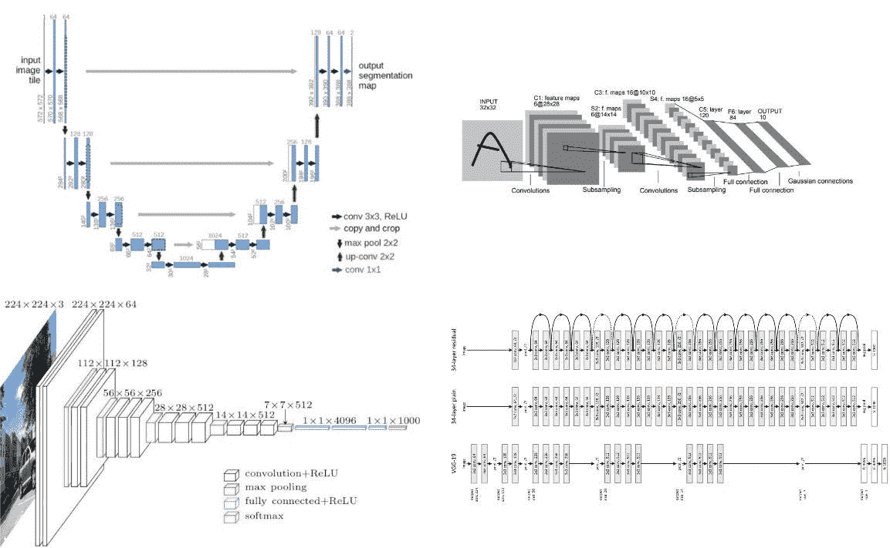

左上: [Unet-Architecture](https://arxiv.org/abs/1505.04597) |右上:发表于【LeCun 等人，1998】的原始图像|左下:VGG16 Architecture |右下:ResNet architecture

这篇文章是写给那些即将进入研究领域或者正在阅读这篇精彩论文的人的。我在印度空间研究组织(ISRO)从事这个领域的实习项目。在这篇博客中，我将尝试以直观的方式解释这篇论文，因为我在实现语义分割时遇到了很多困难。

# 神经结构搜索(NAS)简介

神经结构搜索的问题提出如下。

*给定一组搜索空间操作 O，我们需要找到使目标函数最大化或最小化的这些操作的组合。*

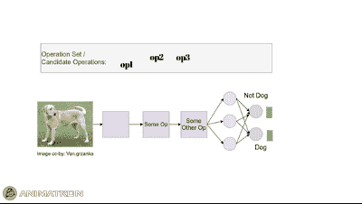

狗图片 cc-by: Von.grzanka |作者图片|显示不同操作如何影响输出的动画。

简单来说，我们需要找到模型的架构，使损失最小化。

## 天真的解决方案

NAS 的一个简单解决方案是反复试验。我们将随机选择一个操作子集，并根据验证损失等参数评估其性能，并选择具有最佳性能的模型配置。

## NAS 发展简史

我们不会深入探讨，但这里有一些有影响力的论文为 NAS 研究铺平了道路。

*   [具有强化学习的神经架构搜索](https://arxiv.org/abs/1611.01578)
*   [通过参数共享进行有效的神经架构搜索](https://arxiv.org/abs/1802.03268)
*   [渐进式神经架构搜索](https://arxiv.org/pdf/1712.00559)
*   [飞镖:差异化建筑搜索](https://arxiv.org/abs/1806.09055)

然后最近有了 [HNAS:移动设备上的分层神经架构搜索](https://arxiv.org/abs/2005.07564)，它将 DARTS 的想法扩展到了下一个层次。

研究的趋势是将计算时间从强化学习的 **2000 GPU** 天或进化的 **3150 GPU** 天减少到飞镖的**2–3 GPU**天。

## NAS 的方法

寻找高性能模型架构的想法并不简单，它包括两个步骤。

1.  在小型数据集上搜索单元架构(例如，CIFAR10 或 CIFAR100)
2.  根据搜索到的单元架构制作模型，并在大数据集(如 ImageNet)上对其进行训练

## 搜索单元架构

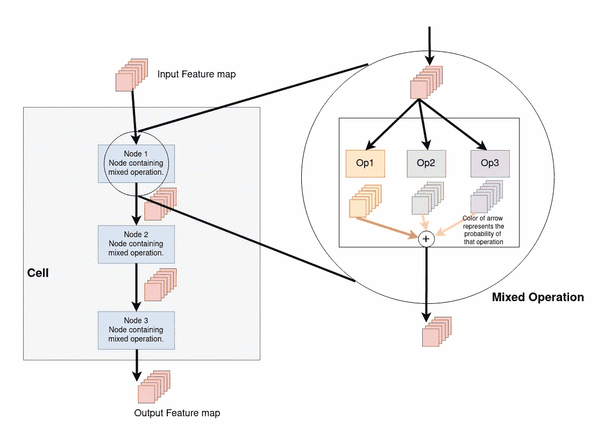

作者图片|简单单元格和混合运算的结构。上面显示的单元以堆叠方式具有 3 种状态。

模型中的单元是什么？嗯，一个单元可以被认为是一个特殊的块，其中层是堆叠的，就像任何其他模型一样。这些单元应用许多卷积运算来获得可以传递给其他单元的特征图。一个模型是通过将这些细胞串联起来制成一个完整的模型。所有这些论文都遵循一个模式，其中搜索两种类型的细胞结构，即**正常细胞**和**还原细胞**。

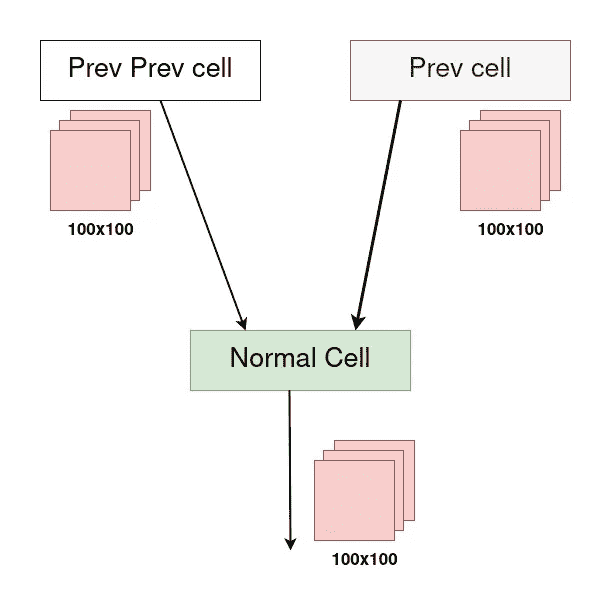

作者图片|普通单元格

**正常单元**:正常单元可以认为是一个计算图像特征图的正常块。这个区块中的回旋和汇集的步幅为 1 。

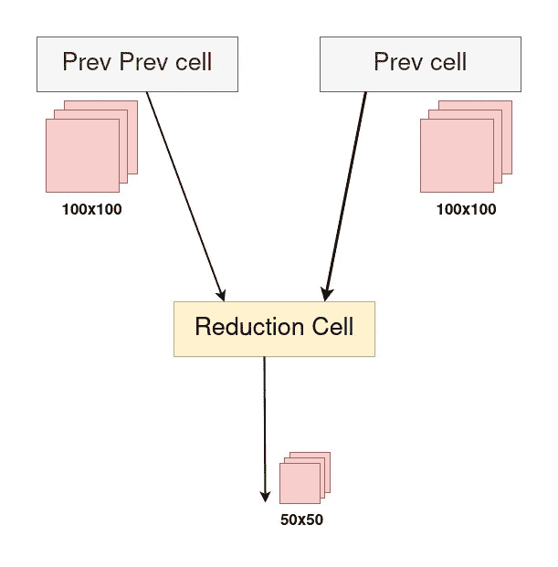

作者图片|缩小单元格

**缩小单元:**缩小单元可以被认为是普通块，而**缩小了**特征图的尺寸。该块中的卷积和池化的步幅为 2。缩减单元的目的是对特征地图进行缩减采样。

由于所有这些论文都解决了分类问题，最后使用了一个**全局平均池层**以及可选的全连接层。

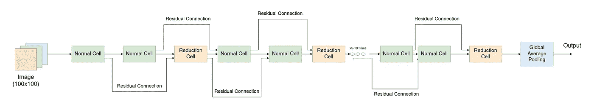

Image by Author |在搜索阶段后，堆叠正常和缩小单元以形成最终模型。

# **关于飞镖的细节。怎么更好？**

Darts 是神经架构搜索中非常有影响力的论文。早期的方法使用强化学习，需要大量的计算资源。花了 **2000 GPU** 天的强化学习或者 **3150 GPU** 天的进化。这个计算时间对大多数组织来说根本不可行。

> *在这篇文章中，我们从一个不同的角度处理这个问题，并提出了一种有效的体系结构搜索方法，称为* ***DARTS*** *(可区分的体系结构搜索)。我们将搜索空间放宽为连续的，而不是在一组离散的候选架构上进行搜索，从而可以通过梯度下降来优化该架构的验证集性能。*
> 
> *与低效的黑盒搜索相反，基于梯度的优化的数据效率使 dart 能够使用数量级 fess 计算资源实现与最先进技术相媲美的性能。*
> 
> *介绍了一种基于双层优化的可区分网络结构搜索算法，该算法适用于卷积和递归结构。”—资料来源:飞镖论文*

DARTS 将搜索时间减少到了**2-3 个 GPU 日**，这是惊人的。

## 飞镖是如何做到这一点的？

1.  **在候选操作的离散集合上搜索计算量很大。**

在候选操作的离散集合上搜索的问题是，在移动到下一个配置之前，模型必须在特定配置上训练。这显然很耗时。作者找到了一种**放松**候选操作的离散集合的方法。

> “为了使搜索空间连续，我们在所有可能的操作中将特定操作的分类选择放宽到最大限度:“——飞镖纸”

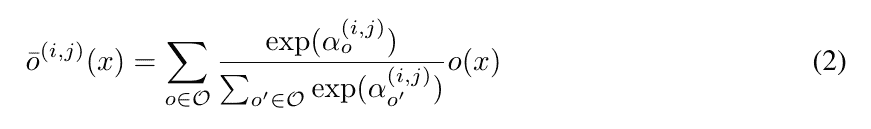

飞镖纸上的方程式

这意味着假设我们的候选操作中只有很少的操作

**O = {conv_3x3，最大 _ 池 _3x3，扩张 _conv_5x5}。**

运算的输出称为混合运算，通过将这些运算的输出乘以它们的概率来定义。

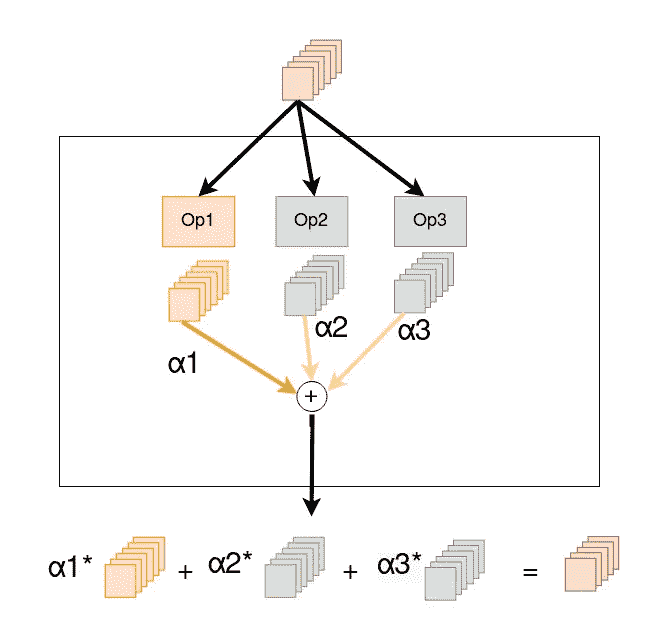

作者图片|显示如何计算混合运算的图片。

> *“每个中间节点都是基于它的所有前置节点计算的。”—飞镖纸*

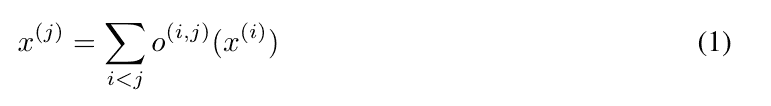

飞镖纸上的方程式

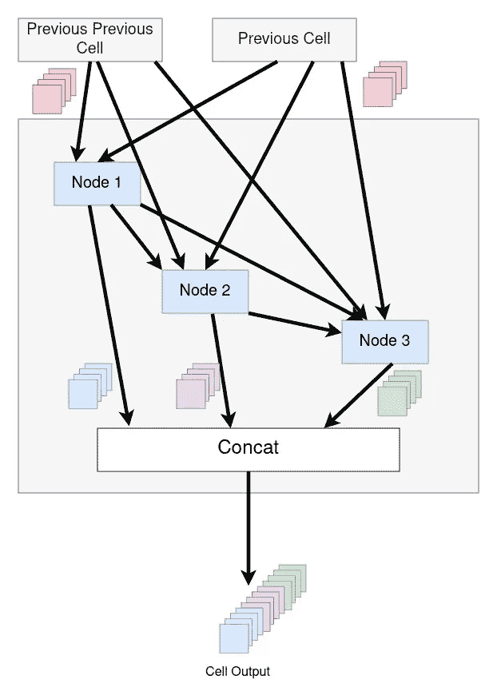

按作者分类的图像|典型 NAS 单元|注意每个节点如何将所有以前节点的输出作为其输入。

这就把我们带到了飞镖细胞的结构。这是模型的核心结构，我想让你在这里好好关注一下。

该单元包含一个或多个节点。这些节点也称为状态。

一个单元的 nput 是最后两个单元的输出，就像 ResNets 一样。在这个单元格中有节点。让我们假设我们制作一个具有 3 个状态/节点的单元。因此第一个节点将有两个输入，即来自最后两个单元的输出。

第二状态将具有来自第一状态的*输入，以及来自最后两个单元*的*输出，因此总共有 **3 个输入。***

第三状态将具有来自第二状态、第一状态的输入和来自最后两个单元的输出。

在搜索结束时，可以通过用最可能的操作替换每个混合操作 o(i，j ),即

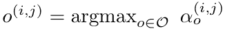

飞镖纸上的方程式。

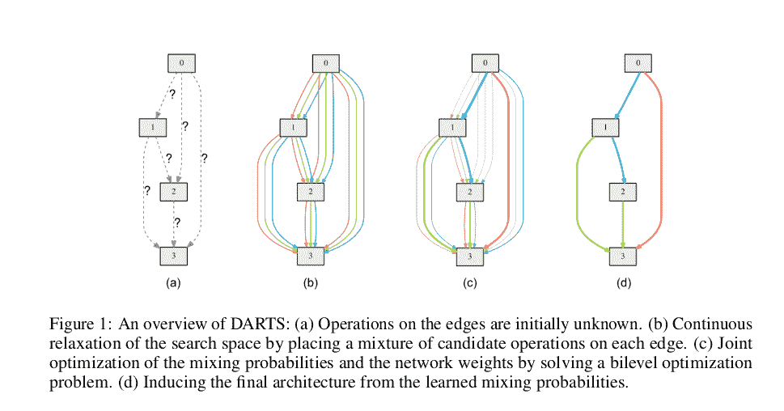

图片来自[飞镖纸](https://arxiv.org/abs/1806.09055)

这听起来很复杂，但是让我们分解一下。搜索阶段结束后，我们可以通过从单元中获取前 k 个(通常 k=2)连接来找到单元的架构。这样，离散搜索空间被转换为连续搜索空间，梯度下降算法将在该连续搜索空间上很好地工作。

2.**双层优化**

> 放松后，我们的目标是联合学习所有混合操作中的架构α和权重 w(例如，卷积滤波器的权重)—飞镖纸

我们已经讨论了如何获得搜索到的架构。但该模型如何寻找最优运行仍是一个未解的问题。训练部分还剩下。

优化问题可以被提出为**寻找 alpha**，使得**验证损失被最小化**，假设我们具有已经在训练集上优化的**权重。**

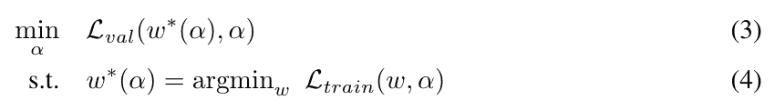

请注意 alphas 和层权重的优化是如何在训练和验证集上完成的。这被称为**双层优化。**

# 近似建筑梯度——房间里的大象

> “由于昂贵的内部优化，精确地评估架构梯度可能是禁止的。因此，我们提出一个简单的近似方案如下:“飞镖纸

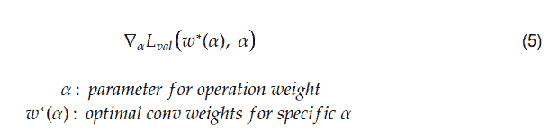

作者图片|显示 alphas 渐变的等式

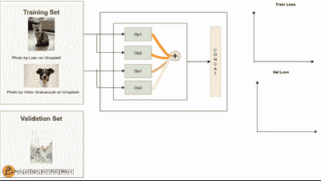

第一张(猫)照片由 [Loan](https://unsplash.com/@l_oan?utm_source=unsplash&utm_medium=referral&utm_content=creditCopyText) 在 [Unsplash](https://unsplash.com/s/photos/cat?utm_source=unsplash&utm_medium=referral&utm_content=creditCopyText) 上拍摄，第二张(狗)照片由 [Victor Grabarczyk](https://unsplash.com/@qrupt?utm_source=unsplash&utm_medium=referral&utm_content=creditCopyText) 在 [Unsplash](https://unsplash.com/s/photos/dog?utm_source=unsplash&utm_medium=referral&utm_content=creditCopyText) 上拍摄，第三张(狗)照片由 [Alvan Nee](https://unsplash.com/@alvannee?utm_source=unsplash&utm_medium=referral&utm_content=creditCopyText) 在 [Unsplash](https://unsplash.com/s/photos/dog?utm_source=unsplash&utm_medium=referral&utm_content=creditCopyText) 上拍摄|作者图片|请注意改变 alphas(橙色线)如何改变训练损失(上图)和重新训练直到必须在重量上完成收敛。**优化 alphas 首先需要优化权重。**

这个方程有一个计算问题。为了获得最佳卷积权重，我们需要通过更新卷积权重来最小化训练损失，从而训练网络。这意味着每次更新 **alpha** 时，都需要最小化训练步骤。这将使网络培训不可行。

> 其思想是通过仅使用单个训练步骤调整 w 来逼近 w*(α)，而不通过训练直到收敛来完全解决内部优化

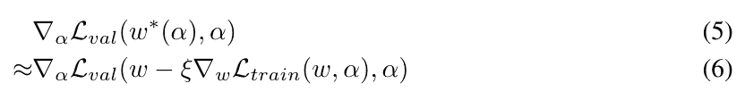

飞镖纸上的方程式

在等式 5 中，为α的每个配置获得最佳权重 w*导致两个优化循环，因此作者建议以这样的方式来近似 w*，使得在收敛之前不需要优化 w*。想法是使用仅仅一个训练步骤而不是整个内部优化循环。

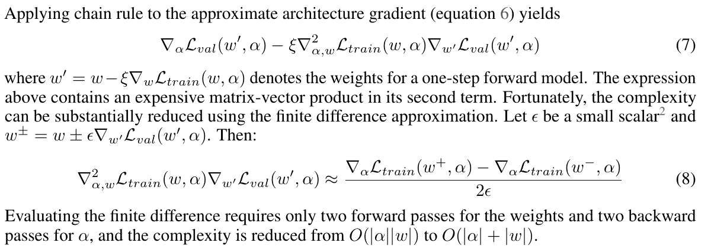

图片来自飞镖纸

[点击此处了解这些等式背后的数学原理。](https://mythrex.github.io/math_behind_darts/)

看看等式 7，我们有一个二阶偏导数，它的计算量很大。为了解决这个问题，使用了有限差分法。

*看，方程 8 没有二阶偏导数！*

关于结果，你可以参考[论文这里](https://arxiv.org/abs/1806.09055)。

# 替代优化策略

作者还试图在训练+验证数据上联合优化 alphas 和权重，但结果恶化。作者解释说，这可能是由于阿尔法对数据的过度拟合。

# 结论

DARTS 是一篇非常有影响力的论文，它将搜索高性能架构的时间从数千个 GPU 小时大幅减少到仅 2-3 个 GPU 天，并且仍然实现了最先进的结果。

# 资源

*   [U-Net:用于生物医学图像分割的卷积网络](https://arxiv.org/abs/1505.04597)
*   [飞镖:差异化架构搜索](https://arxiv.org/abs/1806.09055)
*   [具有强化学习的神经架构搜索](https://arxiv.org/abs/1611.01578)