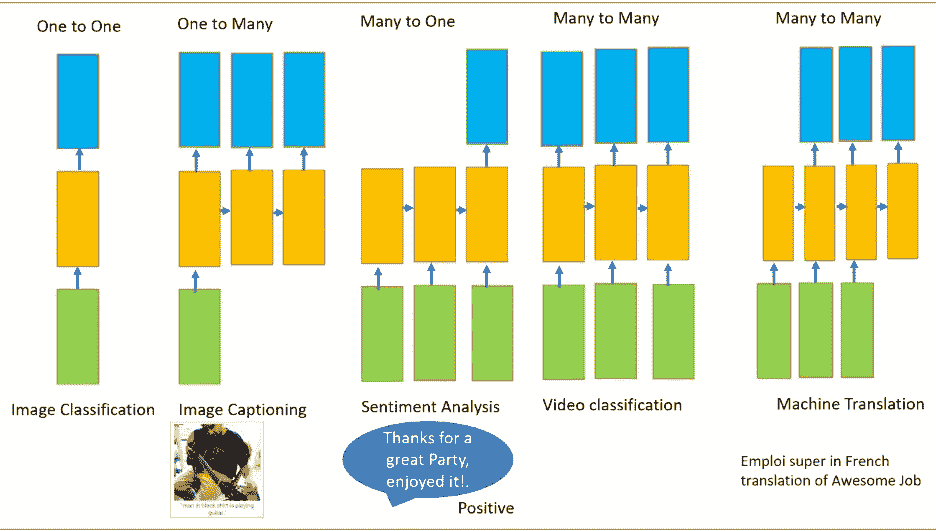
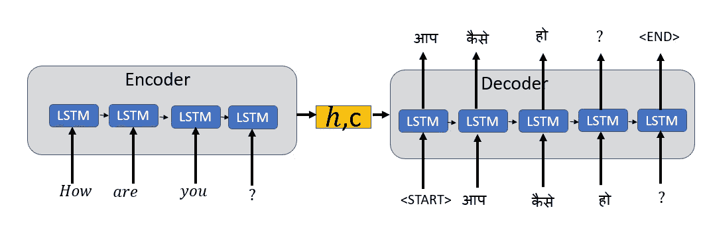
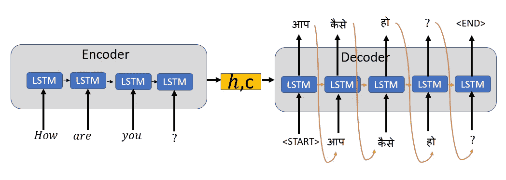

# 神经机器翻译的直观解释

> 原文：<https://towardsdatascience.com/intuitive-explanation-of-neural-machine-translation-129789e3c59f?source=collection_archive---------8----------------------->

## 简单解释用于神经机器翻译的序列到序列模型(NMT)

**什么是神经机器翻译？**

神经机器翻译是一种将一种语言翻译成另一种语言的技术。例如，将英语转换为印地语。让我们考虑一下，如果你在一个印度村庄，那里的大多数人不懂英语。你打算毫不费力地与村民沟通。在这种情况下，你可以使用神经机器翻译。

**神经机器翻译是使用深度神经网络将源语言(如英语)的单词序列转换为目标语言(如印地语或西班牙语)的单词序列的任务。**

***神经机器翻译需要什么特征？***

*   **能够在几个时间步骤内保存顺序数据**

NMT 使用顺序数据，这种数据需要在几个时间步骤中保持不变。人工神经网络(ANN)不会将数据持续几个时间步。像 LSTM(长短期记忆)或 GRU(门控递归单元)这样的递归神经网络(RNN)能够在几个时间步长上保存数据

*   **处理可变长度输入和输出向量的能力**

ANN 和 CNN 需要一个固定的输入向量，您可以对其应用一个函数来产生固定大小的输出。将一种语言翻译成另一种语言包括源语言和目标语言中长度可变的单词序列。

源语言和可变长度的目标句子

***RNN 的像 LSTM 或者***[***GRU***](https://medium.com/datadriveninvestor/multivariate-time-series-using-gated-recurrent-unit-gru-1039099e545a)***对顺序数据处理有什么帮助？***

[**RNN 的**](https://medium.com/datadriveninvestor/recurrent-neural-network-rnn-52dd4f01b7e8) **是具有循环的神经网络，用于保存信息**。它们**对序列中的每个元素执行相同的任务，并且输出元素依赖于先前的元素或状态**。这正是我们处理顺序数据所需要的

RNN 可以有一个或多个输入，也可以有一个或多个输出。这是处理顺序数据(即可变输入和可变输出)的另一个要求

来源:[http://karpathy.github.io/](http://karpathy.github.io/)

***为什么我们不能用 RNN 进行神经机器翻译？***

在人工神经网络中，我们不在网络的不同层之间共享权重，因此，我们不需要对梯度求和。RNN 的份额权重，我们需要对 W 在每一步的梯度求和，如下所示。

在时间步长 t =0 计算 h 的梯度涉及 W 的许多因子，因为我们需要通过每个 RNN 单元反向传播。即使我们忘记了权重矩阵，一次又一次地乘以相同的标量值，比如说 100 个时间步长，这也是一个挑战。

如果最大奇异值大于 1，那么梯度会爆炸，称为**爆炸梯度**。

如果最大奇异值小于 1，那么梯度将消失，称为**消失梯度。**

向前和向后进给和权重在所有层上共享，导致爆炸或消失渐变

**爆炸渐变**是通过使用**渐变裁剪解决的，在渐变裁剪中我们**为渐变设置了一个阈值。如果梯度值大于阈值，我们就对其进行剪裁。

**消失梯度**问题通过使用 LSTM(长短期记忆)或门控循环单元(GRU)解决。

***什么是 LSTM 和 GRU？***

**LSTM 是长短期记忆，GRU** 是门控循环单位。他们能够很快学会长期依赖。LSTM 可以学会跨越超过 1000 步的时间间隔。这是通过有效的基于梯度的算法实现的，该算法使用通过内部状态的恒定误差流。

LSTM 和 GRU 记忆信息的时间跨度很长。他们通过决定记住什么和忘记什么来做到这一点。

LSTM 用 4 个门来决定我们是否需要记住之前的状态。细胞状态在 LSTM 扮演着重要角色。LSTM 可以使用 4 个调节门来决定是否要添加或删除单元状态的信息。这些闸门就像水龙头一样，决定着应该通过多少信息。

LSTM 的三个步骤

GRU 是 LSTM 解决消失梯度问题的更简单的变体

它使用两个门:**复位门和一个更新门**不像 LSTM 的三个步骤。GRU 没有内部记忆

重置门决定如何将新输入与先前时间步长的记忆相结合。更新门决定应该保留多少先前的内存。

GRU 有更少的参数，所以他们在计算上更有效率，比 LSTM 需要更少的数据来概括

***我们如何使用 LSTM 或 GRU 进行神经机器翻译？***

> **我们使用以 LSTM 或 GRU 为基本块的编码器和解码器框架来创建 Seq2Seq 模型**

序列到序列模型将源序列映射到目标序列。源序列是机器翻译系统的输入语言，目标序列是输出语言。

**编码器**:从源语言中读取单词的输入序列，并将该信息编码成实值向量，也称为隐藏状态或思想向量或上下文向量。思维向量将输入序列的“意义”编码成一个向量。编码器输出被丢弃，只有隐藏或内部状态作为初始输入被传递给解码器

**解码器:**将来自编码器的思想向量作为输入，将字符串开始标记`<START>`作为初始输入，产生输出序列。

编码器逐字读取输入序列，类似地，解码器逐字生成输出序列。

解码器在训练和推断阶段的工作方式不同，而编码器在训练和推断阶段的工作方式相同

**解码器的训练阶段**

使用教师强制的编码器-解码器训练阶段

我们使用**教师强制**来更快更有效地训练解码器。

老师的强迫就像老师在学生接受新概念训练时纠正学生一样。由于在培训过程中老师给了学生正确的输入，学生将更快更有效地学习新概念。

**教师强制**算法通过提供先前时间戳的实际输出而不是先前时间的预测输出作为训练期间的输入来训练解码器。

我们添加一个标记`<START>`来表示目标序列的开始，并添加一个标记`<END>`作为目标序列的最后一个字。`<END>`标记稍后在推断阶段用作停止条件，表示输出序列的结束。

**解码器的推断阶段**

编码器-解码器推理阶段

在推理或预测阶段，我们没有实际的输出序列或单词。在推断阶段，我们将前一时间步的预测输出作为输入连同隐藏状态一起传递给解码器。

解码器预测阶段的第一个时间步长将来自编码器和`<START>`标签的最终状态作为输入。

对于随后的时间步长，解码器的输入将是来自前一解码器的隐藏状态以及来自前一解码器的输出。

当我们达到最大目标序列长度或`<END>`标记时，预测阶段停止。

**注:**这只是对 Seq2Seq 的直观解释。我们为输入语言单词和目标语言单词创建单词嵌入。 [**嵌入**](/word-embeddings-for-nlp-5b72991e01d4) **提供了单词及其相对意义的密集表示。**

***如何提高 seq2seq 模型的性能？***

*   大型训练数据集
*   超参数调谐
*   注意机制

***什么是注意机制？***

编码器将上下文向量或思想向量传递给解码器。思想或上下文向量是概括整个输入序列的单个向量。由于输入的单词对翻译的影响，可能需要更多的注意。

注意机制基本思想是避免试图学习每个句子的单一向量表示。注意力机制基于注意力权重关注输入序列的某些输入向量。这允许解码器网络“聚焦”在编码器输出的不同部分。它使用一组*注意力权重*对解码器自身输出的每一步执行此操作。

我们将在下一篇文章中详细讨论注意力机制、光束搜索和 BLEU 评分

## [参考文献:](https://arxiv.org/pdf/1703.01619.pdf)

 [## 从零开始的 NLP:从序列到序列网络和注意力的翻译- PyTorch 教程…

### 作者:Sean Robertson 这是第三篇也是最后一篇关于“从零开始 NLP”的教程，在这里我们编写自己的类…

pytorch.org](https://pytorch.org/tutorials/intermediate/seq2seq_translation_tutorial.html) 

[神经机器翻译和序列对序列模型:教程格雷厄姆·纽比格](https://arxiv.org/pdf/1703.01619.pdf)

[https://towards data science . com/word-level-English-to-Marathi-neural-machine-translation-using-seq 2 seq-encoder-decoder-lstm-model-1a 913 F2 DC 4a 7](/word-level-english-to-marathi-neural-machine-translation-using-seq2seq-encoder-decoder-lstm-model-1a913f2dc4a7)

[https://nlp.stanford.edu/~johnhew/public/14-seq2seq.pdf](https://nlp.stanford.edu/~johnhew/public/14-seq2seq.pdf)