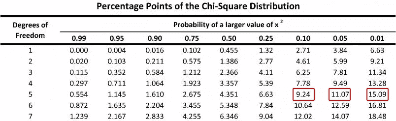
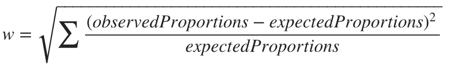
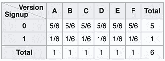

# A/B 测试的直观模拟

> 原文：<https://towardsdatascience.com/intuitive-simulation-of-a-b-testing-191698575235?source=collection_archive---------45----------------------->

## **通过模拟对 A/B 检验、卡方检验、I 型和 II 型误差、置信区间和统计功效有直观和概念性的理解**


图片来自 [Shutterstock](https://www.shutterstock.com/)

我们中的许多人以前都听过、读过、甚至做过 A/B 测试，这意味着我们在某个时候进行了统计测试。大多数时候，我们使用第一方或第三方来源的数据，通过使用从 Excel 到统计软件的工具，甚至是像 *Google Optimize* 这样更自动化的解决方案，轻松地执行这些测试。

如果你像我一样，你可能会好奇这些类型的测试是如何工作的，以及诸如**类型 I** 和**类型 II 误差**、**置信区间**、**影响大小**、**统计功效、**等概念是如何相互作用的。

在这篇文章中，我想邀请你对一种特定类型的 A/B 测试采取不同的方法，这种方法利用了一种叫做**卡方**的特殊统计。特别是，我将尝试探索和通过这种类型的测试，走伟大但漫长的模拟之路，避免库和表，希望设法探索和建立一些背后的*直觉*。

# 开始之前

即使我们可以使用我们过去实验的数据，甚至是像 Kaggle 这样的第三方来源的数据，这篇文章生成我们的数据会更方便。它将允许我们将我们的结论与一个已知的基本事实进行比较；否则，它将很可能是未知的。

对于本例，我们将生成一个虚拟数据集，它将代表注册表单的六个不同版本以及我们在每个版本上观察到的潜在客户数量。对于这个设置为*随机*并有一个*赢家版本为我们服务的* ***地面真相*，**我们将通过模拟一些有偏见的骰子投掷来生成这个表格。

为此，我们生成了一个 **R 函数，模拟一个有偏差的骰子**，其中我们有 20%的概率在 6 中着陆，而有 16%的机会在任何其他数字中着陆。

```
# Biased Dice Rolling Function
DiceRolling <- function(N) {
    Dices <- data.frame()
    for (i in 1:6) {
      if(i==6) {
        Observed <- data.frame(Version=**as.character**(LETTERS[i]),Signup=**rbinom**(N/6,1,0.2))
      } else {
        Observed <- data.frame(Version=**as.character**(LETTERS[i]),Signup=**rbinom**(N/6,1,0.16))
      }
      Dices <- rbind(Dices,Observed)
    }
    return(Dices)
}
*# Let's roll some dices*
set.seed(123) *# this is for result replication 86*
Dices <- DiceRolling(1800)
```

将每个骰子数字视为不同登陆版本的代表(1-6 或 A-F)。对于每个版本，我们将掷骰子 300 次，并将结果记下如下:

*   如果我们在版本 A (1)上，掷骰子，它落在 1 上，我们认为它是注册；否则，只是一次访问。
*   每个版本我们重复 300 次。

# 抽样资料

如前所述，这是我们得到的结果:

```
# We shuffle our results
set.seed(25) 
rows <- sample(nrow(Dices))
t(Dices[head(rows,10),])
```


注意，我们将注册标记为二进制分类变量(1 表示注册，0 表示没有注册)

我们可以从我们的前十个结果中观察到，我们得到了一个对 **F** 、 **D、**和 **A.** 的注册。就合计而言，我们的表格如下所示:

```
library(ggplot2)
ggplot(Result, aes(x=Version, y=Signup)) + geom_bar(stat="identity", position="dodge") + ggtitle("Summary Chart")
Result <- aggregate(Signup ~ Version, Dices, sum)
t(Result)
```


按照设计，F(6)的比例更高

从现在开始，把这个表想象成掷骰子、电子商务转换、调查或我们将在这里使用的登录页面注册转换，没关系，使用对你来说更直观的东西。

对我们来说，这将是注册，所以我们应该产生这个报告:


请注意比例(转换率)的可变性，以及它们与我们的“基本事实”计划有何不同。

## 观察到的频率

我们现在将汇总我们的结果，包括我们的**注册(1)** 和**未注册(0)** 结果，这将使我们更好地了解这些结果与我们的预期值或频率有何不同；这也被称为**交叉制表**或**列联表**。

```
*# We generate our contigency table*
Observed <- table(Dices)
t(Observed)
```


总而言之:


## 预期频率

既然我们知道我们的交叉列表是什么样子，我们现在可以生成一个表来模拟我们应该如何期望我们的结果，就像考虑所有版本的相同性能一样。这相当于说，在我们的例子中，每个版本都有相同的注册转化率或概率，或者如果你愿意，也可以说是无偏差骰子的预期结果。

```
*# We generate our expected frequencies table*
Expected <- Observed
Expected[,1] <- (**sum**(Observed[,1])/nrow(Observed))
Expected[,2] <- **sum**(Observed[,2])/nrow(Observed)
t(Expected)
```


总而言之:


# 假设检验

我们知道我们的测试有一个更高性能的版本，不仅通过视觉检查结果，而且因为我们故意这样设计它。

这是我们等待已久的时刻:**我们是否有可能仅仅根据我们得到的结果来证明这一点？**。

答案是肯定的，第一步是定义我们的无效假设和替代假设，我们稍后将尝试接受或拒绝这些假设。


我们的另一个假设(H1)是我们想要证明正确的，它表明，事实上，在着陆版本和我们观察到的结果之间存在一种关系。相比之下，我们的零假设表明没有关系，这意味着我们观察到的频率和预期的频率之间没有显著差异。

## 统计的

我们的目标是找到我们观察到的数据位于我们的零假设正确的宇宙中的频率，也就是说，我们观察到的和预期的注册频率没有显著差异。

一个有用的统计数据，它能够总结所有这些值；六列(每个版本一列)和两行(每个注册状态一行)合并成一个值就是卡方，计算方法如下:


我们不会详细讨论这个公式是如何找到其假设或要求的(如 Yates 校正)，因为这不是本文的主题。相反，我们希望通过模拟来执行一种数值方法，这应该对这些类型的假设检验有所启发。

继续，如果我们用我们的数据计算这个公式，我们得到:


```
*# We calculate our X^2 score*
Chi <- **sum**((Expected-Observed)^2/Expected)
Chi
```


# 零分布模拟

我们需要获得找到与我们观察到的统计值一样极端的统计值的概率，在这种情况下，用等于 10.368 的卡方表示。从概率的角度来看，这也被称为我们的 P 值。

为此，我们将模拟一个空分布作为基准。这意味着我们需要生成一个场景，其中我们的零分布是正确的，这表明一种情况，其中*在登陆版本和我们得到的观察到的注册结果(频率)*之间没有关系。

我很快想到的一个解决方案是从头开始重复我们的实验，或者通过多次重新收集结果，或者像在这篇文章的上下文中一样，使用一个无偏见的骰子来比较我们观察到的结果与这些测试相比表现如何。尽管这一开始看起来很直观，但在现实场景中，这种解决方案可能不是最有效的，因为它需要大量使用时间和预算等资源来多次重复这种 A/B 测试。

## 重采样

解决上述问题的一个很好的方法叫做重采样。重采样的作用是通过随机改变其中一个变量，使一个变量独立于另一个变量。如果它们之间存在初始关系，那么这种关系将由于随机抽样方法而丢失。

特别是，对于这个场景，我们需要使用原始的(未聚合的)样本。稍后，我们将对其中一列进行多次置换，在这种情况下，这将是注册状态。

具体来说，让我们看看前面显示的前“10 个样本”的 2 次洗牌的例子:


现在让我们用完整的(1800)样本集来尝试一下:

**排列#1**

```
Perm1 <- Dices
set.seed(45)
Perm1$Signup <- sample(Dices$Signup)
ResultPerm1 <- aggregate(Signup ~ Version, Perm1, sum)
cat("Permutation #1:\n\n")
cat("Summary\n\n")
t(ResultPerm1)
cat("Chi-Squared")
Perm1Observed <- table(Perm1)
sum((Expected-Perm1Observed)^2/Expected)
```


**排列#2**

```
Perm1 <- Dices
set.seed(22)
Perm1$Signup <- sample(Dices$Signup)
ResultPerm1 <- aggregate(Signup ~ Version, Perm1, sum)
cat("Permutation #2:\n\n")
cat("Summary\n\n")
t(ResultPerm1)
cat("Chi-Squared")
Perm1Observed <- table(Perm1)
sum((Expected-Perm1Observed)^2/Expected)
```


从我们的数据排列中可以看出，我们得到了完全不同的总结和卡方值。我们将多次重复这一过程，探索我们能在大规模上获得什么。

# 模拟

让我们模拟 15k 个数据排列。

```
# Simulation Function
Simulation <- function(Dices,k) {
    dice_perm <- data.frame()
    i <- 0
    while(i < k) {
      i <- i + 1;# We permutate our Results
      permutation$Signup <- sample(Dices$Signup)# We generate our contigency table
      ObservedPerm <- table(permutation)# We generate our expected frequencies table
      ExpectedPerm <- ObservedPerm
      ExpectedPerm[,1] <- (sum(ObservedPerm[,1])/nrow(ObservedPerm))
      ExpectedPerm[,2] <- sum(ObservedPerm[,2])/nrow(ObservedPerm)# We calculate X^2 test for our permutation
      ChiPerm <- sum((ExpectedPerm-ObservedPerm)^2/ExpectedPerm)# We add our test value to a new dataframe
      dice_perm <- rbind(dice_perm,data.frame(Permutation=i,ChiSq=ChiPerm))
    }
return(dice_perm)
}# Lest's resample our data 15.000 times
start_time <- Sys.time()
permutation <- Dicesset.seed(12)
permutation <- Simulation(Dices,15000)
end_time <- Sys.time()
end_time - start_time
```


时间运行模拟

## 重采样分布

正如我们可以在下面观察到的，我们的 15k 排列看起来像是以独特的形状分布，并且像预期的那样，类似于卡方分布。有了这些信息，我们现在可以计算 15k 次迭代中有多少次，我们观察到的卡方值与我们最初计算的 10.36 一样极端。

```
totals <- as.data.frame(table(permutation$ChiSq))
totals$Var1 <- as.numeric(as.character(totals$Var1))
plot( totals$Freq ~ totals$Var1, ylab=”Frequency”, xlab=”Chi-Squared Values”,main=”Null Distribution”)
```


## p 值

让我们计算一下有多少次我们获得了等于或高于 10.368(我们计算的分数)的卡方值。

```
Higher <- nrow(permutation[which(permutation$ChiSq >= Chi),])
Total <- nrow(permutation)
prob <- Higher/Total
cat(paste("Total Number of Permutations:",Total,"\n"))
cat(paste("  - Total Number of Chi-Squared Values equal to or higher than",**round**(Chi,2),":",Higher,"\n"))
cat(paste("  - Percentage of times it was equal to or higher (",Higher,"/",Total,"): ",**round**(prob*100,3),"% (P-Value)",sep=""))
```


# 决策限制

我们现在有了 P 值，这意味着如果零假设是正确的，即版本和注册之间没有关系，我们应该只在 6.5%的时间里遇到卡方极值。如果我们认为这只是掷骰子的结果，我们应该预期“结果和我们的一样有偏差”，即使在最多 6.5%的情况下掷出一个无偏差的骰子。

现在我们需要定义我们接受或拒绝零假设的决策界限。

我们计算了 90%、95%和 99%置信区间的决策极限，这意味着我们应该期望哪些卡方值作为这些概率的极限。

```
*# Decition Limits*
totals <- as.data.frame(table(permutation$ChiSq))
totals$Var1 <- **as.numeric**(**as.character**(totals$Var1))
totals$Prob <- **cumsum**(totals$Freq)/**sum**(totals$Freq)
Interval90 <- totals$Var1[**min**(which(totals$Prob >= 0.90))]
Interval95 <- totals$Var1[**min**(which(totals$Prob >= 0.95))]
Interval975 <- totals$Var1[**min**(which(totals$Prob >= 0.975))]
Interval99 <- totals$Var1[**min**(which(totals$Prob >= 0.99))]cat(paste("Chi-Squared Limit for 90%:",**round**(Interval90,2),"\n"))
cat(paste("Chi-Squared Limit for 95%:",**round**(Interval95,2),"\n"))
cat(paste("Chi-Squared Limit for 99%:",**round**(Interval99,2),"\n"))
```


**事实核查**



[卡方分布表](https://i.stack.imgur.com/PbEqv.jpg)

正如经典的“卡方分布表”所观察到的，我们可以从模拟中获得非常相似的值，这意味着我们的置信区间和 P 值应该非常准确。

# 假设检验


正如我们所料，我们可以拒绝零假设，并声称版本和注册之间有显著的关系。不过，有一个小警告，这是我们的**信心水平**。正如在上面的计算中观察到的，我们可以看到我们的 P 值(6.5%)正好在 90%和 95%的置信区间之间，这意味着，即使我们可以用 90%的置信度拒绝我们的零假设，我们也不能用 95%或任何更高的置信度拒绝它。

如果我们声称有 90%的信心，那么我们也声称有 10%的机会错误地拒绝我们的零假设(也称为**I 型错误**、**假阳性**或**α**)。注意，在现实中，使用了这样的标准任意值(90%、95%、99%)，但是我们可以很容易地声称我们有 93.5%的把握，因为我们计算了类型 I 错误的 **6.5%的概率。**

有趣的是，即使我们确实知道版本和注册之间的关系，我们也不能仅仅通过观察、模拟来证明这一点，也不能通过用标准的 95%置信水平进行假设检验来证明这一点。这种即使我们知道我们的零假设是错误的，但却没有拒绝它的概念被称为**假阴性**或**第二类错误**(**β**)，它取决于该测试的**统计功效**，该测试测量这种*不发生的概率*。

# 统计能力

在我们的假设检验中，我们看到我们不能拒绝我们的零假设，即使在标准值区间，如 95%或更高的置信度。这是由于我们随机设计的测试的统计功效(或功效)，它对我们上面讨论的**统计显著性**标准(α或 I 型误差)以及**效应大小**和**样本大小**特别敏感。

功率计算如下:


特别是，我们可以通过回答以下问题来计算我们当前的统计能力:

*   如果我们重复我们的实验 X 次，并计算每次实验的 P 值，那么在百分之几的时间里，我们会得到极端的 P 值 5%？

让我们试着回答这个问题:

```
MultipleDiceRolling <- function(k,N) {
    pValues <- **NULL**
    for (i in 1:k) {
    Dices <- DiceRolling(N)    
    Observed <- table(Dices)
    pValues <- cbind(pValues,chisq.test(Observed)$p.value)
    i <- i +1
    }
    **return**(pValues)
}*# Lets replicate our experiment (1800 throws of a biased dice) 10k times*
start_time <- Sys.time()
Rolls <- MultipleDiceRolling(10000,1800)
end_time <- Sys.time()
end_time - start_time
```

我们有多少次观察到 P 值达到 5%的极端值？

```
cat(paste(**length**(which(Rolls <= 0.05)),"Times"))
```


我们观察到这种情况的几率是多少？

```
Power <- **length**(which(Rolls <= 0.05))/**length**(Rolls)
cat(paste(**round**(Power*100,2),"% of the times (",**length**(which(Rolls <= 0.05)),"/",**length**(Rolls),")",sep=""))
```


只有 21.91%的时候，我们遇到的 P 值很小。

如上计算，我们观察到相当于 21.91% (0.219)的幂，这是相当低的，因为黄金标准是 0.8 左右甚至 0.9 (90%)。换句话说，这意味着我们有 78.09% (1 次方)的概率犯第二类错误(T1)，或者，相当于，有 78%的概率(T2)无法在 95%的置信区间拒绝我们的零假设，即使它是假的(T3)，这就是这里发生的情况。

如上所述，功率是以下因素的函数:

*   **我们的显著性标准**:这是我们的 I 型误差或 Alpha，我们决定为 5% (95%置信度)。
*   **效应量级或大小**:根据标准化使用统计，这代表我们观察到的值和预期值之间的差异。在这种情况下，由于我们使用卡方统计，这种影响(命名为 **w** )被计算为标准化卡方值的平方根，通常分为小(0.1)、中(0.3)和大(0.5)(参考: [Cohen，J. (1988)。](http://www.utstat.toronto.edu/~brunner/oldclass/378f16/readings/CohenPower.pdf))
*   **样本量**:这代表样本的总量(在我们的例子中是 1800)。

## 影响幅度

我们设计了一个影响幅度相对较小的实验，因为我们的骰子只偏向一面(6 ),只有轻微的额外机会落在对它有利的地方。

简单地说，我们的**效应量(w)** 计算如下:



1)其中我们的**观察比例**计算如下:


*我们的替代假设的概率*


除以总数(6)

2)和我们的**预期比例**:



*我们零假设的概率*


除以总和(6)

最后，我们可以如下获得我们的效果大小:


我们的效果大小是 0.04，正如所料，被认为非常小(< 0.1)。

## 样本量

类似于我们的效应大小，我们的样本大小，即使看起来足够大(1800)，也不足以在 95%的置信度下发现关系(或偏差),因为我们计算的效应大小非常小。我们可以预期样本大小和效应大小成反比。效应越显著，在给定的显著性水平上证明它所需的样本量就越小。

> 在这个时候，把我们的 A/B 测试的样本大小想象成掷骰子或者甚至投掷硬币可能更舒服。有些直观的是，通过一次投掷骰子/硬币，我们将无法发现有偏差的骰子/硬币，但是如果 1800 次投掷不足以在 95%的置信水平下检测到这种小影响，这将导致我们产生以下问题:我们需要多少次投掷？

同样的原则也适用于我们 A/B 测试的样本量。影响越小，例如每个版本(颜色、字体、按钮)的小变化导致的转换中的小变化，样本就越大，因此，我们需要收集接受或拒绝假设所需的数据的时间就越长。许多关于电子商务网站转化的 A/B 测试中的一个常见问题是，像 Google Optimize 这样的工具可能需要很多天，甚至几周，而且大多数时候，我们不会遇到一个结论性的答案。

为了解决这个问题，首先，我们需要定义我们想要的统计能力。接下来，我们将尝试通过迭代 N 的不同值来回答这个问题，直到我们最小化我们的预期功率和观察到的功率之间的差异。

```
*# Basic example on how to obtain a given N based on a target Power.*
*# Playing with initialization variables might be needed for different scenarios.*
CostFunction <- function(n,w,p) {
  value <- pchisq(qchisq(0.05, df = 5, lower = **FALSE**), df = 5, ncp = (w^2)*n, lower = **FALSE**)
  Error <- (p-value)^2
  **return**(Error)
}
SampleSize <- function(w,n,p) {

    *# Initialize variables*
    N <- n
    i <- 0
    h <- 0.000000001
    LearningRate <- 40000000
    HardStop <- 20000
    power <- 0

    *# Iteration loop*
    for (i in 1:HardStop) {
      dNdError <- (CostFunction(N + h,w,p) - CostFunction(N,w,p)) / h
      N <- N - dNdError*LearningRate
      ChiLimit <- qchisq(0.05, df = 5, lower = **FALSE**)
      new_power <- pchisq(ChiLimit, df = 5, ncp = (w^2)*N, lower = **FALSE**)
      if(**round**(power,6) >= **round**(new_power,6)) {
        cat(paste0("Found in ",i," Iterations\n"))
        cat(paste0("   Power: ",**round**(power,2),"\n"))
        cat(paste0("   N: ",**round**(N)))
        break();
      }
      power <- new_power
      i <- i +1
    }
}
set.seed(22)
SampleSize(0.04,1800,0.8)
SampleSize(0.04,1800,0.9)
```


如上所述，在 N 的不同迭代之后，对于 0.8 和 0.9 的功率值，我们分别获得了 8.017 和 10.293 的推荐样本。

让我们从头开始重复这个实验，看看我们通过瞄准通常使用的 0.8 的幂来建议的这些 8.017 的新样本大小得到了什么结果。

```
start_time <- Sys.time()*# Let's roll some dices*
set.seed(11) *# this is for result replication*
Dices <- DiceRolling(8017) *# We expect 80% Power*
t(table(Dices))*# We generate our contigency table*
Observed <- table(Dices)*# We generate our expected frequencies table*
Expected <- Observed
Expected[,1] <- (**sum**(Observed[,1])/nrow(Observed))
Expected[,2] <- **sum**(Observed[,2])/nrow(Observed)*# We calculate our X^2 score*
Chi <- **sum**((Expected-Observed)^2/Expected)
cat("Chi-Square Score:",Chi,"\n\n")*# Lest's resample our data 15.000 times*
permutation <- Dices
set.seed(20)
permutation <- Simulation(Dices,15000)Higher <- nrow(permutation[which(permutation$ChiSq >= Chi),])
Total <- nrow(permutation)
prob <- Higher/Total
cat(paste("Total Number of Permutations:",Total,"\n"))
cat(paste("  - Total Number of Chi-Squared Values equal to or higher than",**round**(Chi,2),":",Higher,"\n"))
cat(paste("  - Percentage of times it was equal to or higher (",Higher,"/",Total,"): ",**round**(prob*100,3),"% (P-Value)\n\n",sep=""))*# Lets replicate this new experiment (8017 throws of a biased dice) 20k times*
set.seed(20)
Rolls <- MultipleDiceRolling(10000,8017)
Power <- **length**(which(Rolls <= 0.05))/**length**(Rolls)
cat(paste(**round**(Power*100,3),"% of the times (",**length**(which(Rolls <= 0.05)),"/",**length**(Rolls),")",sep=""))end_time <- Sys.time()
end_time - start_time
```


# 最后的想法

正如我们新的实验设计(样本大小等于 8017)所预期的那样，我们能够将 P 值降低到 1.9%。

此外，我们观察到相当于 0.79 的统计功效(非常接近我们的目标)，这意味着我们能够将我们的第二类错误(不拒绝我们的假零假设)减少到仅仅 21%！

这让我们以 95%的置信度(实际上是 98.1%)得出结论，正如我们一直知道的那样，在登陆版本和注册之间存在统计上的显著关系。现在我们需要测试，在给定的置信水平下，哪个版本表现更好；这将包括在本文的第二部分。

[](/intuitive-simulation-of-a-b-testing-part-ii-8902c354947c) [## A/B 测试的直观模拟—第二部分

### 直观地理解学生的 t 检验，I 型和 II 型错误，置信区间，和统计能力，通过…

towardsdatascience.com](/intuitive-simulation-of-a-b-testing-part-ii-8902c354947c) 

如果您有任何问题或意见，请不要犹豫，在下面发表。