# A/B 测试的直观模拟—第二部分

> 原文：<https://towardsdatascience.com/intuitive-simulation-of-a-b-testing-part-ii-8902c354947c?source=collection_archive---------41----------------------->

## 通过模拟直观理解学生的 t 检验、I 型和 II 型错误、置信区间和统计功效


图片来自 [Shutterstock](https://www.shutterstock.com/)

在这篇文章中，我想邀请你继续我们对 A/B 测试的直觉探索，正如在上一篇文章中看到的:

[](/intuitive-simulation-of-a-b-testing-191698575235) [## A/B 测试的直观模拟

### 对 A/B 测试、卡方检验、I 型和 II 型错误、置信区间和…

towardsdatascience.com](/intuitive-simulation-of-a-b-testing-191698575235) 

恢复我们所看到的，我们能够通过模拟和直觉证明网站版本和注册之间存在关系，因为我们能够精心设计一个具有 79%统计能力的测试，允许我们以 95%的置信度拒绝假设。换句话说，我们证明了像我们这样有偏见的行为是随机发现的，只有 1.6%的几率。

即使我们对结果感到满意，我们仍然需要用一个定义的统计置信水平来证明有一个更高性能的版本。在实践中，我们需要证明我们的假设，平均来说，我们应该期望 F 版本会赢过任何其他版本。

# 开始之前

让我们记住并探索我们以前帖子中的工作数据，在那里我们最终抛出了 8017 个骰子，正如我们的统计功效目标 80%所定义的那样。

```
**# Biased Dice Rolling Function** DiceRolling <- function(N) {
    Dices <- data.frame()
    for (i in 1:6) {
      if(i==6) {
        Observed <- data.frame(Version=as.character(LETTERS[i]),Signup=rbinom(N/6,1,0.2))
      } else {
        Observed <- data.frame(Version=as.character(LETTERS[i]),Signup=rbinom(N/6,1,0.16))
      }
      Dices <- rbind(Dices,Observed)
    }
    return(Dices)
}
**# In order to replicate** set.seed(11)
Dices <- DiceRolling(8017) **# We expect 80% Power**
t(table(Dices))
```

提醒一下，我们设计了一个 **R 函数来模拟一个有偏差的骰子**，其中我们有 20%的概率在 6 中着陆，而有 16%的机会在任何其他数字中着陆。

此外，我们最终生成了一个包含 8.017 个样本的虚拟数据集，以 80%的功效计算，代表了注册表单的六个不同版本以及我们在每个版本上观察到的潜在客户数量。对于这个设置为*的虚拟随机*并有一个*赢家版本(F)将作为* ***地面真相*，**我们通过模拟一些有偏见的骰子的投掷来生成这个表格。

输出:

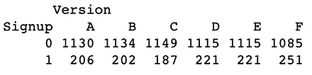

按照设计，我们可以观察到被观察 F 的 ( **251** )的**更高的频率**

这将使我们能够制作这份报告:

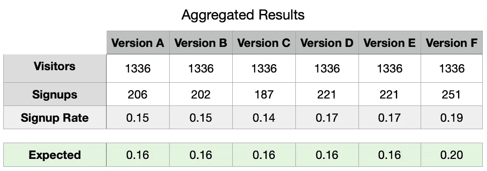

请注意我们观察到的注册率和预期(设计)概率之间的差异。

如上所述，我们可以观察到不同登录页面版本的注册率不同。有趣的是，即使我们计划了一个精确的注册概率(注册率)，我们在观察到的和预期的(计划的)注册率之间得到了完全不同的结果。

让我们暂停一下，对 C 版本进行“健全性检查”,它显示了观察到的(0.14)和预期的(0.16)比率之间的最大差异，以便检查我们的数据是否有问题。

# 健全性检查

尽管这一步不是必需的，但它将为我们建立对我们的主要目标有用的直觉提供一个良好的起点。

如前所述，我们想证明我们的结果，即使最初与我们的预期不同，也不应该相差太远，因为它们基于潜在的概率分布而变化。

换句话说，对于版本 C 的特殊情况，我们的假设如下:

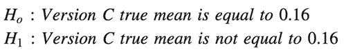

## 我们为什么要用手段？

这种特殊情况允许我们使用比例或平均值，因为我们将变量设计为值为 0 或 1 的二分变量**,在这种情况下，平均值计算代表与我们的比率或比例相同的值。**

```
**# Results for Version C**
VersionC <- Dices[which(Dices$Version==”C”),]
**# Mean calculation**
mean(VersionC$Signup)
```

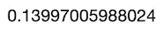

版本 C 观察平均值

## p 值

我们需要找到我们的 p 值，这将允许我们基于在潜在概率分布内找到与我们对版本 C 得到的结果“一样极端”的结果的概率来接受或拒绝我们的假设。

这种确定意味着我们的平均值与真实值(0.16)有显著差异，通常通过一种著名的**学生测试**的变体来解决，称为**单样本 t 检验**注意:因为我们也使用比例，我们也可以使用“**比例测试**”，尽管这不是这篇文章的目的。

为了获得发现像我们这样极端结果的概率，我们需要多次重复我们的数据收集过程。由于这个过程昂贵且不切实际，我们将使用一种类似于我们在上一篇名为“引导”的文章中使用的置换重采样的方法。

## 拔靴带

自举是通过重新排列我们的一个专栏来完成的，在这个例子中是注册，同时保持另一个专栏不变。与我们过去所做的置换重采样不同的是，我们将允许替换，如下所示:

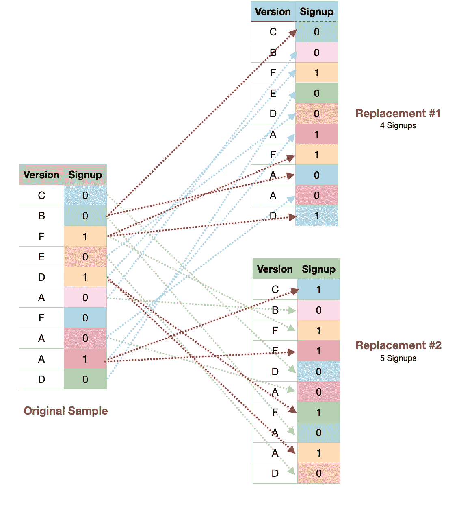

请注意，这次来自我们“原始样本”的注册数据甚至在我们的替换中重复出现。

重要的是要注意，我们需要在这个重组过程中允许替换；否则，简单的排列将总是产生相同的平均值，如下所示。

让我们生成 10 个重采样**而不替换**:

```
i = 0
for (i in 1:10) {
 Resample <- sample(VersionC$Signup,replace=**FALSE**);
 cat(paste("Resample #",i," : ",mean(Resample),"\n",sep=""));
 i = i+1;
}
```

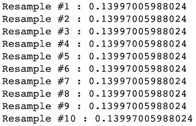

请注意，使用排列，它们将总是相同的。

以及 10 个重新采样**和替换**:

```
i = 0
for (i in 1:10) {
 Resample <- sample(VersionC$Signup,replace=**TRUE**);
 cat(paste("Resample #",i," : ",mean(Resample),"\n",sep=""));
 i = i+1;
}
```

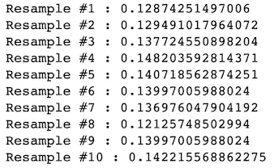

对于替换的样本，它们将根据概率分布而变化。

# 模拟

让我们用我们的数据模拟 C 版本的 30k 个排列。

```
**# Let’s generate a Bootstrap and find our p-Value, Intervals and T-Scores** set.seed(1984)
Sample <- VersionC$Signup
score <- NULL
means <- NULL
for(i in 1:30000) {
 Bootstrap <- sample(Sample,replace = TRUE)
 means <- rbind(means,mean(Bootstrap))
 SimulationtTest <- tTest((Bootstrap-mean(Sample))/sd(Sample))
 tScores <- rbind(score,SimulationtTest)
}
```

结果，我们得到了:

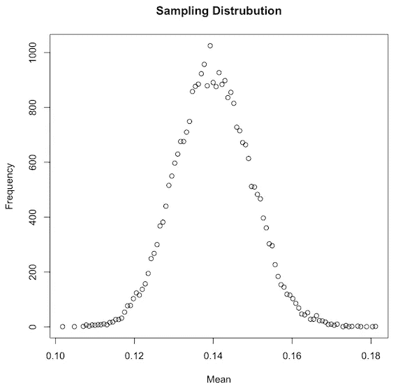

请注意，它看起来是正态分布，平均值等于 0.14

最初，人们可能期望分布在形状上相似，但以 0.16 为中心，因此类似于“**真实人口平均值**分布。尽管我们没有重新创建精确的“基本事实分布”(我们设计的那个)，但由于它现在位于样本平均值的中心(0.14)，我们确实重新创建了一个应该具有大致相同的形状和标准误差，并且应该在其范围内包含我们的真实平均值的分布。

我们可以通过使用**中心极限定理**和**二项分布**的标准差公式，将我们的*自举标准差*与*真实均值标准差*进行比较。

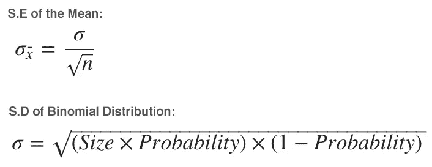

**由此我们可以得到:**

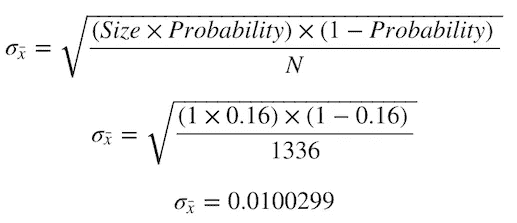

这似乎非常接近我们的自举标准误差:

```
**# Mean from sampling distribution** round(sd(means),6)
```

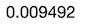

这些数据应该足以让我们通过模拟一个具有等于 0.16 的**均值和 0.01** 的**标准误差的**正态分布**来近似原始的真实均值分布。我们可以找到使用该信息观察到 0.14 这样的极端值的次数百分比。**

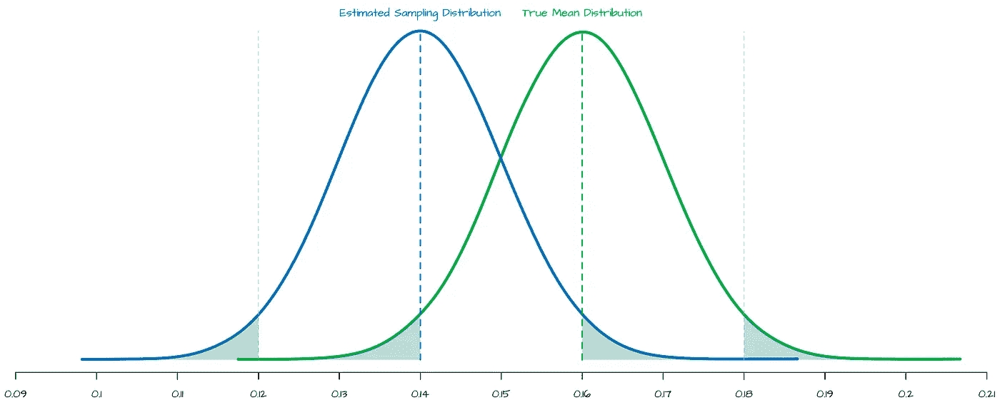

估计抽样分布与真实平均分布

如上所述，我们的*真实均值分布(绿色)*和我们的*自举样本分布(蓝色)*似乎非常相似，除了后者以 0.14 为中心。

在这一点上，我们可以解决我们的问题，要么找到在我们的真实均值分布 *(蓝色区域)中找到 0.14 的极端值的***%。或者，我们可以找到****在我们的自举样本分布*** *(绿色区域)*中找到极值 0.16 的概率。我们将继续讨论后者，因为这篇文章关注的是完全基于样本数据的模拟。***

继续，我们需要计算在我们的自举样本分布中我们观察到了多少次极值 0.16。值得注意的是，在这种情况下，我们的样本均值(0.14)低于我们预期的均值 0.16，但情况并非总是如此，因为正如我们在结果中看到的，版本 D 得到了 0.17。

具体来说，我们将进行一个“双尾检验”，即找出获得数值**为极值**或**为** **远离均值为 0.16 的概率。**C 版的样本均值等于 0.14，这相当于低至 0.12 或高至 0.16，因为这两个值都同样极端。

对于这种情况，我们发现:

```
**# Expected Means, Upper and Lower interval (0.14 and 0.16)** ExpectedMean <- 0.16
upper <- mean(means)+abs(mean(means)-ExpectedMean)
lower <- mean(means)-abs(mean(means)-ExpectedMean)
PValue <- mean(means <= lower | means >= upper)
Sum <- sum(means <= lower | means >= upper)
cat(paste(“We found values as extreme: “,PValue*100,”% (“,Sum,”/”,length(means),”) of the times”,sep=””))
```

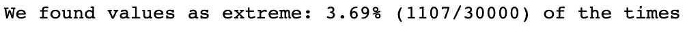

这是我们的 p 值

好了，我们已经找到了我们的 p 值，相对较低。现在，我们希望找到平均值的 95%置信区间，这将有助于了解考虑到 5%的第一类**误差(Alpha)，可能需要哪些值。**

```
**# Data aggregation**
freq <- as.data.frame(table(means))
freq$means <- as.numeric(as.character(freq$means))**# Sort Ascending for right-most proportion**
freq <- freq[order(freq$means,decreasing = FALSE),]
freq$cumsumAsc <- cumsum(freq$Freq)/sum(freq$Freq)
UpperMean <- min(freq$means[which(freq$cumsumAsc >= 0.975)])**# Sort Descending for left-most proportion**
freq <- freq[order(freq$means,decreasing = TRUE),]
freq$cumsumDesc <- cumsum(freq$Freq)/sum(freq$Freq)
LowerMean <- max(freq$means[which(freq$cumsumDesc >= 0.975)])**# Print Results**
cat(paste(“95 percent confidence interval:\n “,round(LowerMean,7),” “,round(UpperMean,7),sep=””))
```

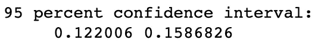

**注意 0.16 不包含在这个 95%的置信区间内。**

让我们来计算我们学生的 T 分数，计算方法如下:

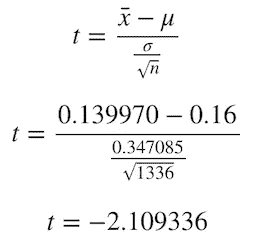

由于我们已经为 30k 个重样本中的每一个计算了这个公式，我们可以为 90%、95%和 99%的置信区间生成我们的临界 t 分数。

```
**# Which are the T-Values expected for each Confidence level?**
histogram <- data.frame(X=tScores)
library(dplyr)
histogram %>% 
 summarize(
 # Find the 0.9 quantile of diff_perm’s stat
 q.90 = quantile(X, p = 0.9),
 # … and the 0.95 quantile
 q.95 = quantile(X, p = 0.95),
 # … and the 0.99 quantile
 q.99 = quantile(X, p = 0.99)
 )
```

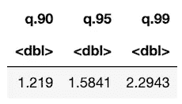

90%、95%和 99%的模拟 t 值

这些值非常接近 1335 (N-1)个自由度的原始学生成绩表，如下所示:

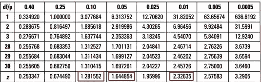

[学生成绩表](https://www.dummies.com/wp-content/uploads/451675.image0.jpg)

继续，我们可以观察到我们计算的 p 值约为 3.69%，我们的 95%区间不包括 0.16，我们的绝对 t 值为 2.1，如表中所示，正好在 Alpha 值 0.05 和 0.01 之间。所有这一切似乎与同样的结果是一致的；**我们以 95%的置信度拒绝零假设**，这意味着**我们无法确认 C 版的真实均值等于 0.16。**

我们自己设计了这个测试，我们很确定我们的零假设是正确的。这种拒绝真零假设的概念被称为假阳性或 I 型错误，可以通过将我们当前的置信区间从 95%增加到 99%来避免。

到目前为止，我们已经通过模拟进行了相当于“**单样本 t 检验**的测试，这意味着我们已经确定了 0.14 的“样本均值”在统计上是否不同于已知或假设的“总体均值”0.16，这是我们的基本事实。

现在，这将为我们下一步的工作打下基础，因为我们现在将继续用一种非常相似的方法来比较我们的登陆版本，看看是否有赢家。

# 寻找我们的赢家版本

我们探讨了如何比较*样本均值*与已知总体均值的统计差异；现在，让我们将我们的样本均值与另一个样本均值进行比较。

对于这个特殊的例子，让我们比较一下**版本 F *和*。版本 A** 。

这种比较两个*独立样本*的程序通常用一种叫做**“不成对两样本 t 检验”**的检验来解决；它是不成对的，因为我们将使用不同的(独立的)样本；我们假设它们的行为是随机的，具有正态分布和零协方差，我们将在后面观察到。

如果我们使用相同的样本，比如在不同的时间点，我们将使用“**配对双样本 t 检验**”，相比之下，它比较两个*相关样本*，并假设非零协方差，这将反映在公式中。

简而言之，我们想知道我们观察到均值的**正差异**的频率，这相当于说版本 F 比版本 A 具有更高的均值，从而具有更好的性能。我们知道我们目前在手段上的差异如下:

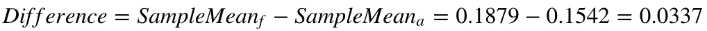

样本 F 和样本 A 之间有 3.37%的正差异

因为我们知道我们的样本均值只是版本 F 和版本 A 的真实总体均值的单一测量，而不是两个版本的**真实样本均值**，所以我们需要像前面一样计算两个版本的估计样本分布。与之前不同，我们还将计算每个重采样的平均值的**差异，以观察它是如何分布的。**

让我们用版本 F 和版本 A 的替代品模拟 40k 个样本，并计算平均值的差异:

```
**# Let’s select data from Version F and Version A** VersionF <- Dices[which(Dices$Version==”F”),]
VersionA <- Dices[which(Dices$Version==”A”),]**# We simulate 40k** Diff <- NULL
meansA <- NULL
meansF <- NULL
for(i in 1:40000) {
 BootstrapA <- sample(VersionA$Signup,replace = TRUE)
 BootstrapF <- sample(VersionF$Signup,replace = TRUE)
 MeanDiff <- mean(BootstrapF)-mean(BootstrapA)
 Diff <- rbind(Diff,MeanDiff)
}
**# We plot the result**
totals <- as.data.frame(table(Diff))
totals$Diff <- as.numeric(as.character(totals$Diff))
plot( totals$Freq ~ totals$Diff , ylab="Frequency", xlab="Difference",main="Sampling Difference Distrubution")
```

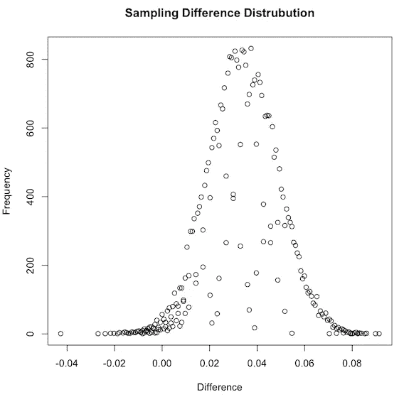

均值间差异的抽样分布

正如我们之前所学的，我们得到了一个正态分布的形状，该形状以之前计算的样本差 0.337 为中心。像以前一样，我们也知道版本 A 和 F 的真实总体均值之间的**差异**应该在这个分布的范围内**。**

此外，我们的 bootstrap 应该为我们提供了真实平均值之间差异的标准误差的良好近似值。我们可以用**中心极限定理**和**二项分布来比较我们的*自举标准差*和*真均值差标准差*。**

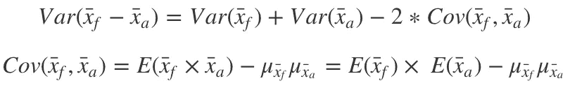

**由此我们可以得出:**

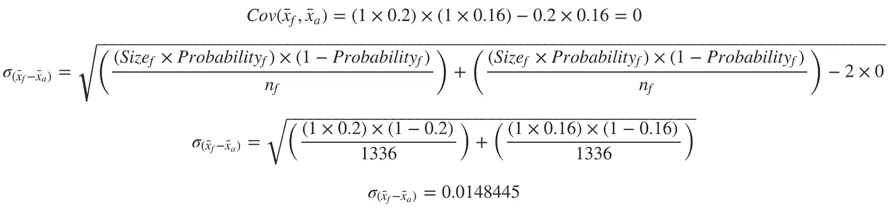

**差异的预期标准误差为 0.0148，协方差为零**

就像以前一样，由于均值的差异，它似乎非常接近我们的自举标准误差:

```
**# Simulated Standard Error of the differences** round(sd(Diff),6)
```

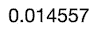

(非常接近我们的 0.0148 目标)

按照设计，我们知道平均的真实期望差是 0.04。我们应该有足够的数据来近似一个**正态分布**，其中**的平均值等于 0.04** 并且**的标准误差为 0.0148，**在这种情况下，我们可以找到一个值被发现为极值 0 的次数的百分比。

然而，这种情况是不现实的，因为我们通常没有总体均值，而总体均值是估计低谷置信区间的全部目的。

与我们之前的案例相反，在我们的第一个例子中，我们将 C 版本的样本分布与假设的总体均值 0.16 进行了比较。然而，在这种情况下，我们比较了两个单独的样本，没有进一步的信息，因为它会发生在一个真正的 A/B 测试。

特别是我们要证明版本 F 优于版本 A，意思是均值之差大于零。在这种情况下，我们需要执行一个“单尾”测试来回答以下问题:**我们观察到均值差异大于零的次数百分比是多少？**

我们的假设如下:

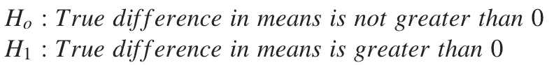

**答案:**

```
**# Percent of times greater than Zero** mean(Diff > 0)
```

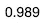

这意味着 P 值= 0.011

由于我们的 p 值代表我们在模拟中没有观察到高于零的均值差异的次数，因此我们可以将其计算为 0.011(1–0.989)。此外，低于 0.05(阿尔法)，我们可以**拒绝我们的零假设**；因此，版本 F **比版本 a**具有更高的性能

如果我们计算这个特定测试的 95%置信区间和 t 分数，我们应该得到类似的结果:

**95%的置信区间:**

```
**# Data aggregation**
freq <- as.data.frame(table(Diff))
freq$Diff <- as.numeric(as.character(freq$Diff))**# Right-most proportion (Inf)** UpperDiff <- Inf**# Sort Descending for left-most proportion**
freq <- freq[order(freq$Diff,decreasing = TRUE),]
freq$cumsumDesc <- cumsum(freq$Freq)/sum(freq$Freq)
LowerDiff <- max(freq$Diff[which(freq$cumsumDesc >= 0.95)])**# Print Results**
cat(paste(“95 percent confidence interval:\n “,round(LowerDiff,7),” “,round(UpperDiff,7),sep=””))
```

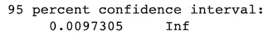

注意我们最右边的区间是无限的，因为我们做了一个单尾测试。

正如所料，我们的置信区间告诉我们，在 95%的置信度下，我们应该期望至少 0.0097 的差异，该差异大于零；因此，它表现出了更好的性能。

**不成对双样本 t 检验得分:**

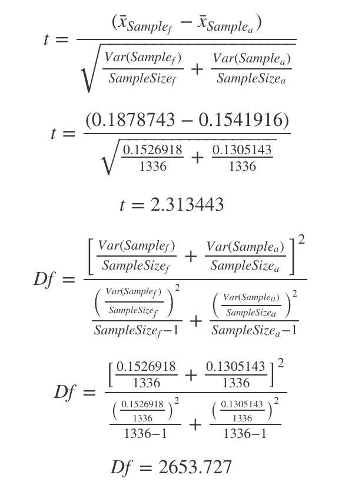

与我们之前的值类似，检查我们的 T 表中的 **T=2.31** 和 **2653 自由度**，我们还发现 **p 值大约为 0.01**

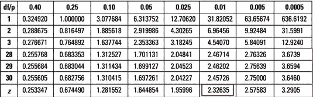

[学生成绩表](https://www.dummies.com/wp-content/uploads/451675.image0.jpg)

# 成对比较

到目前为止，我们已经将 C 版登录页面与假设的平均值 0.16 进行了比较。我们还比较了版本 F 和版本 A，发现哪个版本的性能最好。

现在我们需要确定我们的绝对赢家。我们将进行成对比较，这意味着我们将互相测试每一页，直到我们确定我们的绝对赢家，如果它存在的话。

由于我们将对每个版本进行单尾测试，并且我们不需要对一个版本本身进行测试，因此我们可以减少测试的总数，如下所示。

```
**# Total number of versions** VersionNumber <- 6
**# Number of versions compared** ComparedNumber <- 2
**# Combinations** factorial(VersionNumber)/(factorial(ComparedNumber)*factorial(VersionNumber-ComparedNumber))
```

作为输出，我们得到: 15 对测试。

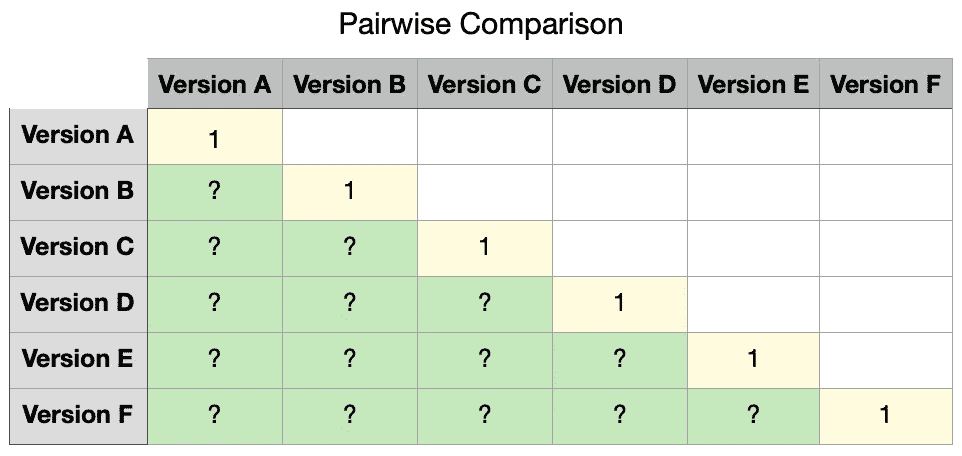

注意，我们只需要找到绿色的值。白色将是 1-对应对(绿色值)

我们将跳过重复 15 次的过程，直接跳到结果，即:

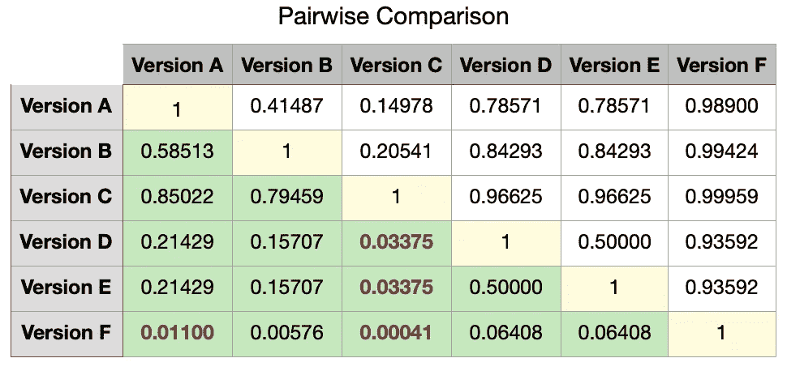

我们用红色标记了 p 值

如上所述，我们发现版本 F 比版本 A、C 具有更好的性能，并且几乎比版本 B、D 和 E 的性能更好，它们接近我们选择的 Alpha 值 5%。相比之下，版本 C 似乎是一个特例，因为对于 D 和 E，它似乎具有大于零的均值差异，我们知道这是不可能的，因为所有三个版本都是以 0.16 的等效概率设计的。

换句话说，我们无法以 95%的置信度拒绝我们的零假设，即使 F *对*为假。*b、* D、C；这种情况(类型 II 错误)可以通过增加我们的**统计功效**来解决。相比之下，我们**拒绝了 D *vs* 的真零假设**。c 和 E *对*。这表明我们已经发生了一个**类型 I 错误**，这可以通过定义一个较低的 Alpha 或较高的置信水平来解决。

我们确实设计了我们的测试有 80%的统计功效。然而，我们设计它仅仅是为了测试我们的 ***总*** *观察频率*和预期频率*之间的*差异，而不是为了测试* ***个体*** *即*之间的*差异。换句话说，我们已经从“**卡方检验”**转换为“**不成对双样本 t 检验”。****

# 统计能力

我们已经取得了成果。即使我们可以按原样使用它们，并选择总体差异最大的那些，例如 P 值最低的那些，我们也可能想要重新测试一些变化，以便完全确定。

正如我们在上一篇文章中看到的，功率的计算如下:

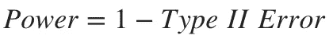

同样，功率是以下各项的函数:

*   **我们的显著性标准**是我们的 I 型误差或 Alpha，我们决定为 5% (95%置信度)。
*   **效应量级或大小**:这代表我们观察到的值和预期值之间关于标准化使用统计的差异。在这种情况下，由于我们使用的是学生的测试统计数据，这种效应(名为 **d** )的计算方法是“*平均值之差*除以“*合并标准误差*”。通常分为小型(0.2)、中型(0.5)和大型(0.8)。
*   **样本量**:这代表样本的总量(在我们的例子中是 8017)。

## 影响幅度

我们设计了一个影响幅度相对较小的实验，因为我们的骰子只偏向一面(6 ),只有轻微的额外机会落在对它有利的地方。

简单地说，我们的**效应量级(d)** 计算如下:

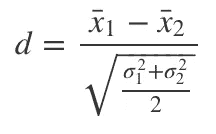

(注意与我们之前使用的 t 分数公式的关系)

如果我们使用目前为止所学的公式计算 F 版本相对于 A 版本的**期望值**，我们会得到:

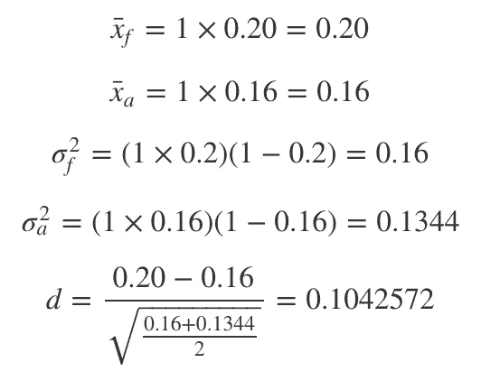

请注意，我们计算的效果大小是通常认为的“小效果”的 50%

## 样本量

正如我们在上一篇文章中所评论的，我们可以预期样本大小和效应大小之间的反比关系。效应越显著，在给定的显著性水平上证明它所需的样本量就越小。

让我们试着找到所需的样本大小，以便有 90%的功效。我们可以通过迭代 N 的不同值来解决这个问题，直到我们最小化我们的预期功率和观察到的功率之间的差异。

```
**# Basic example on how to obtain a given N based on a target Power.
# Playing with initialization variables might be needed for different scenarios.**
set.seed(11)
CostFunction <- function(n,d,p) {
  df <- (n - 1) * 2
  tScore <- qt(0.05, df, lower = FALSE)
  value <- pt(tScore , df, ncp = sqrt(n/2) * d, lower = FALSE)
  Error <- (p-value)^2
  return(Error)
}
SampleSize <- function(d,n,p) {

  # Initialize variables
  N <- n
  i <- 0
  h <- 0.000000001
  LearningRate <- 3000000
  HardStop <- 20000
  power <- 0

  # Iteration loop
  for (i in 1:HardStop) {
    dNdError <- (CostFunction(N + h,d,p) - CostFunction(N,d,p)) / h
    N <- N - dNdError*LearningRate
    tLimit <- qt(0.05, (N - 1) * 2, lower = FALSE)
    new_power <- pt(tLimit , (N- 1) * 2, ncp = sqrt(N/2) * d, lower = FALSE)

    if(round(power,6) >= p) {
      cat(paste0("Found in ",i," Iterations\n"))
      cat(paste0("   Power: ",round(power,2),"\n"))
      cat(paste0("   N: ",round(N)))
      break();
    }
    power <- new_power
    i <- i +1
  }
}
set.seed(22)
SampleSize((0.2-0.16)/sqrt((0.16+0.1344)/2),1336,0.9)
```

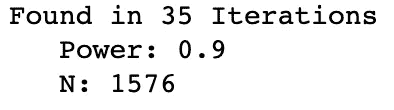

如上所述，在 N 的不同迭代之后，我们获得了每骰子 1576 **的推荐样本**，从而具有 0.9 的幂。

让我们从头开始重复这个实验，看看我们对这些新的样本量 9456 (1575*6)得到了什么结果，这是通过瞄准 0.9 的良好统计功效而建议的。

```
**# Repeat our experiment with sample size 9446** set.seed(11)
Dices <- DiceRolling(9456) **# We expect 90% Power**
t(table(Dices))
```

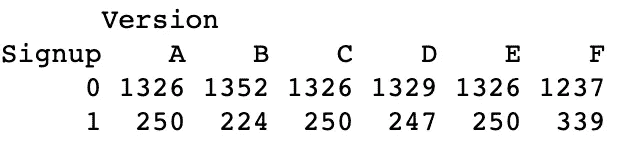

F 版似乎以 339 的注册数再次成为赢家

在我们继续之前，让我们做一个快速的健全性检查，看看我们的实验现在是否有 90%的统计功效；这可以通过问以下问题来回答:

*   如果我们重复我们的实验 X 次，并计算每次实验的 P 值，那么在百分之几的时间里，我们会得到极端的 P 值 5%？

让我们试着回答 F 版和 A 版的这个问题:

```
**# Proving by simulation**
MultipleDiceRolling <- function(k,N) {
  pValues <- NULL
  for (i in 1:k) {
    Dices <- DiceRolling(N)    
    VersionF <- Dices[which(Dices$Version=="F"),]
    VersionA <- Dices[which(Dices$Version=="A"),]
    pValues <- cbind(pValues,t.test(VersionF$Signup,VersionA$Signup,alternative="greater")$p.value)
    i <- i +1
  }
  return(pValues)
}
**# Lets replicate our experiment (9456 throws of a biased dice) 10k times**
start_time <- Sys.time()
Rolls <- MultipleDiceRolling(10000,9456)
end_time <- Sys.time()
end_time - start_time
```

我们有多少次观察到 P 值达到 5%的极端值？

```
cat(paste(**length**(which(Rolls <= 0.05)),"Times"))
```

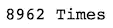

我们观察到这种情况的几率是多少？

```
Power <- **length**(which(Rolls <= 0.05))/**length**(Rolls)
cat(paste(**round**(Power*100,2),"% of the times (",**length**(which(Rolls <= 0.05)),"/",**length**(Rolls),")",sep=""))
```

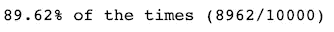

按照上面的计算，我们观察到大约相当于 90%的功率(0.896)，这证明我们的新样本大小按计划工作。这意味着我们有 10% (1 次方)的概率犯下**第二类错误**，或者，等价地，有 10%的概率**无法在 95%的置信区间拒绝我们的零假设，即使它是假的**，这是可以接受的。

## 绝对的赢家

最后，让我们通过重复与这些新样本的成对比较，继续寻找我们的绝对赢家:

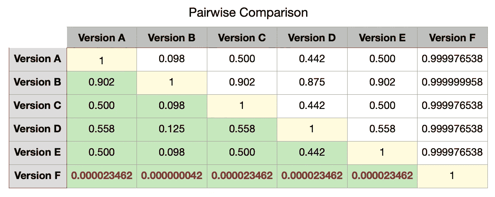

我们用红色标记了 p 值

不出所料，在所有其他版本中，我们的绝对赢家是 F 版。此外，现在也很清楚，任何其他版本的真实含义之间没有显著差异。

# 最后的想法

我们已经探索了如何在两种类型的测试上执行模拟；一个和两个独立样本的卡方检验和学生检验。此外，我们还研究了一些概念，如 I 型和 II 型错误、置信区间以及两种情况下统计功效的计算和解释。

重要的是要知道，通过在传统的用例场景中使用专门的功能来执行这样的测试，我们可以节省很多时间，甚至可以获得更准确的结果，因此不建议遵循这种模拟路径。相比之下，这种类型的练习提供了帮助我们发展更直观的理解的价值，这是我想要达到的。

如果您有任何问题或意见，请不要犹豫，在下面发表。