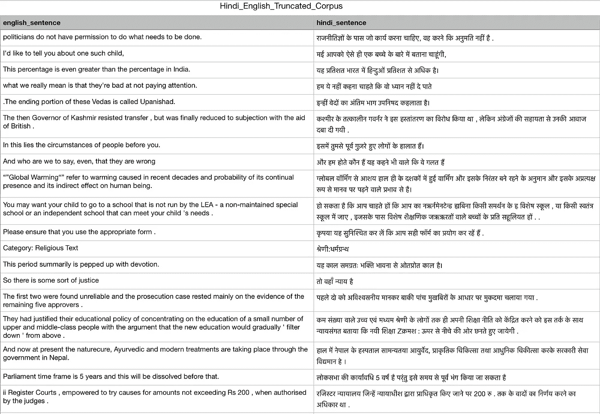
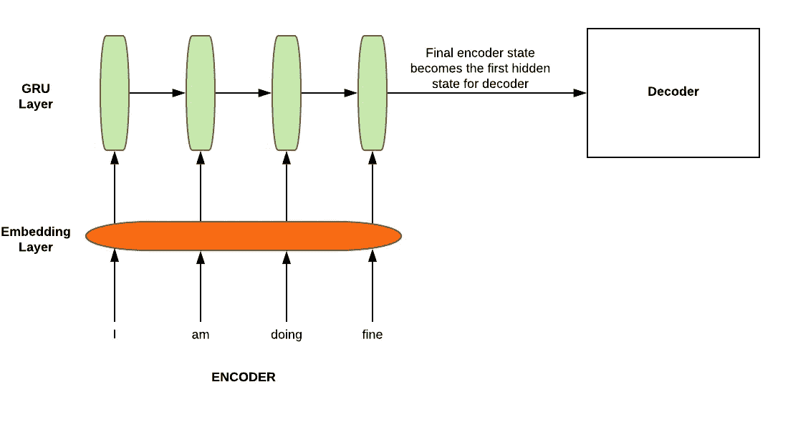
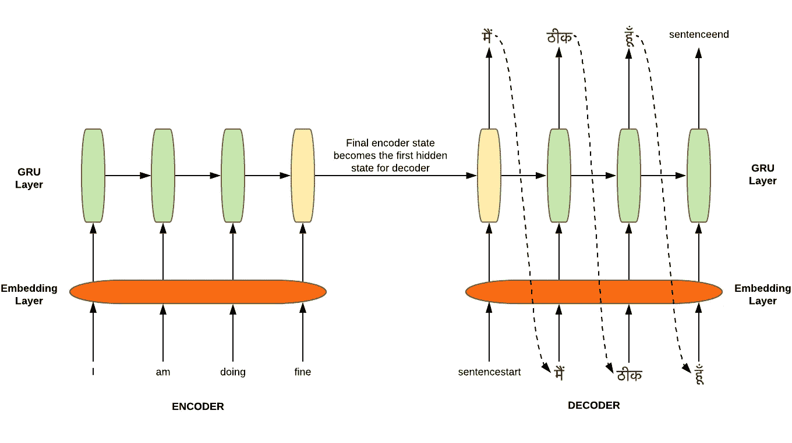
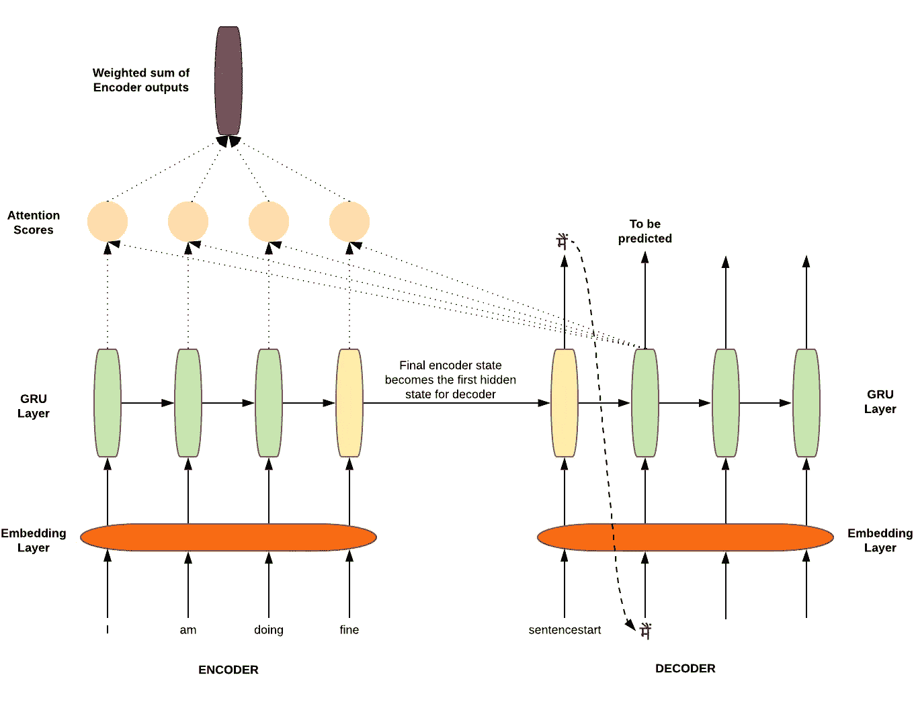
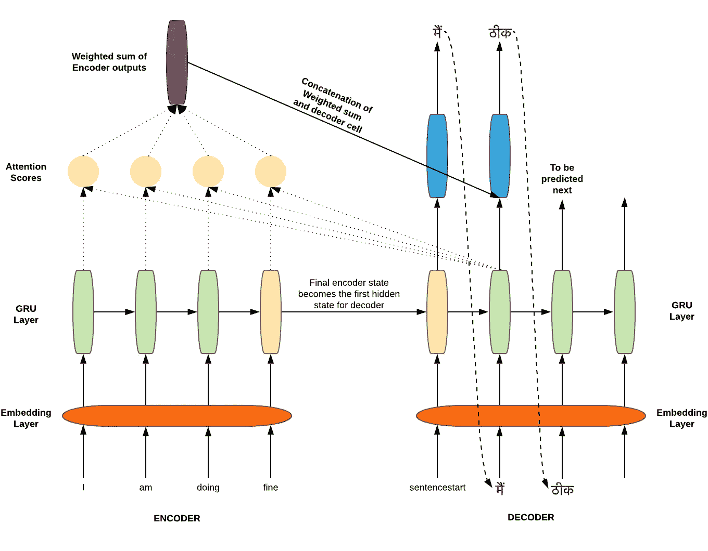
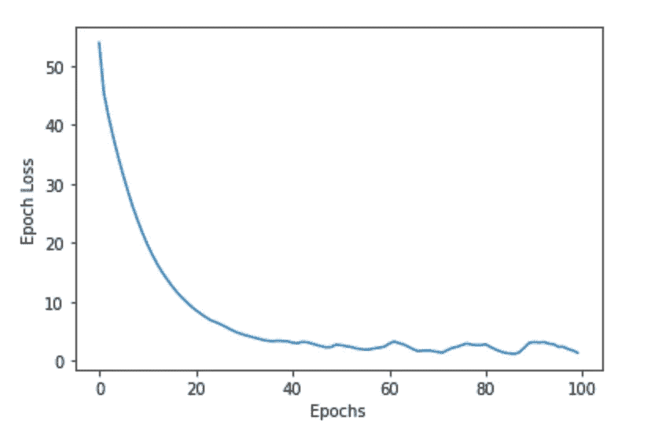
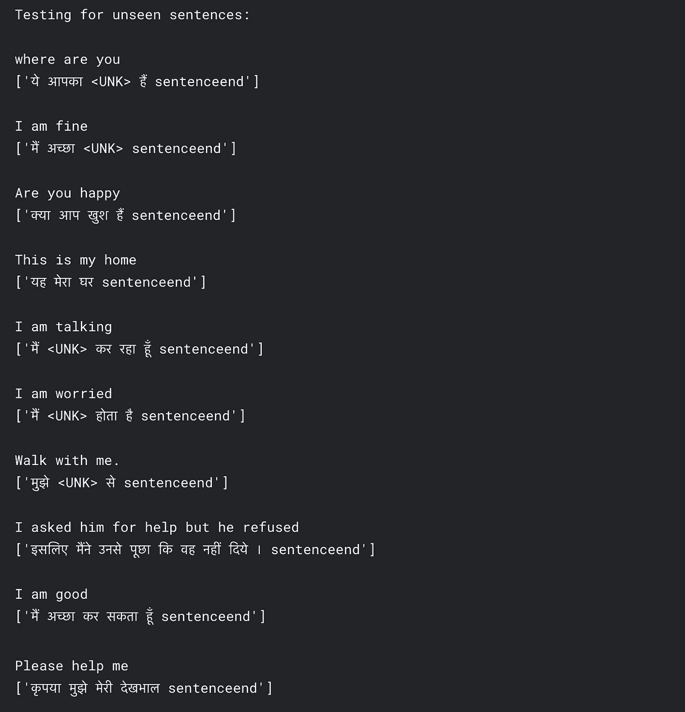

# 具有注意机制的序列到序列模型的直观理解和逐步实现

> 原文：<https://towardsdatascience.com/intuitive-understanding-and-step-by-step-implementation-of-sequence-to-sequence-model-with-86be00ebe0fd?source=collection_archive---------41----------------------->

## 使用具有注意机制的序列到序列体系结构进行英语到印地语的神经机器翻译

如果你曾经使用过谷歌翻译或者曾经与 Siri、Alexa 或谷歌助手进行过交互，你就见证了序列对序列(seq2seq)神经架构的直接影响。Seq2seq 模型构成了机器翻译、图像和视频字幕、文本摘要、聊天机器人以及任何您可能想到的包括从一个数据序列到另一个数据序列的转换的任务的基础。

我们这里的重点是机器翻译，基本上是将一种语言的句子 *x* 翻译成另一种语言的句子 *y* 。机器翻译是 seq2seq 模型的主要用例，并通过注意机制得到改进。关于这类主题的文章通常涉及大量代码段的实现和来自多个库的大量 API 调用，而没有对概念本身的直观理解。在这里，我们将对理论和实现进行充分的公正。除了实现之外，我们还将详细了解 seq2seq 架构和关注点的每个组件代表什么。本文使用的代码可以在这里 找到 [*。*](https://github.com/ayushjain19/NMT-Sequence-to-sequence-model-with-Attention-mechanism-for-English-to-Hindi-Translation)

# 目标

*   在 Tensorflow 中实现、训练和测试英语到印地语的机器翻译模型。
*   对编码器、解码器和注意机制的作用在每一步形成直观和透彻的理解。
*   讨论如何进一步改进现有模型。

# 读取数据集

首先，我们导入我们将需要的所有库。在这个实现中使用的英语到印地语的语料库可以在 Kaggle [这里](https://www.kaggle.com/aiswaryaramachandran/hindienglish-corpora)找到。将下载一个名为“Hindi _ English _ Truncated _ corpus . CSV”的文件。确保在 *pd.read_csv()* 函数中放置正确的文件路径，与您的文件系统中的路径相对应。

让我们快速浏览一下我们正在处理的数据集。这相当简单。

# 预处理数据

在我们继续我们的编码器、解码器和注意力实现之前，我们需要以一种可以用数学方法解释的方式预处理我们的数据。请注意，预处理步骤还取决于我们正在处理的数据类型。例如，在这里考虑的数据集中，也有包含空字符串的句子。我们需要相应地处理这种情况。如果使用其他数据集，可能还会有一些额外或更少的步骤。预处理的步骤包括:

*   在单词和标点符号之间插入空格
*   如果手边的句子是英语，我们用空格代替除了 *(a-z，a-z，“), "?", "!"，"，"*
*   多余的空格被从句子中删除，关键字“sentencestart”和“sentenceend”被分别添加到句子的前面和后面，以让我们的模型清楚地知道句子何时开始和结束。

> 以上每个句子的三个任务都是使用 preprocess_sentence()函数实现的。我们还在开始时初始化了所有的超参数和全局变量。请务必阅读下面的这些超参数和全局变量。我们将在需要时使用它们。

*   遍历包含英语和印地语句子对的每个数据点，确保不考虑包含空字符串的句子，并且句子中的最大字数不大于值 *MAX_WORDS_IN_A_SENTENCE。*采取这一步骤是为了避免矩阵稀疏。
*   下一步是向量化我们的文本语料库。具体来说， *fit_on_texts()* 为每个单词分配一个唯一的索引。 *texts_to_sequences()* 将一个文本句子转换成一个数字列表或向量，其中数字对应于单词的唯一索引。 *pad_sequences()* 通过追加 *oov_token* (来自 vocab token)足够的次数以使每个向量具有相同的长度，从而确保所有这些向量最终具有相同的长度。 *tokenize_sentences()* 封装了以上这些功能。
*   接下来，我们从完整的数据集中获取训练集，然后对训练集进行批处理。我们训练模型的句子对的总数是 51712。

# 编码器

Seq2seq 架构涉及两个长短期记忆(LSTM)在[原文](https://arxiv.org/abs/1409.3215)中。一个用于编码器，另一个用于解码器。请注意，我们将在编码器和解码器中使用 GRU(门控循环单元)来代替 LSTM，因为 GRU 需要较少的计算能力，并且给出与 LSTM 几乎相似的结果。编码器涉及的步骤:

1.  输入句子中的每个单词被嵌入并表示在具有 *embedding_dim* (超参数)维度的不同空间中。换句话说，你可以说词汇中的单词数量被投射到一个具有嵌入维度的空间上。这一步确保了相似的词(如船&船，人&男孩，跑&走等。)就位于这个空间的附近。这意味着单词“*man”*和单词“ *boy* ”被预测到的几率几乎相同(不完全相同)，而且两个单词的意思相似。
2.  接下来，嵌入的句子被馈入 GRU。编码器 GRU 的最终隐藏状态成为解码器 GRU 的初始隐藏状态。编码器中的这个最终 GRU 隐藏状态具有源句子的编码或信息。源句子的这种编码也可以由所有编码器隐藏状态的组合来提供[我们将很快看到，这一事实对于注意力概念的存在是必不可少的]。

# 解码器(无需注意)

> 注意:在这一节中，我们将理解不涉及注意力的情况下的解码器。这对于理解注意力和解码器的作用是很重要的，这将在前面的章节中解释。

解码器 GRU 网络是生成目标句子的语言模型。最终的编码器隐藏状态被用作解码器 GRU 的初始隐藏状态。给予解码器 GRU 单元以预测下一个的第一个字是类似于“ *sentencestart* ”的开始标记。这个令牌用于预测所有的 *num_words* 个单词出现的概率。在训练时，使用预测的概率张量和实际单词的一键编码来计算损失。该损失被反向传播以优化编码器&解码器中的参数。同时，具有最大概率的单词成为下一个 GRU 单元的输入。重复上述步骤，直到出现类似“*句子 end* 的结束标记。

无需注意的编码器-解码器模型

**这种方法的问题:**

*   信息瓶颈:如上所述，对于解码器来说，编码器的最终隐藏状态变成了初始隐藏状态。这造成了信息瓶颈，因为源句子的所有信息都需要在最终状态下被压缩，与在句子中很久以前看到的信息相比，这也可能偏向于在句子末尾的信息。

> 解决方案:我们通过不仅仅依赖编码器最终状态来获得源语句的信息，而且使用来自编码器的所有输出的加权和来解决上述问题。那么，你问哪个编码器输出的权重比另一个大呢？注意这里的救援，我们将在接下来的部分讨论这一点。

# 现在注意点

注意力不仅为瓶颈问题提供了解决方案，还为句子中的每个单词赋予了权重。你看，源序列在**编码器输出**中有它的信息，在解码器中被预测的字在相应的**解码器隐藏状态**中有它的信息。我们需要知道哪个编码器输出保存了与解码器隐藏状态相似的信息。因此，这些编码器输出和解码器隐藏状态被用作数学函数的输入，以产生注意力得分向量。当预测一个单词时，在每一步计算这个注意力得分向量(在解码器中的每个 GRU 单元)。该向量确定每个编码器输出的权重，以找到加权和。

> 注意力的一般定义:给定一组向量“值”和一个向量“查询”，注意力是一种计算依赖于查询的值的加权和的技术。
> 
> 在我们的 seq2seq 架构的上下文中，每个解码器隐藏状态(查询)关注所有编码器输出(值)，以获得取决于解码器隐藏状态(查询)的编码器输出(值)的加权和。
> 
> 加权总和是值中包含的信息的选择性汇总，其中查询确定关注哪些值。这个过程就像将查询投影到值空间中，以在值空间中找到查询(得分)的上下文。高分表示对应的值与查询更相似。

根据[原文](https://arxiv.org/abs/1409.0473)注意，*解码器决定源句中需要注意的部分。通过让解码器具有注意机制，我们将编码器从必须将源句子中的所有信息编码成固定长度向量的负担中解脱出来。利用这种新方法，信息可以在注释序列中传播，解码器可以相应地选择性地检索注释序列。*

还记得我们刚刚谈到的数学函数吗？嗯，有几种方法可以找到注意力得分(相似度)。主要的例子如下:

1.  基本点积注意
2.  倍增注意力
3.  附加注意力

在这里，我们不会深入讨论每一个问题。一个简单的谷歌搜索就足以深入其中。对于我们的实施，我们将考虑**基本点积注意事项**，因为它最容易掌握。你已经猜到这一类注意力是做什么的了。从名字判断，它是输入矩阵的点积。

> 请注意，基本的点积注意力有一个假设。它假设要进行点积的轴上的两个输入矩阵的维数需要相同，才能进行点积。在我们的实现中，这个维度由超参数 **hidden_units** 给出，并且对于两个编码器&解码器是相同的。

编码器输出加权和的计算

理论太多。现在让我们回到代码上来！我们将定义我们的注意力类别。

1.  取编码器输出张量和解码器隐藏状态的点积，得到注意力得分。这是通过 Tensorflow 的 *matmul()* 函数实现的。
2.  我们取上一步得到的注意力分数的最大值。这样做是为了使分数正常化，并使值在区间[0，1]内。
3.  编码器输出与相应的注意力分数相乘，然后相加得到一个张量。这基本上是编码器输出的加权和，由 *reduce_sum()* 函数实现。

# 解码器(注意)

在我们的解码器类中采取了以下步骤。

1.  就像编码器一样，我们在这里也有一个嵌入层，用于目标语言中的序列。序列中的每个单词都表示在嵌入空间中，其中具有相似含义的相似单词接近。
2.  我们还通过使用当前解码器隐藏状态和编码器输出来获得编码器输出的加权和。这是通过调用我们的注意力层来完成的。
3.  我们连接在上面两个步骤中获得的结果(嵌入空间中序列的表示和编码器输出的加权和)。这个级联张量被发送到我们解码器的 GRU 层。
4.  该 GRU 层的输出被发送到一个密集层，该层给出所有 *hindi_vocab_size* 个单词出现的概率。概率高的单词暗示模型认为这个单词应该是下一个单词。

注意的编码器-解码器模型

# 培养

我们定义我们的损失函数和优化器。选择稀疏分类交叉熵损失和 Adam 优化器。每个培训步骤涉及的步骤:

1.  从编码器对象获取编码器序列输出和编码器最终隐藏状态。编码器序列输出将用于寻找注意力分数，并且编码器最终隐藏状态将成为解码器的初始隐藏状态。
2.  对于要在目标语言中预测的每个单词，我们给出一个输入单词、先前的解码器隐藏状态和编码器序列输出作为解码器对象的参数。返回单词预测概率和当前解码器隐藏状态。
3.  具有最大概率的字被认为是下一个解码器 GRU 单元(解码器对象)的输入，并且当前解码器隐藏状态成为下一个解码器 GRU 单元的输入隐藏状态。
4.  使用单词预测概率和目标句子中的实际单词来计算损失，并反向传播。

在每个历元中，为每一批调用上述训练步骤，并最终存储和绘制对应于每个历元的损失。

> 补充说明:在步骤 1 中，为什么我们仍然使用编码器的最终隐藏状态作为解码器的第一个隐藏状态？
> 
> 这是因为，如果我们这样做，seq2seq 模型将作为一个单一系统进行优化。反向传播是端到端的。我们不想分别优化编码器和解码器。并且，没有必要通过这个隐藏状态获得源序列信息，因为我们现在已经有了我们的注意力:)

# 测试

为了测试我们的模型在训练后的表现，我们定义了一个函数，该函数接收一个英语句子，并根据我们的模型的预测返回一个印地语句子。让我们实现这个函数，我们将在下一节中看到结果的好坏。

1.  我们接受英语句子，对其进行预处理，并将其转换为长度为 MAX_WORDS_IN_A_SENTENCE 的序列或向量，如最开始的“预处理数据”部分所述。
2.  这个序列被输入到我们训练过的编码器中，编码器返回编码器序列输出和编码器的最终隐藏状态。
3.  编码器的最终隐藏状态是解码器的第一个隐藏状态，输入到解码器的第一个字是开始标记“sentencestart”。
4.  解码器返回预测的单词概率。具有最大概率的单词成为我们预测的单词，并被附加到最终的印地语句子中。这个字作为下一个解码器层的输入。
5.  预测单词的循环继续，直到解码器预测到结束标记“sentenceend”或单词数量超过某个限制(我们将该限制保持为 MAX_WORDS_IN_A_SENTENCE 的两倍)。

# 结果

先说结果和发现。我用 NVidia K80 GPU 在 Kaggle 上运行代码，上面的代码中给出了超参数。100 个纪元，训练用了 70 分钟。损失与时期的关系图如下所示。

在训练了 35 个纪元后，我尝试将随机的英语句子扔给我们的 *translate_sentence()* 函数，结果有些令人满意，但在某种程度上仍有疑问。显然，超参数可以进一步优化。

**35 个周期后的结果**

但是超参数并不是唯一要对实际翻译中的一些偏差负责的因素。让我们就可以实现以使我们的模型表现得更好的一些要点进行一个小小的讨论。

# 可能的改进

在实现我们的模型时，我们已经对编码器、解码器和注意机制有了非常基本的了解。根据可用的时间和计算能力，以下是可以尝试和测试的一些要点，以了解它们在实施时是否工作良好:

1.  编码器和解码器使用堆叠 GRU
2.  使用不同形式的注意力如上所述
3.  使用不同的优化器
4.  数据集大小的增加
5.  使用波束搜索解码代替贪婪解码

> 我们看到的解码是贪婪解码。我们假设具有最高概率的字是最终预测的字，并输入到下一个解码器状态。这种方法的问题是没有办法撤销这个决定。另一方面，波束搜索解码考虑来自单词概率分布的前 k 个可能单词，并检查所有可能性。你可以阅读更多关于波束搜索解码和一些其他可能的解码[这里](https://medium.com/voice-tech-podcast/visualising-beam-search-and-other-decoding-algorithms-for-natural-language-generation-fbba7cba2c5b)。

我希望这里提供的信息增加了您对 NLP 和 seq2seq 架构的理解。关注推广更多这样的内容。你也可以在 [LinkedIn](https://www.linkedin.com/in/ayushjain19/) 上和我联系。

# 参考

1.  【https://arxiv.org/abs/1409.3215】原文为序对序架构没有注意
2.  [https://arxiv.org/abs/1409.0473](https://arxiv.org/abs/1409.0473)原文为序对序架构关注
3.  数据集:[https://www . ka ggle . com/aiswaryaramachandran/hindienglish-corpora](https://www.kaggle.com/aiswaryaramachandran/hindienglish-corpora)
4.  [斯坦福 CS224N:具有深度学习的| Winter 2019 |第八讲—翻译，Seq2Seq，注意](https://www.youtube.com/watch?v=XXtpJxZBa2c&list=PLoROMvodv4rOhcuXMZkNm7j3fVwBBY42z&index=8)
5.  [https://www . tensor flow . org/tutorials/text/NMT _ with _ attention](https://www.tensorflow.org/tutorials/text/nmt_with_attention)