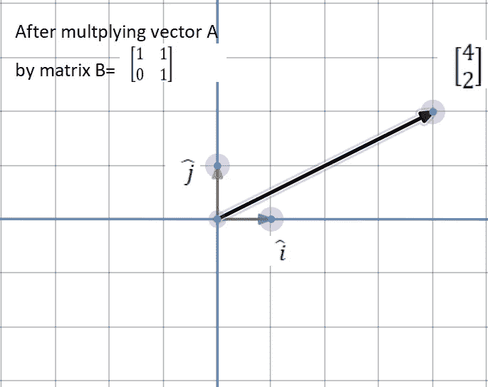
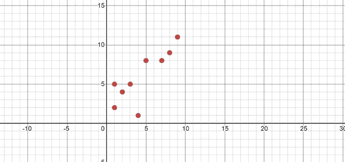
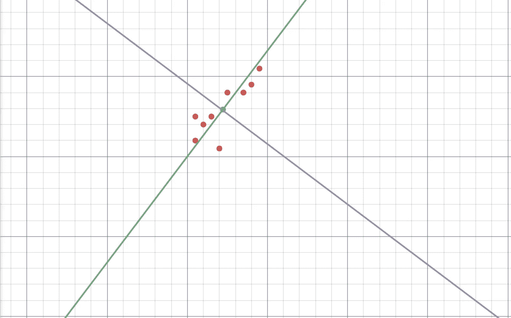
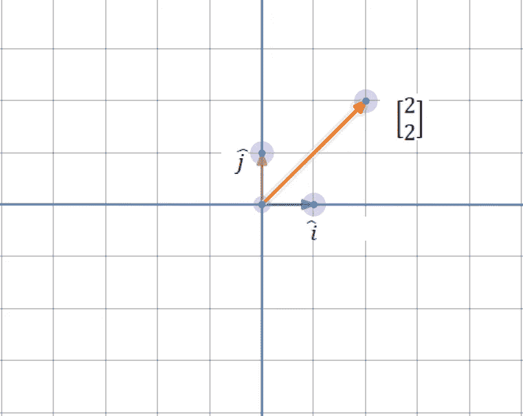
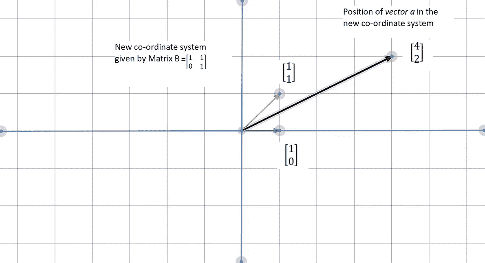
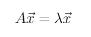
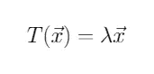
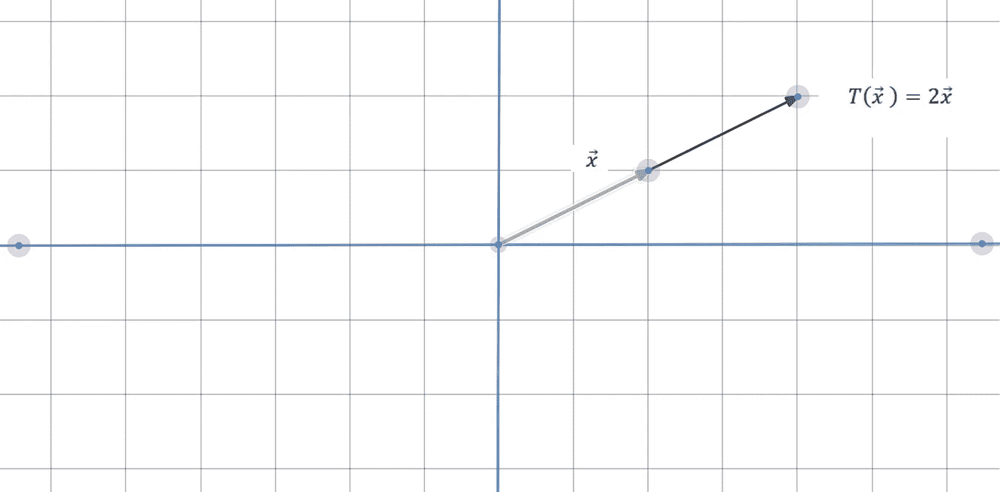
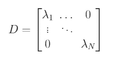
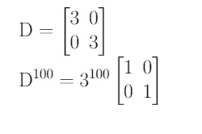

# 对特征向量的直观理解:PCA 的关键

> 原文：<https://towardsdatascience.com/intuitive-understanding-of-eigenvectors-key-to-pca-a30a261c80de?source=collection_archive---------19----------------------->

真正理解主成分分析(PCA)需要对线性代数背后的概念，尤其是特征向量有一个清晰的理解。有许多文章解释了 PCA 及其重要性，尽管我发现有一些文章解释了 PCA 背后的直觉。

这篇文章的目的是给特征向量一个直观的理解，使你更好地理解主成分分析。PCA 算法的步骤不是本文的重点。

首先，我想从可视化线性代数的一些基本概念开始。

## **线性变换**

矩阵在线性空间中被称为函数或“变换”——这意味着，在线性空间中对向量进行变换后，保持了*线性度*。参考下面的例子-

在图中，我们看到一个向量*a =【2 ^ 2】*在乘以矩阵 b 后，被转换成向量*【4 ^ 2】*

图 1(左)显示了变换前的矢量“a ”,图 2 显示了被矩阵 B“变换”后的矢量“a”

## **基础变更**

在标准坐标系中，单位矢量 *i 和 j* 被认为是“基”矢量。这些标准基向量成为测量我们系统的一种方式。

但是，如果我们想改变基本向量，因为我们的数据在不同的系统中可能看起来更好呢？

例如，如果我们在二维空间中有一些数据点。

二维平面中的分散数据

这个视图告诉我们一些关于数据的信息，但是如果我们旋转坐标轴，我们可以得到一个更清晰的视图。

新轴以数据的平均值为中心。这种旋转使我们更容易测量数据的*分布*或*方差*。它还清楚地显示了存在两个不同的数据组。

那么，我们如何着手改变基础呢？—线性变换。

矩阵乘法只不过是把当前坐标系的基变换成矩阵定义的新坐标系。矩阵的列向量给出了新基向量的位置。

以前面的线性变换为例，我们将向量 *a* 乘以矩阵 *B* ，我们找到了向量 *a* 在矩阵 B 的基本向量所跨越的新坐标系中的位置。参见下图。

图 1(左)显示了标准坐标系中的矢量 a。图 2(右)显示了放置在矩阵 B 给出的新坐标系中的矢量 a

如果我们想“回到”原来的坐标系，我们只需将“新向量”乘以基矩阵变化的倒数 *B* 。

因此，将矢量*【4 ^ 2】*乘以 *B* 的逆，就得到矢量*【2 ^ 2】*。

## **特征向量和特征值**

特征向量和特征值如何适应所有这些？

在线性变换期间，可能存在一些保持在它们的原始跨度上的向量，并且仅被缩放或收缩。换句话说，它们的方向保持*不变*。数学上，它被表达为—

由变换 A 给出的特征向量 x 的表达式

λ是与特征向量 *x* 相关联的特征值，矩阵 A 被称为应用于向量 *x* 的变换。

表示为变换函数的特征向量

从几何学上讲，我们可以用下面的方式来形象化它

向量 x 上的变换导致将其拉伸 2 倍(请注意，方向或跨度没有变化)

这里，对向量 *x* 的变换将它拉伸到两倍的长度。因此，与该变换相关的特征值是 2。负特征值与*翻转*向量或反转向量方向相关。

## 是什么让它们如此有用？

由特征向量给出的坐标系被称为*特征基，*它可以写成对角矩阵，因为它将每个基向量缩放了某个值。

具有 N 个特征向量的对角矩阵

对角矩阵使计算变得非常容易。考虑将矩阵提升到 100 的幂，在非对角矩阵的情况下，这将成为一项艰巨的任务。在对角矩阵的情况下，计算相当简单。

对角矩阵使计算更容易

**根据 PCA**

PCA 的目标是*最小化冗余*和*最大化方差*以更好地表达数据。这是通过找到与数据点的协方差矩阵相关联的特征向量来实现的。然后将数据投影到由这些特征向量构成的新坐标系上。要进一步了解 PCA，请查阅参考文献[1]和[2]。

我希望这能作为对特征向量的直观理解，并帮助你更好地理解 PCA 算法。

**参考文献**—

所有的图表都是用-[https://www.desmos.com/](https://www.desmos.com/geometry/355373dbed)制作的

1.  PCA 教程—[https://arxiv.org/pdf/1404.1100.pdf](https://arxiv.org/pdf/1404.1100.pdf)
2.  [http://www.math.union.edu/~jaureguj/PCA.pdf](http://www.math.union.edu/~jaureguj/PCA.pdf)
3.  [https://www.khanacademy.org/math/linear-algebra/](https://www.khanacademy.org/math/linear-algebra/alternate-bases/eigen-everything/v/linear-algebra-showing-that-an-eigenbasis-makes-for-good-coordinate-systems)
4.  关于线性代数的精彩系列 3 blue 1 brown—【https://www.youtube.com/watch?v=fNk_zzaMoSs】T2&list = plzhqobowt qd D3 mizm 2 xvfitgf 8 he _ ab&index = 1