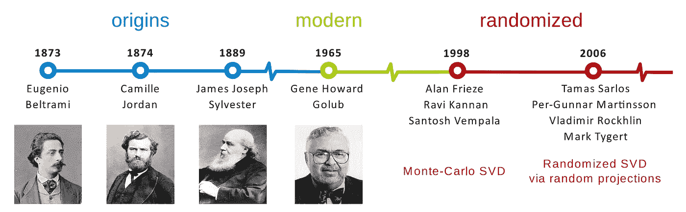
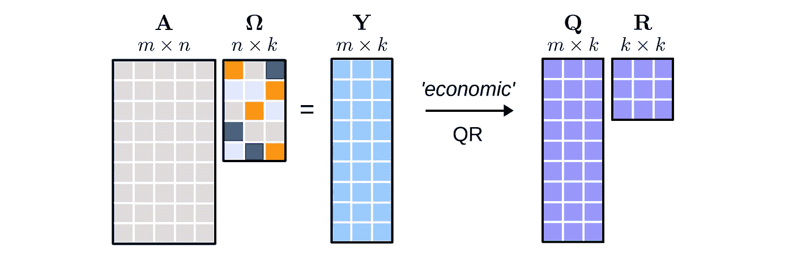
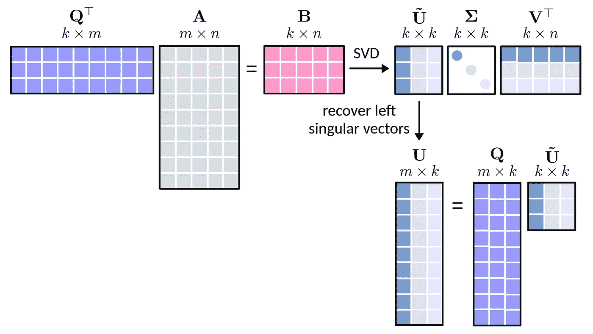
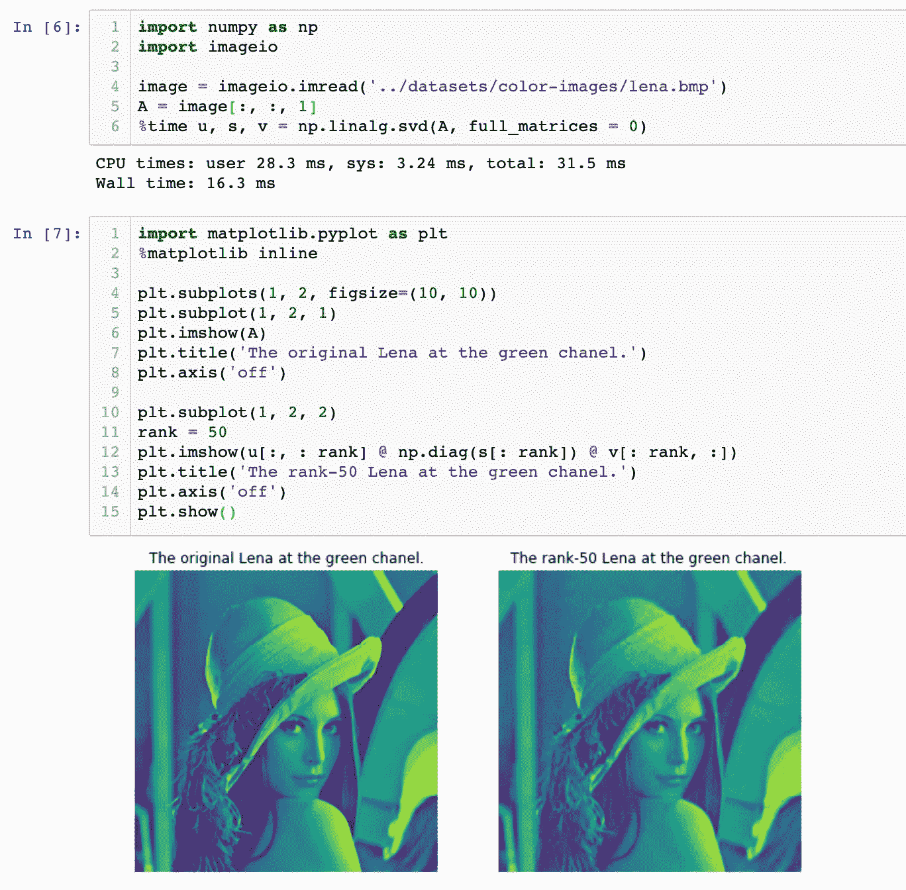
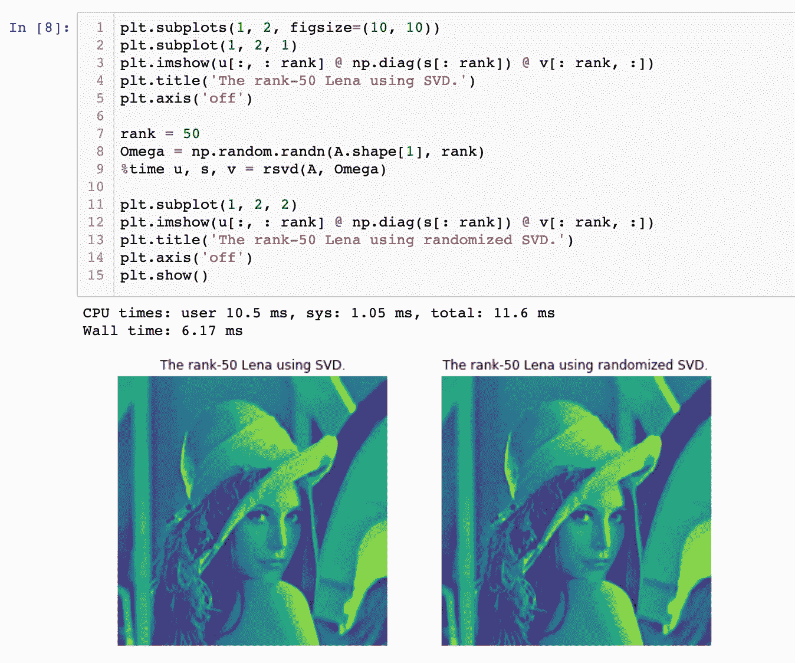

# 对随机化奇异值分解的直观理解

> 原文：<https://towardsdatascience.com/intuitive-understanding-of-randomized-singular-value-decomposition-9389e27cb9de?source=collection_archive---------16----------------------->

## 随机线性代数奇异值分解的 Python 实现

矩阵分解是许多机器学习问题的强大工具，它已经广泛用于数据压缩、降维和稀疏学习等。在许多情况下，为了用低秩结构逼近数据矩阵，奇异值分解(SVD)通常被证明是最佳选择。然而，大数据矩阵(例如，8k 乘 10k 矩阵)的准确且有效的 SVD 在计算上具有挑战性。为了解决这种情况下的奇异值分解，许多算法通过应用随机线性代数方法被开发出来。最重要的算法之一是随机化 SVD，它对于分解任何具有相对较低秩的大型矩阵具有竞争效率。



图 SVD 主要发展的时间表。(图片来自[2])

这篇文章将介绍随机奇异值分解的基本思想。为了帮助读者更好地理解随机化 SVD，我们在本文中还提供了相应的 Python 实现。另外，这个帖子的 Jupyter 笔记本可以在[这里](https://nbviewer.jupyter.org/github/xinychen/tensor-learning/blob/master/tutorial/randomized_svd.ipynb)找到。

# 初步的

**奇异值分解公式**

我们首先回顾奇异值分解的概念。你可能已经知道，SVD 是线性代数中最重要的分解公式之一。对于任意给定的矩阵 ***A*** ，SVD 具有如下形式

***a***=***u*σ*v***^t

其中矩阵*和 ***V*** 分别由左和右奇异向量组成。**σ**的对角线项为奇异值。*

***一个小矩阵例子***

*以一个 3 乘 3 的矩阵为例，我们可以通过使用 Python 中的`numpy.linalg.svd()`来计算 SVD。让我们看一看:*

```
*import numpy as npA = np.array([[1, 3, 2],
              [5, 3, 1],
              [3, 4, 5]])
u, s, v = np.linalg.svd(A, full_matrices = 0)
print('Left singular vectors:')
print(u)
print()
print('Singular values:')
print(s)
print()
print('Right singular vectors:')
print(v)
print()*
```

*在这种情况下，奇异值为 9.3427、3.2450 和 1.0885。*

```
*Left singular vectors:
[[-0.37421754 0.28475648 -0.88253894]
 [-0.56470638 -0.82485997 -0.02669705]
 [-0.7355732 0.48838486 0.46948087]]Singular values:
[9.34265841 3.24497827 1.08850813]Right singular vectors:
[[-0.57847229 -0.61642675 -0.53421706]
 [-0.73171177 0.10269066 0.67383419]
 [ 0.36051032 -0.78068732 0.51045041]]*
```

# *随机化奇异值分解*

***基本理念***

*随机化 SVD 可以分为三个主要步骤。对于任意给定的 *m* -by- *n* 矩阵*，如果我们强加一个目标秩 *k* 与 *k* < min( *m* ， *n* )，那么如图 2 所示的第一步就是**

*   **1)通过 *-k* 生成大小为 *n-* 的高斯随机矩阵**ω**，**
*   **2)计算新的 *m* -by- *k* 矩阵 ***Y*** ，**
*   **以及 3)对矩阵 ***Y*** 应用 QR 分解。**

**注意，第一步需要返回 *m* -by- *k* 矩阵 ***Q*** 。**

****

**图 2:随机化 SVD 的第一步。(图片来自[2])**

**然后，如图 3 所示的第二步是**

*   **4)将 ***Q*** 的转置矩阵与矩阵 ***A*** 相乘，得到一个 *k* -by- *n* 矩阵 ***B*** ，**
*   **以及 5)计算矩阵 ***B.*** 的 SVD 这里，不是计算原矩阵 ***A*** ， ***B*** 的 SVD，而是一个更小的矩阵来进行工作。**

**由于矩阵*的奇异值(即**σ**)和右奇异向量(即 ***V*** )也是原矩阵*A 的奇异值和右奇异向量，我们应该保留矩阵 ***B 计算的奇异值和右奇异向量*******

****

**图 3:随机化 SVD 的第二步和第三步。(图片来自[2])**

**如图 3 所示，如果将第一步中导出的矩阵 ***Q*** 与 ***B*** 的左奇异向量组合，就可以得到第三步中矩阵***【A***的左奇异向量(即 ***U*** )。**

****一个小矩阵例子****

**即使我们在上面已经学习了随机化 SVD 的基本思想，如果没有直观的例子，它也不会真正清楚。为此，我们遵循前面提到的小矩阵奇异值分解。**

**首先，让我们尝试编写随机化 SVD 的 Python 函数。这里，我们将使用两个 Numpy 函数，即`np.linalg.qr()`和`np.linalg.svd()`。**

```
**import numpy as npdef rsvd(A, Omega):
    Y = A @ Omega
    Q, _ = np.linalg.qr(Y)
    B = Q.T @ A
    u_tilde, s, v = np.linalg.svd(B, full_matrices = 0)
    u = Q @ u_tilde
    return u, s, v**
```

**现在，让我们用 3 乘 3 矩阵(`rank = 2`表示 *k* 用*k*min(*m*， *n* )来测试一下:**

```
**np.random.seed(1000)A = np.array([[1, 3, 2],
              [5, 3, 1],
              [3, 4, 5]])
rank = 2
Omega = np.random.randn(A.shape[1], rank)
u, s, v = rsvd(A, Omega)
print('Left singular vectors:')
print(u)
print()
print('Singular values:')
print(s)
print()
print('Right singular vectors:')
print(v)
print()**
```

**这个随机 SVD 示例的结果是:**

```
**Left singular vectors:
[[ 0.38070859  0.60505354]
 [ 0.56830191 -0.74963644]
 [ 0.72944767  0.26824507]]Singular values:
[9.34224023 3.02039888]Right singular vectors:
[[ 0.57915029  0.61707064  0.53273704]
 [-0.77420021  0.21163814  0.59650929]]**
```

**回想一下，这个矩阵的奇异值是 **9.3427** 、 **3.2450** 和 1.0885。在这种情况下，随机化 SVD 的前两个奇异值为 **9.3422** 和 **3.0204** 。**

**我们可以看到，由这两种 SVD 算法计算的第一奇异值非常接近。但是，随机化 SVD 的第二奇异值略有偏差。有没有其他方法可以改善这个结果？又是怎么做到的？**

**答案是肯定的！**

# **幂迭代随机奇异值分解**

**为了提高随机奇异值分解的质量，可以直接使用幂迭代法。关于幂迭代的更多细节，请参见[1]第 39 页，第 40 页也有一个 Matlab 实现。**

**在下面的 Python 代码中，`power_iteration()`是迭代计算 *m* -by- *k* 矩阵 ***Y*** 然后通过 QR 分解导出 *m* -by- *k* 矩阵 ***Q*** 的函数。**

```
**import numpy as npdef power_iteration(A, Omega, power_iter = 3):
    Y = A @ Omega
    for q in range(power_iter):
        Y = A @ (A.T @ Y)
    Q, _ = np.linalg.qr(Y)
    return Qdef rsvd(A, Omega):
    Q = power_iteration(A, Omega)
    B = Q.T @ A
    u_tilde, s, v = np.linalg.svd(B, full_matrices = 0)
    u = Q @ u_tilde
    return u, s, v**
```

**让我们测试一下新的`rsvd()`函数:**

```
**np.random.seed(1000)A = np.array([[1, 3, 2],
              [5, 3, 1],
              [3, 4, 5]])
rank = 2
Omega = np.random.randn(A.shape[1], rank)
u, s, v = rsvd(A, Omega)
print('Left singular vectors:')
print(u)
print()
print('Singular values:')
print(s)
print()
print('Right singular vectors:')
print(v)
print()**
```

**结果是:**

```
**Left singular vectors:
[[ 0.37421757  0.28528579]
 [ 0.56470638 -0.82484381]
 [ 0.73557319  0.48810317]]Singular values:
[9.34265841 3.24497775]Right singular vectors:
[[ 0.57847229  0.61642675  0.53421706]
 [-0.73178429  0.10284774  0.67373147]]**
```

**回想一下:**

*   **奇异值分解的奇异值有: **9.3427** ， **3.2450** ，1.0885。**
*   **无幂迭代的随机化 SVD 奇异值有: **9.3422** 和 **3.0204** 。**
*   **幂迭代的随机化 SVD 奇异值为: **9.3427** 和 **3.2450** 。**

**如您所见，幂迭代随机化 SVD 提供了极其精确的奇异值。**

# **图像压缩**

**如上所述，可以使用 SVD 或随机化 SVD 来压缩(低秩)信号矩阵。事实上，使用奇异值分解压缩图像的方法非常简单:直接对图像进行奇异值分解，只保留主奇异值和左/右奇异向量。在随机奇异值分解方面，我们可以先预先确定主奇异值的个数，然后通过随机奇异值分解得到奇异值和左/右奇异向量。**

**对于我们的评估，我们选择**莉娜**的彩色图像作为我们的数据。这张图片的尺寸是 256×256×3。在这里，我们通过只选择绿色通道来构建一个大小为 256×256 的矩阵*。***

*   *****直接使用 SVD*****

******

*   *****使用随机奇异值分解代替*****

******

***从这个图像压缩实验中我们可以看出:***

*   ***1)通过与 SVD 相比较，随机化的 SVD 也可以产生具有规定的低秩的精确压缩(这里，我们设置`rank = 50`)。***
*   ***2)随机化的 SVD 是计算友好的。通过指定`rank = 50`，随机化 SVD 的总 CPU 时间约为 **11.6 ms** ，而 SVD 的总 CPU 时间为 **31.5 ms** 。***

# ***摘要***

***在本文中，您发现了 SVD 的随机化线性代数方法。具体来说，您学到了:***

*   ***随机化奇异值分解的基本思想。***
*   ***如何用 Python 实现随机化的 SVD？***

***你有什么问题吗？***

# ***参考***

***[1]史蒂文·l·布伦顿，j·内森·库兹(2019)。数据驱动的科学与工程:机器学习、动力系统和控制。第 37–41 页。***

***[2] N .本杰明·埃里克森，谢尔盖·沃罗宁，史蒂文·l·布伦顿，j .内森·库兹(2016)。使用 R. arXiv 的随机矩阵分解:1608.02148。[ [PDF](https://arxiv.org/pdf/1608.02148.pdf)***