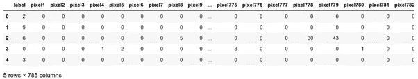
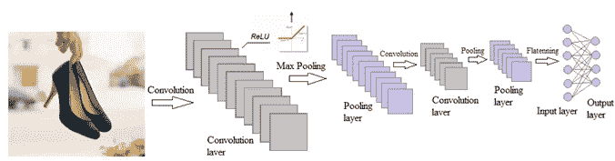
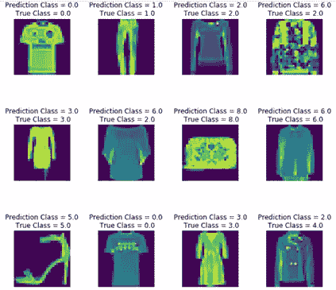

# 用于时尚图像多类分类的直观 CNN 创建

> 原文：<https://towardsdatascience.com/intuitively-create-cnn-for-fashion-image-multi-class-classification-6e31421d5227?source=collection_archive---------24----------------------->

## 服装图像分类中使用 Keras 的卷积神经网络创建的分步走查


Img 改编自 Pixabay 通过[链接](https://pixabay.com/photos/woman-umbrella-floating-jumping-1245817/)

在之前的[文章](https://medium.com/@vistaxjtu/cnn-classification-a-cat-or-a-dog-568e6a135602)中，我创建了一个卷积神经网络(CNN)用于二值图像分类。在本文中，我将为零售营销行业创建另一个 CNN。**本文的独特之处在于:不同格式的输入数据需要不同的数据处理方法，不同的 CNN 架构支持多类分类。**它被分成 6 部分。

1.  问题陈述
2.  数据处理
3.  模型结构
4.  模型编译
5.  模型拟合
6.  模型评估

让我们开始旅程吧🏃‍♀️🏃‍♂️.

1.  **问题陈述**

我们得到了一组来自零售业的图片。任务是创建一个 CNN 模型来预测一个时尚形象的标签:0 为 t 恤；1 作为裤子；2 作为套头衫；3 作为着装；4 作为外套；5 作为凉鞋；6 as 衬衫；7 作为球鞋；8 as 包；9 作为踝靴。

2.**数据处理**

我们使用的数据是具有 70，000 幅图像的 Fashion MINST 数据集，其中 60，000 幅用于训练集，10，000 幅用于测试集。所有图像都是灰度，高 28 像素，宽 28 像素。每个像素代表像素的暗度，范围从 0(黑色)到 255(白色)。

图 1 是训练数据的一个片段。请注意，代表图像的每一行都有一个关联的标签和 784 像素值。



图 1 训练数据片段

首先，读入训练和测试数据，将*数据帧*类型转换为 *NumPy 数组*。

```
fashion_train_df = pd.read_csv(‘fashion-mnist_train.csv’,sep=’,’)
fashion_test_df = pd.read_csv(‘fashion-mnist_test.csv’, sep = ‘,’)
training = np.array(fashion_train_df, dtype = ‘float32’)
testing = np.array(fashion_test_df, dtype=’float32')
```

如果您想以彩色或灰度模式查看图像，请尝试以下方式:

```
i = random.randint(1,60000) 
plt.imshow( training[i,1:].reshape((28,28)) ) 
plt.imshow( training[i,1:].reshape((28,28)) , cmap = ‘gray’) 
```

接下来，在 0 和 1 之间缩放独立变量，即像素。

```
X_train = training[:,1:]/255
y_train = training[:,0]
X_test = testing[:,1:]/255
y_test = testing[:,0]
```

然后，将训练数据分成训练集和验证集，验证占 20%。通过验证集，将评估模型对新数据进行概括预测的能力。

```
X_train, X_validate, y_train, y_validate = train_test_split(X_train, y_train, test_size = 0.2, random_state = 12345)
```

最后，我们需要重塑 *X_train* ， *X_validate* ， *X_test* 。这是一个临界点。 *Keras* 只接受 CNN 特殊形状的输入数据，即(批量大小，像素宽度，像素高度，颜色通道数)。因此，

```
X_train = X_train.reshape((-1, 28, 28, 1))
X_test = X_test.reshape(X_test.shape[0], *(28, 28, 1))
X_validate = X_validate.reshape(X_validate.shape[0], *(28, 28, 1))
```

请注意，有两种方法用于重塑上述数据，达到了相同的目的。**第一种方法为 *Numpy* 设置第一维度进行推断，第二种方法用*定义第一维度。**

太好了，现在数据已经准备好训练模型了😎。

3.**模型建立**

> 一般来说，建立一个 CNN 需要 4 个步骤:卷积、最大池化、扁平化和完全连接。在这里，我们将建立一个有两个卷积层的 CNN 模型。

3.1 卷积

> 从根本上说，CNN 是基于卷积的。简而言之，卷积使用一个核矩阵来扫描给定的图像，并应用滤镜来获得某种效果，如模糊和锐化。在 CNN 中，核用于特征提取，以选择图像中最重要的像素，同时保持像素之间的空间关系。

如果你想要一个详细的概念解释，请点击查看上一篇文章[。请随意探索这个神奇的](https://medium.com/p/568e6a135602/edit)[网站](https://setosa.io/ev/image-kernels/)来可视化卷积如何工作。另一个很棒的 T4 网站是瑞尔森大学的。它直观、互动地展示了 CNN 是如何工作的。

具体来说，

```
classifier = Sequential()
classifier.add(Conv2D(64,3, 3, input_shape = (28,28,1), activation=’relu’))
```

注意，特征检测器的数量 *n* 设置为 64，特征检测器为 3×3 阵列。 *input_shape* 是我们通过卷积对其应用特征检测器的输入图像的形状。我们设置为 *(28，28，1)。*这里，1 是灰度图像的通道数，28x28 是每个通道中的图像尺寸。这需要与 *X_train* 、 *X_test* 、 *X_validate* 的形状相同。

最后一个参数是激活函数。我们使用 ***ReLU*** 去除特征图中的负像素值。这是因为根据卷积中使用的参数，我们可能会在特征图中获得负像素。移除负像素增加了非线性分类问题的非线性。

3.2 最大池化

> 最大池化是通过滑动表格并取表格中的最大值来减小卷积产生的特征图的大小。最终，它的目标是在不丢失图像中的关键特征和空间结构信息的情况下，减少完全连接层中的节点数量。

具体来说，我们使用 *MaxPooling2D()* 函数来添加池层。一般来说，我们使用 2x2 的表格进行合并。

```
classifier.add(MaxPooling2D(pool_size = (2, 2)))
```

3.3 辍学

辍学是过度拟合的解决方案。辍学是怎么回事🤔？在每次训练迭代期间，一些神经元被随机禁用，以防止它们过于依赖彼此。通过覆盖这些神经元，神经网络每次都保留不同的架构，帮助神经网络学习数据的独立相关性。这可以防止神经元过度学习。

具体来说，

```
classifier.add(Dropout(0.25))
```

注意，我们在每次迭代中将 25%的神经元设置为禁用。

3.4 卷积和最大池化

基于之前的实验，添加第二层用于卷积和最大池以提高模型性能。

```
classifier.add(Conv2D(32,3, 3, activation=’relu’))
classifier.add(MaxPooling2D(pool_size = (2, 2)))
```

3.5 扁平化

> 展平是将所有缩减后的特征地图汇集成一个矢量，作为完全连接图层的输入。

具体来说，

```
classifier.add(Flatten())
```

3.6 完全连接

通过以上操作，我们将输入图像转换为一维向量。现在让我们使用这个向量作为输入来构建一个分类器。具体来说，

```
classifier.add(Dense(output_dim = 32, activation = ‘relu’))
classifier.add(Dense(output_dim = 10, activation = ‘sigmoid’))
```

注意，对于第一隐藏层，作为隐藏层中的节点数的 *output_dim* 被设置为 32。请随意尝试更多。使用 ***ReLU*** 作为激活功能。

完成后，祝贺你完成了模型制作。图 2 是我们构建的🎉🎉。



图 2 CNN 架构图(作者创建的 Img)

4.**模型编译**

添加完所有图层后，让我们为训练配置 CNN。要做的一个重要决定是损失函数。至于建议，如果一个样本可以有多个类或者标签，使用***categorial _ cross entropy***。如果类是互斥的(例如，当每个样本恰好属于一个类时)，使用***sparse _ category _ cross entropy***。这里用后者。

```
classifier.compile(loss =’sparse_categorical_crossentropy’, optimizer=Adam(lr=0.001), metrics =[‘accuracy’])
```

5.**模型拟合**

我们根据数据对模型进行 50 次迭代训练。该模型每 512 个样本更新其梯度。使用( *X_validate* ， *y_validate* )评估模型损耗和精度。

```
epochs = 50
history = classifier.fit(X_train, y_train, batch_size = 512, nb_epoch = epochs, verbose = 1, validation_data = (X_validate, y_validate))
```

最终我们得到了一个训练精度为 **92%** 和测试精度为 **90% ✨✨**

6.**模型评估**

现在，让我们在测试集上评估模型。具体来说，

```
evaluation = classifier.evaluate(X_test, y_test)
```

我们获得了一个 **90%** 的测试准确率！如果你想知道如何计算精度，请阅读这篇[文章](https://medium.com/@vistaxjtu/intuitively-explain-accuracy-precision-recall-and-f1-777563342aca)。

下面的图 3 显示了图像的预测标签和真实标签的视图。这个模型似乎不擅长区分套头衫(2)、衬衫(6)和外套(4)。



图 3 预测和真实类别比较

如果你想用更多的数据训练模型，可以随意探索这个[链接](http://mmlab.ie.cuhk.edu.hk/projects/DeepFashion.html)。如果你想查一个零售业数据科学创新的真实案例，可以查这个[页面](https://vue.ai/)。

**太好了！如果你觉得这篇文章有帮助，请随意点击👏s！如果需要源代码或者更多 CNN 用例，请访问我的** [**Github**](https://github.com/luke4u/CNN-Image-Classification) **页面🤞🤞。**