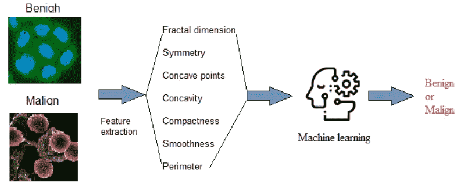
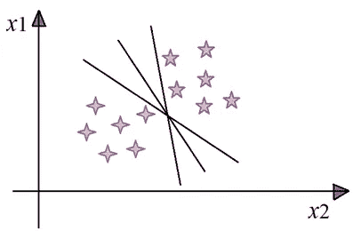
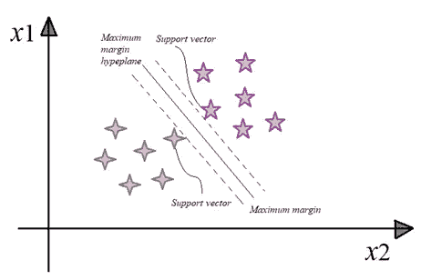
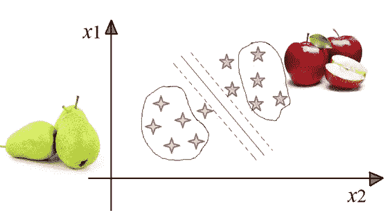
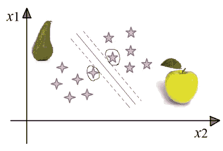
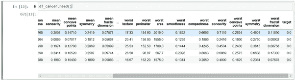
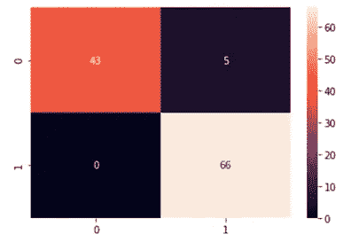
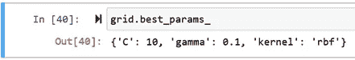
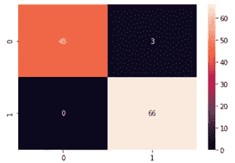

# 用于癌症预测的支持向量机

> 原文：<https://towardsdatascience.com/intuitively-explain-svm-and-build-for-breast-cancer-classification-cc9e081b7d86?source=collection_archive---------43----------------------->

## 支持向量机介绍及基于 Sklearn 的乳腺癌预测模型建立



来自 [Unsplash](https://unsplash.com/photos/L7en7Lb-Ovc) 的细胞图像

在这篇文章中，我将解释支持向量机(SVM)如何工作，并建立一个乳腺癌预测的 SVM 模型。全文分为以下六个部分。

1.  SVM 简介
2.  问题陈述
3.  数据处理
4.  模型拟合和评估
5.  模型优化

现在让我们开始旅程🏃‍♂️🏃‍♀️.

1.  **SVM 简介**

支持向量机(SVM)最初在 20 世纪 60 年代开发，然后在 20 世纪 90 年代完善，在机器学习领域非常流行。它适用于可线性分离的数据，其中可以画线来分隔两个类别。SVM 是如何运作的🤔？

为简单起见，假设给出两列数据 *x1* 和 *x2* 。为了区分 *x1* 和 *x2* ，我们画了几条边界线，如图 1 所示。根据新数据的位置，这些线会产生不同的结果。但是如何决定哪条线是最好的分离呢🤔？SVM 就是这么做的。



图 1 SVM 分类图(作者创建的 Img)

## SVM 通过最大边距搜索最佳边界，如图 2 所示。换句话说，为了使这条线成为 SVM 的结果，从支持向量到边界的两个距离之和必须最大化。因此，只有支持向量对 SVM 结果有贡献。从概念上讲，它是一个简单的算法。



图 2 SVM 分类原则(作者创建的 Img)

为什么 SVM 与其他机器学习算法相比很特别？假设我们正在对水果进行分类:苹果或梨。大多数机器学习算法会看最像苹果的苹果，所以它知道苹果是什么。类似地，它试图通过查看梨的最典型特征来了解什么是梨，如图 3 所示。



图 3 应用/梨按普通 ML 分类(来自 [pixabay](https://pixabay.com/photos/search/) 的水果图像)

> 但对 SVM 来说，情况恰恰相反。如图 4 所示，SVM 试图观察更像梨或非标准苹果的苹果，以及更像苹果的梨。这些最不典型的梨和苹果充当支持向量。通过观察极端案例，SVM 旨在找到区分不同阶层的最佳分界线。



图 4 SVM 对苹果/梨的分类(来自 [pixabay](https://pixabay.com/photos/search/) 的水果图像)

2.**问题陈述**

乳腺癌是全球女性中最常见的癌症，占所有癌症病例的 25%。早期诊断可以大大增加存活的机会。关键的挑战是将肿瘤分为恶性 0 级或良性 1 级。

3.**数据处理**

我们的数据来自*UCI*机器学习库[这里](https://archive.ics.uci.edu/ml/datasets/Breast+Cancer+Wisconsin+(Diagnostic))。有 569 个癌症数据实例，其中 212 个是恶性的，357 个是良性的。从癌症图像中提取了 30 个特征。

首先，以*字典*的形式读入数据，并转换成带有“数据”和“目标”列的*数据帧*。

```
from sklearn.datasets import load_breast_cancer
cancer = load_breast_cancer()
df_cancer = pd.DataFrame(np.c_[cancer[‘data’], cancer[‘target’]],
columns = np.append(cancer[‘feature_names’], [‘target’]))
```

图 5 显示了数据片段。显然，所有的特征都是数值。不需要数据编码。



图 5 输入数据片段

接下来，准备训练数据 *X* 和 *y* 并分割数据，测试集占 20%。

```
X = df_cancer.drop([‘target’],axis=1)
y = df_cancer[‘target’]
X_train, X_test, y_train, y_test = train_test_split(X, y, test_size = 0.20, random_state=5)
```

拟合模型之前的一个必要步骤是特征缩放，以避免一个特征支配其他小特征并减少密集计算。这里我们使用*基于单位的归一化*来得到范围[0，1]内的所有值。

具体来说，

```
min_train = X_train.min()
range_train = (X_train — min_train).max()
X_train_scaled = (X_train — min_train)/range_trainmin_test = X_test.min()
range_test = (X_test — min_test).max()
X_test_scaled = (X_test — min_test)/range_test
```

4.**模型拟合和评估**

为了拟合和评估该模型，我们从 *sklearn* 获取 *SVM* 类。

```
from sklearn.svm import SVC
from sklearn.metrics import classification_report, confusion_matrix
svc_model = SVC()
svc_model.fit(X_train_scaled, y_train)
y_predict = svc_model.predict(X_test_scaled)
cm = confusion_matrix(y_test, y_predict)
```

经过测试，如图 6 的混淆矩阵所示，该模型显示了 96% ✨✨.的准确性



图 6 SVM 测试结果的混淆矩阵

5.**模型优化**

SVM 有两个有助于优化模型的关键参数。

> **第一个是 *C* 参数**，控制正确分类训练点和具有平滑边界之间的权衡。小的 *C* 使得错误分类的成本(惩罚)很低，从而产生平滑的边界。然而，如果使用大的 *C* 参数，这意味着错误分类的高成本，迫使模型更严格地解释输入数据，并可能过度拟合。
> 
> **第二个是*伽玛*参数。**它控制单个训练集的影响范围。有了大的 *gamma* ，模型将有一个很近的范围，对靠近超平面的点赋予更高的权重。该模型具有过度拟合的高风险，产生更弯曲的边界。然而，使用小的 *gamma* ，该模型将更加一般化，因为远离超平面的更多数据点将被训练。

具体来说，我们使用**网格搜索**来调整 *C* 和*伽马*参数。

```
from sklearn.model_selection import GridSearchCV
param_grid = {‘C’: [0.1, 1, 10, 100], ‘gamma’: [1, 0.1, 0.01, 0.001], ‘kernel’: [‘rbf’]}grid = GridSearchCV(SVC(), param_grid, refit=True, verbose=4)
grid.fit(X_train_scaled, y_train)
```

通过以上，我们找到了如图 7 所示的 *C* 和 *gamma* 的最佳参数。



图 7 网格搜索后的最佳参数

我们再次测试了模型，发现精度提高了 0.97，如图 8 所示。该模型仅将 3 个病例错误分类为恶性，这是一个不错的结果，因为这种错误分类不会对诊断造成任何显著影响🎉🎉。



图 8 优化后 SVM 测试结果的混淆矩阵

**太好了！如果你觉得这篇文章有帮助，请随意点击👏s！如果你需要一些额外的，访问我的** [**Github**](https://github.com/luke4u/Image-Classification) **页面🤞🤞。**