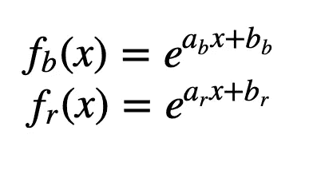

# 凭直觉，我们如何(更好地)理解逻辑回归

> 原文：<https://towardsdatascience.com/intuitively-how-can-we-better-understand-logistic-regression-97af9e77e136?source=collection_archive---------38----------------------->

## 逻辑回归和线性判别分析密切相关。这里有一个直观的方法来理解它们，并帮助我们定义 Softmax 回归

在我之前的文章中，我介绍了 5 个分类原则，它们帮助我们定义了 5 种以上的算法。

我们用于逻辑回归的直觉是“平滑直线”。平滑函数是一个**逻辑函数**。现在，我们如何更好地理解我们是如何想出这个逻辑函数的呢？

和上一篇文章一样，我们将用蓝点和红点来解释 1D 情况的原理。

# LDA 和逻辑回归是如何关联的

为了解释 LDA(线性判别分析)，思路是先建立两个**正态分布**。对于新的点 x，我们可以考虑:

*   **PDF_b(x)** 其中 PDF_b:为**蓝点**的概率密度函数
*   **PDF_r(x)** 带 PDF _ r:**红点**的概率密度函数
*   **p(B)** :蓝点比例
*   **p(R)** :红点比例

新点为蓝色的最终概率为:

p(B)×PDF _ B(x)/(p(B)×PDF _ B(x)+p(R)×PDF _ R(x))

现在让我们看看普通的 PDF:

由于我们考虑到在 LDA 的情况下，两个类别的标准偏差是相同的，因此我们可以简化，x 项将消失，这就是为什么我们称之为**线性**判别分析。

如果我们不采用同标准差的假设(这意味着两个类别具有相同的标准差)，x 项将保持不变，该算法称为**二次**判别分析。

所以对 LDA 来说，我们最终会得到这样的结果:

1/(1+exp(ax+b))

是的，一个逻辑函数！

当然，参数 a 和 b 与实际的 logistic 回归是不同的。

我们可以比较结果，在这种情况下，我们可以看到结果实际上非常接近(绿色曲线是 logistic 回归，黑色曲线是 LDA)。

结论:LDA 和逻辑回归产生的最终概率是逻辑函数。这两种方法之间的唯一区别在于

*   逻辑回归使用*最大似然*来估计参数
*   LDA，参数来自一个*正态分布*的估计均值和方差以及每类的比例(先验概率)

# 简化普通 PDF

既然知道正态 PDF 中的 x 会在同方差的假设下不了了之，也许一开始就可以直接去掉。

所以我们可以直接考虑:

我们可以测试一些参数，以便绘制曲线。让我们从蓝色曲线 fb(x)开始:

*   首先，我们可以让 a_b=1(蓝点的参数 a)
*   对于 b_b，我们可以说曲线应该通过点(x =蓝点的平均值，y=1)

我们认为红色曲线的情况是对称的:

*   a_r =-1
*   红色曲线应该通过该点(x =红点的平均值，y=1)

# 比率的计算

当我们计算比率得到最终概率时

我们最后还会有一个逻辑功能。

下面我们可以看到比例(黑线)。记住这里的参数 a 和 b 是手动选择的。

但即使如此，我们可以看到，在给定的情况下，它实际上并没有那么糟糕。下图中的绿线是逻辑回归模型，而黑线是用我们手动选择的参数计算的比率。

结论:logistic 回归是一个归一化的指数函数(由两类定义)。

# Softmax 回归

凭着“平滑直线”的直觉，对于多个预测类的情况，不容易一概而论。但是有了归一化指数函数的思想，我们可以增加更多的类。

对于 **K 类**，我们可以考虑这个归一化的指数函数来估计 x 属于**类 j** 的概率

这是一个包含 3 个类别的图表

这被称为 **softmax 回归**，现在你知道在这个花哨的名字背后，它只是逻辑回归的一个非常简单的概括。

因为您知道逻辑回归非常接近 LDA，所以 softmax 回归的结果应该接近**多类 LDA** ，如下图所示:

如果你发现一些不够直观的东西，或者如果你有任何问题，请评论，这将有助于我提高我的写作。