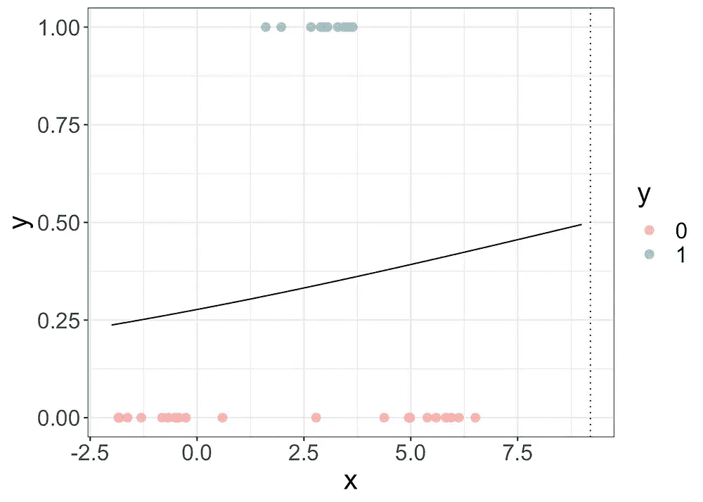

# 凭直觉，我们如何建立非线性分类器

> 原文：<https://towardsdatascience.com/intuitively-how-can-we-build-non-linear-classifiers-10c381ed633e?source=collection_archive---------39----------------------->

## 直观地

## 现实生活中的问题往往是非线性的，所以让我们看看算法是如何处理非线性可分数据的。

在我的文章 [*直观地说，我们如何理解不同的分类算法*](/intuitively-how-can-we-understand-different-classification-algorithms-principles-d45cf8ef54e3) 中，我介绍了 5 种数据分类的方法。

但是我用的玩具数据是**几乎线性可分**。因此，在本文中，我们将看到算法如何处理**非线性可分离数据**。

让我们举一些 1D 的简单例子。

*   左图(或第一幅图):带有一些噪声的线性可分数据
*   右图(或第二个图形):非线性可分离数据

# LDA 和标准差

LDA 表示**线性判别分析**。所以根据定义，它应该不能处理**非线性**可分数据。但也许我们可以做些改进，让它发挥作用？

让我们回到 LDA 的定义。想法是建立两个**正态分布**:一个用于蓝点，另一个用于红点。关于这两个正态分布的标准差的计算，我们有两个选择:

*   我们可以为这两个类选择相同的标准差
*   或者不同的标准偏差

**同方差和线性判别分析**

LDA 的思想包括比较两个分布(一个用于蓝点，一个用于红点)。或者我们可以计算蓝点密度的比率来估计新点属于蓝点的概率。

当估计正态分布时，如果我们认为两个类别的标准差相同，那么我们可以简化:

在上面的等式中，让我们用蓝色点的**下标 b 和红色点**的**下标 r 来记录平均值和标准偏差。**

最后，经过简化，我们得到了一个逻辑函数。

**异方差和二次判别分析**

如果我们为每一类保留不同的标准差，那么 x 项或二次项将保持不变。

在下图中，我们可以看到，如果红点和蓝点的标准偏差不同，会更有意义:

然后我们可以看到两条曲线接触的地方有两个不同的点，这意味着它们是相等的，所以，概率是 50%。我们可以用这两个交点作为两个决策边界。

正是因为二次项导致了二次方程，所以我们得到了两个零点。所以我们称这种算法为 **QDA** 或**二次判别分析**。

总之，用 LDA 提出非线性分类器是一种非常直观的方法:必须考虑不同类别的标准偏差是不同的。

但明显的缺点是，如果非线性更复杂，那么 QDA 算法就不能处理它。例如，如果我们需要 3 个线性边界的组合来分类数据，那么 QDA 将失败。

# 逻辑回归和一个二次项

逻辑回归在非线性可分数据面前表现也很差。我们可以在下面看到结果。

作为我上一篇文章的提醒，下面的图表显示了概率(蓝线和红线),您应该最大化乘积以获得逻辑回归的解。

我们知道 LDA 和逻辑回归是非常密切相关的。它们的最终模型是相同的，具有逻辑功能。但是参数的估计是不同的。你可以直观地阅读这篇文章 [*，我们如何(更好地)理解逻辑回归*](/intuitively-how-can-we-better-understand-logistic-regression-97af9e77e136) *。*

我们可以看到，从 LDA 到 QDA，区别在于二次项的存在。那么，为什么不尝试通过增加一个 x 项来改善逻辑回归呢？这就是为什么它被称为**二次逻辑回归**。

然后将一个变量的初始数据转化为两个变量的数据集。现在，我们可以看到数据似乎表现为线性。

我们可以对这两个变量进行逻辑回归，得到如下结果。因为我们有两个输入和一个介于 0 和 1 之间的输出。然后我们可以将算法创建的表面可视化。

然后就可以找到决策边界，对应的是概率等于 50%的线。哪一个是 **LR 表面**和 y=0.5 的平面的交点

在 2D，我们可以画出一条线，作为我们的决策界限。我们可以把概率作为颜色的不透明度。

现在，**二次 Logistic 回归**和**二次判别分析**是什么关系？在 1D，唯一的区别是参数估计的不同(对于**二次逻辑回归**，是似然最大化；对于 **QDA** ，参数来自均值和标准差估计)。

现在为了更高的维度。QDA 可以考虑协方差。至于 QDA，二次逻辑回归也无法捕捉数据中更复杂的非线性。

# SVM 及其内核

手动添加二次项的技巧同样适用于 SVM。下面的结果表明，超平面分隔符似乎捕捉到了数据的非线性。(带 X 的点是支持向量。)

数学家们找到了其他转换数据的“技巧”。其中一个技巧是应用一个高斯内核。之后我们会看到一个快速的证明。但是解释它的一个直观的方法是:不要把支持向量(这里它们只是点)看作孤立的，而是把它们看作围绕着某种**分布**。

我们先来看线性可分的数据，直觉仍然是分析**前沿地区**。代替线性函数，我们可以考虑采用由支持向量的**分布形成的分布的曲线。我们可以看到支持向量**【在边界】**更重要。**

现在让我们回到非线性可分的情况。我们可以应用同样的技巧，得到以下结果。

决策值是所有分布的加权和加上一个偏差。

我们可以注意到，在边境地区，我们有直线段。

最后，我们可以计算概率来对这些点进行分类。

内核技巧的想法可以看作是**将数据映射到一个更高维度的空间**。并且新的空间被称为**特征空间**。

在多项式核的情况下，我们的初始空间(x，1 维)被转换成 2 维(由 x 和 x 形成)。在高斯核的情况下，维数是无限的。我们可以用泰勒级数将指数函数转换成多项式形式。

来想象内核的变化。我们可以考虑分类器的双重版本。

将内核应用于原始版本相当于将其应用于对偶版本。

通过添加二次项的先前变换可以被认为是使用多项式核:

而在我们的例子中，参数 d(度)是 2，系数 c0 是 1/2，系数γ是 1。

因为

因此，高斯变换使用一个名为 **RBF** ( **径向基函数** ) **内核**或**高斯内核**的内核。

结论:核技巧被用于 SVM，使其成为一个非线性分类器。实际上，同样的方法可以应用于逻辑回归，我们称之为核逻辑回归。

# kNN 和决策树呢？

通过构造，kNN 和决策树是非线性模型。所以他们在非线性可分数据面前会表现的很好。

提醒一下，这是两种算法的原理。

对于 kNN，我们考虑一个局部常数函数，并为一个新点找到最近的邻居。然后邻居类的比例会导致最终的预测。

对于一棵分类树，思路是:**分而治之**。原则是除以最小化一个度量(可以是基尼系数或熵)。因此在生长树时可以找到非线性决策边界。

这是我们玩具数据决策树的结果。

下面是非线性分类器的工作原理:

*   使用 LDA，我们考虑不同类别数据的**异方差**，然后我们可以捕捉一些非线性。但是它是有限的，并且不能捕捉更复杂的非线性。
*   使用 SVM，我们使用不同的内核将数据转换到一个**特征空间**，在这里数据是更加线性可分的。内核的性质可以非常多样，因此我们可以处理更复杂的非线性。
*   对于逻辑回归，我们可以用一个**二次项**来转换它，或者我们可以使用**内核技巧**。
*   kNN 将考虑非线性，因为我们只分析邻域数据。
*   有了决策树，连续数据的分割可以在任何地方进行，只要指标指示我们继续分割数据以形成更同质的部分。

我花了很多时间试图找出一些直观的方法来考虑不同算法之间的关系。我希望它对你也有用。

我在这里没有讨论的另一种转换数据的方式是神经网络。您可以阅读下面的文章来了解如何操作。

 [## 直观来看，神经网络是如何工作的？

### “神经网络”这个术语可能看起来很神秘，为什么一个算法叫做神经网络？它真的模仿真实的…

towardsdatascience.com](/intuitively-how-do-neural-networks-work-d7710b602e51) 

对于不同分类器的原理，你可能会对这篇文章感兴趣。

 [## 凭直觉，我们如何理解不同的分类算法原理

### 机器学习算法有时可以被视为一个黑盒，那么我们如何以更直观的方式来解释它们呢？

towardsdatascience.com](/intuitively-how-can-we-understand-different-classification-algorithms-principles-d45cf8ef54e3)