# 凭直觉，我们如何理解不同的分类算法原理

> 原文：<https://towardsdatascience.com/intuitively-how-can-we-understand-different-classification-algorithms-principles-d45cf8ef54e3?source=collection_archive---------29----------------------->

## 机器学习算法有时可以被视为一个黑盒，那么我们如何以更直观的方式来解释它们呢？

在下图中，给定蓝点和红点，我们可以看到有一个模式。作为人类，我们可以用我们的“直觉”来区分它们，并预测一个新点的颜色。

例如，我们大多数人可能会说图中的黑点属于蓝点类别。但是你如何用数学的方式表达这种“直觉”呢？你会看到不同的直觉导致我们所知道的所有算法…

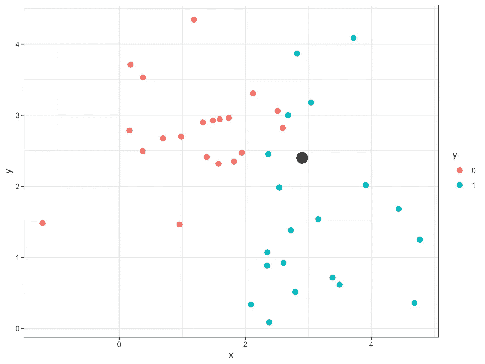

如果蓝点和红点对你来说可能比较抽象，那么让我们来看一些真实世界的例子。

*   肿瘤的诊断(B 为良性，M 为恶性)，具有两种不同的肿瘤特征。

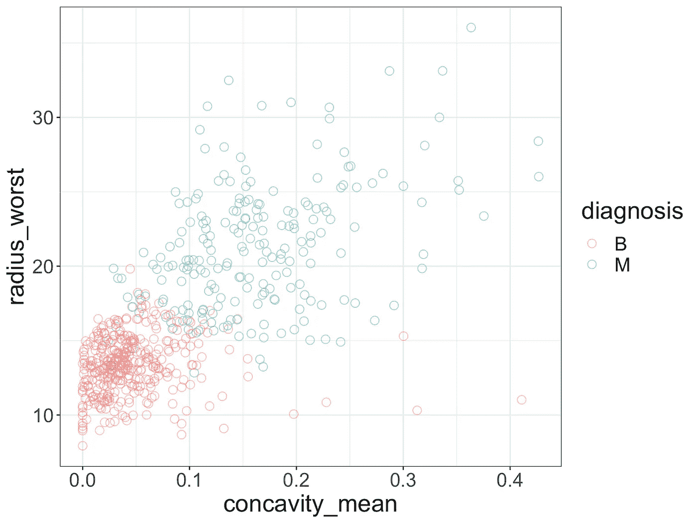

*   垃圾邮件检测:使用两个变量，美元符号的频率和单词“remove”的频率。

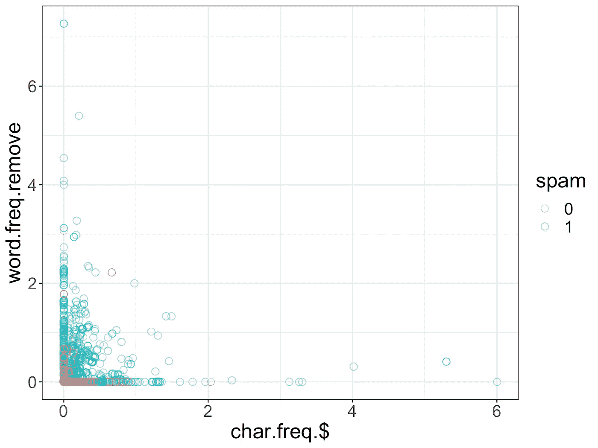

你可能已经知道一些可行的分类算法:逻辑回归、kNN、LDA(线性判别分析)、SVM、决策树等等。

但是理解它们直观吗？

首先，为了简化问题，我们将在本文中考虑 1D 的情况(我们将在另一篇文章中考虑 2D 的情况)

正如我们在下图中看到的，我们只有一个预测值，即 X，目标变量是 Y，有两个类，红点和蓝点。

注意，从数学上来说，“红”或“蓝”没有任何意义，所以我们将这个变量转换成一个二进制变量:1 代表“蓝”，0 代表“红”。这就对应了这个问题:圆点是蓝色的吗？1 代表真，0 代表假。当然，这只是约定俗成。

在现实世界的例子中，“圆点是蓝色的吗？”可以是:肿瘤是不是恶性的？这封邮件是不是垃圾邮件？

# 第一个原则:邻居分析

对于一个给定的点，其思想是查看该点的**邻居**。

邻居是什么？离**最近的**的那些？

“接近”是什么意思？**最短的**距离？

什么是距离？在这里，它只是指 x 的两个值之差(x 是一个实数)。

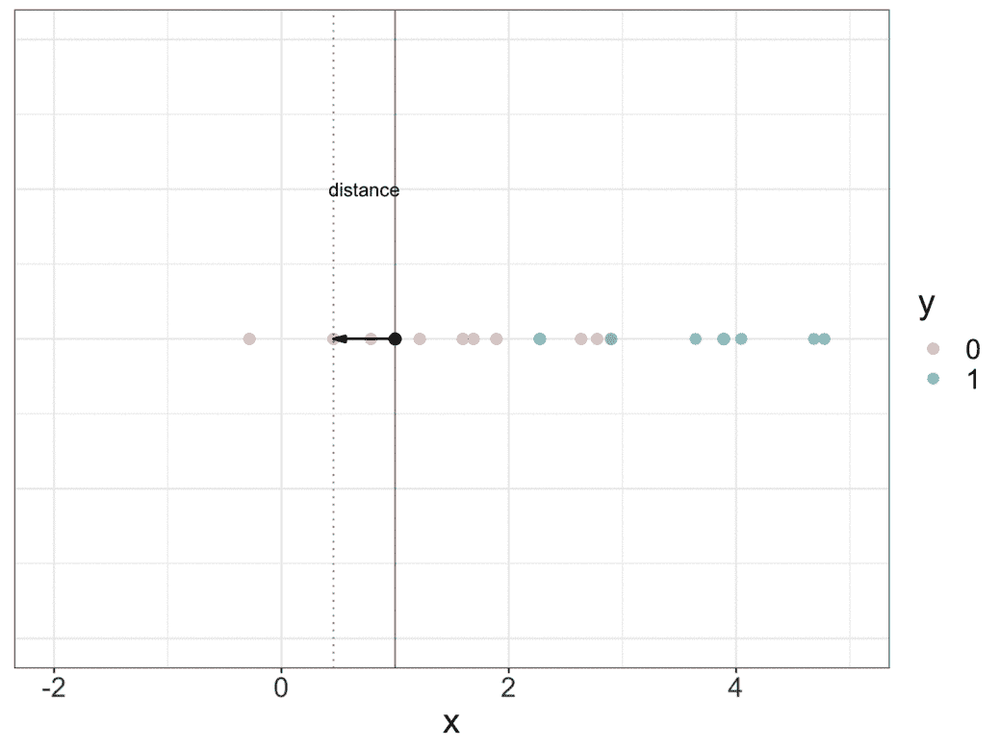

现在，给定一个新点，我们可以计算这个点和其他点之间的距离。我们可以选择最接近的。

但是有多少呢？这是这种方法的一个大问题:我们选择多少点？

首先，我们称这个数为 k，k=5。

现在我们可以检查邻居的等级。如果你有一个类的多数，那么你可以用多数类来预测。在我们的例子中，如果邻居的多数类是 1，那么新点很有可能属于类 1。

注意“多数”原则。所以如果我们选择了 k=4，那么就很难决定了。因此，如果 k 是奇数，它有助于作出明确的决定。

现在可以计算一个新点的概率，我们有下图:

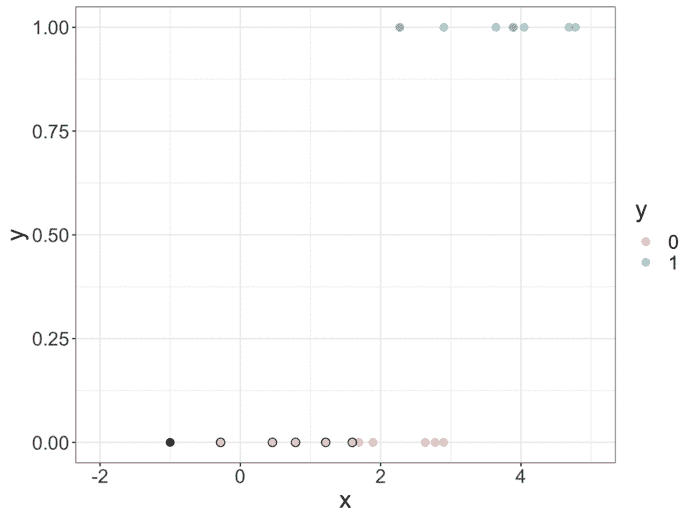

这个原理叫做 kNN，意思是 K 近邻。

现在，这个算法的特别之处在于，由于你不知道要保留哪些点，所以你必须为每个预测保留所有的点。这就是为什么我们说这个算法不是基于模型的，而是基于实例的。

# 第二个原则:全球比例和正态分布

我们刚刚在上面说过，选择数字 k 是不方便的，我们没有对我们的观察结果进行任何建模。

现在我们该怎么办？首先，让我们考虑所有的人口。如果您这样做，那么您的预测对所有新点都是一样的:多数类和概率将是多数类的比例。

这可能有点简单化了。为了做得更好，我们可以考虑点的正态分布。为什么是正态分布？这很简单，简化了所有的计算。这真的是个好理由吗？嗯，这就是我们所说的“建模”。

> 所有的模型都是错的，但有些是有用的。—乔治·博克斯，著名统计学家

现在，我们可以问一个更好的问题，而不是数邻居:我离蓝点或红点有多远。换句话说:给定一个新点，这个点是蓝色或红色的概率是多少？

*   这个新点离**蓝色**点有多近？我们考虑**蓝点**(标注为 PDF_b)的概率密度函数，距离(或者说接近度)将是 **PDF_b(x)**
*   新点离红色点有多近？我们考虑**红点**(记为 PDF_r)的概率密度函数，距离(或者说接近度)将是 **PDF_r(x)**

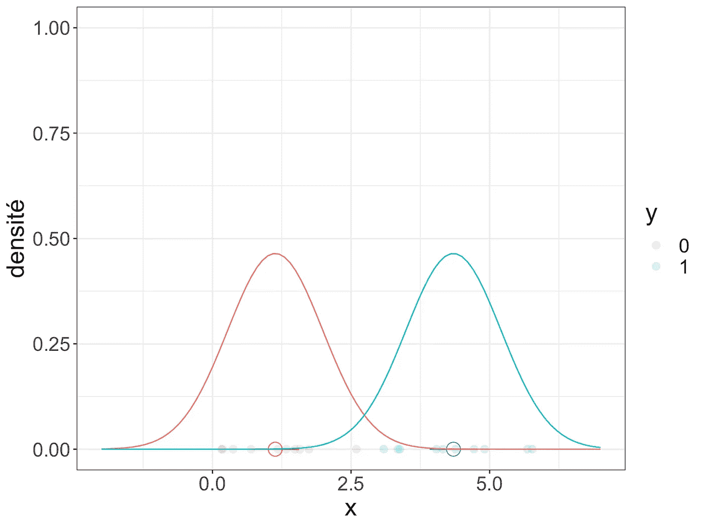

为了知道新点更接近哪种颜色，我们只需比较两个概率密度。下图中，黑色曲线代表比率: **PDF_b/(PDF_b+PDF_r)**

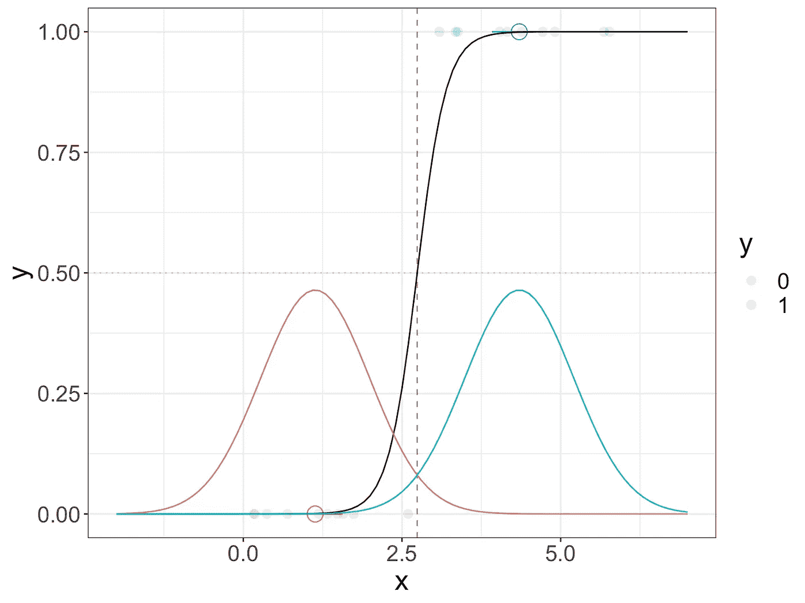

现在，就建模而言，令人惊讶的是:使用 kNN，您必须保留所有的点才能做出决定，现在您只需使用几个参数，如均值和标准差，以便定义正态分布。

在之前的数据集中，我们有相同数量的蓝点和红点。如果数字不同，我们可以用两个密度的比例来加权。

现在类似**线性判别分析**、**二次判别分析**、**朴素贝叶斯分类器**等算法都在使用这个原理。

它们之间有什么区别？

还记得我们必须计算正常密度吗？为了得到正态分布，我们必须计算平均值和标准差。就手段而言，很简单。但是对于标准差，我们有两个选择。我们可以计算每个类的标准差，或者，为了简化，我们可以认为这两个类的标准差是相同的。为什么我们可以使用两个标准差的加权值。为什么是“线性”对“二次”呢？为此，我写了另一篇文章:[直观地说，我们如何才能建立非线性分类器](/intuitively-how-can-we-build-non-linear-classifiers-10c381ed633e)。

# 第三个原则:分析前沿领域

根据前面的原则，我们可以看到，在对整个数据集建模之后，我们得出了一个决策边界。

现在，我们可以想:如果目标是找到一个前沿，为什么我们不直接分析前沿领域？

“边界区域”可以用 M(表示边距)来定义，M 是我们选择用来定义“边界区域”的两点之间的距离。我们可以将红色圆点的候选点记为**，将蓝色圆点的候选点**记为**。用数学术语来说，我们有:**

M=B-A

首先让我们考虑这两个类是线性可分的。然后我们可以计算红点的**最大值(我们得到 A)** ，蓝点的**最小值(我们得到 B)** 。(注意，在 1D 的情况下，最小值和最大值很容易定义。但是当维度更高时，它可能更复杂。)

现在*非常直观的(见下面的引用)，*我们可以选择两个值的平均值作为决策边界。

> 最大化间隔看起来不错，因为决策[区间]附近的点代表非常不确定的分类决策:分类器几乎有 50%的机会做出任何决定。具有较大裕度的分类器做出的分类决策确定性不低。这给了你一个分类安全裕度— [支持向量机:线性可分的情况](https://nlp.stanford.edu/IR-book/html/htmledition/support-vector-machines-the-linearly-separable-case-1.html)

但是如果有一个类 0 的值非常接近类 1 呢？那么我们将会有如下图所示的边界:

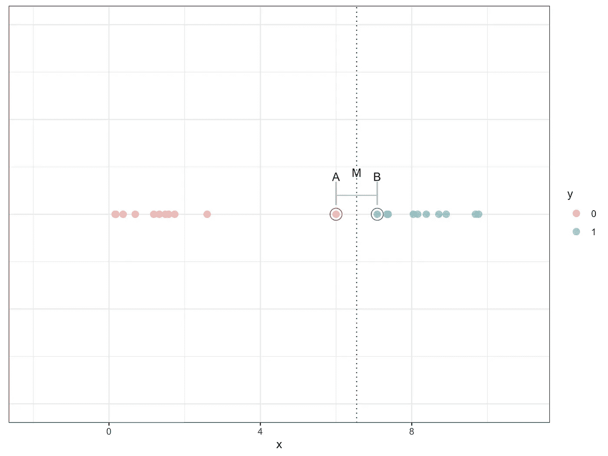

现在我们有了这种直觉，第二种情况下定义的决策边界并不是最优的:边界区域很小。现在，如果我们保持前面的 M，让异常点，如下所示:

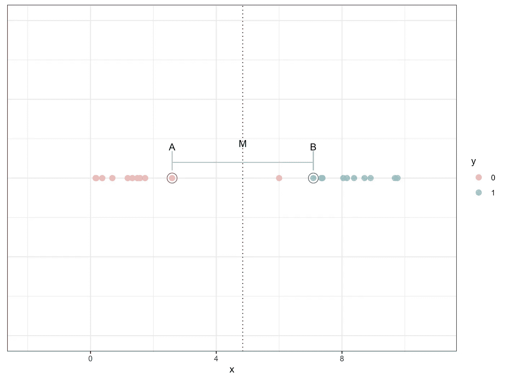

我们可以为异常点添加一个惩罚项，它可以是异常点和 a 之间的距离。

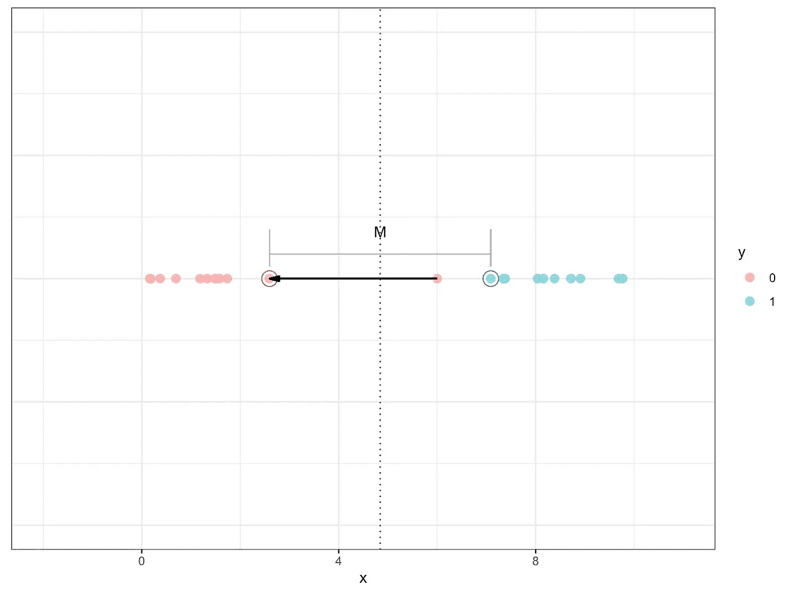

更好的是，我们可以用一个系数对惩罚进行加权，我们称之为 c。因此，最终的决策标准是:

M - C ×(红色异常点- S_r)

(保证金减去加权罚金)

一般来说，如果有几个异常点，我们可以对它们进行求和:

M - C × ( ∑(红色异常点- S_r) + ∑ (S_b -蓝色异常点))

通过这样做，我们还解决了如下图所示的点不是线性可分的情况下的问题(记住，我们说过我们可以首先考虑点是线性可分的，这样我们就可以得到我们直观的“边界区域”)。)

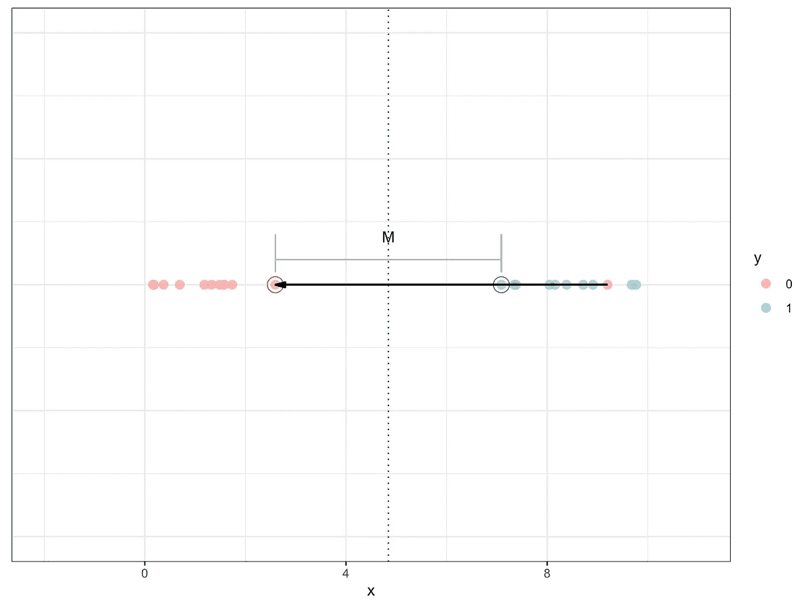

现在，这个原理被用于 SVM(支持向量机)，为了得到 SVM 的最终版本，我们必须做一些小的调整(我们将在另一篇文章中讨论它们)。而为什么叫“支持”呢？因为你使用不同的点(称为“支持向量”)来最大化边际(或者更准确地说是惩罚边际)。

# 第四个原则:寻找最佳曲线

对于这个原理，让我们考虑一条直线来模拟作为 x 的函数的 y。

y=a × x + b

为了简化这个问题的求解，我们可以考虑直线会经过每一类的均值，如下图所示。

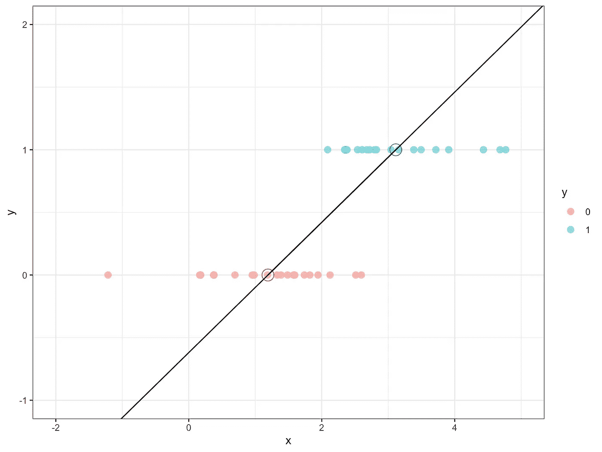

现在，当 y=0.5 时，你可以考虑 x 的值，这可以作为你决定 y 属于 0 类还是 1 类的边界。

但是用这个模型，对于 x 的大值，你会得到 y > 1，对于 x 的小值，y <0\. So what can we do? Let’s smooth it. Like this?

Come on, we can do better, like this?

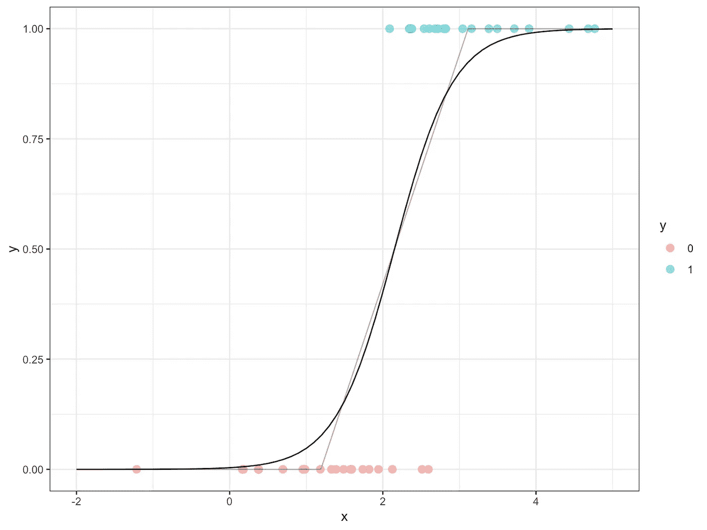

To do the smoothing in the graph above, we can use this function for example

p(x)= 1 / (1+exp(-(a × x + b)))

To understand why we use this function, you can note that we find the initial straight line : y(x)=a × x + b in this function, and we can define: sigma(y)= 1 / (1+exp( -y )))

So we have : p(x)=sigma(y(x))=1 / (1+exp(-(a × x + b)))

To visualize the smoothing effect, we can see the graph of sigma below

*   when x is very big, the output is very close to 1
*   when x is very small, the output is very close to 0

And now the task is to find the parameters: a and b. To achieve this goal, we can consider the probability of each point to be correctly classified.

*   For the blue dots, the probability value is p(x);
*   For the red dots, the probability value is 1-p(x).

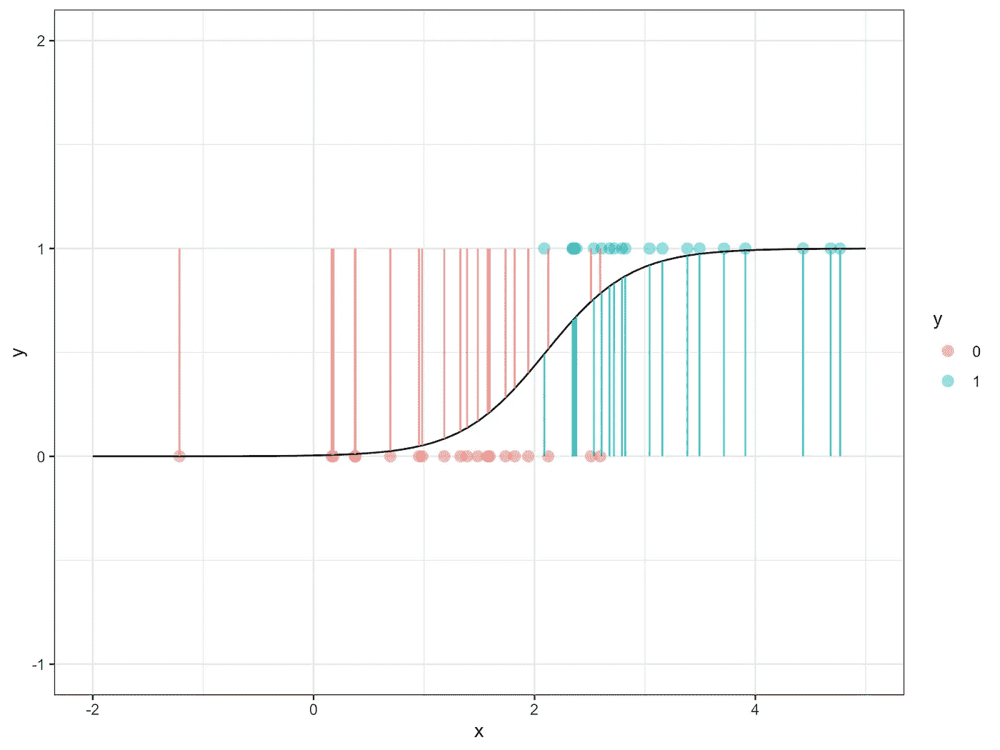

The criterion is the maximization of the overall probability: we multiply all the probabilities (for class 0 and class 1). And we try to maximize the result.

P_overall = product (p(x), for class 1) × product ( (1-p(x), for class 0)

Or in a simpler form

P_overall = product (p(x)×y +(1-p(x))×(1-y))

The mathematical trick is then to take the log and to take the derivatives, etc. But it turns out that there is not an easy way (a closed formula) to find the parameters, and we have to solve it numerically.

Below we can see the situation for different values of **a** 和 **b** 。垂直线段代表每个点的概率。所有这些概率的乘积应该最大化，以便优化 **a** 和 **b** 。

这是逻辑回归使用的原理，因为我们之前看到的 sigma 函数的名字，叫做逻辑函数。

(如果你觉得这个解释不够直观，可以看看这篇文章:[直观地说，我们如何(更好地)理解 Logistic 回归](/intuitively-how-can-we-better-understand-logistic-regression-97af9e77e136)

# 第五个原则:避免错误

最后一个原则是关于选择决策边界时可能犯的**错误**。

现在有哪些错误:

*   如果在该区域中，蓝色点占多数，那么红色点就是错误；
*   如果红点占多数，那么蓝点就是错误。

当找到决策边界时，这些点被分成两个区域。这个想法是为了描述区域的“同质性”:错误越少越好。

现在让我们找一个函数来描述区域的“均匀性”。以 p 为例，作为第 1 类的比例。我们得到 0 类的比例为(1-p)。

现在有了 p 和(1-p)，我们能做什么？让我们从非常简单的操作开始。

*   Sum？嗯，再想想。
*   产品。嗯，让我看看，这是一张图表。

所以这个函数是对称的，这是一个必需的特性，因为这个函数应该对任何一个类都有效。并且该函数的输出可以指示该区域的“均匀性”:越低越好

*   当 p 接近 1 时，几乎所有的点都是蓝色的，指示值很低
*   当 p 接近 0 时，那么几乎所有的点都是红色的，那么指标也很低
*   当 p 为 0.5 时，那么我们有相同数量的红点和蓝点，这不是理想的状态。该指标处于最高水平。

为了找到决策边界，我们必须测试不同的 x 值。对于 x 的每个值，创建两个区域:左手侧区域和右手侧区域。对于每一方，我们可以计算指标，然后我们用每个区域的分数比例对它们进行加权，以获得总体指标。

现在，我们可以测试作为决策边界的所有点，并查看指标如何变化。

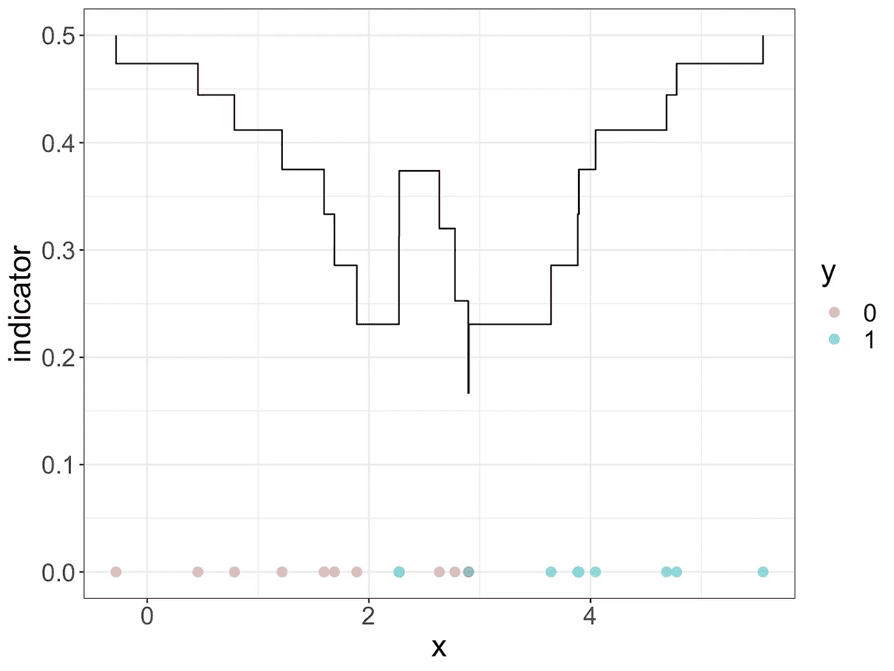

现在，我们可以采用指标的最低级别来找到 x 的最佳值。注意，由于我们有一个阶跃函数，我们可以计算定义指标最低级别的两个 x 值的平均值。

这个原则的特别之处在于，你可以在每个区域中继续寻找其他决策边界。我们将在另一篇专门讨论该原则的文章中看到，这样做的好处是您可以轻松处理非线性情况。

所以一步一步，我们可以一个一个的找到最优前沿。

这里我们有一个决策树，关于每一步不同的决策界限。

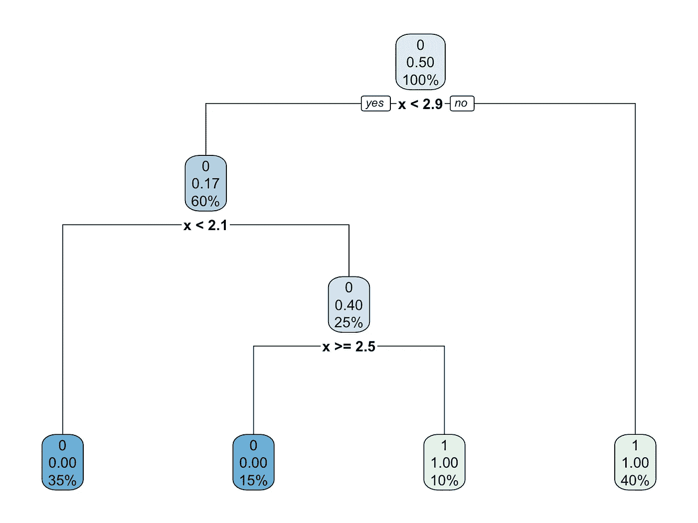

现在的问题是:我们什么时候停止？可以有不同的规则…

这个原则也被认为是“分而治之”。它让我们能够生长决策树。这些树也是更复杂算法的基础，如随机森林或梯度推进机器。

让我们回顾一下:

*   原则 1:检查邻居，我们得到 KNN
*   原则二:考虑全球比例和正态分布，我们可以做 LDA，QDA，或者 NB。
*   原则三:研究边疆地区，尽量做到“干净”和大。我们得到了 SVM。
*   原则四:画一条直线，平滑，试着调整。我们得到逻辑回归
*   原则 5:分而治之。我们得到了决策树。

请注意，我们没有完成五个原则的所有推理:

*   用 kNN 法测定水中的钾
*   决策树中的停止规则
*   系数 C 的确定
*   逻辑回归中 a 和 b 的确定

对于机器学习从业者来说，你可以注意到我自愿没有使用技术术语，也许你可以评论并把技术术语放在正确的上下文中:硬边、软边、梯度下降、凸性、超平面、先验概率、后验概率、损失函数、交叉熵、最大似然估计、过拟合……

当我们谈论机器学习和人工智能时，我们总是谈论神经网络，但为什么我们在这里没有提到它们？实际上，我们确实看到了一个简单的神经网络的例子**，它是**逻辑回归**，关于它的文章即将发表。**

使用的玩具数据非常简单:这两个类是线性可分的。这些算法是如何处理非线性可分的数据的？你可以阅读这篇文章:[直观地，我们如何才能建立非线性分类器](/intuitively-how-can-we-build-non-linear-classifiers-10c381ed633e)。