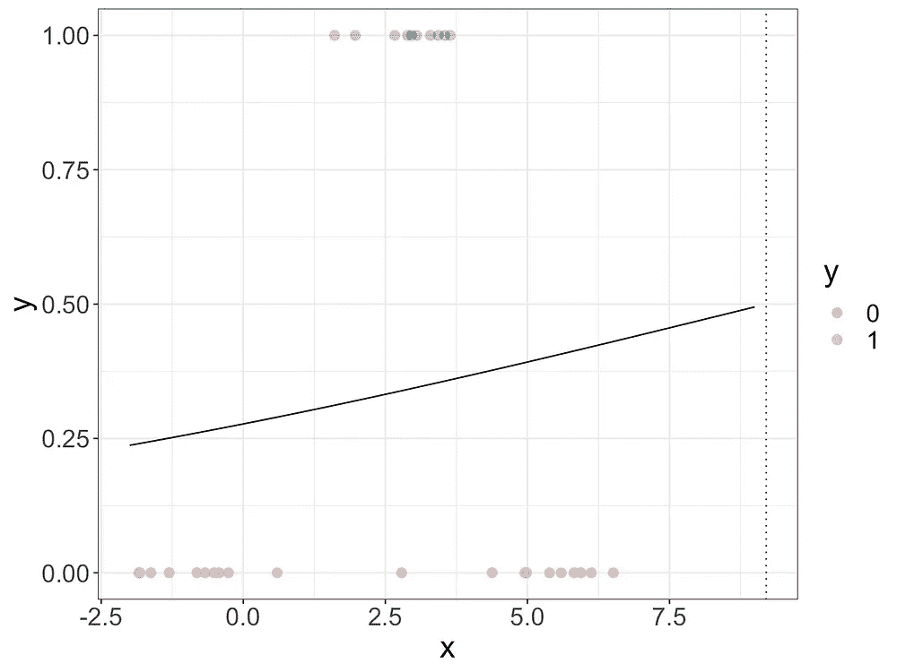
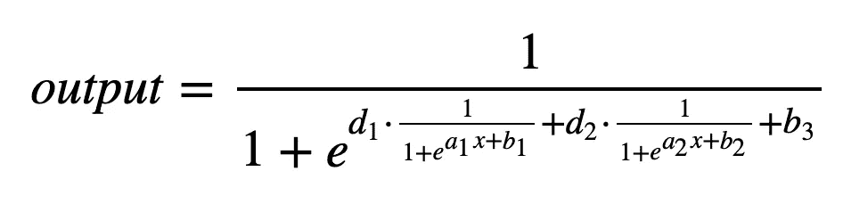
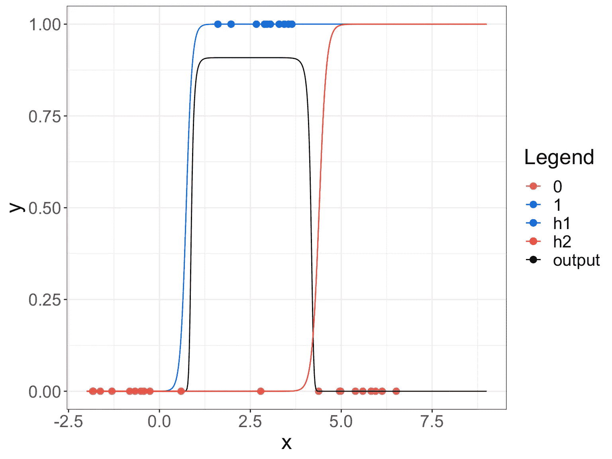
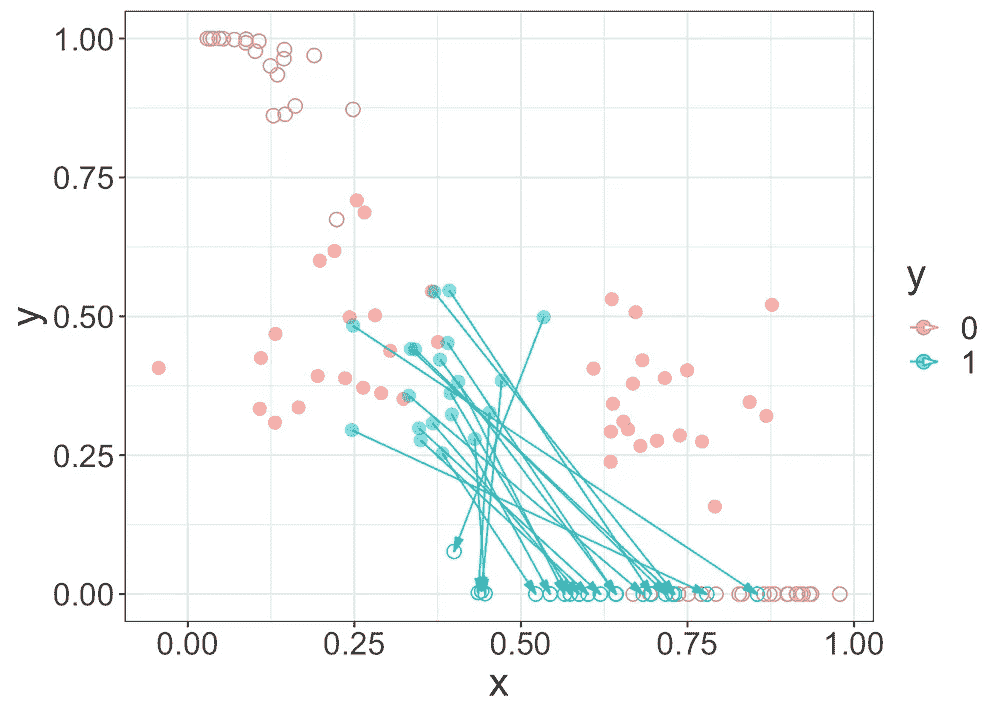
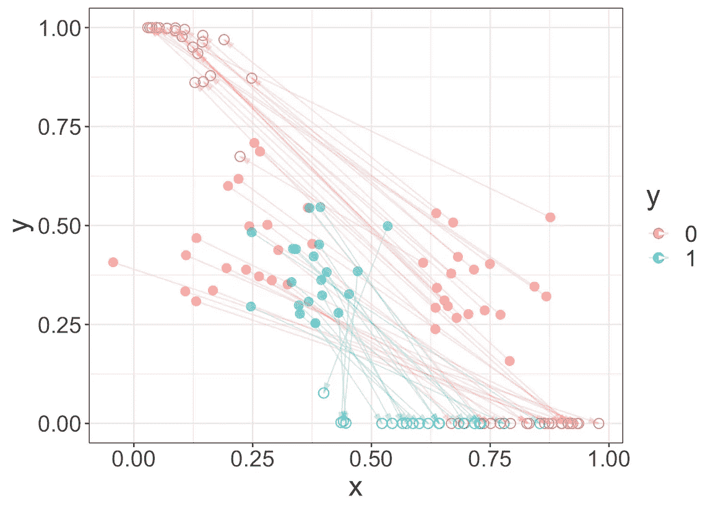
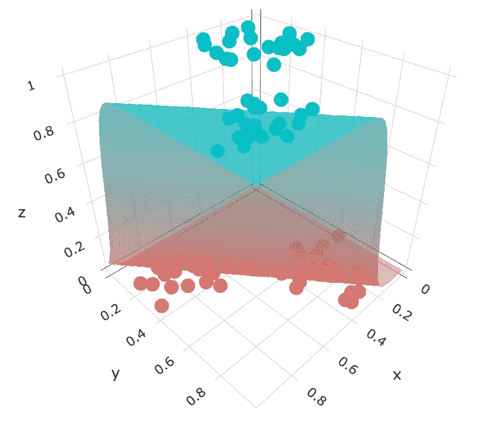

# 直观来看，神经网络是如何工作的？

> 原文：<https://towardsdatascience.com/intuitively-how-do-neural-networks-work-d7710b602e51?source=collection_archive---------27----------------------->

## 直观地

## “神经网络”这个术语可能看起来很神秘，为什么一个算法叫做神经网络？它真的能模仿真正的神经元吗，又是如何模仿的呢？

在我上一篇关于 [*直观上，我们如何理解不同的分类算法*](/intuitively-how-can-we-understand-different-classification-algorithms-principles-d45cf8ef54e3) 的文章中，我介绍了分类算法的主要原理。然而，我使用的玩具数据非常简单，几乎是线性可分的数据；在现实生活中，数据几乎总是**非线性**，所以我们应该让我们的算法能够处理非线性可分数据。

# 简单逻辑回归和非线性数据

让我们比较一下逻辑回归对于几乎线性可分数据和非线性可分数据的表现。

通过下面的两个玩具数据，我们可以看到，当数据几乎是线性可分时，逻辑回归有助于我们找到决策边界，但当数据不是线性可分数据时，逻辑回归无法找到明确的决策边界。这是可以理解的，因为逻辑回归只能将数据分成两部分。

在本文中，我们将尝试以不同的方式重用逻辑回归，并尝试使其适用于非线性数据。

# 组合逻辑回归

当观察蓝点和红点时，数据是非线性的，因为我们可以看到有 3 个部分，我们应该找到两个决策边界。那么，如果…如果我们试着结合两个逻辑回归会怎么样？

例如，我们有这两个基于逻辑回归的模型。

我们称它们为 h1 和 h2。

然后，我们可以将 h1 和 h2 结合起来，用另一个逻辑回归进行最终预测。

然后，您可以用 h1 和 h2 各自的逻辑函数表达式来替换它们:

然后我们可以通过找到不同的系数来解决问题，你猜怎么着，最终的结果是相当令人满意的:我们可以看到，两个组合的 Logistic 回归给了我们两个决策边界。

# 更好的表现

让我们回到我们模型的最终表达式:

**这个表情可能看起来挺吓人的。让我们给它加点艺术感。**

让我们画一些东西来以更易读的方式表示这些函数:

横向来看，甚至会更好:

让我们指定所有要确定的系数，我们可以将它们放在线上，这样更容易理解:

我们可以将线性函数和 sigmoid 函数分开，以更好地提高可读性。

长方形？不，圆圈更好。等等，你看到我看到的了吗？

哇，它们就像…神经元！

图片来自 123rf

我们可以添加更多的颜色使它更好。连接代表重量，我们可以让它们变粗来代表更大的数字。用一种颜色，我们可以代表这个符号。

*   这里，绿色是正的，红色是负的。

数学家是艺术家！

# 神经网络词汇

现在让我们围绕这个神经网络创造一个全新的世界。

让我们创建不同的层:输入、输出和隐藏层。

当计算给定输入值的输出值时，必须遍历所有隐藏层。所以你会从左边走到右边。姑且称之为“**正向传播**”。

最后，您将计算出一个估计的输出，并且您必须将它与实际输出进行比较。这个误差将帮助我们微调权重。为此，我们可以使用梯度下降，我们必须计算不同的导数。

由于最终会计算误差，因此我们会在输出层之前调整神经元的权重。我们总是会从右向左调整。所以姑且称之为“**反向传播**”。

# 二维空间会发生什么

现在让我们考虑两个输入变量，这是玩具数据。

直观上，我们可以看到两个决策边界就足够了。所以让我们应用两个隐藏的神经元:

然后，我们可以通过用周围区域数据测试神经网络来可视化最终结果。我们可以看到模型做得相当好。

现在，既然我们知道在神经网络内部只有逻辑回归，我们可以尝试将转换的不同步骤可视化。

## 隐藏层转换

让我们看看 H1:输入数据是原始的蓝点和红点。H1 是一个有两个输入变量的逻辑回归，所以结果是一个表面。

然后第二个隐藏神经元 H2 是类似的。

输出图层 O1 是一个逻辑回归，也接受两个输入，因此我们也有一个表面来表示结果。而 O1 的输入是数值在 0 和 1 之间的两个数据系列，因为它们是两个逻辑回归的结果。然后我们可以看到，如果我们取值 0.5 到表面，最初的蓝点和红点可以线性分成两部分。

那么在这个神经网络中发生了什么呢？在某种意义上，我们可以说**神经网络将非线性可分离的数据转化为几乎线性可分离的数据。**

## 另一个可视化

隐藏层有两个神经元，所以是二维的。因此，如果我们想看到这种转变，我们希望看到点是如何在平面上移动的。我们知道这些点的最终位置在单位正方形(0，1)x(0，1)中。

我们可以分别看到蓝点和红点。**注意，箭头指向最终位置。**

然后我们可以看到最后的逻辑回归。

原始数据不是线性可分的，但是经过变换后，它们被移动到单位正方形中，在那里它们变得几乎线性可分。

# 另一个更复杂数据的可视化

现在让我们考虑另一个玩具数据。凭直觉，你会应用多少个隐藏神经元？

嗯，3 个神经元就足够了，如下图所示:

我们可以看到每个神经元的逻辑回归曲面。

隐藏神经元 2

隐藏神经元 3

对于输出神经元，它有 3 个输入(因为它们是逻辑回归的结果，值在 0 和 1 之间)，我们可以在一个单位立方体中可视化它们。

我们可以创建一个动画来更好地可视化

让我们回顾一下:

*   初始 2D 数据不是线性可分的。
*   它们被转换成 3D 空间(在一个隐藏层中有 3 个神经元)。
*   经过变换后，它们变得几乎线性可分。
*   最后，简单的逻辑回归允许我们对转换后的数据进行线性分类。
*   最终的逻辑回归有 3 个输入变量。因此该模型可以预测三维空间中每个点的概率。这就是为什么我们可以看到立方体充满了彩色点。决策边界是一个曲面。

更复杂的神经网络可以捕捉甚至更复杂的输入数据关系。但我们可以看到原理相当简单:**隐藏神经元的目的是将非线性可分离的数据转换到一个可以线性分离的空间。**

如果你对其他分类器如何处理非线性可分离数据感兴趣，你可以看看下面的文章:

 [## 凭直觉，我们如何建立非线性分类器

### 现实生活中的问题通常是非线性的，所以让我们看看算法是如何处理非线性可分数据的。

towardsdatascience.com](/intuitively-how-can-we-build-non-linear-classifiers-10c381ed633e)