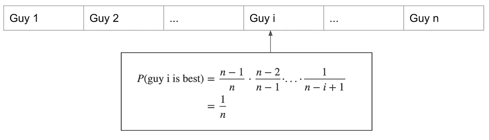
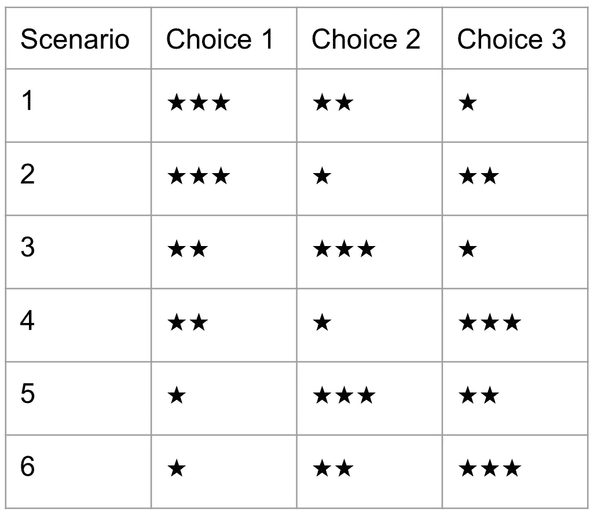

# 凭直觉，在找到你的完美伴侣之前，你应该和多少男人约会

> 原文：<https://towardsdatascience.com/intuitively-how-many-guys-should-you-date-before-finding-your-perfect-partner-7e6f9d691095?source=collection_archive---------29----------------------->

## 直观地

## 你可以看到这篇文章的标签是数据科学，概率统计专题。是的，这是正确的，有一个数学模型来定义最佳策略。

用平面图标制作的图标

为了找到你的完美伴侣，最好的策略是什么？第一个的家伙是不是最好的？我们必须和尽可能多的 T2 男人约会才能找到最好的吗？

但你很容易理解，这两种策略都是*有风险且非最优*:第一种情况，如果你和第一个约会的男生结婚，你以后会后悔；在第二种情况下，你可能会失去一些好的比赛机会，并最终孤独终老。

为了确定对你来说什么是最好的策略，你必须知道你想约会的男人总数，因为也许你想在某个截止日期前结婚，也许你没有时间或者不想和很多人约会。

值得注意的是,*最佳男朋友*的概念只是你选择了的约会总数(n)中的**最佳男朋友。所以如果你选择了一次约会，那么根据定义，你已经选择了最好的一次。**

为了简化数学模型，需要指定以下几个假设:

*   都可以对比评级，你可以毫不含糊的说谁更好。
*   如果你拒绝了一个男生，你就不能收回你的决定。不然就太容易了。
*   他们一个接一个地到来，顺序是随机的，你只能在给定的时间里和一个人约会。
*   当然只能选择一次。

现在的问题是:**如何选择那个家伙，使得(被选择的家伙是最好的那个)的概率最高？**

# 随机策略还是固定策略

## 首先让我们看看最简单的选择方式:随机策略。

如果你的策略是**在任何一步随机停止**，选择那个家伙，**不做比较，**那么推理如下 **:** 对于每一步，他是最好的概率是 **1/n** 。而停在步骤 I 选择他的概率也是 **1/n** 。

既然不比较也不研究小伙，那么这两个事件(小伙最优秀和小伙被选中)可以认为是**独立**。所以我们可以有下面的结果:

## 现在我们来看另一种选择方式:固定策略。

为了简化词汇，我会说 *guy i* ，对于*你在步骤 i* 遇到的那个家伙。指数 *i* 与第 I 次约会有关，与男生无关。值得注意的是:这里随机的是你选择约会的**次**次，而不是在所有男生中选择一个男生。

如果你选择总是留在第一选择的*。那么他是最好的那个的概率是: **1 /总数= 1/ n***

如果你选择永远留在第二选择*，不管是什么原因*。那么概率将是:

*   第一，guy 1 应该不是最好的那个。但是嘿，这个概率很高:(n-1)/n
*   知道了这一点，第二个人是最好的概率是 1/(n-1)
*   最后，总是选择第二个人的最终概率也是 1/n 。

如果您选择始终使用*第三个选择:*，理由非常相似

我们现在可以概括推理，如果你选择总是保持你的第一个选择*:**1/n .***

**

***所以在没有任何有意义的策略(随机策略或固定策略)的情况下，从 10 个家伙中选出最佳家伙的概率是 10%** 。*

*凭直觉，你知道你可以做得更好:你希望能够将现在的人与以前的人进行比较。*

*所以现在就来详细说一下对比策略吧！*

# *比较策略*

*该战略包括两个阶段:*

*   *第一阶段:我们可以称之为**观察阶段**，这是一个你最终总是会离开那个人的阶段，但是你会有一个和其他人比较的基础。观察阶段的最佳人选，我们称他为**参考人选**。*
*   *第二阶段:我们可以称之为**选择阶段**，我们将比较当前的家伙和所有以前的家伙，如果她或他比所有以前的更好，那么你选择这个。这就等于说，你会选择第一个比你在观察期约会的男生更好的。*

*为了选择最好的一个，或者换句话说，为了在选择我们的家伙时有最高的概率，唯一要确定的参数是:**在观察阶段我们应该和多少个家伙约会？***

# *拒绝的最佳次数*

*如果你约会的总数是 10，那么答案是 3！*

**

*听起来可能很无情，用这个策略，你应该和三个男生约会，然后拒绝他们(因为他们只是观察阶段的一部分)。然后从第 4 个家伙开始，如果他比之前所有的都好(这也和对比**参考家伙**是一样的)，你就可以和他在一起了。*

*而且用这个策略，**选到最优的概率差不多有 40%** ！*

*这比随机策略好 4 倍。*

*为什么？让我们做个示范。*

# ***用小数字演示***

*为了演示 10 个人的比较策略，我们将通过首先与一个人迭代，然后与两个人迭代，然后与三个人迭代，以此类推。*

***只有一个家伙***

*如果你选择只和一个男人约会**，那么我们不能说他是最好的还是最差的，事实上，他两者都是！***

***两个家伙***

*如果你选择和两个男人约会，那么你只有两个选择。你可以和第一个人在一起，也可以和第二个人在一起。没有区别。所以你有 50%的概率选择最好的一个。*

*值得注意的是，随机策略会产生相同的结果。*

***三个家伙***

*如果你选择和 **3 个家伙**约会，那么我们要做一些概率计算。假设我们可以用★来给他们打分，因为有 3 个人:★★是最好的，而★是最差的。*

*有 6 种可能的情况。请注意，选项 1 表示你第一次遇见一个男生，选项 2 表示你第二次遇见一个男生，等等…*

**

***坚持你的第一选择***

*如果你决定坚持你的第一选择，那么选择最佳选择的概率是 6 分之 2。(我们的场景表中的场景 1 和 2)。*

*所以**概率是 33%，**这和随机策略的概率是一样的。*

**

***拒绝第一个选择，然后选择***

*如果你决定拒绝第一个，那么你的第一选择将是你的**观察阶段**。而从第二个选择开始，你会选择:如果他比之前所有的都好，那你就和他在一起，如果不是，你就继续(并以第三个结束)。*

*现在你可以看到，使用这种策略，你最终得到最佳策略的概率是 6 分之 3。*

**

*或者换句话说，概率是 **50%** 。*

***拒绝第一和第二个选择，选择第三个***

*对于这种策略，概率很容易计算，它是 6 中的 2，即 33%。*

**

*在总共 3 个人的情况下:*

*   *如果你遵循随机策略，那么选择最佳家伙的概率是 **33%** 。*
*   *如果用比较策略遵循我们的最优策略，那么概率是 **50%** ！*

# ***一个广义的论证***

*现在让我们尝试推广两个给定参数的概率 P 的计算*

*   *n，男生总数*
*   *r，拒绝的次数*

*这一次，我们必须使用**条件概率**，因为在这个策略中，事件是相关的。*

**

*那么我们必须不同地考虑这两个阶段:*

*   *在**观察阶段**:我们会全部拒绝。所以概率是 **0***
*   *在**选择阶段**:对于盖伊 I，*知道*他是最好的一个，那么他实际被选中的概率就是**之前所有的盖伊都没有被选中的概率。或者从步骤(r+1)到步骤(i-1)的家伙。***

*换句话说:*

*   ***从步骤(r+1)到步骤(i-1)的人并不比观察阶段的人更好(否则，他会被选中)***
*   *在第(i-1)个家伙中，最好的家伙在第 r 个家伙中。*

*现在我们可以通过分析(i-1)个之前的家伙来计算选择这个家伙 I 的概率，知道他是最好的一个:*

*   *成为(i-1)个男生中最好的一个的概率是: **1/(i-1)***
*   *既然观察阶段有 r 个家伙，那么概率是: **r/(i-1)***

**

*现在我们可以把之前所有人的概率加起来:*

**

# *数值应用和模拟*

*现在有了这个公式，我们可以很容易地计算出给定数字 n 的概率，然后我们可以找到最佳的拒绝次数(这是概率最高的数字)。*

*下面是结果表:*

**

*你看。对于 10 个男生，你的最佳策略是拒绝前 3 个男生。*

*现在你想约会更多？好的，这些是概率和最优拒绝数:*

**

*对于那些想要更多的人，让我们来看看拒绝的最佳数量以及任何总数的相关概率。*

*下图显示了不同总数的最佳选择的概率(最大概率)向一个百分比收敛。比率 r/n(拒绝次数/总次数)也是如此。*

*我们可以显示比率 r/n，而不是在 x 轴上显示 r。我们得到下面的两个图表。*

****

*对于那些了解微积分的人来说，我们可以证明曲线会收敛到*

**

*然后我们可以找到最大值(通过求导),我们得到最佳比值:1/e ≈ 0.368*

*最优概率的极限也是:1/e*

*(e 是欧拉数:e ≈ 2.72)*

# *最佳人选策略的结论*

*让我们回顾一下:*

*   *定义你想约会或可能约会的男生总数。例如，你 20 岁，你想在 30 岁前找到你的完美伴侣。你觉得你可能会和 10 个男人约会。*
*   *拒绝**最佳绷绳数**，定义**参考绷绳**。在 10 的情况下，你应该拒绝前 3 个家伙。而在现实生活中，对他们进行排名是比较困难的，所以要研究你的排名标准。*
*   *现在**不要让下一个比参考人更好的人走**。如果没有，你可能会在截止日期前找不到任何人。*
*   *如果你是对方，一定不要处于**观察阶段**，为了最大化你的机会，你宁愿成为**选择阶段的第一个家伙。***

*现在，如果你和你遇到的第一个男人结婚了，并且正在读这篇文章，请记住，这只是一个模型*

> *所有的模型都是错的，但有些是有用的。*

*明智地使用它。:)*

# *1/e 最佳选择定律*

*实际上我们已经看到了统计学中非常著名的东西，这种策略也被称为 1/e 策略，它可以应用于其他现实生活中的问题，比如:*

*   *招聘候选人*
*   *购买汽车*
*   *买房子*
*   *等等。*

*记住，现实生活总是不同于数学模型。*