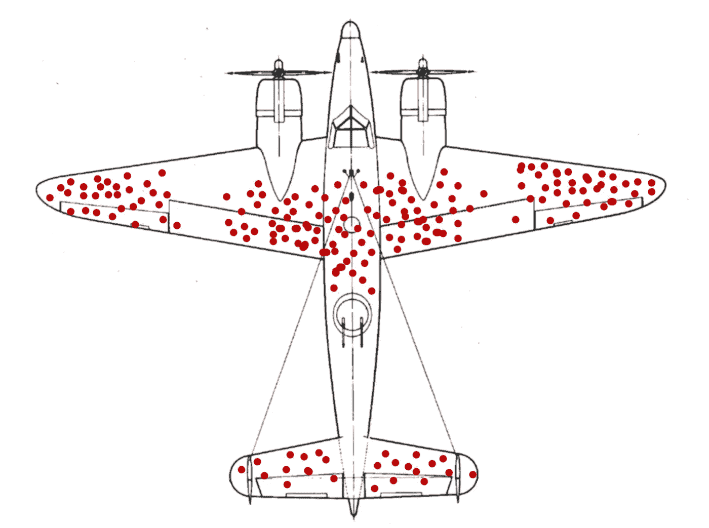

# 直觉上…或者不是，你不应该只看成功的人来变得成功

> 原文：<https://towardsdatascience.com/intuitively-or-not-you-shouldnt-only-look-at-the-successful-to-become-successful-8d2eda668ce3?source=collection_archive---------52----------------------->

## 克服生存偏见就是认识到丢失的东西可能包含重要的信息

科比·门德斯在 [Unsplash](https://unsplash.com?utm_source=medium&utm_medium=referral) 上的照片

最近，我和一个孩子进行了一次谈话，他告诉我:“我长大后要成为一名足球运动员。这样我就能赚很多钱，买一栋大房子”。除了这么小就有令人担忧的物质主义心态，这个推理背后的**明显的生存偏见**让我笑了。

是的，如果你在电视上看到所有的足球运动员，你可能会认为这是一个特别赚钱的职业；然而，这种推理是有偏见的，因为你没有考虑到那些没有成为明星的人。

只有孩子有生存偏见吗？不，成年人也很容易落入这个陷阱。

# 生存偏差背后的故事

维基百科:生存

也许你以前已经听说过生存偏差:一个著名的例子是研究二战飞机的统计学家亚伯拉罕·瓦尔德的故事。军方告诉沃尔德，许多飞机坠毁，返航的飞机上有许多弹孔。军队跟踪返航飞机上弹孔的位置，以了解在哪里加固飞机。

假设返航飞机上的弹孔分布如下:

当你看这个图的时候，你会在哪里加固这些平面？

陆军最初的做法是:“好吧，我们看着回来的飞机，我们看到他们被击中最严重的地方:所以我们应该加强这些削弱的部分，不是吗？”。根据上图，我们应该加固机翼，不是吗？

然而，沃尔德说不，那将是*确切地说是*错误的决定。

沃尔德已经意识到**这个结论只是基于幸存者得出的，但是那些没有回来的飞机呢？**事实上，这些洞表明这些飞机*被击中后仍然能够回来*。所以我们掌握的信息是不完整的。被击中而没有回来的飞机有了更准确的信息，知道哪些零件需要加固。

> 误解:如果你想学习如何生存，你应该关注幸存者。
> 
> 真相:如果你不看失败，你就无法知道是什么让一个幸存者不同于一个失败者。

然而，如果军队犯了这样的错误，这是否意味着我们在日常生活中也容易产生这种偏见？是的，当然。

我们可以在日常生活中的许多其他例子中看到生存偏差。

# 存活率偏差示例

生存偏差可能发生在你的研究中有两个类别的时候，其中一个你可以标记为“幸存者”:**在商业中**它可能是成功的对不成功的；在医学上，可以是活人 vs 死人；**在一局**中，可以是胜者 vs 败者。

如果你决定创办一家初创企业，只考虑那些已经成功的企业，你会忘记，大多数初创企业在头两年都会失败。

**在医学**中，排除偏见尤其重要:医生应该记住治疗没有像预期的那样奏效的次数以及奏效的次数，以免他们忘记一些重要的事情。

例如，现在在我们看来显而易见的是，放血毫无用处，无助于治愈任何疾病(事实上它的危害更大)。然而，这种基于抽血可以帮助身体保持平衡和健康的信念的做法，已经延续了 2000 多年，直到 19 世纪末。**为什么这么久？嗯，这正是因为幸存者偏差:在某些情况下，放血可能会产生积极的结果，如果没有完整的科学方法，只考虑幸存者。**

现在记住这一事实尤为重要，因为我们都在焦急地等待新冠肺炎的治愈方法:一些治疗可能声称是成功的，但如果没有对照组，就很难从科学上证明这一点。希望不应该影响我们的判断。

维基百科放血

或者一个更简单的例子:你听说有人成功地尝试了一种新的饮食方式，并且正在考虑尝试减肥。然而，如果有些人通过一周只吃苹果成功减肥(例如)，并在他们的博客上谈论它，你不会听到有人尝试同样的饮食，但效果并不那么好。

在我们的社会中，我们倾向于向在他们的领域中成功的人聚集，而不是从失败的人那里寻求建议(即使他们能给我们有趣的建议*关于你应该* ***而不是*** *做*)。

> "一个效果很好的愚蠢决定在事后会变成一个明智的决定."——心理学家丹尼尔·卡内曼在《思考的快慢》中

那么，数据科学家能从这些课程中学到什么呢？

# 为什么数据科学家需要了解生存偏差

作为一名数据科学家，您需要处理提供给您的数据。你应该从你所拥有的数据中获得洞察力。所以，你给出的结论取决于你掌握的数据。那么，如果您因为最重要的数据不是您拥有的数据而遗漏了一些重要信息，该怎么办呢？

最近要给某个行业做一个流失模型。

然而，GDPR(一般数据保护条例)刚刚开始在该公司实施，例如，一些搅拌机的数据不再可用:因为它们很久以前就搅拌过，出于隐私原因，数据只能存储一定数量的年，除非我们得到客户某种形式的同意。

例如，数据集是在 2020 年建立的。我有 1990 年的客户数据，到 2020 年，仍然是数据集中的客户。但是我没有 2015 年之前离开的客户的数据。这里有生存偏差吗？

事实上，是的，我没有 1990 年至 2015 年之间的客户数据，也没有这一时期的客户数据。那么如何应对呢？

在这种情况下，一个简单的方法是对所有人群进行相同的参考，并通过仅选取合同开始日期早于或等于 2015 年的人群来开始分析。

在其他情况下，可能没有一个简单的解决方案，因此您可能不得不在给出有偏见的结论之前停止分析，因为一些重要的数据丢失了。

简而言之，生存偏差被定义为“一种认知偏差，当某人试图根据过去的成功做出决定，而忽视过去的失败时就会出现这种偏差。”科学是一种从表象中过滤出真实的方法。乍一看似乎很直观的东西可能不是一个好的答案。