# 库存管理—应对不可预测的需求

> 原文：<https://towardsdatascience.com/inventory-management-using-python-17cb7ddf9314?source=collection_archive---------5----------------------->

## 使用 Python 对随机需求进行供应链分析

这篇文章旨在解决产品随机需求带来的挑战。这是一个案例研究，处理不同产品的需求分布，并使用蒙特卡罗模拟来最佳地管理其库存并获得预期利润。

图片由[克拉克街商业](https://unsplash.com/@mercantile?utm_source=medium&utm_medium=referral)在 [Unsplash](https://unsplash.com?utm_source=medium&utm_medium=referral) 上拍摄

想象一下，你是一个高度定制产品的经销商，因此每个客户对该产品的需求都是独特的。你不可能每天都收到这种产品的订单。一些产品可能会因季节性而有所不同，而另一些则可能有潜在的趋势。为了对这种随机需求进行数学建模，您必须获取每种产品至少在过去 12 个月的销售信息。

现在，顾客有时会走进商店，却买不到他们想要的特定商品。虽然很难对消费者行为建模，但我们可以提供一个粗略的估计，即客户在任何给定的一天下订单的概率为“p”。这个 p 可以简单的用去年的订单数除以工作日数来计算。

除非或直到你有一个特定的客户合同，另一个不确定性是订单大小。在本案例研究中，假设订单大小遵循一个分布参数未知的[对数正态](https://en.wikipedia.org/wiki/Log-normal_distribution)分布(这是常见的情况)。因此，获取产品的历史销售额非常重要。

本案例着眼于 4 种不同产品的销售，并试图采用持续审查或定期审查[政策](https://www.ukessays.com/essays/business/continuous-review-periodic-review-system-1062.php)来管理其库存。目标是最大化其**预期** **利润**。

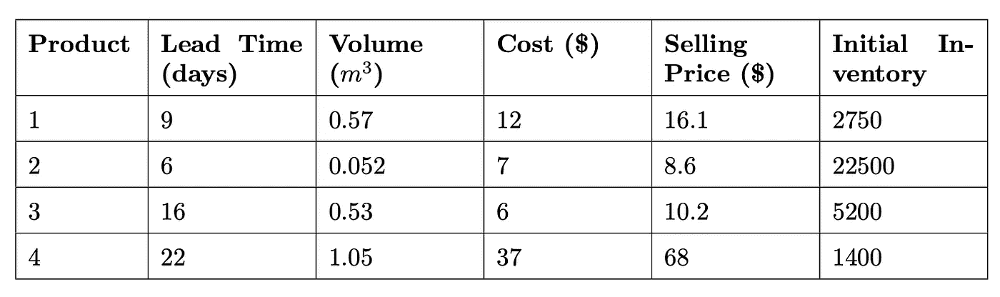

附加产品数据

根据去年的销售情况，下面给出了每种产品的需求分布直方图。

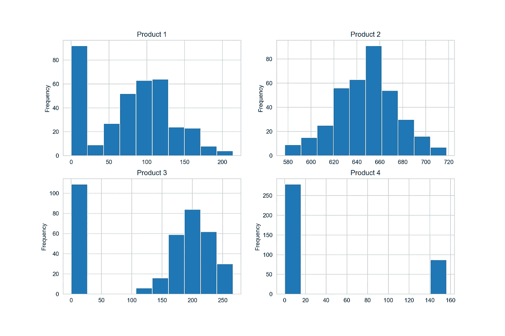

每种产品的需求分布。按作者分类的图表

你可以看到对每种产品需求的明显差异。例如，产品 2 是每天都有人购买的大批量产品(p = 1)，平均订单量为 649。而产品 4 有 24%的时间被购买，其平均订单规模约为 150。下表提供了每种产品的汇总，可以完全根据过去的销售数据进行计算。

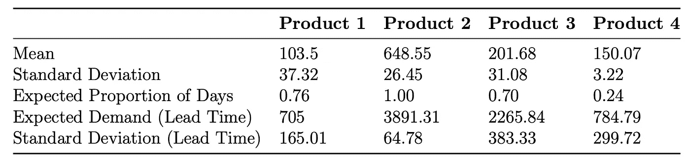

每个产品的摘要

理解[交付周期](https://en.wikipedia.org/wiki/Lead_time)期间的需求统计数据非常重要。

将这些数字放入上下文中，产品 1 的交付周期是 9 天(如前所述)，因此在这 9 天中，分销商可以预期平均有 705 个订单。在下原始订单时，需要考虑到这一点，否则经销商总是无法满足需求。

# 定期审查

有了定期审查系统，库存检查和再订购只在指定的时间点进行。例如，可以每周、每两周、每月或其他周期检查库存并下订单。当一个公司或企业处理多种产品时，定期审查系统的优点是要求在相同的预设定期审查时间下几个项目的订单。有了这种类型的库存系统，多种产品订单的装运和接收就很容易协调。在前面讨论的订购量、再订购点系统下，各种产品的再订购点可能在完全不同的时间点遇到，使得多种产品的订单协调更加困难。[1]

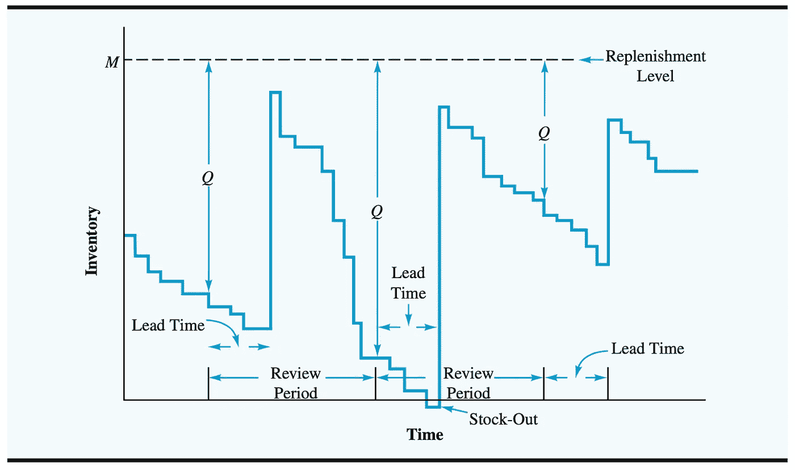

具有概率需求的定期审查模型的库存模式。[1]

在定期审查政策方法中，在一定时间后补充库存。这个时间周期取决于审核周期和交付周期。[蒙特卡洛](https://en.wikipedia.org/wiki/Monte_Carlo_method)技术被用来模拟商店中每种产品的日需求量。从上一节的分布图中，我们注意到，除了产品 2 之外，并不是每一种产品都在每天被购买。计算出的预期订单比例表明当天产品被购买的概率。例如，对于产品 1，预期比例是 0.76，这意味着在一年中的任何一天，客户都有 76%的机会购买产品 1。

如果购买一种产品，那么需求遵循对数正态分布。通过取每日数值的对数，将前一年的需求分布转换为对数正态分布。为了模拟日常顾客购买行为，从 0 到 1 范围内的均匀分布中选取一个随机数。

从对数正态分布中提取的 Python 代码

进行蒙特卡罗模拟来模拟需求行为和一次实现的利润计算。在模拟中，该算法每天迭代，试图捕捉产品的库存水平。这是为了生成当天的产品需求。

为定期审查进行蒙特卡罗模拟

该算法的逻辑如下:

1.  如果当前库存水平可以完全满足需求，则库存水平会根据需求和当天售出的单位数量的增量而减少
2.  如果库存水平不能完全满足需求，那么现有库存就是当天售出的数量

为了对定期检查策略进行建模，该算法会跟踪一年中的当天。如果一年中的某一天等于审核期，则下订单将库存补充到数量为 M 的**订单。该值是决策变量，并作为输入传递给算法。在该特定产品的交付周期结束后，库存会根据所下的订单数量进行更新。这将持续 365 天。**

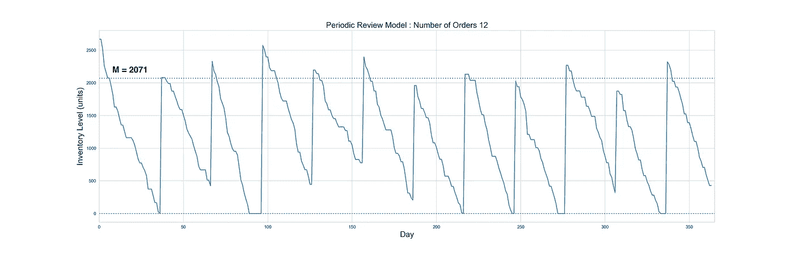

产品 1 的库存模拟。按作者分类的图表

一个 365 天模拟的库存水平可用于确定商店当年的利润。所有售出的单位都乘以产品售价来计算收入。

成本分为三个部分，

1.  **产品成本**、
    产品成本的计算方法是将每种产品的单位成本乘以订购数量的总和。
2.  **订购成本**
    订购成本的计算方法是将当年的订购次数乘以该产品的单项订购成本。将一年中每天的库存水平汇总，以表明一年中有多少库存。
3.  **持有成本。**
    然后通过将持有的股票数量乘以产品的单位尺寸和持有单位的每日成本来计算持有成本。

从收入中减去这些成本，得到当年实现的相应利润。损失的单位数量被合计并除以当年的需求，以给出当年订单损失的比例。

年利润的数学公式如下。

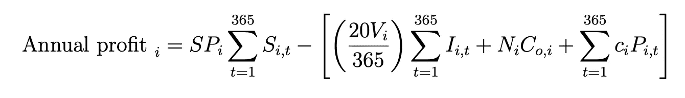

计算年利润的 Python 代码

该模拟被执行 10，000 次，以给出每次利润和订单损失比例的多种实现。这些结果用于绘制直方图，并计算利润的平均值和标准偏差，以及特定订单直到点(M)的订单丢失比例。下图是产品 1 的一个模拟，订单数量为 2071。

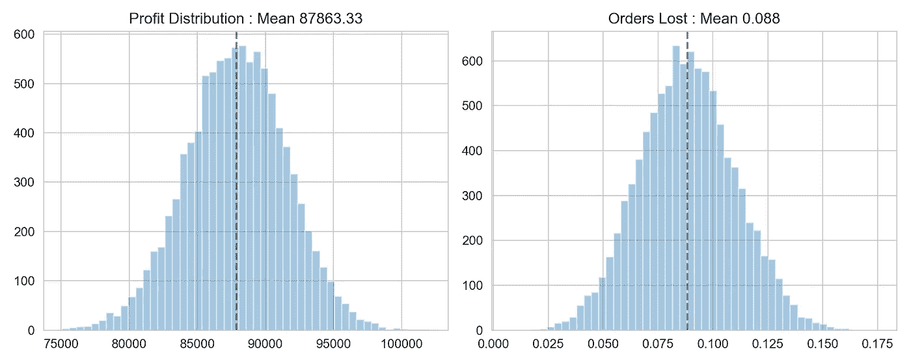

产品 1 的利润和订单损失分布。作者配图。

类似地，这个练习可以针对一系列值 **M** 进行，以确定给我们最高预期利润的值。从下图中可以看出，对于产品 1，我们模拟了 1000 到 3000 之间的数值范围。这给出了 87，863 美元*的最佳预期利润(再次运行模拟时，87，992 美元是最佳利润)*截至 2071 年的订单。

对其他产品进行这些实验，并相应地计算它们的最佳值。由于利润线性依赖于需求和与特定产品相关的成本，因此可以计算出该函数的最大值。

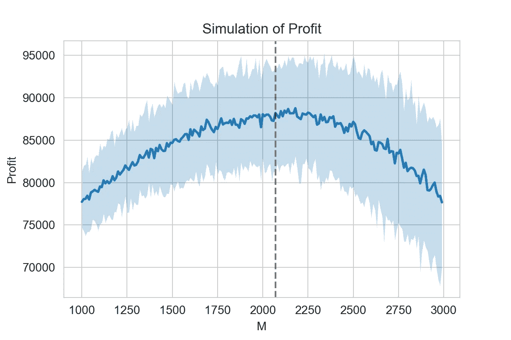

产品 1 —模拟结果。作者配图。

使用一个月的审查期，下表列出了每种产品的最佳订购点、预期年利润和一年中的订单损失比例。

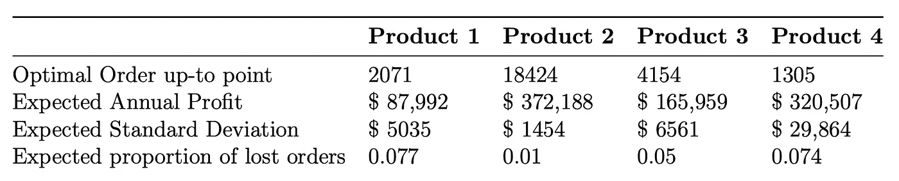

备选方案 1——定期审查

# 持续审查

在多周期模型中，库存系统以许多重复的周期连续运作；存货可以从一个时期结转到下一个时期。每当库存位置达到再订购点时，就会发出 *Q* 单位的订单。因为需求是概率性的，所以无法提前确定再订购点的到达时间、订单之间的时间以及 *Q* 单位的订单到达库存的时间。[1]

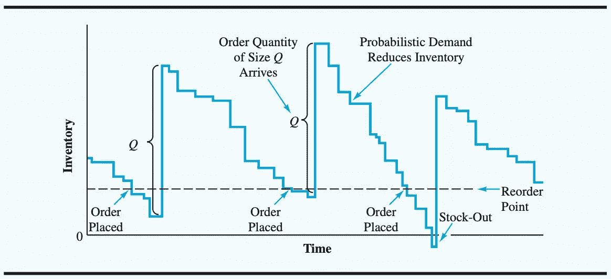

具有概率需求的订货批量、再订购点模型的库存模式。[1]

请注意，每当 *Q* 单位的订单到达时，库存就会增加或跳跃。基于概率需求，库存以非恒定速率减少。只要达到再订购点，就会下新订单。有时， *Q* 单位的订单数量会在库存为零之前到达。然而，在其他时候，更高的需求会导致在收到新订单之前缺货。与其他订单数量、再订购点模型一样，经理必须确定库存系统的订单数量 ***Q*** 和再订购点 ***r*** 。[1]

在该策略中，分销商能够定期检查库存，并确定他们希望在哪个点下订单(即再订购点)。分销商还可以指定他们每次想要订购的数量(即订购数量)。

蒙特卡洛模拟中的逻辑被更新用于持续审查策略。

为持续审查进行蒙特卡罗模拟

每天，该算法都会检查库存水平，并将其与再订购点进行比较。

1.  如果库存水平低于或等于再订购点，它就会下订单。但是这种库存只有在产品交付周期结束后才能变现。例如，产品 1 有 9 天的提前期，如果在第 52 天下订单，库存将在第 61 天补充。
2.  然后，在更新库存水平时，它遵循与定期审查算法相似的决策逻辑。
3.  利润和预期订单损失的计算类似于定期审查政策的计算。

产品 1 的库存模拟。作者配图。

对于每个产品，这些结果的模拟再次进行 10，000 次。这些结果用于绘制直方图，以计算订单数量 2002 和再订购点 812 的利润和订单损失比例的平均值和标准偏差。下图是产品 1 的一个模拟。

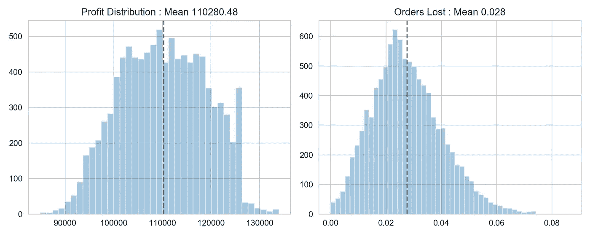

产品 1 的利润和订单损失分布。作者配图。

通过在每种产品的一系列值之间执行网格搜索，可以计算出优化利润函数的订货量和再订货点的组合。如下图所示，对于产品 1，这些值是针对订单数量从 1000 到 3000 以及再订购点在 500 到 1100 之间进行模拟的。该图似乎显示了一个凹函数，表示利润的最大值。

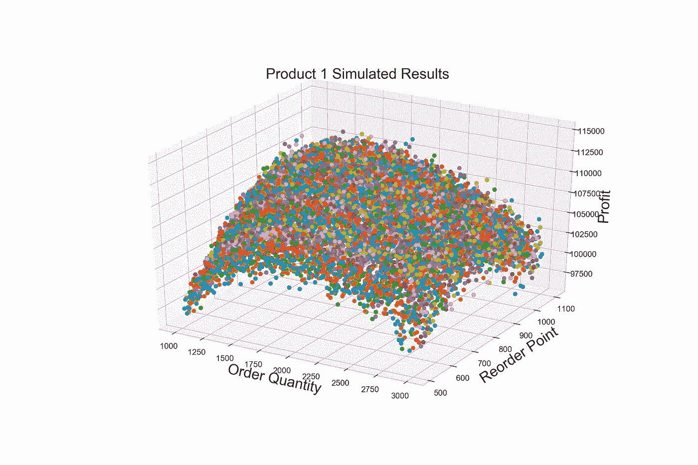

产品 1 —网格搜索结果。作者配图。

在产品 1 的这个场景中，根据模拟，2002 年的订单数量和 812 的再订购点的最大利润为$110，174。

使用这种策略，下表列出了每种产品的最佳再订购点、最佳订购数量、预期年利润和一年中的订单损失比例。

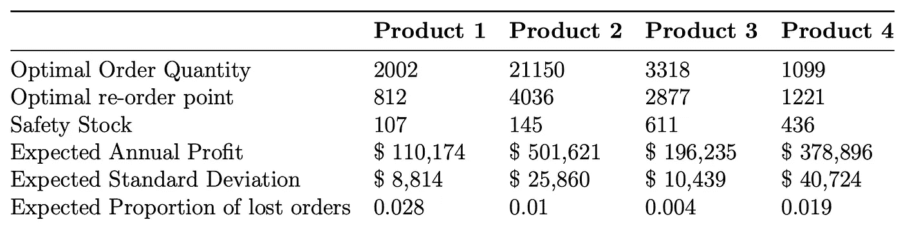

备选方案 2——持续审查

# 定论

持续审查和定期审查政策各有优点。定期审查政策有一个固定的审查周期，使组织能够更好地预测一段时间内的订单。而持续审查政策保持订单规模不变，并在下订单的时间方面提供灵活性。由于持续审核策略中的决策变量比定期审核中的决策变量多两个，因此持续审核策略的解决方案空间可能会更大。

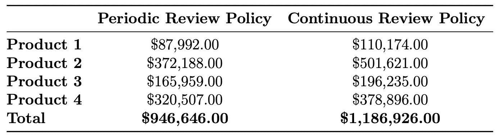

定期审查政策和持续审查政策的利润比较

从上表中我们可以清楚地看到，就每种产品的预期利润而言，持续审查政策优于定期审查政策。持续审查政策的总预期利润比定期审查的总预期利润高 25%。如果决策完全基于预期总利润，研究建议持续审查政策作为更好的选择。

# GitHub 链接

所有的图表和代码都可以在我的 GitHub 资源库中找到，请随意下载并根据您的用例修改数字。

[https://github . com/wiredtoserve/data science/tree/master/inventory management](https://github.com/wiredtoserve/datascience/tree/master/InventoryManagement)

# 参考

[1]安德森、斯威尼、威廉姆斯、卡姆、科克伦、弗莱、奥尔曼。*管理科学导论:决策的定量方法*。2015 年第 14 版。Cengage 学习。第 457-478 页